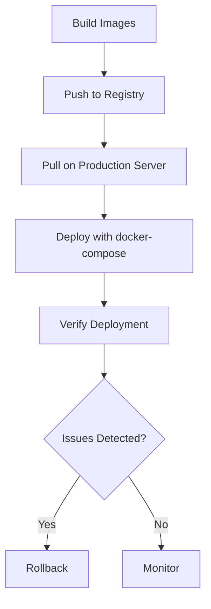

# Docker Compose Production

## Introduction

Docker Compose is a powerful tool for defining and running multi-container Docker applications. While it's commonly used for development environments, Docker Compose can also be leveraged for production deployments with some additional considerations and configurations. This guide will walk you through using Docker Compose in production environments, covering best practices, security considerations, scaling strategies, and real-world deployment scenarios.

## Docker Compose: Development vs. Production

Before diving into production configurations, let's understand the key differences between development and production environments when using Docker Compose:

| Development | Production |
|-------------|------------|
| Optimized for quick iterations | Optimized for stability and performance |
| Local volume mounts for code changes | Packaged, immutable containers |
| Debug-friendly configurations | Security-focused configurations |
| Single-node deployment | Potential multi-node deployment |
| Limited or simulated data | Real user data with backup requirements |

## Setting Up a Production-Ready Docker Compose File

A production Docker Compose configuration requires special attention to security, performance, and reliability. Let's look at a basic example and then enhance it for production use.

### Basic Development docker-compose.yml

```yaml
version: '3'
services:
  web:
    build: ./app
    ports:
      - "3000:3000"
    volumes:
      - ./app:/app
    environment:
      - NODE_ENV=development
      - DB_HOST=database
      - DB_PASSWORD=devpassword
  database:
    image: postgres:13
    volumes:
      - db-data:/var/lib/postgresql/data
    environment:
      - POSTGRES_PASSWORD=devpassword

volumes:
  db-data:
```

### Enhanced Production docker-compose.yml

```yaml
version: '3.8'
services:
  web:
    image: myregistry.com/myapp:${TAG:-latest}
    restart: unless-stopped
    ports:
      - "80:3000"
    environment:
      - NODE_ENV=production
      - DB_HOST=database
      - DB_PASSWORD=${DB_PASSWORD}
    depends_on:
      - database
    deploy:
      replicas: 2
      update_config:
        parallelism: 1
        delay: 10s
      restart_policy:
        condition: on-failure
    healthcheck:
      test: ["CMD", "curl", "-f", "http://localhost:3000/health"]
      interval: 30s
      timeout: 10s
      retries: 3
      start_period: 40s
    logging:
      driver: "json-file"
      options:
        max-size: "10m"
        max-file: "3"

  database:
    image: postgres:13-alpine
    volumes:
      - db-data:/var/lib/postgresql/data
    environment:
      - POSTGRES_PASSWORD=${DB_PASSWORD}
    restart: unless-stopped
    healthcheck:
      test: ["CMD-SHELL", "pg_isready -U postgres"]
      interval: 10s
      timeout: 5s
      retries: 5
    deploy:
      resources:
        limits:
          cpus: '1'
          memory: 1G

volumes:
  db-data:
    driver: local
```

## Key Production Enhancements Explained

### 1. Using Pre-Built Images

In production, use pre-built images from a registry rather than building at deployment time:

```yaml
# Development
web:
  build: ./app

# Production
web:
  image: myregistry.com/myapp:${TAG:-latest}
```

This approach ensures consistency across environments and faster deployments.

### 2. Environment Variables

Never hardcode sensitive information. Use environment variables:

```yaml
environment:
  - DB_PASSWORD=${DB_PASSWORD}
```

You can provide these variables through a `.env` file (make sure it's not committed to version control) or through your CI/CD system.

### 3. Container Restart Policies

Ensure services recover from failures:

```yaml
restart: unless-stopped
```

Options include:
- `no`: Never restart (default)
- `always`: Always restart regardless of exit state
- `on-failure`: Restart only on non-zero exit codes
- `unless-stopped`: Always restart unless explicitly stopped

### 4. Health Checks

Implement health checks to ensure your services are truly operational:

```yaml
healthcheck:
  test: ["CMD", "curl", "-f", "http://localhost:3000/health"]
  interval: 30s
  timeout: 10s
  retries: 3
  start_period: 40s
```

These checks help Docker know if your container is healthy and functioning correctly.

### 5. Resource Limits

Prevent any single container from consuming all host resources:

```yaml
deploy:
  resources:
    limits:
      cpus: '1'
      memory: 1G
```

### 6. Logging Configuration

Properly manage logs to prevent disk space issues:

```yaml
logging:
  driver: "json-file"
  options:
    max-size: "10m"
    max-file: "3"
```

## Using docker-compose.override.yml for Environment-Specific Configurations

Docker Compose allows you to use multiple configuration files to separate environment-specific settings. This is particularly useful for maintaining a base configuration while adding environment-specific overrides.

### Base Configuration (docker-compose.yml)

```yaml
version: '3.8'
services:
  web:
    image: myapp:latest
    restart: unless-stopped
```

### Development Override (docker-compose.override.yml)

```yaml
version: '3.8'
services:
  web:
    build: ./app
    volumes:
      - ./app:/app
    environment:
      - NODE_ENV=development
```

### Production Override (docker-compose.prod.yml)

```yaml
version: '3.8'
services:
  web:
    image: myregistry.com/myapp:${TAG:-latest}
    environment:
      - NODE_ENV=production
```

To use the production configuration:

```bash
docker-compose -f docker-compose.yml -f docker-compose.prod.yml up -d
```

## Scaling Services in Production

Docker Compose can scale services in a single-host environment:

```bash
docker-compose up -d --scale web=3
```

However, for true production scaling across multiple hosts, consider:

1. Docker Swarm mode (which uses the same compose file format)
2. Kubernetes with kompose to convert your compose files

## Deploying to Production

Here's a production deployment workflow:



### Deployment Script Example

```bash
#!/bin/bash
set -e

# 1. Set environment variables
export TAG=$(git rev-parse --short HEAD)
export DB_PASSWORD=$(cat /path/to/secrets/db_password)

# 2. Pull the latest images
docker-compose -f docker-compose.yml -f docker-compose.prod.yml pull

# 3. Deploy with zero downtime (for supported services)
docker-compose -f docker-compose.yml -f docker-compose.prod.yml up -d

# 4. Cleanup unused resources
docker system prune -af
```

## Production-Ready docker-compose.yml with Common Services

Below is a more comprehensive example incorporating common production services:

```yaml
version: '3.8'
services:
  nginx:
    image: nginx:alpine
    ports:
      - "80:80"
      - "443:443"
    volumes:
      - ./nginx/conf.d:/etc/nginx/conf.d:ro
      - ./nginx/ssl:/etc/nginx/ssl:ro
      - static-content:/usr/share/nginx/html
    depends_on:
      - web
    restart: unless-stopped

  web:
    image: myregistry.com/myapp:${TAG:-latest}
    expose:
      - "3000"
    environment:
      - NODE_ENV=production
      - REDIS_HOST=redis
      - DB_HOST=database
      - DB_PASSWORD=${DB_PASSWORD}
    depends_on:
      - redis
      - database
    restart: unless-stopped
    volumes:
      - static-content:/app/public
    healthcheck:
      test: ["CMD", "curl", "-f", "http://localhost:3000/health"]
      interval: 30s
      timeout: 10s
      retries: 3

  redis:
    image: redis:alpine
    command: ["redis-server", "--appendonly", "yes"]
    volumes:
      - redis-data:/data
    restart: unless-stopped
    healthcheck:
      test: ["CMD", "redis-cli", "ping"]
      interval: 10s
      timeout: 5s
      retries: 5

  database:
    image: postgres:13-alpine
    volumes:
      - db-data:/var/lib/postgresql/data
      - ./backups:/backups
    environment:
      - POSTGRES_PASSWORD=${DB_PASSWORD}
      - POSTGRES_DB=myapp
    restart: unless-stopped
    healthcheck:
      test: ["CMD-SHELL", "pg_isready -U postgres"]
      interval: 10s
      timeout: 5s
      retries: 5

  backup:
    image: postgres:13-alpine
    volumes:
      - ./backups:/backups
    depends_on:
      - database
    command: |
      sh -c '
        sleep 30
        pg_dump -h database -U postgres -d myapp -f /backups/backup_$(date +%Y%m%d_%H%M%S).sql
      '
    environment:
      - POSTGRES_PASSWORD=${DB_PASSWORD}
    restart: "no"

volumes:
  db-data:
  redis-data:
  static-content:
```

## Security Best Practices

1. **Never** store sensitive credentials in your Docker Compose files
2. Use environment variables or Docker secrets for sensitive information
3. Always specify image tags to avoid unexpected updates
4. Remove unnecessary privileges from containers
5. Keep your Docker and container images updated
6. Scan your container images for vulnerabilities:
   ```bash
   docker scan myregistry.com/myapp:latest
   ```
7. Use non-root users inside containers:
   ```yaml
   user: node  # Example for Node.js applications
   ```

## Monitoring Docker Compose in Production

While Docker Compose doesn't include monitoring, you can integrate with tools like:

1. **Prometheus & Grafana**: For metrics collection and visualization
2. **Loki**: For log aggregation
3. **cAdvisor**: For container resource usage monitoring
4. **Portainer**: For Docker environment management

Example prometheus configuration for a container:

```yaml
services:
  web:
    # Other configurations...
    labels:
      - "prometheus.enable=true"
      - "prometheus.port=3000"
      - "prometheus.path=/metrics"
```

## Backup Strategies

Always implement regular backups for your data volumes:

1. **Database Backups**: Schedule regular dumps
2. **Volume Backups**: Use tools like `restic` or `duplicity`
3. **Automation**: Use cron jobs or backup containers

Example backup script:

```bash
#!/bin/bash
# Stop containers before backup to ensure data consistency
docker-compose stop database

# Backup the volume
tar -czf "db_backup_$(date +%Y%m%d_%H%M%S).tar.gz" -C /var/lib/docker/volumes db-data

# Restart containers
docker-compose start database

# Upload backup to remote storage (example)
aws s3 cp "db_backup_$(date +%Y%m%d_%H%M%S).tar.gz" s3://my-backups/
```

## Production Deployment Checklist

Before deploying to production, ensure you've addressed:

- [ ] Images are properly tagged and in a registry
- [ ] Sensitive data is managed through environment variables or secrets
- [ ] Resource limits are configured
- [ ] Health checks are implemented
- [ ] Logging is properly configured
- [ ] Restart policies are set
- [ ] Backup strategy is in place
- [ ] Monitoring is configured
- [ ] SSL/TLS is configured (if applicable)
- [ ] Volumes are properly managed
- [ ] Network security is configured

## Troubleshooting Common Production Issues

### 1. Container Keeps Restarting

Check the logs for the container:
```bash
docker-compose logs --tail=100 web
```

### 2. Out of Memory Issues

Implement and adjust memory limits:
```yaml
deploy:
  resources:
    limits:
      memory: 1G
```

### 3. Disk Space Running Out

Check disk usage and prune unused resources:
```bash
docker system df
docker system prune -a
```

### 4. Cannot Connect to Services

Verify network configurations and service health:
```bash
docker-compose ps
docker-compose exec web ping database
```

## Summary

Using Docker Compose in production requires careful planning and configuration, but it can be a viable option for many deployments, especially for small to medium-sized applications. Key considerations include:

1. Using pre-built images with specific tags
2. Implementing proper security measures
3. Configuring restart policies and health checks
4. Setting up monitoring and logging
5. Establishing backup and recovery procedures
6. Managing environment-specific configurations with override files

While Docker Compose alone may not be sufficient for large-scale distributed applications (where orchestrators like Kubernetes shine), it provides a straightforward path from development to production for many use cases.

## Additional Resources

- [Docker Compose documentation](https://docs.docker.com/compose/)
- [Docker in Production: A History of Failure](https://thehftguy.com/2016/11/01/docker-in-production-an-history-of-failure/) (A critical perspective worth reading)
- [Production-Ready Docker Compose](https://docs.docker.com/compose/production/)

## Exercises

1. Create a production-ready Docker Compose file for a three-tier web application (web, api, database).
2. Implement a backup solution for your Docker volumes using a separate container.
3. Set up Prometheus and Grafana to monitor your Docker Compose services.
4. Create a deployment script that includes zero-downtime updates for your services.
5. Implement a rollback strategy in case a deployment fails.