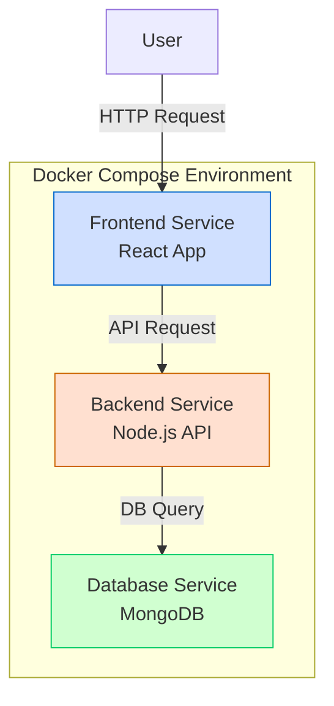

# Docker Compose YAML

## Introduction

Docker Compose is a powerful tool that allows you to define and run multi-container Docker applications. At the heart of Docker Compose is the YAML file (typically named `docker-compose.yml`), which describes your application's services, networks, and volumes in a declarative way. This configuration file is written in YAML (YAML Ain't Markup Language) format, which is designed to be human-readable and easy to work with.

In this tutorial, we'll explore the structure and syntax of Docker Compose YAML files, understand the key components, and learn how to create effective configurations for your Docker applications.

## Understanding YAML Basics

Before diving into Docker Compose specifics, let's briefly review YAML syntax:

- YAML is indentation-sensitive (usually 2 spaces)
- Comments begin with `#`
- Key-value pairs are written as `key: value`
- Lists are represented using hyphens (`-`)
- YAML supports strings, numbers, booleans, nulls, lists, and maps

Here's a simple example:

```yaml
# This is a comment
name: John Doe
age: 30
is_active: true
skills:
  - Python
  - Docker
  - JavaScript
address:
  street: 123 Main St
  city: Anytown
```

## Docker Compose YAML Structure

A Docker Compose file is structured around these main components:

1. **Version** - Specifies the Compose file format version
2. **Services** - Defines the containers your application uses
3. **Networks** - Configures networking between containers
4. **Volumes** - Manages persistent data storage
5. **Configs** and **Secrets** - Manage configuration and sensitive data

Let's look at a minimal example:

```yaml
version: '3.8'

services:
  webapp:
    image: nginx:latest
    ports:
      - "80:80"
```

## Key Components in Detail

### Version

The `version` key specifies which Compose file version you're using:

```yaml
version: '3.8'
```

For most current projects, versions 3.x are recommended. The version affects which features are available.

### Services

The `services` section defines the containers that make up your application:

```yaml
services:
  webapp:
    image: nginx:latest
    ports:
      - "80:80"
    volumes:
      - ./html:/usr/share/nginx/html
  
  database:
    image: mysql:8.0
    environment:
      MYSQL_ROOT_PASSWORD: example
      MYSQL_DATABASE: myapp
```

Each service can include the following common properties:

#### `image`

Specifies the Docker image to use:

```yaml
image: postgres:13
```

#### `build`

Instead of using a pre-built image, you can build a custom image:

```yaml
build:
  context: ./app
  dockerfile: Dockerfile.dev
```

Or more simply:

```yaml
build: ./app
```

#### `ports`

Maps host ports to container ports:

```yaml
ports:
  - "8080:80"  # Host port 8080 maps to container port 80
  - "443:443"
```

#### `volumes`

Mounts host paths or named volumes into the container:

```yaml
volumes:
  - ./data:/app/data  # Host path to container path
  - logs:/app/logs    # Named volume to container path
```

#### `environment`

Sets environment variables:

```yaml
environment:
  NODE_ENV: development
  DEBUG: "true"
```

Or using an array format:

```yaml
environment:
  - NODE_ENV=development
  - DEBUG=true
```

#### `depends_on`

Expresses dependency between services:

```yaml
depends_on:
  - database
  - redis
```

#### `networks`

Connects the container to specific networks:

```yaml
networks:
  - frontend
  - backend
```

#### `restart`

Configures the restart policy:

```yaml
restart: always  # Other options: "no", "on-failure", "unless-stopped"
```

### Networks

The `networks` section defines the networks for your services:

```yaml
networks:
  frontend:
    driver: bridge
  backend:
    driver: bridge
    internal: true  # Not accessible from outside
```

### Volumes

The `volumes` section defines named volumes that can be mounted to containers:

```yaml
volumes:
  dbdata:  # This creates a named volume called "dbdata"
    driver: local
  logs:
    driver: local
```

## Complete Example

Here's a complete example of a Docker Compose file for a web application with frontend, backend, and database services:

```yaml
version: '3.8'

services:
  frontend:
    build: ./frontend
    ports:
      - "3000:3000"
    volumes:
      - ./frontend:/app
      - /app/node_modules
    environment:
      - NODE_ENV=development
      - REACT_APP_API_URL=http://backend:5000/api
    depends_on:
      - backend
    networks:
      - frontend-network

  backend:
    build: ./backend
    ports:
      - "5000:5000"
    volumes:
      - ./backend:/app
      - /app/node_modules
    environment:
      - NODE_ENV=development
      - DATABASE_URL=mongodb://db:27017/myapp
    depends_on:
      - db
    networks:
      - frontend-network
      - backend-network

  db:
    image: mongo:4.4
    volumes:
      - mongo-data:/data/db
    ports:
      - "27017:27017"
    environment:
      - MONGO_INITDB_ROOT_USERNAME=root
      - MONGO_INITDB_ROOT_PASSWORD=example
    networks:
      - backend-network

networks:
  frontend-network:
    driver: bridge
  backend-network:
    driver: bridge

volumes:
  mongo-data:
    driver: local
```

## Application Flow Visualization

Here's a diagram showing how the services in our example interact:



## Common Configuration Patterns

### Environment Variables

Using environment variables from a `.env` file:

```yaml
services:
  app:
    image: myapp
    env_file:
      - .env.development
```

### Health Checks

Adding health checks to ensure services are running properly:

```yaml
services:
  webapp:
    image: nginx
    healthcheck:
      test: ["CMD", "curl", "-f", "http://localhost"]
      interval: 30s
      timeout: 10s
      retries: 3
      start_period: 40s
```

### Resource Limits

Setting resource constraints for containers:

```yaml
services:
  app:
    image: myapp
    deploy:
      resources:
        limits:
          cpus: '0.5'
          memory: 512M
        reservations:
          cpus: '0.25'
          memory: 256M
```

## Docker Compose Commands with YAML Files

Once you've created your Docker Compose YAML file, you can use these common commands:

- Start services: `docker-compose up`
- Start in detached mode: `docker-compose up -d`
- Stop services: `docker-compose down`
- View logs: `docker-compose logs`
- List running services: `docker-compose ps`
- Execute command in service: `docker-compose exec service_name command`

## Best Practices for Docker Compose YAML

1. **Use version control** for your Docker Compose files
2. **Organize services** logically by function
3. **Set explicit versions** for images to ensure consistency
4. **Use environment variables** for configuration that changes between environments
5. **Define volumes** for persistent data
6. **Use healthchecks** for critical services
7. **Comment your configuration** for clarity
8. **Use descriptive names** for services, networks, and volumes
9. **Validate your YAML** before deployment
10. **Keep sensitive information** in environment files (`.env`) excluded from version control

## Advanced Features

### Multiple Compose Files

You can split your configuration across multiple files for different environments:

- `docker-compose.yml` - Base configuration
- `docker-compose.override.yml` - Development overrides
- `docker-compose.prod.yml` - Production settings

To use a specific override file:

```bash
docker-compose -f docker-compose.yml -f docker-compose.prod.yml up -d
```

### Extending Services

You can extend service definitions using YAML anchors and aliases:

```yaml
version: '3.8'

x-common-config: &common-config
  restart: always
  logging:
    driver: "json-file"
    options:
      max-size: "10m"
      max-file: "3"

services:
  service1:
    <<: *common-config
    image: service1-image
  
  service2:
    <<: *common-config
    image: service2-image
```

## Troubleshooting Docker Compose YAML

### Indentation Issues

YAML is sensitive to indentation. Always use consistent indentation (typically 2 spaces).

```yaml
# Incorrect indentation
services:
  webapp:
  image: nginx  # This should be indented further

# Correct indentation
services:
  webapp:
    image: nginx
```

### Quotes for Special Characters

Use quotes for values containing special characters:

```yaml
environment:
  # Using quotes for special characters
  SPECIAL_STRING: "value:with:colons"
```

### Validation Tools

Use Docker Compose's built-in validation:

```bash
docker-compose config
```

## Summary

Docker Compose YAML files provide a powerful, declarative way to define multi-container applications. Key points to remember:

- YAML is indentation-sensitive and human-readable
- The main components are `version`, `services`, `networks`, and `volumes`
- Each service can define its image, build context, ports, volumes, and more
- Docker Compose provides commands to manage the entire application lifecycle
- Best practices include version control, environment variables, and clear organization

By mastering Docker Compose YAML, you gain the ability to define complex applications in a simple, reproducible way, making development and deployment more efficient and consistent.

## Exercise: Create Your First Multi-Service Application

Try creating a Docker Compose file for a simple web application with:

1. A frontend service using Nginx
2. A backend service using a language of your choice (Node.js, Python, etc.)
3. A database service (MySQL, PostgreSQL, or MongoDB)

Make sure to define appropriate volumes, networks, and environment variables.

## Additional Resources

- [Docker Compose Documentation](https://docs.docker.com/compose/)
- [YAML Specification](https://yaml.org/)
- [Docker Compose CLI Reference](https://docs.docker.com/compose/reference/)
- [Docker Compose File Version Compatibility](https://docs.docker.com/compose/compose-file/compose-versioning/)