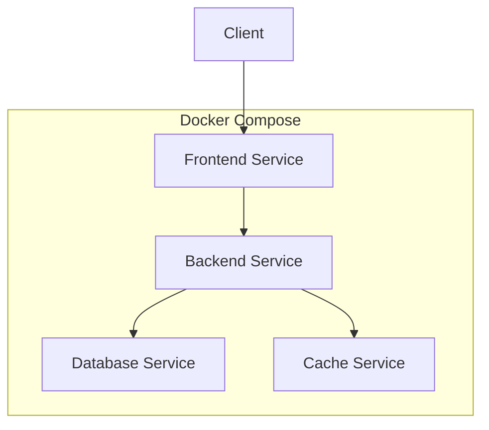

# Docker Compose Services

## Introduction

When building modern applications, you'll often need to run multiple containers that work together. For example, you might have a container for your web application, another for your database, and perhaps a third for a cache like Redis. **Docker Compose** makes managing these multi-container applications straightforward, and **services** are at the heart of this functionality.

In this guide, we'll explore how to define services in Docker Compose, understand the available configuration options, and see real-world examples of how services are used in development environments.

## What Are Docker Compose Services?

In Docker Compose, a **service** is a container in production. Services define how containers should behave in your application environment, including:

- What Docker image to use
- Environment variables
- Network connections
- Volume mounts
- Resource constraints
- Restart policies
- And much more

Let's look at the basic structure of defining a service in a `docker-compose.yml` file:

```yaml
version: '3.8'

services:
  # Service name
  web:
    # Service configuration goes here
    image: nginx:latest
    ports:
      - "80:80"
```

In this simple example, we've defined a service named `web` that uses the `nginx:latest` image and maps port 80 from the container to port 80 on the host.

## Creating Your First Docker Compose Services File

Let's create a complete example of a `docker-compose.yml` file with multiple services:

```yaml
version: '3.8'

services:
  # Web application service
  web:
    image: nginx:latest
    ports:
      - "80:80"
    volumes:
      - ./website:/usr/share/nginx/html
    depends_on:
      - api
  
  # API service
  api:
    build: ./api
    ports:
      - "3000:3000"
    environment:
      - DB_HOST=database
      - DB_USER=myuser
      - DB_PASSWORD=mypassword
      - DB_NAME=mydb
    depends_on:
      - database
  
  # Database service
  database:
    image: postgres:13
    volumes:
      - postgres_data:/var/lib/postgresql/data
    environment:
      - POSTGRES_USER=myuser
      - POSTGRES_PASSWORD=mypassword
      - POSTGRES_DB=mydb

volumes:
  postgres_data:
```

In this file, we've defined three services:
- `web`: An Nginx web server for serving static content
- `api`: A custom API service built from a local Dockerfile
- `database`: A PostgreSQL database for data storage

## Key Service Configuration Options

Let's explore the most important configuration options for services:

### Image or Build

Every service needs a container image. You can specify an existing image or build a custom one:

```yaml
services:
  # Using an existing image
  web:
    image: nginx:latest
    
  # Building a custom image
  api:
    build: ./api
    
  # Building with more options
  app:
    build:
      context: ./app
      dockerfile: Dockerfile.dev
      args:
        NODE_ENV: development
```

### Ports

To expose ports from a container to the host:

```yaml
services:
  web:
    image: nginx:latest
    ports:
      - "80:80"      # HOST:CONTAINER format
      - "443:443"
      - "8080"       # Will assign a random host port to container port 8080
```

### Environment Variables

To set environment variables in a container:

```yaml
services:
  api:
    image: my-api:latest
    environment:
      - NODE_ENV=production
      - API_KEY=secret_value
      - DEBUG=false
    # Alternative syntax
    # environment:
    #   NODE_ENV: production
    #   API_KEY: secret_value
    #   DEBUG: "false"
```

For better security, you can use a `.env` file:

```yaml
services:
  api:
    image: my-api:latest
    env_file:
      - ./config.env
```

### Volumes

To mount files or directories from the host to the container:

```yaml
services:
  web:
    image: nginx:latest
    volumes:
      - ./website:/usr/share/nginx/html          # Host path:Container path
      - ./nginx.conf:/etc/nginx/nginx.conf:ro    # Read-only volume
      - logs:/var/log/nginx                      # Named volume
```

### Networks

To control how containers connect to each other:

```yaml
services:
  web:
    image: nginx:latest
    networks:
      - frontend
  
  api:
    image: my-api:latest
    networks:
      - frontend
      - backend
  
  database:
    image: postgres:latest
    networks:
      - backend

networks:
  frontend:
  backend:
```

### Depends On

To control the startup order of services:

```yaml
services:
  web:
    image: nginx:latest
    depends_on:
      - api
  
  api:
    image: my-api:latest
    depends_on:
      - database
  
  database:
    image: postgres:latest
```

Note: `depends_on` only waits for the container to start, not for the service inside the container to be ready.

## Service Resource Configuration

You can also configure resource constraints for your services:

```yaml
services:
  api:
    image: my-api:latest
    deploy:
      resources:
        limits:
          cpus: '0.5'
          memory: 512M
        reservations:
          cpus: '0.25'
          memory: 256M
```

## Restart Policies

To define how containers should restart after a failure:

```yaml
services:
  web:
    image: nginx:latest
    restart: always  # Options: "no", "on-failure", "always", "unless-stopped"
```

## Practical Example: Full-Stack Web Application

Let's build a complete example of a typical full-stack web application with React frontend, Node.js backend, and MongoDB database:

```yaml
version: '3.8'

services:
  # Frontend service
  frontend:
    build:
      context: ./frontend
      dockerfile: Dockerfile
    ports:
      - "3000:3000"
    volumes:
      - ./frontend:/app
      - /app/node_modules
    environment:
      - REACT_APP_API_URL=http://localhost:4000
    depends_on:
      - backend
  
  # Backend service
  backend:
    build:
      context: ./backend
      dockerfile: Dockerfile
    ports:
      - "4000:4000"
    volumes:
      - ./backend:/app
      - /app/node_modules
    environment:
      - PORT=4000
      - MONGO_URI=mongodb://db:27017/myapp
      - NODE_ENV=development
    depends_on:
      - db
  
  # Database service
  db:
    image: mongo:4.4
    volumes:
      - mongo_data:/data/db
    ports:
      - "27017:27017"

volumes:
  mongo_data:
```

## Common Service Patterns

Let's look at some common service patterns you might encounter in real-world scenarios:

### 1. Service with Healthcheck

```yaml
services:
  api:
    image: my-api:latest
    healthcheck:
      test: ["CMD", "curl", "-f", "http://localhost:3000/health"]
      interval: 30s
      timeout: 10s
      retries: 3
      start_period: 40s
```

### 2. Service with Custom Command and Entrypoint

```yaml
services:
  worker:
    image: my-worker:latest
    entrypoint: /bin/sh
    command: -c "echo 'Starting worker' && python worker.py"
```

### 3. Service with Logging Configuration

```yaml
services:
  web:
    image: nginx:latest
    logging:
      driver: "json-file"
      options:
        max-size: "10m"
        max-file: "3"
```

## Working with Multiple Compose Files

For complex projects, you might want to split your configuration across multiple files:

```bash
# Base configuration
docker-compose -f docker-compose.yml -f docker-compose.prod.yml up -d
```

Base file (`docker-compose.yml`):

```yaml
version: '3.8'

services:
  web:
    image: myapp:latest
    build: .
```

Production overrides (`docker-compose.prod.yml`):

```yaml
version: '3.8'

services:
  web:
    environment:
      - NODE_ENV=production
    restart: always
```

## Service Visualization

Understanding the relationships between services can be helpful. Here's a visualization of a multi-service application:



## Summary

Docker Compose services provide a powerful way to define multi-container applications. In this guide, we've covered:

- Basic service definition syntax
- Key configuration options like image, ports, volumes, and environment variables
- Resource constraints and restart policies
- Real-world examples of full-stack applications
- Common service patterns and configurations

With these concepts, you can now build sophisticated multi-container applications that are easy to deploy and manage across different environments.

## Additional Resources and Exercises

### Exercises

1. **Basic Service Configuration**:
   - Create a Docker Compose file with a simple web service using the `nginx` image.
   - Map port 8080 on your host to port 80 in the container.
   - Mount a local directory containing an `index.html` file to `/usr/share/nginx/html`.

2. **Multi-Service Application**:
   - Build a Docker Compose file with three services: a web frontend, an API, and a database.
   - Configure environment variables to connect the API to the database.
   - Use depends_on to ensure proper startup order.

3. **Service Scaling**:
   - Create a Docker Compose file with a web service that can be scaled.
   - Practice scaling the service using the command: `docker-compose up --scale web=3`.

### Additional Resources

- [Docker Compose Documentation](https://docs.docker.com/compose/)
- [Docker Compose File Reference](https://docs.docker.com/compose/compose-file/)
- [Best Practices for Docker Compose](https://docs.docker.com/develop/dev-best-practices/)

Happy containerizing!