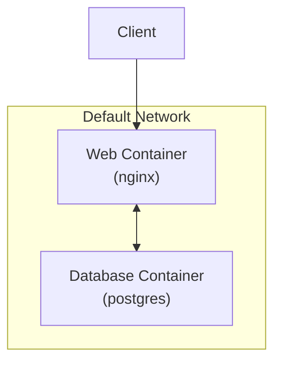
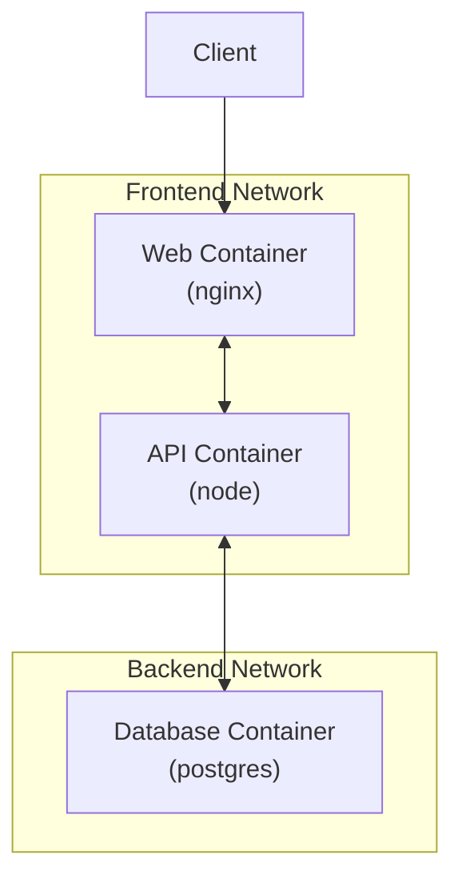
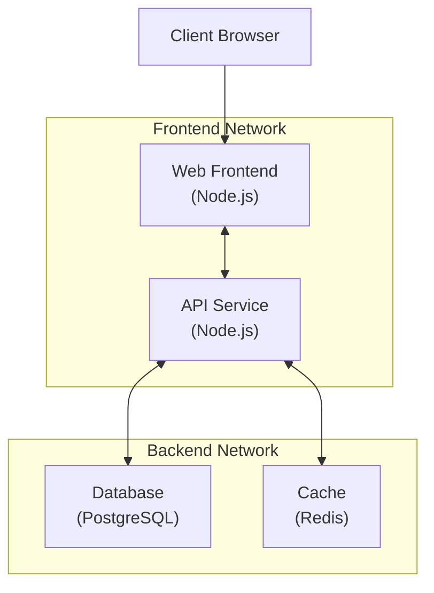

# Docker Compose Networks

## Introduction

When building applications with Docker, containers often need to communicate with each other. Docker Compose simplifies this communication by providing built-in networking capabilities. Understanding how networking works in Docker Compose is essential for developing multi-container applications effectively.

In this guide, we'll explore how Docker Compose manages networks, how containers can communicate with each other, and how to customize network configurations for your specific needs.

## Default Network Behavior

By default, Docker Compose creates a single network for your application, and all services defined in your `docker-compose.yml` file are connected to this network. This means containers can communicate with each other using their service names as hostnames.

Let's look at a basic example:

```yaml
version: '3'
services:
  web:
    image: nginx:latest
    ports:
      - "8080:80"
  database:
    image: postgres:latest
    environment:
      POSTGRES_PASSWORD: example
```

When you run `docker-compose up`, both services (`web` and `database`) are placed on the same network. The `web` service can reach the `database` service using the hostname `database`.

For example, if your web application needs to connect to the database, you could use:

```javascript
// Node.js example
const { Client } = require('pg')
const client = new Client({
  host: 'database', // This works because of Docker Compose networking
  user: 'postgres',
  password: 'example'
})
```

## Visualizing the Default Network



## Inspecting Networks

To see the networks created by Docker Compose, use:

```bash
docker-compose ps
docker network ls
```

You'll notice that Docker Compose creates a network with a name based on your project directory:

```
NETWORK ID     NAME                  DRIVER    SCOPE
f7d5ce87a756   myapp_default         bridge    local
```

To inspect a specific network:

```bash
docker network inspect myapp_default
```

Output (simplified):

```json
[
  {
    "Name": "myapp_default",
    "Driver": "bridge",
    "Containers": {
      "2a6e712d74c2": {
        "Name": "myapp_web_1",
        "IPv4Address": "172.18.0.2/16"
      },
      "d5fcf3d034fc": {
        "Name": "myapp_database_1",
        "IPv4Address": "172.18.0.3/16"
      }
    }
  }
]
```

## Custom Network Configuration

While the default network is sufficient for many use cases, Docker Compose allows you to define custom networks with specific settings.

### Defining Custom Networks

```yaml
version: '3'

services:
  web:
    image: nginx:latest
    networks:
      - frontend
  api:
    image: node:alpine
    networks:
      - frontend
      - backend
  database:
    image: postgres:latest
    networks:
      - backend

networks:
  frontend:
    driver: bridge
  backend:
    driver: bridge
```

In this example:
- We define two networks: `frontend` and `backend`
- The `web` service can only communicate with the `api` service
- The `database` service can only communicate with the `api` service
- The `api` service can communicate with both `web` and `database`

### Visualizing Custom Networks



## Network Types and Drivers

Docker Compose supports different network drivers, each with specific use cases:

1. **bridge** (default): Standard network driver for standalone containers

```yaml
networks:
  mynetwork:
    driver: bridge
```

2. **host**: Removes network isolation between container and host

```yaml
networks:
  mynetwork:
    driver: host
```

3. **none**: Disables networking for containers

```yaml
networks:
  mynetwork:
    driver: none
```

4. **overlay**: For multi-host networking (used with Docker Swarm)

```yaml
networks:
  mynetwork:
    driver: overlay
```

## Advanced Network Configuration

### Setting Static IP Addresses

You can configure containers with static IP addresses:

```yaml
version: '3'

services:
  web:
    image: nginx:latest
    networks:
      app_net:
        ipv4_address: 172.16.238.10

networks:
  app_net:
    driver: bridge
    ipam:
      driver: default
      config:
        - subnet: 172.16.238.0/24
```

### Connecting to External Networks

You can connect to pre-existing networks (created outside Docker Compose):

```yaml
version: '3'

services:
  web:
    image: nginx:latest
    networks:
      - existing_network

networks:
  existing_network:
    external: true
```

### Network Aliases

You can give services additional network aliases to be reached by:

```yaml
version: '3'

services:
  database:
    image: postgres:latest
    networks:
      backend:
        aliases:
          - db
          - postgresql

networks:
  backend:
    driver: bridge
```

With this configuration, other services can connect to the database using either `database`, `db`, or `postgresql` as the hostname.

## Practical Example: Web Application with Database and Redis Cache

Let's create a practical example of a web application with a database and Redis cache:

```yaml
version: '3'

services:
  web:
    build: ./web
    ports:
      - "3000:3000"
    networks:
      - frontend
      - backend
    depends_on:
      - api
  
  api:
    build: ./api
    networks:
      - backend
    depends_on:
      - database
      - redis
    environment:
      - DB_HOST=database
      - REDIS_HOST=redis
  
  database:
    image: postgres:latest
    volumes:
      - db-data:/var/lib/postgresql/data
    networks:
      - backend
    environment:
      POSTGRES_PASSWORD: example
  
  redis:
    image: redis:alpine
    networks:
      - backend

networks:
  frontend:
    driver: bridge
  backend:
    driver: bridge

volumes:
  db-data:
```

In this example:
1. We have a web frontend that communicates with an API
2. The API service communicates with both a database and Redis cache
3. The database and Redis are only accessible to the API (not directly to the web frontend)
4. We're using environment variables to pass connection information

### Web App Architecture Diagram



## Network Best Practices

1. **Security through Segmentation**: Separate your networks based on security requirements. For instance, keep your database in a different network than your frontend.

   ```yaml
   networks:
     frontend:
       driver: bridge
     backend:
       driver: bridge
       internal: true  # No external connectivity
   ```

2. **Use network aliases wisely**: They can make your configuration more flexible and descriptive.

3. **Consider using the `internal` flag** for networks that should not have internet access:

   ```yaml
   networks:
     db_network:
       driver: bridge
       internal: true
   ```

4. **Use service discovery** by default (service names as hostnames) instead of hardcoded IPs.

5. **Document your network layout** for complex applications.

## Troubleshooting Docker Compose Networks

### 1. Check network connectivity between containers

Use the `docker-compose exec` command to run commands inside containers:

```bash
docker-compose exec web ping database
```

### 2. Inspect the network

```bash
docker network inspect my_project_default
```

### 3. View logs for network-related issues

```bash
docker-compose logs [service_name]
```

### 4. Recreate networks

If you're experiencing networking issues, try:

```bash
docker-compose down
docker-compose up
```

## Summary

Docker Compose networks provide a powerful way to manage communication between containers in multi-container applications. By default, Docker Compose creates a single network for all services, enabling easy communication between them using service names as hostnames.

For more complex applications, you can define custom networks with specific drivers and configurations, including static IP addresses, custom subnets, and network aliases. By understanding these networking capabilities, you can design more secure and efficient container-based applications.

## Exercise: Create a Three-Tier Application

**Exercise**: Create a Docker Compose configuration for a three-tier application with:
- A frontend web server (Nginx)
- A backend API (Node.js)
- A database (MongoDB)

Requirements:
1. The frontend should only communicate with the backend API
2. The backend API should communicate with both the frontend and database
3. The database should only be accessible to the backend API
4. Define appropriate networks to enforce these communication patterns

## Additional Resources

- [Docker Compose Networking Documentation](https://docs.docker.com/compose/networking/)
- [Docker Network Drivers](https://docs.docker.com/network/drivers/)
- [Docker Networking Guide](https://docs.docker.com/network/)