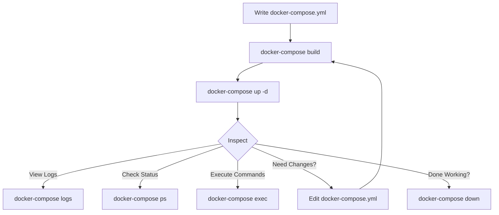

# Docker Compose Commands

## Introduction

Docker Compose is a powerful tool that allows you to define and manage multi-container Docker applications. Instead of using multiple Docker commands to create, start, and connect containers, Docker Compose enables you to use a single YAML file to configure your application's services and execute a single command to create and start all the services.

This guide covers the essential Docker Compose commands you'll need to work with multi-container applications effectively. By the end, you'll be comfortable creating, running, and managing complex Docker environments.

## Getting Started with Docker Compose

Before diving into the commands, make sure you have Docker and Docker Compose installed on your system. You can check your installations with:

```bash
docker --version
docker-compose --version
```

A Docker Compose file (typically named `docker-compose.yml`) defines the services, networks, and volumes for your application. Here's a simple example:

```yaml
version: '3'
services:
  web:
    image: nginx:latest
    ports:
      - "8080:80"
  database:
    image: mysql:5.7
    environment:
      MYSQL_ROOT_PASSWORD: example
```

This file defines two services: a web server using the Nginx image and a database using MySQL.

## Essential Docker Compose Commands

### 1. Creating and Starting Containers

#### `docker-compose up`

This command builds, creates, and starts all services defined in your `docker-compose.yml` file.

```bash
# Start all services
docker-compose up

# Start in detached mode (background)
docker-compose up -d

# Build images before starting containers
docker-compose up --build
```

**Output example:**
```
Creating network "myapp_default" with the default driver
Creating myapp_database_1 ... done
Creating myapp_web_1      ... done
Attaching to myapp_database_1, myapp_web_1
database_1  | 2023-04-10T10:15:23.334Z [Note] [Entrypoint]: Entrypoint script for MySQL Server started.
web_1       | /docker-entrypoint.sh: /docker-entrypoint.d/ is not empty, will attempt to perform configuration
```

### 2. Stopping Containers

#### `docker-compose down`

This command stops and removes all containers, networks, and volumes defined in the Docker Compose file.

```bash
# Stop and remove containers, networks
docker-compose down

# Additionally remove volumes
docker-compose down --volumes

# Additionally remove images
docker-compose down --rmi all
```

#### `docker-compose stop`

This command stops running containers without removing them.

```bash
# Stop all services
docker-compose stop

# Stop specific service
docker-compose stop web
```

### 3. Viewing Container Status

#### `docker-compose ps`

This command lists all containers related to the services defined in your Docker Compose file and their status.

```bash
docker-compose ps
```

**Output example:**
```
       Name                     Command               State           Ports
----------------------------------------------------------------------------------
myapp_database_1    docker-entrypoint.sh mysqld      Up      3306/tcp, 33060/tcp
myapp_web_1         /docker-entrypoint.sh ngin ...   Up      0.0.0.0:8080->80/tcp
```

### 4. Viewing Logs

#### `docker-compose logs`

This command displays log outputs from services.

```bash
# View logs of all services
docker-compose logs

# View logs of a specific service
docker-compose logs web

# Follow log output
docker-compose logs -f

# Show last 10 lines
docker-compose logs --tail=10
```

### 5. Executing Commands in Containers

#### `docker-compose exec`

This command executes a command in a running container.

```bash
# Open a shell in the web service container
docker-compose exec web bash

# Run a specific command
docker-compose exec database mysql -u root -p
```

### 6. Building Images

#### `docker-compose build`

This command builds or rebuilds services defined in the Docker Compose file.

```bash
# Build all services
docker-compose build

# Build a specific service
docker-compose build web

# Build with no cache
docker-compose build --no-cache
```

### 7. Pulling Images

#### `docker-compose pull`

This command pulls the latest images for services defined in the Docker Compose file.

```bash
# Pull all images
docker-compose pull

# Pull a specific service's image
docker-compose pull database
```

### 8. Creating Service Configuration

#### `docker-compose config`

This command validates and displays the composition file after processing.

```bash
# Check if docker-compose.yml is valid
docker-compose config

# Check a specific file
docker-compose -f custom-compose.yml config
```

### 9. Scaling Services

#### `docker-compose up --scale`

This command scales a service to a specified number of instances.

```bash
# Scale the web service to 3 instances
docker-compose up -d --scale web=3
```

**Output example:**
```
Creating myapp_web_1 ... done
Creating myapp_web_2 ... done
Creating myapp_web_3 ... done
```

## Practical Examples

### Example 1: Setting Up a Web Application with Database

Let's create a simple web application with a front-end, backend API, and database:

```yaml
version: '3'
services:
  frontend:
    image: node:14
    working_dir: /app
    volumes:
      - ./frontend:/app
    command: npm start
    ports:
      - "3000:3000"
    depends_on:
      - api

  api:
    image: node:14
    working_dir: /app
    volumes:
      - ./api:/app
    command: npm start
    ports:
      - "4000:4000"
    depends_on:
      - db
    environment:
      - DB_HOST=db
      - DB_USER=root
      - DB_PASSWORD=example
      - DB_NAME=myapp

  db:
    image: mysql:5.7
    ports:
      - "3306:3306"
    environment:
      - MYSQL_ROOT_PASSWORD=example
      - MYSQL_DATABASE=myapp
    volumes:
      - db-data:/var/lib/mysql

volumes:
  db-data:
```

To set up and run this application:

```bash
# Start all services in detached mode
docker-compose up -d

# Check status
docker-compose ps

# View API logs
docker-compose logs api

# Execute MySQL command
docker-compose exec db mysql -u root -p -e "SHOW DATABASES;"
```

### Example 2: Development vs. Production Configuration

You can use multiple compose files for different environments:

**docker-compose.yml** (base configuration):
```yaml
version: '3'
services:
  app:
    build: .
    ports:
      - "8000:8000"
  db:
    image: postgres:13
    volumes:
      - db-data:/var/lib/postgresql/data

volumes:
  db-data:
```

**docker-compose.override.yml** (development overrides, applied automatically):
```yaml
version: '3'
services:
  app:
    volumes:
      - ./app:/app
    environment:
      - DEBUG=true
  db:
    ports:
      - "5432:5432"
```

**docker-compose.prod.yml** (production overrides):
```yaml
version: '3'
services:
  app:
    environment:
      - DEBUG=false
    restart: always
  db:
    restart: always
```

To use these configurations:

```bash
# For development (uses docker-compose.yml + docker-compose.override.yml automatically)
docker-compose up -d

# For production (specify both files)
docker-compose -f docker-compose.yml -f docker-compose.prod.yml up -d
```

## Docker Compose Command Flow

Here's a typical workflow with Docker Compose:



## Summary

Docker Compose provides a streamlined way to manage multi-container applications through a single YAML file and simple commands. The key commands we've covered are:

- `docker-compose up`: Create and start containers
- `docker-compose down`: Stop and remove containers
- `docker-compose ps`: View container status
- `docker-compose logs`: View logs
- `docker-compose exec`: Execute commands in containers
- `docker-compose build`: Build or rebuild services
- `docker-compose pull`: Pull service images
- `docker-compose config`: Validate configuration
- `docker-compose up --scale`: Scale services

By mastering these commands, you'll be able to efficiently develop, test, and deploy complex applications using Docker Compose.

## Additional Resources

- [Docker Compose Documentation](https://docs.docker.com/compose/)
- [Docker Compose File Reference](https://docs.docker.com/compose/compose-file/)

## Exercises

1. Create a `docker-compose.yml` file that runs a WordPress site with a MySQL database.
2. Modify an existing Docker Compose file to scale a service to multiple instances.
3. Create separate development and production Docker Compose configurations for an application.
4. Set up a multi-container application with proper dependency order and networking.
5. Use Docker Compose to set up a local development environment for a web application with frontend, backend, and database components.