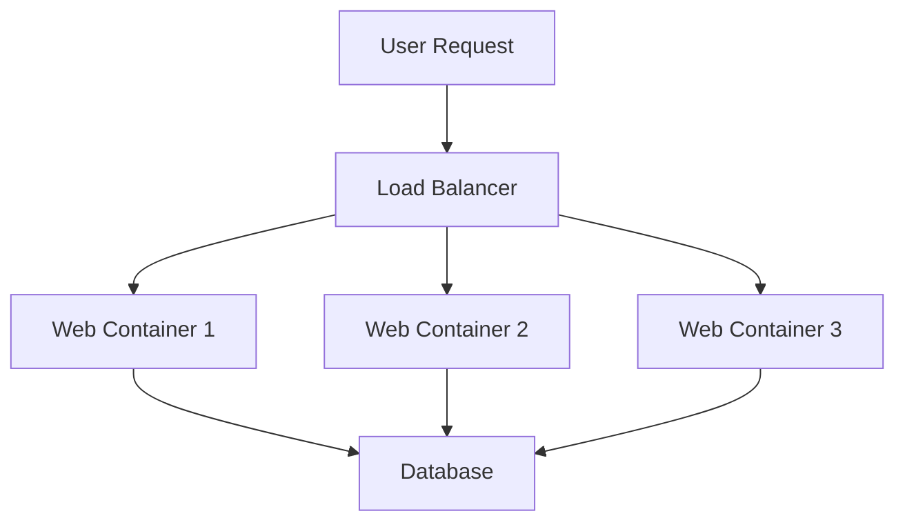

# Docker Compose Scaling

## Introduction

In modern application development, scalability is a critical requirement. As user traffic increases, your application needs to handle the growing load efficiently. Docker Compose, a tool for defining and running multi-container Docker applications, offers a straightforward way to scale services horizontally. 

Scaling in Docker Compose refers to increasing or decreasing the number of container instances for a specific service. This capability is particularly valuable for services that experience varying loads, such as web servers, API endpoints, or processing workers.

In this guide, we'll explore Docker Compose scaling features, understand when and how to implement them, and walk through practical examples to demonstrate their real-world applications.

## Understanding Docker Compose Scaling

When you scale a service in Docker Compose, you create multiple instances of the same container based on the service definition. Each container instance runs independently but shares the same configuration as defined in your `docker-compose.yml` file.

### Key Benefits of Scaling

- **Improved performance**: Distributing load across multiple container instances
- **Enhanced reliability**: Ensuring service availability even if some containers fail
- **Better resource utilization**: Making efficient use of available system resources
- **Flexibility**: Quickly adapting to changing demand without reconfiguring your application

## Basic Scaling with Docker Compose

Let's start with a simple example. Assume we have a basic web application with a web server and a database.

```yaml
version: '3'
services:
  web:
    image: nginx:latest
    ports:
      - "80:80"
  
  database:
    image: mysql:8.0
    environment:
      MYSQL_ROOT_PASSWORD: example
      MYSQL_DATABASE: myapp
```

### Using the `--scale` Option

The simplest way to scale a service is by using the `--scale` option with the `docker-compose up` command:

```bash
docker-compose up -d --scale web=3
```

This command starts three instances of the `web` service while keeping a single instance of the `database` service.

**Output:**
```
Creating project_web_1 ... done
Creating project_web_2 ... done
Creating project_web_3 ... done
Creating project_database_1 ... done
```

### Port Conflicts When Scaling

You might notice a problem with our previous example. Since all three web containers try to bind to port 80 on the host, you'll encounter port conflicts. Let's update our configuration to handle this:

```yaml
version: '3'
services:
  web:
    image: nginx:latest
    ports:
      - "8080-8082:80"
  
  database:
    image: mysql:8.0
    environment:
      MYSQL_ROOT_PASSWORD: example
      MYSQL_DATABASE: myapp
```

Now when we scale the web service:

```bash
docker-compose up -d --scale web=3
```

Docker Compose will map each container's port 80 to a different host port in the specified range (8080, 8081, and 8082).

## Advanced Scaling Configurations

For more complex applications, we need more sophisticated scaling strategies.

### Using Load Balancers

In a production environment, you typically want to distribute traffic across your scaled services. This is where a load balancer comes in:

```yaml
version: '3'
services:
  web:
    image: nginx:latest
    expose:
      - "80"
  
  load-balancer:
    image: nginx:latest
    volumes:
      - ./nginx.conf:/etc/nginx/nginx.conf
    ports:
      - "80:80"
    depends_on:
      - web
  
  database:
    image: mysql:8.0
    environment:
      MYSQL_ROOT_PASSWORD: example
      MYSQL_DATABASE: myapp
```

With a custom Nginx configuration in `nginx.conf`:

```
events {
    worker_connections 1024;
}

http {
    upstream web {
        server web_1:80;
        server web_2:80;
        server web_3:80;
    }
    
    server {
        listen 80;
        
        location / {
            proxy_pass http://web;
            proxy_set_header Host $host;
            proxy_set_header X-Real-IP $remote_addr;
        }
    }
}
```

The challenge here is that you need to know the container names in advance. Let's see a more dynamic approach in the next section.

## Scaling With Docker Swarm

For more advanced scaling needs, you might want to use Docker Compose with Docker Swarm, which provides native load balancing and service discovery.

First, initialize a Swarm:

```bash
docker swarm init
```

Then, deploy your stack:

```bash
docker stack deploy -c docker-compose.yml myapp
```

A Docker Compose file for Swarm might look like this:

```yaml
version: '3.8'
services:
  web:
    image: nginx:latest
    deploy:
      replicas: 3
      resources:
        limits:
          cpus: '0.5'
          memory: 512M
    ports:
      - "80:80"
  
  database:
    image: mysql:8.0
    environment:
      MYSQL_ROOT_PASSWORD: example
      MYSQL_DATABASE: myapp
    deploy:
      replicas: 1
      placement:
        constraints: [node.role == manager]
```

The `deploy` section specifies how the service should be deployed in Swarm mode, including the number of replicas.

## Real-World Example: Scaling a Web Application

Let's create a more practical example with a complete web application stack:

```yaml
version: '3.8'
services:
  frontend:
    build: ./frontend
    deploy:
      replicas: 5
      update_config:
        parallelism: 2
        delay: 10s
      restart_policy:
        condition: on-failure
    ports:
      - "3000-3004:3000"
  
  api:
    build: ./api
    deploy:
      replicas: 3
      resources:
        limits:
          cpus: '0.5'
          memory: 256M
    environment:
      DB_HOST: database
      REDIS_HOST: cache
  
  database:
    image: postgres:13
    volumes:
      - db-data:/var/lib/postgresql/data
    environment:
      POSTGRES_PASSWORD: example
      POSTGRES_DB: myapp
    deploy:
      replicas: 1
      placement:
        constraints: [node.role == manager]
  
  cache:
    image: redis:6
    deploy:
      replicas: 2

volumes:
  db-data:
```

In this example:
- The frontend service is scaled to 5 replicas
- The API service is scaled to 3 replicas
- The database remains a single instance (scaling databases requires additional configuration)
- The Redis cache is scaled to 2 replicas

### Scaling Based on Resource Usage

In a production environment, you might want to scale services based on their resource usage. This requires additional tools like Docker's built-in autoscaling or external solutions like Kubernetes.

## Scaling Down Services

Scaling isn't just about increasing capacity. Sometimes you need to scale down to conserve resources:

```bash
docker-compose up -d --scale api=1
```

This command reduces the number of API service instances to just one.

## Monitoring Scaled Services

When working with scaled services, monitoring becomes essential. You can view all running containers with:

```bash
docker-compose ps
```

**Output:**
```
      Name                     Command               State           Ports
---------------------------------------------------------------------------------
myapp_api_1         node server.js                   Up      3000/tcp
myapp_api_2         node server.js                   Up      3000/tcp
myapp_api_3         node server.js                   Up      3000/tcp
myapp_database_1    docker-entrypoint.sh postgres    Up      5432/tcp
myapp_frontend_1    nginx -g daemon off;             Up      0.0.0.0:3000->3000/tcp
myapp_frontend_2    nginx -g daemon off;             Up      0.0.0.0:3001->3000/tcp
myapp_frontend_3    nginx -g daemon off;             Up      0.0.0.0:3002->3000/tcp
myapp_frontend_4    nginx -g daemon off;             Up      0.0.0.0:3003->3000/tcp
myapp_frontend_5    nginx -g daemon off;             Up      0.0.0.0:3004->3000/tcp
```

For more detailed metrics, consider using Docker's built-in stats command:

```bash
docker stats
```

Or integrate with monitoring solutions like Prometheus and Grafana.

## Best Practices for Docker Compose Scaling

1. **Stateless services**: Design services to be stateless whenever possible for easy scaling
2. **Resource allocation**: Set appropriate resource limits to prevent a single service from consuming all resources
3. **Load balancing**: Implement proper load balancing for evenly distributed traffic
4. **Persistent data**: Be careful when scaling services that manage persistent data
5. **Network configuration**: Ensure proper network configuration to allow communication between scaled services
6. **Health checks**: Implement health checks to ensure only healthy containers receive traffic
7. **Logging**: Configure centralized logging to aggregate logs from all container instances

```yaml
version: '3.8'
services:
  web:
    image: nginx:latest
    deploy:
      replicas: 3
    healthcheck:
      test: ["CMD", "curl", "-f", "http://localhost"]
      interval: 30s
      timeout: 10s
      retries: 3
      start_period: 40s
```

## Limitations of Docker Compose Scaling

While Docker Compose scaling is powerful, it does have limitations:

1. **Single host**: Basic Docker Compose runs on a single host, limiting total capacity
2. **Manual scaling**: No built-in autoscaling capabilities in standalone Docker Compose
3. **Stateful services**: Challenging to scale services with persistent state
4. **Complex networking**: Advanced networking features may require additional configuration

For more advanced scaling needs, consider:
- Docker Swarm for native clustering
- Kubernetes for enterprise-level container orchestration

## Visual Representation of Scaling



## Summary

Docker Compose scaling provides a straightforward way to horizontally scale your containerized applications. By running multiple instances of a service, you can distribute load, improve reliability, and efficiently handle increased traffic.

We've covered:
- Basic scaling with the `--scale` option
- Handling port conflicts when scaling services
- Advanced configurations with load balancers
- Using Docker Swarm for more sophisticated scaling
- Real-world examples and best practices

As your applications grow, you might need to explore more advanced orchestration tools like Kubernetes, but Docker Compose scaling provides an excellent starting point for improving your application's performance and reliability.

## Additional Resources and Exercises

### Exercises

1. Create a simple web application with a frontend and backend service, then scale the backend to handle different loads.
2. Implement a load testing scenario to observe how scaled services handle increased traffic.
3. Configure a load balancer to distribute traffic among scaled services in a round-robin fashion.
4. Experiment with different scaling configurations and measure the performance impact.

### Further Learning

- Docker Compose official documentation
- Docker Swarm mode for advanced scaling
- Introduction to container orchestration with Kubernetes
- Monitoring containerized applications with Prometheus and Grafana