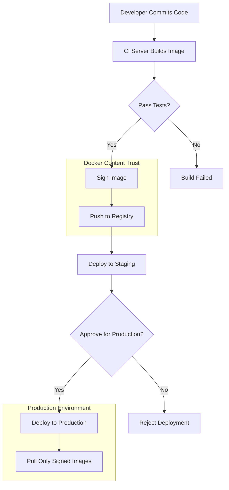

# Docker Content Trust

## Introduction

Docker Content Trust (DCT) is a critical security feature in Docker that allows you to verify the integrity and publisher of container images. In a world where containers are pulled from various registries, DCT provides a way to ensure that the images you're deploying haven't been tampered with and come from trusted sources.

At its core, Docker Content Trust implements a system of digital signatures for container images. When enabled, it requires Docker images to be signed when they're pushed to a registry and verifies these signatures when images are pulled. This creates a chain of trust from the image publisher to your deployment environment.

## Key Concepts

Before diving into how to use Docker Content Trust, let's understand some key concepts:

### Digital Signatures

Digital signatures use cryptographic keys to verify:
1. **Authenticity** - Confirms who created or published the image
2. **Integrity** - Ensures the image hasn't been modified since it was signed

### Notary

Docker Content Trust is built on [Notary](https://github.com/notaryproject/notary), an open-source project that implements The Update Framework (TUF), a secure design for content distribution. Notary provides the tools for signing and verifying content.

### Types of Keys in DCT

Docker Content Trust uses several types of keys:
- **Root Key**: The most powerful key that establishes the initial trust for the entire system
- **Target Key**: Used to sign individual images (also called a repository key)
- **Snapshot Key**: Prevents replay attacks by signing a snapshot of all targets
- **Timestamp Key**: Indicates when metadata was last updated

## Enabling Docker Content Trust

### Temporary Enabling

To enable Docker Content Trust for a single command, you can prefix your Docker commands with the `DOCKER_CONTENT_TRUST=1` environment variable:

```bash
# Pull an image with DCT enabled
DOCKER_CONTENT_TRUST=1 docker pull alpine:latest
```

If the image hasn't been signed, you'll see an error like:

```
Error: remote trust data does not exist for docker.io/library/alpine:latest
```

### Permanent Enabling

To enable Docker Content Trust permanently, set the environment variable in your shell profile:

```bash
# For bash users
echo 'export DOCKER_CONTENT_TRUST=1' >> ~/.bashrc
source ~/.bashrc

# For zsh users
echo 'export DOCKER_CONTENT_TRUST=1' >> ~/.zshrc
source ~/.zshrc
```

You can verify that Docker Content Trust is enabled:

```bash
echo $DOCKER_CONTENT_TRUST
# Should output "1"
```

## Signing Images with Docker Content Trust

When Docker Content Trust is enabled, images are automatically signed when you push them to a registry.

### Pushing a Signed Image

```bash
# Build your image
docker build -t username/myapp:1.0 .

# Push your image (with DCT enabled)
DOCKER_CONTENT_TRUST=1 docker push username/myapp:1.0
```

The first time you push a signed image, Docker will generate the necessary keys:

```
Generating key for username/myapp...
Enter passphrase for new repository key with ID 3f4fd5a: 
Repeat passphrase for new repository key with ID 3f4fd5a: 
Finished generating key for username/myapp
```

Keep your passphrase secure, as you'll need it each time you sign images for this repository.

### Key Management

Your keys are stored in `~/.docker/trust/`. It's crucial to back up your root key:

```bash
# Backup your root key
cp ~/.docker/trust/private/root_keys ~/.backup/
```

Losing your root key means losing the ability to sign new images with your existing targets keys.

## Verifying Signed Images

When Docker Content Trust is enabled, Docker automatically verifies signatures when pulling images:

```bash
# Pull a signed image
DOCKER_CONTENT_TRUST=1 docker pull username/myapp:1.0
```

If the signature is valid, Docker pulls the image normally. If not, you'll see an error.

You can also inspect trust information for a repository:

```bash
docker trust inspect username/myapp:1.0 --pretty
```

Output:

```
Signatures for username/myapp:1.0

SIGNED TAG          DIGEST                                                             SIGNERS
1.0                 708bc6af05e3e6e4da9f728cde7b4ee5416037f4800037d2bb56927e9b3b1a6a   username

Administrative keys for username/myapp:1.0

  Repository Key:       3f4fd5a919e26586582f12bb91f25253a0a6eefe05f21a9ea9eaa1b2e326425f
  Root Key:             40edfa775fb18a14683cce6af85810932300221e5211fb09eee6537eb17ef3f0
```

## Delegations - Advanced Trust Management

For teams or larger organizations, Docker Content Trust supports delegations, allowing multiple signers for a repository.

### Creating a Delegation

```bash
# Generate a new key pair for a team member
docker trust key generate mary

# Add the delegation to your repository
docker trust signer add --key mary.pub mary username/myapp
```

Now Mary can sign images using her own key:

```bash
# Mary signs an image
DOCKER_CONTENT_TRUST=1 DOCKER_CONTENT_TRUST_REPOSITORY_PASSPHRASE=mary_passphrase docker push username/myapp:2.0
```

### Viewing Delegations

```bash
docker trust inspect --pretty username/myapp
```

Output will show all signers/delegations for the repository.

## Real-World Example: Securing a CI/CD Pipeline

Let's see how Docker Content Trust can be integrated into a CI/CD pipeline to ensure only trusted images reach production.

### CI/CD Pipeline with Docker Content Trust



### Example Jenkins Pipeline with Docker Content Trust

```groovy
pipeline {
    agent any
    
    environment {
        DOCKER_CONTENT_TRUST = 1
    }
    
    stages {
        stage('Build') {
            steps {
                sh 'docker build -t mycompany/myapp:${BUILD_NUMBER} .'
            }
        }
        
        stage('Test') {
            steps {
                sh 'docker run --rm mycompany/myapp:${BUILD_NUMBER} run-tests'
            }
        }
        
        stage('Sign and Push') {
            steps {
                withCredentials([file(credentialsId: 'docker-signing-key', variable: 'DOCKER_SIGNING_KEY')]) {
                    sh '''
                        # Load the signing key
                        mkdir -p ~/.docker/trust/private
                        cp $DOCKER_SIGNING_KEY ~/.docker/trust/private/
                        
                        # Push the signed image
                        echo $DOCKER_CONTENT_TRUST_REPOSITORY_PASSPHRASE | docker push mycompany/myapp:${BUILD_NUMBER}
                    '''
                }
            }
        }
        
        stage('Deploy') {
            steps {
                sh '''
                    # Production server will verify signatures when pulling
                    ssh production-server "DOCKER_CONTENT_TRUST=1 docker pull mycompany/myapp:${BUILD_NUMBER} && docker-compose up -d"
                '''
            }
        }
    }
}
```

## Best Practices for Docker Content Trust

1. **Backup Your Keys**: Store root keys securely, ideally offline
2. **Use Hardware Security Modules**: For production environments, consider using YubiKeys or other hardware security modules
3. **Rotate Keys Regularly**: Establish a key rotation policy
4. **Use Different Keys for Different Environments**: Separate development, staging, and production keys
5. **Implement Multiple Signers**: Use delegations for critical repositories
6. **Enforce Content Trust in Production**: Configure production servers to only pull signed images

## Troubleshooting Docker Content Trust

### Common Error: Missing Repository Key

```
No timestamps found for docker.io/username/myapp
```

**Solution**: Ensure you have the correct repository key in your `~/.docker/trust/private` directory.

### Common Error: Trust Data Doesn't Exist

```
Error: remote trust data does not exist
```

**Solution**: The image hasn't been signed yet. Either sign the image or disable content trust if you want to pull the unsigned image.

### Common Error: Incorrect Passphrase

```
Error: failed to decrypt private key: x509: decryption password incorrect
```

**Solution**: You entered the wrong passphrase for your key. Try again with the correct passphrase.

## Summary

Docker Content Trust provides a robust mechanism for verifying the integrity and publisher of container images. By implementing digital signatures throughout the container lifecycle, DCT helps organizations build secure supply chains for their containerized applications.

In this guide, we've covered:
- The fundamentals of Docker Content Trust
- How to enable DCT temporarily and permanently
- Signing and verifying images
- Advanced features like delegations
- Real-world implementation in CI/CD pipelines
- Best practices and troubleshooting

By implementing Docker Content Trust, you're taking a significant step toward securing your container deployment pipeline and protecting your applications from potential supply chain attacks.

## Additional Resources

- [Docker Content Trust in Docker Engine](https://docs.docker.com/engine/security/trust/)
- [Notary Project](https://github.com/notaryproject/notary)
- [The Update Framework (TUF)](https://theupdateframework.io/)

## Exercises

1. Enable Docker Content Trust and try to pull a popular image. Does it have signatures?
2. Create a simple Docker image, sign it, and push it to a registry.
3. Set up a delegation for a teammate and practice signing the same repository with different keys.
4. Configure a test server to only pull signed images and verify it rejects unsigned images.
5. Create a backup plan for your Docker Content Trust keys.