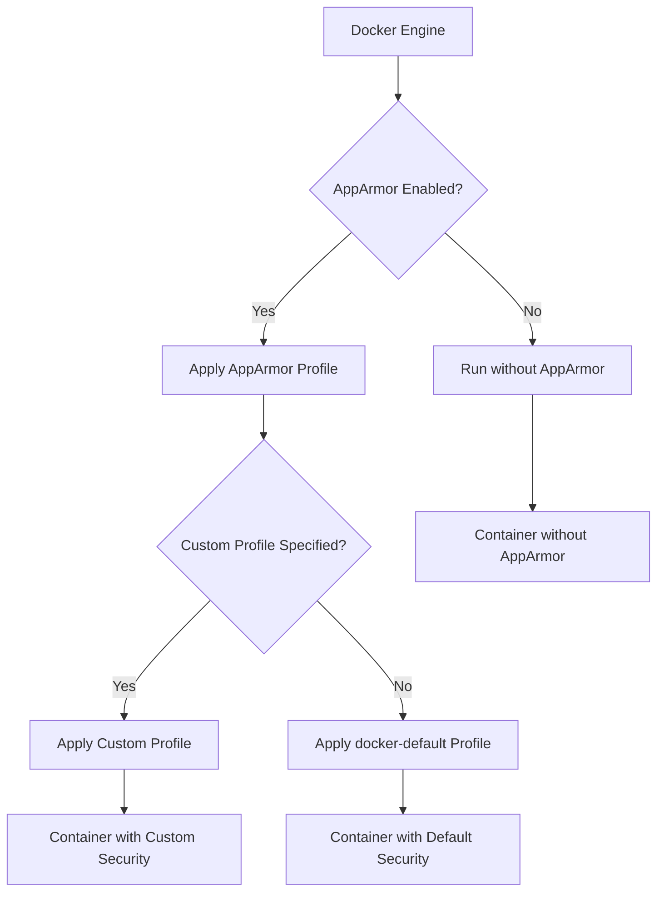

# Docker AppArmor

## Introduction

AppArmor is a powerful Linux security module that works alongside Docker to provide an additional layer of container security. It restricts the capabilities of programs by enforcing rules on what files they can access and what operations they can perform. When used with Docker, AppArmor helps mitigate the risk of container breakouts and limits the potential damage that could result from a compromised container.

In this guide, we'll explore how Docker integrates with AppArmor, how to implement custom AppArmor profiles for your containers, and why this is an essential component of a robust Docker security strategy.

## Prerequisites

Before diving into Docker AppArmor, you should have:

- A Linux environment with Docker installed
- Basic understanding of Docker containers
- Familiarity with Linux security concepts
- AppArmor installed on your system

## Understanding AppArmor Basics

AppArmor operates on profiles - rule sets that define what resources a program can access. These profiles can be set to either:

- **Enforce mode**: Actively blocks unauthorized access attempts
- **Complain mode**: Allows access but logs violations (useful for testing)

Docker automatically creates and applies a default AppArmor profile to containers unless you specify otherwise.

## Docker's Default AppArmor Profile

By default, Docker applies its built-in AppArmor profile (`docker-default`) to all containers on systems where AppArmor is enabled. This default profile:

- Prevents containers from mounting most filesystems
- Restricts privileged operations like setting system time
- Blocks loading kernel modules
- Prevents changing file capabilities

Let's see how to check if a container is using the default AppArmor profile:

```bash
# Start a container
docker run -d --name test-container nginx

# Check the AppArmor profile applied to it
docker inspect --format 'AppArmorProfile={{ .AppArmorProfile }}' test-container
```

The output would look like:

```
AppArmorProfile=docker-default
```

## Creating Custom AppArmor Profiles

While the default profile is a good starting point, you might need to create custom profiles for specific applications or to implement stricter security policies.

### Step 1: Create an AppArmor Profile File

Let's create a simple custom profile for a container running Nginx:

```bash
# Create a new AppArmor profile file
sudo nano /etc/apparmor.d/docker-nginx
```

Add the following content:

```
#include <tunables/global>

profile docker-nginx flags=(attach_disconnected,mediate_deleted) {
  #include <abstractions/base>
  #include <abstractions/nginx>

  network inet tcp,
  network inet udp,
  
  deny mount,
  deny /bin/** wl,
  deny /boot/** wl,
  deny /dev/** wl,
  deny /etc/** wl,
  deny /home/** wl,
  deny /lib/** wl,
  deny /lib64/** wl,
  deny /media/** wl,
  deny /mnt/** wl,
  deny /opt/** wl,
  deny /proc/** wl,
  deny /root/** wl,
  deny /sbin/** wl,
  deny /srv/** wl,
  deny /tmp/** wl,
  deny /sys/** wl,
  deny /usr/** wl,
  
  # Allow specific directories needed by Nginx
  /var/lib/nginx/ r,
  /var/lib/nginx/** rw,
  /var/log/nginx/ r,
  /var/log/nginx/** rw,
  /var/run/nginx.pid rw,
  /etc/nginx/** r,
  /usr/sbin/nginx ix,
  /usr/share/nginx/** r,
  
  # Allow reading some system files
  /etc/passwd r,
  /etc/group r,
  /etc/nsswitch.conf r,
  /etc/hosts r,
  
  # Site-specific additions and overrides
  # Site specific additions and overrides
  # See local/README for details
  #include <local/docker-nginx>
}
```

### Step 2: Load the AppArmor Profile

Load the new profile into the AppArmor system:

```bash
sudo apparmor_parser -r -W /etc/apparmor.d/docker-nginx
```

### Step 3: Verify the Profile is Loaded

Check if the profile is loaded correctly:

```bash
sudo aa-status | grep docker-nginx
```

You should see your profile in the list of loaded profiles.

## Running Docker Containers with Custom AppArmor Profiles

Now that we have our custom profile, we can run a container with it:

```bash
docker run -d --name nginx-custom-apparmor --security-opt apparmor=docker-nginx nginx
```

Let's verify that our custom profile is applied:

```bash
docker inspect --format 'AppArmorProfile={{ .AppArmorProfile }}' nginx-custom-apparmor
```

The output should show:

```
AppArmorProfile=docker-nginx
```

## Disabling AppArmor for a Container

In some cases, you might need to disable AppArmor for a specific container:

```bash
docker run -d --name nginx-no-apparmor --security-opt apparmor=unconfined nginx
```

:::caution
Disabling AppArmor removes an important security layer and should only be done when absolutely necessary, such as for debugging or when the container requires specific capabilities that are blocked by AppArmor.
:::

## Visualizing Docker AppArmor Integration

The following diagram illustrates how Docker integrates with AppArmor:



## Real-World Use Cases

### 1. Restricting a Database Container

A database container often contains sensitive data and needs strict security controls:

```bash
# Create AppArmor profile for PostgreSQL
sudo nano /etc/apparmor.d/docker-postgres
```

Profile content would include rules to:
- Allow access only to the database directory
- Restrict network access to specific ports
- Block unnecessary system calls

After creating and loading the profile:

```bash
docker run -d \
  --name secure-postgres \
  --security-opt apparmor=docker-postgres \
  -e POSTGRES_PASSWORD=mysecretpassword \
  postgres:13
```

### 2. Web Application with File Upload Functionality

For a web application that allows file uploads, you can create a profile that:
- Restricts where uploaded files can be stored
- Prevents the execution of uploaded files
- Limits network access to necessary ports

```bash
docker run -d \
  --name webapp \
  --security-opt apparmor=docker-webapp-profile \
  -p 8080:80 \
  mywebapp:latest
```

## Best Practices for Docker AppArmor

1. **Start with the Default Profile**: Begin with Docker's default profile and customize based on your specific needs.

2. **Test in Complain Mode**: Before enforcing a custom profile, test it in complain mode to catch potential issues:
   ```bash
   # Edit the profile to add complain flag
   profile docker-custom flags=(complain) {
   ```

3. **Audit and Refine**: Use AppArmor's auditing capabilities to monitor policy violations and refine your profiles:
   ```bash
   sudo aa-logprof
   ```

4. **Least Privilege Principle**: Only grant the permissions that are absolutely necessary for your application to function.

5. **Version Control Profiles**: Maintain your AppArmor profiles in a version control system alongside your Dockerfiles.

## Troubleshooting AppArmor with Docker

### Check AppArmor Status

```bash
sudo aa-status
```

### Check AppArmor Logs

```bash
sudo dmesg | grep -i apparmor
```

For more detailed logs:

```bash
sudo cat /var/log/syslog | grep -i apparmor
```

### Common Issues

1. **Container won't start with custom profile**:
   - Check the AppArmor logs for denied actions
   - Add necessary permissions to your profile
   - Temporarily try running in complain mode to identify issues

2. **Performance concerns**:
   - Optimize your profiles to include only necessary rules
   - Consider using profile includes to reduce redundancy

## Summary

AppArmor provides an essential additional layer of security for Docker containers by enforcing strict access controls. By understanding and implementing custom AppArmor profiles, you can significantly enhance the security posture of your Docker deployments while following the principle of least privilege.

Key takeaways:
- Docker's default AppArmor profile provides basic security for containers
- Custom profiles allow fine-grained control over container permissions
- AppArmor integrates seamlessly with Docker's security options
- Proper implementation requires understanding your application's needs

## Additional Resources

- [Docker Security Documentation](https://docs.docker.com/engine/security/)
- [AppArmor Documentation](https://gitlab.com/apparmor/apparmor/-/wikis/home)
- [Linux Capabilities and Docker](https://docs.docker.com/engine/security/security/#linux-kernel-capabilities)

## Exercises

1. Create a custom AppArmor profile for a Redis container that only allows access to the necessary directories and network ports.

2. Run a container with the default Docker AppArmor profile and attempt to perform restricted operations. Document what is blocked.

3. Modify an existing AppArmor profile to allow a specific operation that was previously blocked.

4. Create a Docker Compose setup that applies different AppArmor profiles to different services based on their security requirements.