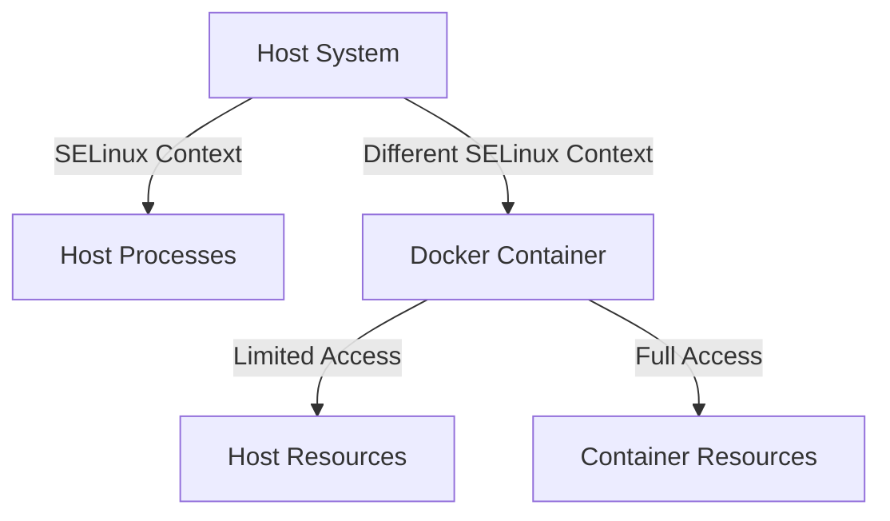

# Docker SELinux

## Introduction

Security-Enhanced Linux (SELinux) is a powerful security mechanism that provides an additional layer of protection for Docker containers. When properly configured, SELinux helps prevent container breakouts and limits the potential damage that can occur if a container is compromised. This guide will help you understand how SELinux interacts with Docker and how to configure it properly to enhance your container security posture.

SELinux implements Mandatory Access Control (MAC), which differs from the traditional Linux Discretionary Access Control (DAC) by enforcing security policies system-wide, regardless of user permissions. When running Docker with SELinux, each container process and its resources are isolated with specific security contexts that restrict what the container can access.

## Understanding SELinux Contexts and Docker

SELinux assigns security contexts to all processes and files. A security context consists of:

- User
- Role
- Type (most important for Docker)
- Level (optional)

For Docker containers, SELinux primarily uses type enforcement to restrict container access to host resources.



When Docker runs with SELinux enabled, containers get the `container_t` type, and bind-mounted volumes from the host get the `container_file_t` type. This separation prevents containers from accessing resources they shouldn't.

## Setting Up Docker with SELinux

### Prerequisites

Before getting started, make sure your system has:

1. A Linux distribution with SELinux (like RHEL, CentOS, Fedora)
2. Docker installed
3. SELinux in enforcing mode

Check your SELinux status with:

```bash
# Check SELinux status
getenforce

# Expected output:
# Enforcing
```

If it shows "Permissive" or "Disabled", enable it with:

```bash
# Set SELinux to enforcing mode
sudo setenforce 1

# Make the change permanent
sudo sed -i 's/SELINUX=permissive/SELINUX=enforcing/' /etc/selinux/config
```

### Verifying Docker SELinux Integration

To verify Docker is properly configured to use SELinux:

```bash
# Check if Docker is using SELinux
docker info | grep Security

# Expected output should include:
# Security Options: seccomp, selinux
```

## Working with Volume Mounts and SELinux

One of the most common SELinux issues with Docker involves volume mounts. When you mount a host directory into a container, SELinux needs to know this is allowed.

### The `:Z` and `:z` Mount Options

Docker provides two special options for handling SELinux contexts with volumes:

- `:Z` - assigns a private, unshared label to the content
- `:z` - assigns a shared label to the content

Let's see examples of both:

```bash
# Using the :Z option (private, unshared)
docker run -v /host/path:/container/path:Z my-image

# Using the :z option (shared)
docker run -v /host/path:/container/path:z my-image
```

Practical example with a web server:

```bash
# Without SELinux context
docker run -d -p 8080:80 -v /var/www/html:/usr/share/nginx/html nginx

# With proper SELinux context
docker run -d -p 8080:80 -v /var/www/html:/usr/share/nginx/html:Z nginx
```

Without the `:Z` or `:z` option, you might see "Permission denied" errors in your container logs, even though the traditional Linux permissions look correct.

## Common SELinux Docker Issues and Solutions

### Problem 1: Permission Denied on Volume Mounts

**Symptoms:**
- Container can't access mounted volumes
- "Permission denied" errors in logs

**Solution:**
Use the appropriate volume mount option:

```bash
# For single container access
docker run -v /host/path:/container/path:Z my-image

# For shared access between containers
docker run -v /host/path:/container/path:z my-image
```

### Problem 2: Network Connection Issues

**Symptoms:**
- Container can't connect to certain ports
- Connection refused errors

**Solution:**
Allow the container type to access network ports:

```bash
# Allow container to connect to a specific port
sudo semanage port -a -t container_port_t -p tcp 8080
```

### Problem 3: Container Can't Execute Commands

**Symptoms:**
- "Permission denied" when executing commands
- SELinux denials in audit log

**Solution:**
Check audit logs and use audit2allow to generate a custom policy:

```bash
# Check SELinux denials
sudo ausearch -m avc -ts recent

# Create a custom policy module
sudo ausearch -m avc -ts recent | audit2allow -M my-docker-policy

# Apply the policy
sudo semodule -i my-docker-policy.pp
```

## SELinux Modes and Docker

SELinux can run in three modes, each with different implications for Docker:

1. **Enforcing** - SELinux policies are enforced (recommended for production)
2. **Permissive** - SELinux logs violations but doesn't enforce (good for testing)
3. **Disabled** - SELinux is turned off (not recommended)

You can temporarily switch between enforcing and permissive modes for testing:

```bash
# Switch to permissive mode
sudo setenforce 0

# Switch to enforcing mode
sudo setenforce 1
```

A common approach when debugging container issues:

```bash
# Temporarily set SELinux to permissive
sudo setenforce 0

# Try running your container
docker run -v /host/path:/container/path my-image

# If it works, switch back to enforcing and use proper context
sudo setenforce 1
docker run -v /host/path:/container/path:Z my-image
```

## Best Practices for Docker SELinux

1. **Always use the correct volume mount options** (`:Z` or `:z`) when mounting host directories.

2. **Keep SELinux in enforcing mode** in production environments.

3. **Create custom SELinux policies** for containers with special requirements:

```bash
# Generate a custom policy based on denied actions
sudo grep "denied" /var/log/audit/audit.log | audit2allow -M my-container-policy
sudo semodule -i my-container-policy.pp
```

4. **Use container-specific volumes** whenever possible to avoid SELinux labeling issues.

5. **Run containers with the `--security-opt label=disable` option only as a last resort**, as it disables SELinux protection:

```bash
# Not recommended for production
docker run --security-opt label=disable my-image
```

## SELinux Types for Docker

Docker and SELinux interact through several predefined types:

| Type | Description |
|------|-------------|
| `container_t` | Process type for containers |
| `container_file_t` | Type for files accessible by containers |
| `container_var_lib_t` | Type for /var/lib/docker |
| `container_var_run_t` | Type for container runtime files |
| `container_port_t` | Type for ports accessible by containers |

You can view the SELinux context of running containers:

```bash
# Run a container
docker run -d --name selinux-test alpine sleep 1000

# Check its process context
ps -efZ | grep docker

# Expected output will show something like:
# system_u:system_r:container_t:s0:c123,c456 root 123456 ... /usr/bin/docker-containerd-shim-current...
```

## Practical Example: Secure Web Server with SELinux

Let's create a secure web server setup using Docker and SELinux:

1. Create a directory for web content:

```bash
mkdir -p ~/webserver/html
echo "<h1>SELinux Protected Web Server</h1>" > ~/webserver/html/index.html
```

2. Run an Nginx container with proper SELinux context:

```bash
docker run -d --name secure-nginx \
  -p 8080:80 \
  -v ~/webserver/html:/usr/share/nginx/html:Z \
  nginx
```

3. Verify the SELinux context of the mounted directory:

```bash
ls -Z ~/webserver/html/

# Output should show a context like:
# system_u:object_r:container_file_t:s0:c123,c456 index.html
```

4. Test the web server:

```bash
curl http://localhost:8080

# Expected output:
# <h1>SELinux Protected Web Server</h1>
```

## Troubleshooting SELinux with Docker

When you encounter issues, follow these troubleshooting steps:

1. **Check SELinux denials in the audit log**:

```bash
sudo ausearch -m avc -ts recent
```

2. **Understand what's being denied**:

```bash
sudo ausearch -m avc -ts recent | audit2allow -a
```

3. **Generate a policy to allow the action** (only if it's legitimate):

```bash
sudo ausearch -m avc -ts recent | audit2allow -M mycontainerpolicy
sudo semodule -i mycontainerpolicy.pp
```

4. **Use `sesearch` to check existing rules**:

```bash
# See allow rules for container_t
sesearch --allow -s container_t
```

## Summary

SELinux provides a critical security layer for Docker containers by enforcing mandatory access controls. Key takeaways include:

- SELinux restricts what containers can access on the host system
- Use `:Z` or `:z` options when mounting volumes to set correct SELinux contexts
- Keep SELinux in enforcing mode in production environments
- Troubleshoot issues using audit logs and create custom policies when needed
- Never disable SELinux entirely just to make containers work

By properly configuring Docker with SELinux, you significantly reduce the risk of container escape vulnerabilities and limit the impact of compromised containers.

## Additional Resources

- [Red Hat's Guide to Container Security with SELinux](https://www.redhat.com/sysadmin/container-security-selinux)
- [Dan Walsh's Blog on Docker and SELinux](https://danwalsh.livejournal.com/74754.html)
- [SELinux User's and Administrator's Guide](https://access.redhat.com/documentation/en-us/red_hat_enterprise_linux/8/html/using_selinux/index)

## Exercises

1. **Basic SELinux Context Exploration**: 
   - Run a container and examine its SELinux context using `ps -efZ`
   - Create a file inside the container and check its context when viewed from the host

2. **Volume Mounting Test**:
   - Create a directory on the host with a test file
   - Try mounting it without SELinux options and observe the error
   - Mount it with the `:Z` option and verify it works

3. **Custom Policy Creation**:
   - Run a container that needs special access
   - Use `ausearch` and `audit2allow` to identify and fix SELinux denials
   - Create and apply a custom policy module

4. **Network Ports and SELinux**:
   - Configure a container to use a non-standard port
   - Handle any SELinux port restrictions using `semanage port`