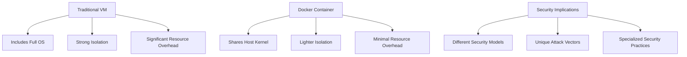

# Docker Container Security

## Introduction

Docker containers have revolutionized software development and deployment by providing a lightweight, portable, and consistent environment for applications. However, as with any technology, security must be a primary consideration. Container security requires different approaches than traditional virtual machines due to their shared kernel architecture and dynamic nature.

This guide explores essential Docker container security practices to protect your containerized applications from vulnerabilities and threats, ensuring your containerized environments remain secure and compliant.

## Why Docker Container Security Matters

Containers operate differently than traditional virtual machines:



This architecture creates unique security challenges:

- **Shared kernel vulnerabilities** can affect all containers
- **Container escape** attacks might compromise the host
- **Supply chain risks** from base images and dependencies
- **Runtime security** concerns as containers start and stop frequently

Let's dive into the essential security practices for Docker containers.

## Container Security Best Practices

### 1. Secure Base Images

#### Use Official and Minimal Images

Always start with trusted, official base images and prefer minimal images when possible:

```bash
# Good: Using official minimal image
FROM alpine:3.17

# Better: Using distroless images
FROM gcr.io/distroless/static-debian11
```

#### Scan Images for Vulnerabilities

Regularly scan your Docker images for known vulnerabilities:

```bash
# Using Docker Scout to scan an image
docker scout cves alpine:latest

# Sample output:
# ✓ Image stored for indexing
# ✓ Indexed 13 packages
# ✓ No vulnerabilities found
```

You can integrate vulnerability scanning into your CI/CD pipeline with tools like:
- Docker Scout
- Trivy
- Clair
- Snyk

### 2. Implement Least Privilege Principle

#### Run Containers as Non-root

By default, processes in Docker containers run as root, which poses security risks. Create a dedicated user:

```dockerfile
FROM alpine:3.17

# Create a non-root user
RUN addgroup -S appgroup && adduser -S appuser -G appgroup

# Set ownership
COPY --chown=appuser:appgroup . /app/

# Switch to non-root user
USER appuser

WORKDIR /app
CMD ["./app"]
```

#### Use Security Options

Restrict container privileges using security options:

```bash
# Run container with security options
docker run --security-opt=no-new-privileges \
           --cap-drop=ALL \
           --cap-add=NET_BIND_SERVICE \
           my-secure-app
```

Common security options:
- `no-new-privileges`: Prevents privilege escalation
- `cap-drop=ALL`: Drops all capabilities
- `cap-add`: Adds only required capabilities

### 3. Control Resource Usage

Limit resources to prevent DoS attacks and resource starvation:

```bash
docker run -d \
  --name resource-limited-container \
  --memory="256m" \
  --memory-swap="512m" \
  --cpu-shares=512 \
  --pids-limit=100 \
  my-image
```

Key resource constraints:
- Memory limits prevent container processes from consuming excessive memory
- CPU limits ensure fair resource sharing
- Process limits protect against fork bombs

### 4. Secure Container Runtime

#### Enable Docker Content Trust

Docker Content Trust ensures you're using signed, verified images:

```bash
# Enable content trust
export DOCKER_CONTENT_TRUST=1

# Pull a signed image
docker pull docker/trusttest:latest

# Output:
# Pull (1 of 1): docker/trusttest:latest@sha256:...
# Tagging docker/trusttest@sha256:... as docker/trusttest:latest
```

#### Use Read-only Containers

Make your container filesystem read-only to prevent modifications:

```bash
docker run --read-only \
           --tmpfs /tmp \
           --tmpfs /var/run \
           --volume /path/to/data:/data:ro \
           my-secure-app
```

Use `tmpfs` for temporary directories that need write access.

### 5. Implement Network Segmentation

Use Docker networks to isolate container communication:

```bash
# Create a custom bridge network
docker network create --driver bridge secure-network

# Run containers in the isolated network
docker run --network=secure-network --name db -d postgres
docker run --network=secure-network --name app -d my-app
```

Benefits:
- Containers can communicate by name within the network
- Isolated from other container networks
- Only expose necessary ports

### 6. Secure Secrets Management

#### Use Docker Secrets

For Docker Swarm, use Docker secrets to manage sensitive data:

```bash
# Create a secret
echo "my-secure-password" | docker secret create db_password -

# Use the secret in a service
docker service create \
  --name secure-app \
  --secret db_password \
  my-secure-app
```

#### Use Environment Variables Securely

Avoid hardcoding secrets in Dockerfiles:

```dockerfile
# BAD: Hardcoded secrets
ENV API_KEY="12345secret"

# GOOD: Accept secrets at runtime
# Secrets will be provided when running the container
```

### 7. Regular Updates and Patching

Keep your Docker engine, base images, and applications updated:

```bash
# Update Docker Engine
sudo apt-get update
sudo apt-get install docker-ce docker-ce-cli containerd.io

# Update images
docker pull nginx:latest
```

Create a systematic approach to updates:
1. Monitor security advisories
2. Test updates in staging environments
3. Deploy updates using blue-green or canary strategies

### 8. Monitoring and Logging

Implement continuous monitoring for container security:

```bash
# Run Falco for runtime security monitoring
docker run -d \
  --name falco \
  --privileged \
  -v /var/run/docker.sock:/var/run/docker.sock \
  falcosecurity/falco:latest
```

Essential monitoring practices:
- Collect container logs
- Monitor container activities
- Set up alerts for suspicious behaviors
- Implement audit logging

## Practical Example: Securing a Web Application Container

Let's build a secure Dockerfile for a Node.js web application:

```dockerfile
# Start with a specific version of Node.js on Alpine
FROM node:18-alpine

# Create app directory and non-root user
RUN mkdir -p /app && \
    addgroup -S appgroup && \
    adduser -S appuser -G appgroup && \
    chown -R appuser:appgroup /app

# Set working directory
WORKDIR /app

# Copy package files and install dependencies
COPY --chown=appuser:appgroup package*.json ./
RUN npm ci --only=production

# Copy application code with correct ownership
COPY --chown=appuser:appgroup . .

# Switch to non-root user
USER appuser

# Expose only necessary port
EXPOSE 3000

# Define health check
HEALTHCHECK --interval=30s --timeout=3s \
  CMD wget -q -O - http://localhost:3000/health || exit 1

# Use a non-root user to run the application
CMD ["node", "server.js"]
```

Run the container with security options:

```bash
docker run -d \
  --name secure-webapp \
  --read-only \
  --tmpfs /tmp \
  --cap-drop=ALL \
  --security-opt=no-new-privileges \
  -p 3000:3000 \
  secure-webapp
```

## Docker Security Tools

Several tools can enhance your Docker container security:

1. **Docker Bench for Security**: A script that checks for dozens of common best-practices around deploying Docker containers
2. **Trivy**: An open-source vulnerability scanner for containers
3. **Falco**: Runtime security monitoring and detection
4. **Anchore**: Deep container analysis and policy enforcement
5. **Notary**: Implementation of The Update Framework (TUF) for Docker content trust

## Summary

Docker container security requires a multi-layered approach that addresses:

1. Base image security and vulnerability scanning
2. Principle of least privilege implementation
3. Resource constraints and limitations
4. Secure container runtime configuration
5. Network segmentation and isolation
6. Secrets management
7. Regular updates and patching
8. Continuous monitoring and logging

By implementing these security practices, you can significantly reduce the risk surface of your containerized applications and protect your infrastructure from potential threats.

## Additional Resources and Exercises

### Resources

- [Docker Security Documentation](https://docs.docker.com/engine/security/)
- [CIS Docker Benchmark](https://www.cisecurity.org/benchmark/docker)
- [OWASP Docker Security Cheat Sheet](https://cheatsheetseries.owasp.org/cheatsheets/Docker_Security_Cheat_Sheet.html)

### Exercises

1. **Security Scan Exercise**: 
   Use Trivy to scan a Docker image you use frequently and address any critical vulnerabilities found.

2. **Least Privilege Exercise**: 
   Convert an existing Dockerfile that runs as root to follow the least privilege principle.

3. **Network Segmentation Exercise**: 
   Create a multi-container application with proper network segmentation between frontend, backend, and database containers.