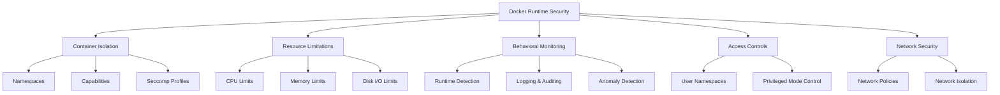

# Docker Runtime Security

## Introduction

Runtime security is a critical component of Docker security that focuses on protecting containers while they're actively running. Unlike build-time security, which addresses vulnerabilities before deployment, runtime security deals with threats that emerge during container execution.

In this guide, we'll explore the essential concepts, tools, and best practices for securing your Docker containers at runtime. You'll learn how to monitor container behavior, detect anomalies, and implement defense-in-depth strategies to protect your containerized applications.

## What is Docker Runtime Security?

Docker runtime security refers to the set of practices, policies, and tools designed to:

1. Monitor container behavior and resource usage
2. Detect and prevent unauthorized actions
3. Enforce security policies during container execution
4. Isolate containers from each other and the host system
5. Limit the potential impact of container breaches

Let's visualize the layers of Docker runtime security:



## Core Runtime Security Features in Docker

### 1. Running Containers with Limited Privileges

By default, Docker containers have fewer privileges than the host system, but they still have more than necessary for most applications. It's best practice to further restrict these privileges.

Here's how to run a container with reduced privileges:

```bash
# Run a container as a non-root user
docker run --user 1000:1000 nginx

# Drop all capabilities and only add back what's needed
docker run --cap-drop ALL --cap-add NET_BIND_SERVICE nginx
```

### 2. Resource Limitations

Setting resource constraints prevents containers from exhausting host resources, which could lead to denial-of-service conditions:

```bash
# Limit container to 0.5 CPU cores and 512MB of memory
docker run --cpus=0.5 --memory=512m nginx
```

Let's check our container's resource usage:

```bash
docker stats
```

Output:
```
CONTAINER ID   NAME          CPU %     MEM USAGE / LIMIT     MEM %     NET I/O       BLOCK I/O     PIDS
9b6f7d2291e1   gifted_shaw   0.00%     5.043MiB / 512MiB     0.98%     1.45kB / 0B   0B / 0B       2
```

### 3. Security Profiles with Seccomp

Seccomp (secure computing mode) restricts the system calls a container can make to the host kernel. Docker uses a default seccomp profile, but you can create custom profiles for additional security:

```bash
# Run with a custom seccomp profile
docker run --security-opt seccomp=/path/to/custom-seccomp.json nginx
```

Here's a simple example of a custom seccomp profile (`custom-seccomp.json`):

```json
{
  "defaultAction": "SCMP_ACT_ERRNO",
  "architectures": [
    "SCMP_ARCH_X86_64"
  ],
  "syscalls": [
    {
      "names": [
        "accept",
        "bind",
        "listen",
        "read",
        "write",
        "close",
        "exit",
        "exit_group"
      ],
      "action": "SCMP_ACT_ALLOW"
    }
  ]
}
```

This profile only allows the listed system calls and blocks all others.

### 4. AppArmor Profiles

AppArmor provides an additional layer of security by restricting programs' capabilities:

```bash
# Run with a custom AppArmor profile
docker run --security-opt apparmor=custom-profile nginx
```

## Implementing Docker Runtime Security

### Step 1: Setting Up Container Monitoring

Container monitoring is essential for runtime security. Let's implement basic monitoring with Docker's built-in tools:

```bash
# View logs for a specific container
docker logs container_name

# Stream logs in real-time
docker logs -f container_name
```

For more advanced monitoring, you can use dedicated tools:

```bash
# Install cAdvisor for container monitoring
docker run \
  --volume=/:/rootfs:ro \
  --volume=/var/run:/var/run:ro \
  --volume=/sys:/sys:ro \
  --volume=/var/lib/docker/:/var/lib/docker:ro \
  --publish=8080:8080 \
  --detach=true \
  --name=cadvisor \
  google/cadvisor:latest
```

Now you can access cAdvisor at http://localhost:8080 to view detailed container metrics.

### Step 2: Implementing Runtime Security Tools

Let's explore implementing Falco, a popular open-source container runtime security project:

```bash
# Install Falco using Docker
docker run -d \
  --name falco \
  --privileged \
  -v /var/run/docker.sock:/var/run/docker.sock \
  -v /dev:/host/dev \
  -v /proc:/host/proc:ro \
  -v /boot:/host/boot:ro \
  -v /lib/modules:/host/lib/modules:ro \
  -v /usr:/host/usr:ro \
  falcosecurity/falco:latest
```

Falco can detect suspicious behaviors like:
- Shell execution inside containers
- Unexpected process executions
- Changes to sensitive files
- Unusual network connections

Here's an example of a Falco rule to detect when a shell is run in a container:

```yaml
- rule: Terminal shell in container
  desc: A shell was used as the entrypoint/exec point into a container with an attached terminal
  condition: >
    container.id != "" and
    proc.name = bash and
    proc.tty != 0 and
    container.image.repository != "k8s.gcr.io/pause"
  output: >
    A shell was spawned in a container with an attached terminal (user=%user.name container_id=%container.id 
    container_name=%container.name image=%container.image.repository:%container.image.tag)
  priority: NOTICE
```

### Step 3: Network Security for Running Containers

Container network security is crucial for runtime protection:

```bash
# Create a custom bridge network
docker network create --driver bridge secure-network

# Run containers on the secure network
docker run --network=secure-network --name backend-app backend-image
docker run --network=secure-network --name frontend-app frontend-image
```

Let's verify our network configuration:

```bash
docker network inspect secure-network
```

Output (shortened):
```json
[
    {
        "Name": "secure-network",
        "Id": "7d86d31b1478544b5315e88ecc8bd4c5f9c67c263b5937f51967827213d3d33a",
        "Created": "2023-04-01T10:20:30.123456789Z",
        "Scope": "local",
        "Driver": "bridge",
        "EnableIPv6": false,
        "IPAM": {
            "Driver": "default",
            "Config": [
                {
                    "Subnet": "172.18.0.0/16",
                    "Gateway": "172.18.0.1"
                }
            ]
        },
        "Containers": {
            "3da2279329134a234334": {
                "Name": "backend-app",
                "IPv4Address": "172.18.0.2/16"
            },
            "1bc2293401143b334411": {
                "Name": "frontend-app",
                "IPv4Address": "172.18.0.3/16"
            }
        }
    }
]
```

## Real-World Example: Securing a Web Application

Let's put everything together to secure a simple web application at runtime:

```bash
# Step 1: Create a custom network
docker network create --driver bridge webapp-network

# Step 2: Run a database with limited resources and capabilities
docker run -d \
  --name db \
  --network=webapp-network \
  --user 999:999 \
  --cap-drop ALL \
  --security-opt=no-new-privileges \
  --cpus=0.5 \
  --memory=512m \
  --restart=on-failure \
  -v db-data:/var/lib/postgresql/data \
  -e POSTGRES_PASSWORD=secure_password \
  postgres:13

# Step 3: Run the web application with security restrictions
docker run -d \
  --name webapp \
  --network=webapp-network \
  --user 1000:1000 \
  --cap-drop ALL \
  --security-opt=no-new-privileges \
  --cpus=1 \
  --memory=1g \
  --read-only \
  --tmpfs /tmp \
  -p 8080:8080 \
  -e DB_HOST=db \
  -e DB_PASSWORD=secure_password \
  my-webapp:latest
```

In this example, we've applied multiple layers of security:
- Custom network isolation
- Non-root users
- Capability restrictions
- Resource limitations
- Read-only filesystem with temporary storage
- Security option to prevent privilege escalation

## Runtime Security Best Practices

1. **Use the principle of least privilege**
   - Run containers as non-root users
   - Drop unnecessary capabilities
   - Use read-only filesystems when possible

2. **Implement resource constraints**
   - Set CPU and memory limits
   - Configure restart policies
   - Monitor resource usage

3. **Enable logging and monitoring**
   - Collect container logs
   - Monitor system calls
   - Set up alerts for suspicious activities

4. **Regularly update and scan**
   - Keep base images updated
   - Scan running containers for vulnerabilities
   - Apply security patches quickly

5. **Implement network segmentation**
   - Create separate networks for container groups
   - Control container-to-container communication
   - Use network policies to restrict traffic

## Exercise: Setting Up Runtime Security for a Container

Try this exercise to practice implementing runtime security:

1. Run a simple Nginx container with the following security measures:
   - Non-root user
   - Limited capabilities
   - Resource constraints
   - Read-only filesystem
   - Volume for logs

2. Monitor the container's behavior using Docker's built-in tools
3. Test accessing the Nginx server to ensure it works as expected

Here's a solution to get you started:

```bash
# Run Nginx with security measures
docker run -d \
  --name secure-nginx \
  --user nobody \
  --cap-drop ALL \
  --cap-add NET_BIND_SERVICE \
  --cpus=0.5 \
  --memory=256m \
  --read-only \
  --tmpfs /var/cache/nginx \
  --tmpfs /var/run \
  -v nginx-logs:/var/log/nginx \
  -p 8080:80 \
  nginx:stable-alpine

# Check container status
docker ps -a

# Monitor resource usage
docker stats secure-nginx

# View logs
docker logs secure-nginx
```

## Summary

Docker runtime security is a critical component of a comprehensive container security strategy. By implementing proper resource limitations, reducing privileges, monitoring container behavior, and following best practices, you can significantly improve the security posture of your containerized applications.

Remember that runtime security is just one part of a defense-in-depth approach. It should complement build-time security practices and secure infrastructure configurations to create a robust security framework.

## Additional Resources

- [Docker Security Documentation](https://docs.docker.com/engine/security/)
- [CIS Docker Benchmark](https://www.cisecurity.org/benchmark/docker/)
- [OWASP Docker Security Cheat Sheet](https://cheatsheetseries.owasp.org/cheatsheets/Docker_Security_Cheat_Sheet.html)
- [Falco Documentation](https://falco.org/docs/)

## Next Steps

Now that you understand Docker runtime security, you can:
1. Implement runtime security in your existing Docker environments
2. Explore advanced security tools like Falco, Sysdig, or Aqua Security
3. Learn about Kubernetes security for orchestrated containers
4. Develop comprehensive security policies for your organization