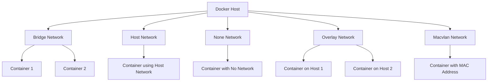
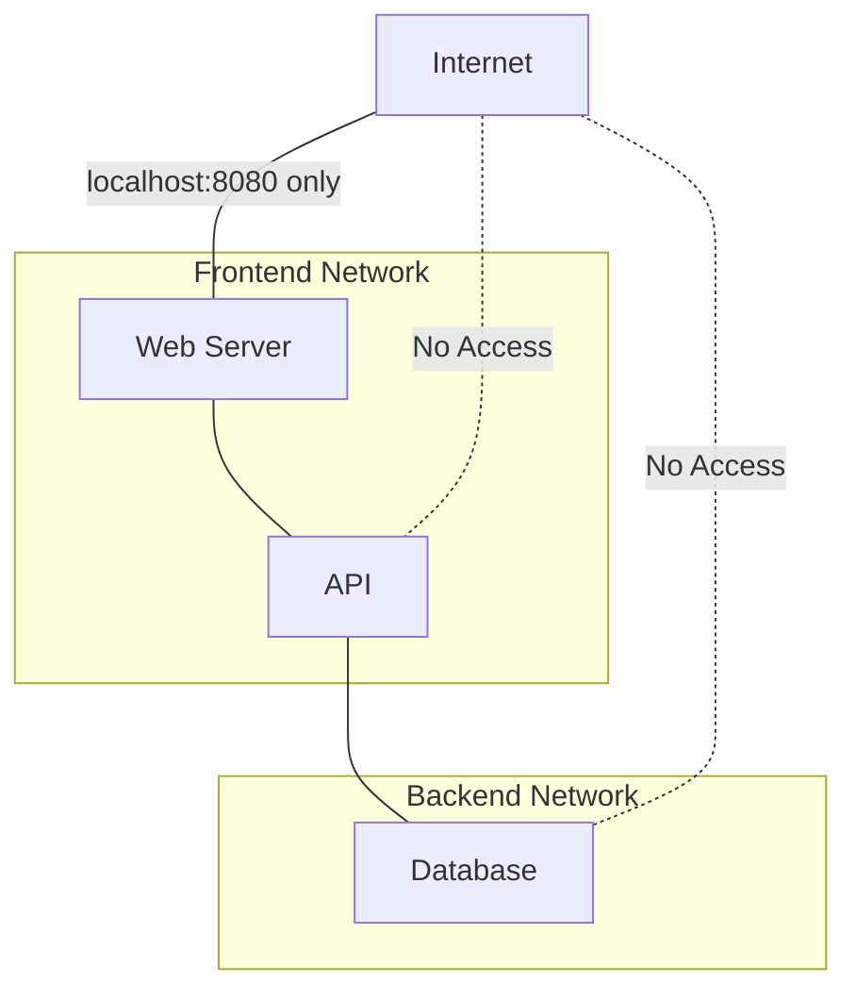

# Docker Network Security

## Introduction

When working with Docker containers, network security is a critical component that's often overlooked. Containers communicate with each other and the outside world through networks, creating potential security vulnerabilities if not properly configured. This guide will help you understand Docker networking fundamentals from a security perspective and implement best practices to protect your containerized applications.

## Docker Network Basics

Before diving into security, let's briefly review how Docker networking works.

### Default Network Types

Docker provides several built-in network drivers:

- **Bridge**: The default network driver. Containers on the same bridge network can communicate while remaining isolated from containers on different networks.
- **Host**: Removes network isolation between the container and the host.
- **None**: Disables networking entirely.
- **Overlay**: Connects multiple Docker daemons across hosts.
- **Macvlan**: Assigns a MAC address to a container, making it appear as a physical device on the network.

Let's visualize these network types:



## Network Security Risks

Docker networks face several security challenges:

1. **Unintended exposure**: Containers accidentally exposing services to the public internet
2. **Container-to-container attacks**: Compromised containers affecting others on the same network
3. **Host network access**: Containers with excessive network privileges
4. **Man-in-the-middle attacks**: Unencrypted traffic between containers
5. **Network scanning**: Attackers identifying container services

## Security Best Practices

Let's explore practical approaches to secure Docker networks:

### 1. Use Custom Bridge Networks

The default bridge network allows all containers to communicate with each other. Create custom bridge networks to isolate container groups:

```bash
# Create a custom bridge network
docker network create --driver bridge secure-network

# Run containers on this network
docker run --network=secure-network -d --name web-app nginx
docker run --network=secure-network -d --name backend-api my-api-image
```

This creates network isolation - containers in different custom networks cannot communicate by default.

### 2. Restrict Port Publishing

Only publish ports that are absolutely necessary:

```bash
# Bad practice: exposing port to all interfaces
docker run -d -p 8080:80 nginx

# Better: restrict to localhost only
docker run -d -p 127.0.0.1:8080:80 nginx
```

The second example only allows access from the host itself, not from external networks.

### 3. Use Network Policies with Docker Swarm

If using Docker Swarm, implement network policies to control traffic:

```bash
# Create an overlay network with encryption
docker network create --driver overlay --opt encrypted=true secure-overlay

# Deploy a service with network constraints
docker service create \
  --name secure-service \
  --network secure-overlay \
  --publish published=8080,target=80 \
  nginx
```

### 4. Implement Network Encryption

For overlay networks, enable encryption to protect data in transit:

```bash
docker network create --driver overlay --opt encrypted=true secure-overlay-network
```

### 5. Use Security-Enhanced Docker Images

Choose base images with minimal network services. For example, alpine-based images have fewer network services running by default:

```bash
docker run -d --name minimal-container alpine:latest sleep infinity
```

### 6. Control Inter-Container Communication

Use the `--icc=false` flag when starting the Docker daemon to disable inter-container communication on the default bridge:

```bash
# In Docker daemon configuration (/etc/docker/daemon.json)
{
  "icc": false
}
```

After modifying this file, restart the Docker daemon:

```bash
sudo systemctl restart docker
```

### 7. Implement Host Firewall Rules

Use host-level firewalls (like `iptables` or `ufw`) to add an extra layer of protection:

```bash
# Allow specific Docker published ports
sudo ufw allow 8080/tcp

# Deny all other incoming traffic to Docker
sudo ufw deny in to any port 2375
```

### 8. Use Read-Only Containers

Launch containers in read-only mode to prevent modifications that might lead to network attacks:

```bash
docker run --read-only -d nginx
```

## Practical Example: Securing a Web Application

Let's walk through securing a typical web application stack with multiple containers:

```bash
# Create isolated networks for different layers
docker network create frontend-net
docker network create backend-net

# Database container (only on backend network)
docker run -d \
  --name db \
  --network backend-net \
  --env MYSQL_ROOT_PASSWORD=secure_password \
  --env MYSQL_DATABASE=app_db \
  mysql:8.0

# API container (connected to both networks)
docker run -d \
  --name api \
  --network backend-net \
  api-image:latest

# Connect API to frontend network too
docker network connect frontend-net api

# Web server (only on frontend network)
docker run -d \
  --name web \
  --network frontend-net \
  -p 127.0.0.1:8080:80 \
  nginx:latest
```

This configuration ensures:
- The database is not accessible from the internet
- The web server cannot directly access the database
- The API service can communicate with both the database and web server
- The web interface is only accessible via localhost:8080

Let's visualize this network isolation:



## Docker Network Inspection and Auditing

Regularly inspect your Docker networks to ensure they're configured securely:

```bash
# List all networks
docker network ls

# Inspect a specific network
docker network inspect frontend-net

# See which containers are on a network
docker network inspect frontend-net -f '{{range .Containers}}{{.Name}} {{end}}'
```

Check exposed ports on your containers:

```bash
docker ps --format "{{.Names}}: {{.Ports}}"
```

## Advanced Security with Third-Party Tools

Consider these tools for enhanced Docker network security:

1. **Docker Bench for Security**: Checks for dozens of common Docker security configuration issues
2. **Cilium**: Provides network security with eBPF-based networking
3. **Calico**: Network policy engine for Kubernetes environments
4. **Aqua Security**: Commercial container security platform

## Troubleshooting Network Security Issues

Common issues and solutions:

| Issue | Solution |
|-------|----------|
| Unexpected container communication | Check network isolation, inspect networks |
| Exposed internal services | Review port publishing settings |
| Network performance degradation | Look for security tools affecting network throughput |
| Container losing network connectivity | Check network policies or firewall rules |

## Summary

Securing Docker networks requires a layered approach:

1. **Isolation**: Use custom networks to separate container groups
2. **Least privilege**: Only expose necessary ports, preferably only to required interfaces
3. **Encryption**: Protect sensitive data in transit
4. **Monitoring**: Regularly audit network configurations
5. **Defense in depth**: Combine Docker's security features with host-level protections

By following these principles, you can dramatically improve the security posture of your containerized applications without sacrificing functionality.

## Further Learning

To deepen your understanding of Docker network security, try these exercises:

1. Create a multi-container application with proper network isolation
2. Configure TLS encryption for Docker daemon communications
3. Implement and test network policies in a Docker Swarm environment
4. Perform a security audit of your Docker network configurations
5. Set up logging and monitoring for network-related security events

## Additional Resources

- [Docker Security Documentation](https://docs.docker.com/engine/security/)
- [CIS Docker Benchmark](https://www.cisecurity.org/benchmark/docker/)
- [OWASP Docker Security Cheat Sheet](https://cheatsheetseries.owasp.org/cheatsheets/Docker_Security_Cheat_Sheet.html)