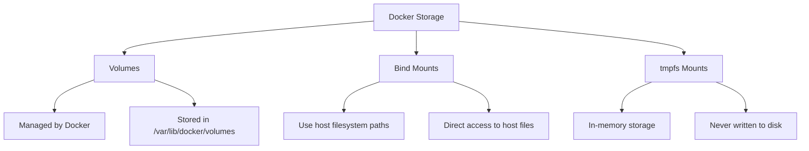

# Docker Storage Security

## Introduction

When working with Docker containers, securing the data and storage components is just as crucial as securing the container itself. Docker storage security focuses on protecting the data used by containers, whether it's stored as volumes, bind mounts, or tmpfs mounts.

In this guide, we'll explore essential security practices for Docker storage, helping you understand how to protect sensitive data in your containerized applications.

## Understanding Docker Storage Types

Before diving into security practices, let's familiarize ourselves with the main types of Docker storage:



1. **Volumes**: Docker-managed storage created and managed by Docker.
2. **Bind Mounts**: Direct mappings to directories on the host system.
3. **tmpfs Mounts**: In-memory storage that's never written to the host filesystem.

Each storage type has different security implications and use cases.

## Common Storage Security Risks

When using Docker storage, you should be aware of these security risks:

- Sensitive data exposure
- Unauthorized access to host filesystem
- Data persistence after container deletion
- Excessive permissions
- Lack of encryption
- Improper volume sharing between containers

## Securing Docker Volumes

### 1. Use Volumes Instead of Bind Mounts When Possible

Volumes are the preferred mechanism for persisting data in Docker:

```bash
# More secure: Using a volume
docker run -d --name database \
  --volume db_data:/var/lib/postgresql/data \
  postgres:14

# Less secure: Using a bind mount
docker run -d --name database \
  --mount type=bind,source=/home/user/data,target=/var/lib/postgresql/data \
  postgres:14
```

Volumes provide better isolation from the host system and are entirely managed by Docker.

### 2. Implement Proper Volume Access Controls

Restrict access permissions on volumes to prevent unauthorized access:

```bash
# Create a volume with specific ownership
docker volume create --driver local \
  --opt type=none \
  --opt device=/path/on/host \
  --opt o=uid=1000,gid=1000 \
  my_secure_volume
```

### 3. Use Volume Labels for Organization and Security Policies

Labels help categorize volumes and apply security policies:

```bash
docker volume create --label environment=production \
  --label data=sensitive \
  secure_customer_data
```

You can then filter volumes based on these labels:

```bash
docker volume ls --filter label=data=sensitive
```

## Encrypting Docker Storage

### 1. Volume Encryption with Docker Enterprise

For Docker Enterprise Edition, you can use encrypted volumes:

```bash
# Create an encrypted volume
docker volume create --driver=encrypted-storage \
  --opt key=password123 secure_volume

# Use the encrypted volume
docker run -d --name secure_app \
  --volume secure_volume:/app/data \
  myapp:latest
```

### 2. Using Third-Party Encryption Solutions

For Docker Community Edition, consider third-party solutions:

```bash
# Using LUKS encryption on the host
sudo cryptsetup luksFormat /dev/sdb1
sudo cryptsetup open /dev/sdb1 encrypted_storage
sudo mkfs.ext4 /dev/mapper/encrypted_storage
sudo mount /dev/mapper/encrypted_storage /mnt/encrypted

# Then use the encrypted mount with Docker
docker run -d --name secure_app \
  --mount type=bind,source=/mnt/encrypted,target=/app/data \
  myapp:latest
```

### 3. Application-Level Encryption

Implement encryption within your application for sensitive data:

```javascript
// Example Node.js code using crypto module
const crypto = require('crypto');
const fs = require('fs');

// Encryption function
function encryptData(data, key) {
  const algorithm = 'aes-256-cbc';
  const iv = crypto.randomBytes(16);
  const cipher = crypto.createCipheriv(algorithm, Buffer.from(key, 'hex'), iv);
  
  let encrypted = cipher.update(data, 'utf8', 'hex');
  encrypted += cipher.final('hex');
  
  return {
    iv: iv.toString('hex'),
    encryptedData: encrypted
  };
}

// Example usage
const sensitiveData = "This is secret customer information";
const encryptionKey = crypto.randomBytes(32).toString('hex');
const encryptedResult = encryptData(sensitiveData, encryptionKey);

// Save to file in Docker volume
fs.writeFileSync('/app/data/encrypted.json', JSON.stringify(encryptedResult));
```

## Secure Practices for Bind Mounts

While volumes are preferred, if you need to use bind mounts, follow these practices:

### 1. Use Read-Only Bind Mounts

When containers only need to read data, mount in read-only mode:

```bash
docker run -d --name webserver \
  --mount type=bind,source=/path/to/static/content,target=/usr/share/nginx/html,readonly \
  nginx:latest
```

### 2. Limit the Scope of Bind Mounts

Mount only the specific directories needed instead of entire filesystems:

```bash
# Bad practice: mounting entire user directory
docker run -d --mount type=bind,source=/home/user,target=/data myapp

# Better practice: mounting only the needed subdirectory
docker run -d --mount type=bind,source=/home/user/project/configs,target=/app/configs myapp
```

### 3. Avoid Mounting Sensitive Host Directories

Never mount these sensitive directories from the host:

- `/etc`, `/boot`, `/root`
- SSH keys or credential directories
- System directories containing sensitive information

## Secure Practices for tmpfs Mounts

Use tmpfs mounts for sensitive temporary data:

```bash
# Store temporary sensitive data in memory
docker run -d --name app \
  --tmpfs /app/tmp:rw,noexec,nosuid,size=100M \
  myapp:latest
```

The `noexec` and `nosuid` flags enhance security by preventing executable files and setuid binaries.

## Implementing Volume Plugins for Enhanced Security

Docker supports volume plugins that can provide advanced security features:

```bash
# Install a volume plugin
docker plugin install rexray/ebs:latest

# Create a volume using the plugin
docker volume create --driver rexray/ebs \
  --opt size=10 \
  --opt encrypted=true \
  secure_ebs_volume

# Use the encrypted volume
docker run -d --name secure_app \
  --volume secure_ebs_volume:/app/data \
  myapp:latest
```

## Secrets Management for Docker Storage

Instead of storing secrets in volumes, use Docker's secrets management:

```bash
# Create a secret
echo "my_database_password" | docker secret create db_password -

# Use the secret in a service
docker service create \
  --name db \
  --secret db_password \
  --env DB_PASSWORD_FILE=/run/secrets/db_password \
  postgres:14
```

Secrets are:
- Encrypted at rest
- Encrypted during transit
- Mounted as in-memory filesystems
- Automatically removed when the container stops

## Docker Storage Security Best Practices

### 1. Regular Security Audits

Regularly inspect your Docker volumes and their permissions:

```bash
# List all volumes
docker volume ls

# Inspect volume details
docker volume inspect my_volume

# Check which containers are using volumes
docker ps -a --filter volume=my_volume
```

### 2. Clean Up Unused Volumes

Regularly prune unused volumes to reduce the attack surface:

```bash
# Remove all unused volumes
docker volume prune

# Remove volumes with more specific filtering
docker volume prune --filter "label!=keep"
```

### 3. Use Volume Mounting with User Namespaces

When using user namespaces, ensure proper permissions mapping:

```bash
# Run container with specific user
docker run -d --user 1000:1000 \
  --volume app_data:/app/data \
  myapp:latest
```

### 4. Implement Backup and Recovery Procedures

Regularly back up important volumes:

```bash
# Back up a volume
docker run --rm \
  --volume db_data:/source:ro \
  --volume $(pwd):/backup \
  alpine sh -c "tar czf /backup/db_backup_$(date +%Y%m%d).tar.gz -C /source ."
```

### 5. Monitor Volume Access and Usage

Implement monitoring for storage access patterns:

```bash
# Example using Docker stats for basic monitoring
docker stats --format "table {{.Name}}\t{{.DiskIO}}"
```

## Practical Example: Securing a Database Container

Let's put it all together with a real-world example of securing a PostgreSQL database container:

```bash
# Step 1: Create a dedicated volume for database data
docker volume create --label project=finance \
  --label data=sensitive \
  --label backup=daily \
  pgdata_finance

# Step 2: Create a secrets for database credentials
echo "SuperSecurePassword123!" | docker secret create pg_password -
echo "finance_db" | docker secret create pg_database -
echo "finance_user" | docker secret create pg_user -

# Step 3: Run the database container with the secure configuration
docker run -d --name finance_db \
  --mount type=volume,source=pgdata_finance,target=/var/lib/postgresql/data \
  --tmpfs /tmp:rw,noexec,nosuid,size=100M \
  --secret pg_password \
  --secret pg_user \
  --secret pg_database \
  --env POSTGRES_PASSWORD_FILE=/run/secrets/pg_password \
  --env POSTGRES_USER_FILE=/run/secrets/pg_user \
  --env POSTGRES_DB_FILE=/run/secrets/pg_database \
  --health-cmd="pg_isready -U finance_user -d finance_db" \
  --health-interval=30s \
  --health-timeout=5s \
  --health-retries=3 \
  --restart=unless-stopped \
  --cap-drop=ALL \
  --cap-add=CHOWN \
  --cap-add=FOWNER \
  --cap-add=SETGID \
  --cap-add=SETUID \
  postgres:14
```

This setup includes:
- A labeled volume for organization and policy application
- Secrets for all sensitive credentials
- A tmpfs mount for temporary files
- Health checks
- Minimal capabilities

## Troubleshooting Docker Storage Security Issues

Here are some common issues and their solutions:

### Permission Denied Errors

```bash
# Check ownership on the host
ls -la /var/lib/docker/volumes/my_volume/_data

# Fix permissions on the host
sudo chown -R 1000:1000 /var/lib/docker/volumes/my_volume/_data

# Or run the container with the correct user
docker run -d --user 1000:1000 --volume my_volume:/app/data myapp
```

### Detecting Volume Access Issues

```bash
# Inspect container logs for access issues
docker logs my_container | grep "permission denied"

# Test access from within the container
docker exec -it my_container sh -c "touch /app/data/test_file"
```

## Summary

Securing Docker storage is crucial for maintaining the overall security of your containerized applications. Key takeaways include:

- Use volumes instead of bind mounts whenever possible
- Implement proper access controls and permissions
- Encrypt sensitive data, either at the volume or application level
- Use Docker secrets for credential management
- Regularly audit and clean up volumes
- Apply the principle of least privilege to storage access

By following these practices, you can significantly reduce the risk of data breaches and unauthorized access to your containerized applications' data.

## Additional Resources and Exercises

### Further Reading

- Docker Documentation: Volume Security
- NIST Container Security Guide
- CIS Docker Benchmark

### Practice Exercises

1. **Basic Exercise**: Create a secure volume for a web application that stores user data.
2. **Intermediate Exercise**: Implement backup and restoration procedures for your Docker volumes.
3. **Advanced Exercise**: Set up a complete stack with encrypted volumes and secrets management.

### Self-Assessment Questions

1. What are the security advantages of volumes over bind mounts?
2. How can you encrypt sensitive data in Docker volumes?
3. What steps should you take to secure a database container's storage?
4. How would you implement a secure backup strategy for Docker volumes?