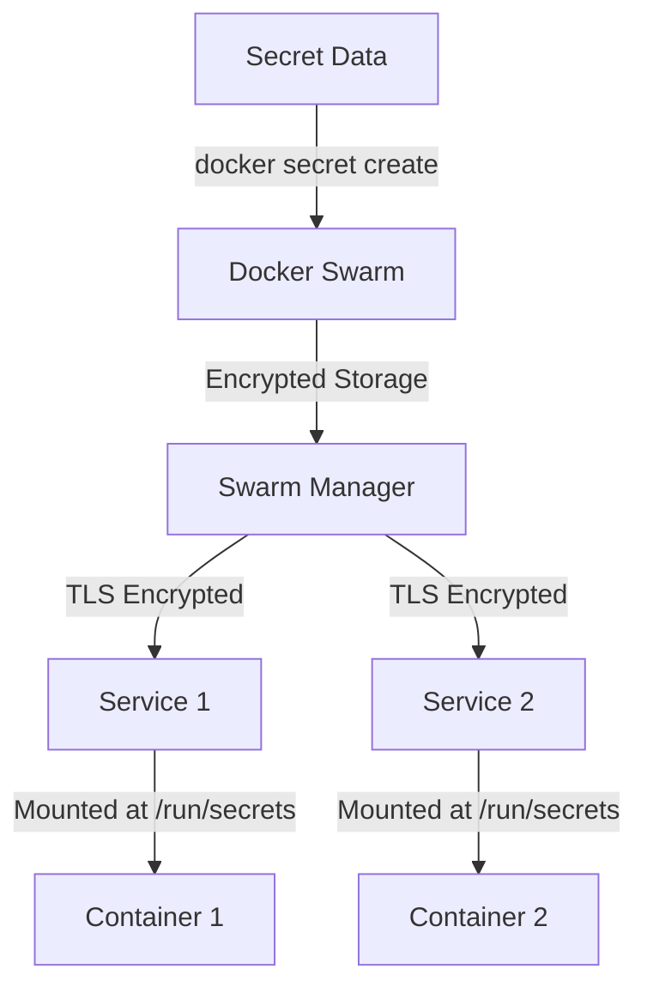

# Docker Secrets

## Introduction

When building containerized applications, one of the most critical challenges is securely managing sensitive information like passwords, API keys, and certificates. Docker Secrets provides a solution to this problem by offering a secure way to store and distribute sensitive data to only the containers that need access to it.

In this guide, we'll explore how Docker Secrets works, why it's important for securing your Docker environments, and how to implement it in your containerized applications.

## What are Docker Secrets?

Docker Secrets is a feature that allows you to securely store sensitive data and make it available only to services that need access to it. A secret is any data that you don't want to store in your Docker image, Dockerfile, or application source code.

Some examples of secrets include:

- Database passwords
- API keys
- TLS certificates
- SSH keys
- OAuth tokens



## Why Use Docker Secrets?

Before Docker Secrets, developers often resorted to unsafe practices to manage sensitive information:

1. Hardcoding credentials in the application code
2. Storing secrets in environment variables
3. Using configuration files with sensitive data

These approaches have several drawbacks:

- **Reduced security**: Secrets might be exposed in logs, container inspection, or source code
- **Limited scope control**: Difficult to restrict which containers have access to secrets
- **Poor auditability**: Hard to track who accessed a secret and when
- **Manual rotation**: Updating secrets requires rebuilding images or restarting containers

Docker Secrets addresses these issues by:

- Encrypting secrets at rest and in transit
- Allowing fine-grained access control
- Providing a centralized secret management system
- Making secret rotation easier and more secure

## How Docker Secrets Works

Docker Secrets is available when running Docker in Swarm mode, which is Docker's built-in orchestration feature for managing a cluster of Docker engines.

The workflow for Docker Secrets follows these steps:

1. You create a secret and send it to the Docker swarm
2. Docker securely stores the secret in the Swarm's encrypted Raft log
3. When you create a service that needs access to the secret, you specify which secrets it requires
4. Docker securely transmits the secret to the nodes running the service containers
5. The secret is mounted as a file in the container's filesystem at `/run/secrets/<secret_name>`
6. Your application reads the secret from the file

This approach ensures that secrets are:
- Encrypted at rest in the swarm
- Encrypted during transit to nodes
- Only accessible to services that explicitly need them
- Never written to disk unencrypted on worker nodes

## Getting Started with Docker Secrets

### Prerequisites

To use Docker Secrets, you need:

1. Docker running in Swarm mode
2. Docker version 1.13 or newer

### Initialize Docker Swarm

If you haven't already, initialize Docker Swarm:

```bash
docker swarm init
```

### Creating a Secret

You can create a secret from a file or from standard input:

**From a file:**

```bash
echo "mypassword" > password.txt
docker secret create db_password password.txt
rm password.txt  # Delete the file after creating the secret
```

**From standard input:**

```bash
echo "mypassword" | docker secret create db_password -
```

**Verify the secret was created:**

```bash
docker secret ls
```

Example output:

```
ID                          NAME         CREATED       UPDATED
ov30stt2qzhnpphcg72c1psvl   db_password  5 seconds ago   5 seconds ago
```

### Using Secrets in Docker Services

To use a secret in a Docker service, specify it when creating the service:

```bash
docker service create \
  --name db \
  --secret db_password \
  --secret source=db_username,target=username \
  postgres
```

This will:
1. Create a service named `db` using the `postgres` image
2. Make the `db_password` secret available at `/run/secrets/db_password`
3. Make the `db_username` secret available at `/run/secrets/username` (renamed from its source name)

### Accessing Secrets in the Container

Inside the container, the secret is available as a file at `/run/secrets/<secret_name>`.

For example, to read the password secret:

```bash
cat /run/secrets/db_password
```

Your application can read this file to access the secret.

## Practical Example: Securing a Web Application with a Database

Let's create a practical example using a simple web application that connects to a PostgreSQL database:

### 1. Create the necessary secrets

```bash
# Create database password secret
echo "secure_db_password" | docker secret create db_password -

# Create database username secret
echo "app_user" | docker secret create db_username -

# Create API key secret
echo "4b8f7d6e5a3c2b1a" | docker secret create api_key -
```

### 2. Create a Docker Compose file for your application

Create a file named `docker-compose.yml`:

```yaml
version: '3.8'

services:
  webapp:
    image: mywebapp:latest
    secrets:
      - db_password
      - db_username
      - api_key
    environment:
      - DB_HOST=postgres
      - DB_PASSWORD_FILE=/run/secrets/db_password
      - DB_USER_FILE=/run/secrets/db_username
      - API_KEY_FILE=/run/secrets/api_key
    ports:
      - "8080:8080"
    networks:
      - app-network
    depends_on:
      - postgres

  postgres:
    image: postgres:latest
    secrets:
      - db_password
      - db_username
    environment:
      - POSTGRES_PASSWORD_FILE=/run/secrets/db_password
      - POSTGRES_USER_FILE=/run/secrets/db_username
    volumes:
      - db-data:/var/lib/postgresql/data
    networks:
      - app-network

networks:
  app-network:

volumes:
  db-data:

secrets:
  db_password:
    external: true
  db_username:
    external: true
  api_key:
    external: true
```

### 3. In your application code, read secrets from files

Here's a simple Node.js example showing how to read secrets:

```javascript
const fs = require('fs');

// Read secrets from files
const dbPassword = fs.readFileSync('/run/secrets/db_password', 'utf8').trim();
const dbUsername = fs.readFileSync('/run/secrets/db_username', 'utf8').trim();
const apiKey = fs.readFileSync('/run/secrets/api_key', 'utf8').trim();

// Use the secrets to connect to the database
const { Pool } = require('pg');
const pool = new Pool({
  user: dbUsername,
  host: process.env.DB_HOST,
  database: 'myapp',
  password: dbPassword,
  port: 5432,
});

// Example API endpoint that uses the API key
app.get('/api/data', (req, res) => {
  const providedKey = req.headers['x-api-key'];
  
  if (providedKey !== apiKey) {
    return res.status(401).json({ error: 'Unauthorized' });
  }
  
  // Process authorized request...
  // ...
});
```

### 4. Deploy the application stack

```bash
docker stack deploy -c docker-compose.yml myapp
```

## Best Practices for Docker Secrets

1. **Never store secrets in Docker images**: Avoid putting secrets in your Dockerfile or embedded in your image.

2. **Use short-lived secrets**: Rotate secrets regularly to limit the impact of potential breaches.

3. **Limit secret access**: Only grant services access to the secrets they need.

4. **Clean up unused secrets**: Regularly audit and remove secrets that are no longer needed.

5. **Use secret names that describe their purpose**: Choose descriptive names that make it clear what the secret is used for.

6. **Consider using a dedicated secret management solution**: For more complex scenarios, consider using tools like HashiCorp Vault, AWS Secrets Manager, or Azure Key Vault.

7. **Read secrets from files, not environment variables**: While Docker can inject secrets as environment variables, this is less secure than reading them from files.

## Updating and Rotating Secrets

To update a secret, you need to:

1. Create a new secret with a new name
2. Update your service to use the new secret
3. Remove the old secret when it's no longer needed

For example:

```bash
# Create a new secret
echo "new_secure_password" | docker secret create db_password_v2 -

# Update the service to use the new secret
docker service update \
  --secret-rm db_password \
  --secret-add db_password_v2 \
  db

# Once all services are updated, remove the old secret
docker secret rm db_password
```

## Limitations of Docker Secrets

1. **Swarm-only feature**: Docker Secrets is only available in Docker Swarm mode, not in standalone containers.

2. **File-based access only**: Secrets are only available as files, which may require code changes in applications expecting environment variables.

3. **No built-in secret rotation**: You must implement your own process for rotating secrets.

4. **Limited metadata**: There's no built-in way to add metadata like expiration dates to secrets.

## Docker Secrets vs. Kubernetes Secrets

If you're working in a Kubernetes environment instead of Docker Swarm, you'll use Kubernetes Secrets instead of Docker Secrets. While the concepts are similar, there are some key differences:

| Feature | Docker Secrets | Kubernetes Secrets |
|---------|---------------|-------------------|
| Storage | Encrypted at rest | Base64 encoded by default (not encrypted) |
| Access Control | Service-level | RBAC and namespace-based |
| Mounting | Files only | Files or environment variables |
| Management | Docker CLI | kubectl or Kubernetes API |
| Integration | Docker Swarm native | Kubernetes native |

## Summary

Docker Secrets provides a secure way to manage sensitive information in containerized applications:

- Secrets are stored securely and encrypted in the Docker Swarm
- Only services with explicit permission can access specific secrets
- Secrets are mounted as files in the container, keeping them out of environment variables and logs
- The secret management lifecycle (creation, distribution, rotation) is handled by Docker

By using Docker Secrets, you can significantly improve the security posture of your containerized applications without compromising on convenience or flexibility.

## Additional Resources

- [Official Docker Secrets documentation](https://docs.docker.com/engine/swarm/secrets/)
- [Docker Compose with Secrets](https://docs.docker.com/compose/use-secrets/)
- [Docker Security Best Practices](https://docs.docker.com/develop/security-best-practices/)

## Exercises

1. Initialize a Docker Swarm and create a secret containing a database password.
2. Create a simple Docker Compose file that uses the secret for a PostgreSQL database.
3. Write a small application that reads the secret from the mounted file.
4. Practice rotating a secret by creating a new version and updating your service.
5. Compare Docker Secrets with environment variables by testing both approaches and analyzing the security implications.