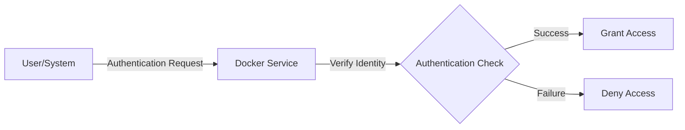
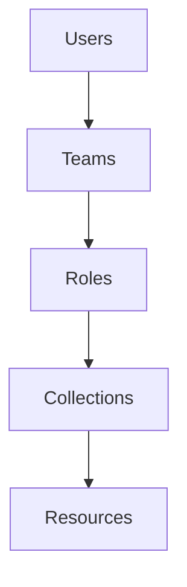

# Docker Authentication

## Introduction

Authentication is a critical aspect of Docker security that controls who can access and interact with your Docker resources. In containerized environments, proper authentication ensures that only authorized users and systems can pull images, push to registries, or execute commands against your Docker daemon.

This guide will walk you through the fundamentals of Docker authentication, explaining how authentication works in Docker and providing practical examples to help you implement secure authentication in your Docker environment.

## What is Docker Authentication?

Docker authentication is the process of verifying the identity of users, services, or systems that interact with Docker components such as:

- Docker daemon (Docker Engine)
- Docker Hub or other container registries
- Docker Swarm or other orchestration tools

Authentication answers the question: "Who are you?" before allowing access to Docker resources.



## Docker Registry Authentication

### Basic Authentication with Docker Hub

The most common authentication scenario is logging into Docker Hub or other container registries to pull or push images.

#### Logging into Docker Hub

```bash
docker login
```

This command prompts you for your Docker Hub username and password. After successful authentication, Docker stores credentials in a configuration file.

**Example Output:**
```
Login with your Docker ID to push and pull images from Docker Hub.
Username: your_username
Password: 
Login Succeeded
```

#### Where are credentials stored?

After successful authentication, Docker stores your credentials in:

- Linux: `~/.docker/config.json`
- Windows: `%USERPROFILE%\.docker\config.json`
- macOS: `~/.docker/config.json`

The file will contain an encrypted version of your credentials:

```json
{
  "auths": {
    "https://index.docker.io/v1/": {
      "auth": "base64encoded_credentials"
    }
  }
}
```

### Logging into Private Registries

To authenticate with a private registry:

```bash
docker login my-registry.example.com:5000
```

This works similarly to Docker Hub login but directs authentication to your specified registry.

## Docker Credential Helpers

Storing credentials in plain text (even if encoded) isn't ideal. Docker supports credential helpers that provide more secure storage.

Popular credential helpers include:

- `docker-credential-osxkeychain` for macOS
- `docker-credential-wincred` for Windows
- `docker-credential-pass` or `docker-credential-secretservice` for Linux

### Example: Setting up credential helper on Linux

1. Install pass (Password Store):

```bash
sudo apt-get install pass
```

2. Initialize pass with a GPG key:

```bash
gpg --gen-key
pass init "your-gpg-id"
```

3. Install the Docker credential helper:

```bash
sudo apt-get install docker-credential-pass
```

4. Configure Docker to use the credential helper:

```bash
mkdir -p ~/.docker
echo '{
  "credsStore": "pass"
}' > ~/.docker/config.json
```

5. Now when you log in, credentials will be stored securely:

```bash
docker login
```

## Docker Daemon Authentication (TLS)

By default, the Docker daemon socket (`/var/run/docker.sock`) is owned by the root user and the docker group. Anyone with access to this socket has full control over Docker.

For remote access to the Docker daemon, it's crucial to enable TLS authentication.

### Setting up TLS for Docker Daemon (Basic Steps)

1. Create a Certificate Authority (CA) certificate:

```bash
mkdir -p ~/.docker/certs
cd ~/.docker/certs
openssl genrsa -aes256 -out ca-key.pem 4096
openssl req -new -x509 -days 365 -key ca-key.pem -sha256 -out ca.pem
```

2. Create a server certificate:

```bash
openssl genrsa -out server-key.pem 4096
openssl req -subj "/CN=your-server-name" -sha256 -new -key server-key.pem -out server.csr
```

3. Create client certificates:

```bash
openssl genrsa -out key.pem 4096
openssl req -subj '/CN=client' -new -key key.pem -out client.csr
```

4. Configure the Docker daemon to use TLS by modifying `/etc/docker/daemon.json`:

```json
{
  "tls": true,
  "tlscacert": "/root/.docker/certs/ca.pem",
  "tlscert": "/root/.docker/certs/server-cert.pem",
  "tlskey": "/root/.docker/certs/server-key.pem",
  "tlsverify": true
}
```

5. Restart the Docker daemon:

```bash
sudo systemctl restart docker
```

6. Configure the Docker client to use your certificates when connecting:

```bash
docker --tlsverify \
  --tlscacert=ca.pem \
  --tlscert=cert.pem \
  --tlskey=key.pem \
  -H=your-server-name:2376 version
```

## Authentication in Docker Swarm

Docker Swarm, the native clustering and orchestration solution for Docker, uses mutual TLS (mTLS) for node authentication and encryption.

When initializing a swarm:

```bash
docker swarm init --advertise-addr <MANAGER-IP>
```

Docker automatically:
- Creates a Certificate Authority (CA) for the swarm
- Issues certificates to all manager and worker nodes
- Rotates certificates periodically (default: 90 days)

To add a worker to the swarm:

```bash
docker swarm join --token <WORKER-TOKEN> <MANAGER-IP>:2377
```

The token contains cryptographic material that ensures secure authentication between nodes.

## Role-Based Access Control (RBAC)

For more advanced authentication and authorization, you can implement RBAC using Docker Enterprise or integrate with external auth providers.

### Docker Enterprise Example

Docker Enterprise Edition provides built-in RBAC:



- **Users**: Individual accounts
- **Teams**: Groups of users
- **Roles**: Sets of permissions (Viewer, Developer, Operator, etc.)
- **Collections**: Groups of resources (containers, images, networks, etc.)

## Best Practices for Docker Authentication

1. **Never use the default configuration for production environments**
   - Always configure TLS authentication for remote Docker daemon access

2. **Use credential helpers instead of storing plain text credentials**
   - Leverage system keychain when available

3. **Implement the principle of least privilege**
   - Grant only necessary permissions to users and services

4. **Regularly rotate credentials and certificates**
   - Set up automated rotation when possible

5. **Use separate accounts for different purposes**
   - Don't share Docker Hub accounts across teams or projects

6. **Consider using access tokens instead of passwords**
   - Docker Hub and many registries support token-based authentication

### Example: Using Docker Hub Access Tokens

1. Generate a token in Docker Hub (Account Settings → Security → New Access Token)
2. Use the token instead of your password:

```bash
docker login -u your_username
# Enter your token when prompted for password
```

## Working with Docker Secrets

For applications running in Docker Swarm, Docker Secrets provide a way to securely store and share authentication credentials.

### Creating and Using a Secret

1. Create a secret:

```bash
echo "my_secret_password" | docker secret create db_password -
```

2. Use the secret in a service:

```bash
docker service create \
  --name db \
  --secret db_password \
  --env PASSWORD_FILE=/run/secrets/db_password \
  postgres
```

Inside the container, the secret is available at `/run/secrets/db_password`.

## Automated Authentication in CI/CD Pipelines

When using Docker in CI/CD pipelines, you need automated authentication.

### Example: GitHub Actions

```yaml
name: Build and Push Docker Image

on:
  push:
    branches: [ main ]

jobs:
  build:
    runs-on: ubuntu-latest
    steps:
    - uses: actions/checkout@v2
    
    - name: Login to DockerHub
      uses: docker/login-action@v1
      with:
        username: ${{ secrets.DOCKERHUB_USERNAME }}
        password: ${{ secrets.DOCKERHUB_TOKEN }}
    
    - name: Build and push
      uses: docker/build-push-action@v2
      with:
        push: true
        tags: yourusername/app:latest
```

### Example: GitLab CI

```yaml
build_and_push:
  image: docker:latest
  services:
    - docker:dind
  before_script:
    - echo "$DOCKER_PASSWORD" | docker login -u "$DOCKER_USERNAME" --password-stdin
  script:
    - docker build -t yourusername/app:latest .
    - docker push yourusername/app:latest
```

## Common Authentication Issues and Troubleshooting

### Issue: "unauthorized: authentication required"

This common error occurs when trying to pull or push images without proper authentication.

**Solution:**
```bash
# Re-authenticate with the registry
docker login
```

### Issue: "certificate signed by unknown authority"

This occurs when using TLS but the certificates aren't properly configured.

**Solution:**
```bash
# Ensure you're using the correct CA certificate
docker --tlsverify \
  --tlscacert=ca.pem \
  --tlscert=cert.pem \
  --tlskey=key.pem \
  -H=your-server-name:2376 version
```

### Issue: "permission denied while trying to connect to the Docker daemon socket"

This happens when your user doesn't have permission to access the Docker socket.

**Solution:**
```bash
# Add your user to the docker group
sudo usermod -aG docker $USER

# Then log out and back in for changes to take effect
```

## Summary

Docker authentication is a critical component of container security that verifies the identity of users and systems interacting with Docker resources. Key points to remember:

- Authentication with registries allows pulling and pushing images
- TLS certificates protect remote Docker daemon access
- Docker Swarm uses mutual TLS for node authentication
- Credential helpers provide secure storage for login information
- Docker Secrets manage sensitive information for Swarm services

By implementing proper authentication mechanisms, you can significantly improve the security posture of your Docker environment and protect your containerized applications from unauthorized access.

## Additional Resources

- [Docker Security Documentation](https://docs.docker.com/engine/security/)
- [Docker Content Trust](https://docs.docker.com/engine/security/trust/)
- [Container Registry Authentication](https://docs.docker.com/registry/spec/auth/)

## Practice Exercises

1. Set up a secure Docker daemon with TLS authentication and connect to it from a remote client.
2. Configure a credential helper for your system to securely store Docker Hub credentials.
3. Create a Docker Swarm and examine how certificates are automatically managed.
4. Implement Docker Secrets in a multi-container application to handle database credentials securely.
5. Configure your CI/CD pipeline to authenticate with Docker Hub using access tokens.