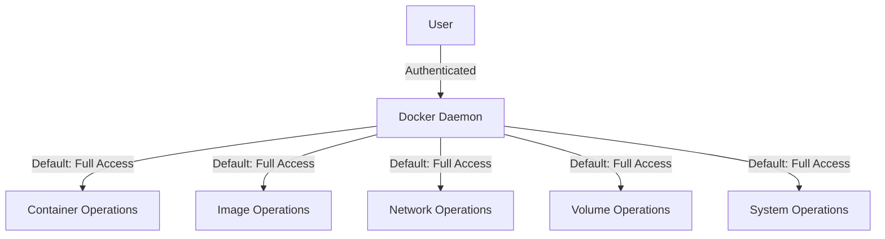
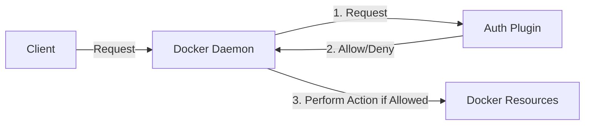

# Docker Authorization

## Introduction

Docker Authorization is a critical component of Docker security that controls what actions users can perform with Docker resources after they've been authenticated. While authentication verifies who you are, authorization determines what you're allowed to do. 

In containerized environments where multiple users or services might have access to the Docker daemon, properly implementing authorization controls helps prevent unauthorized access, limits the blast radius of security incidents, and ensures compliance with security policies.

## Understanding Docker Authorization

### The Default Model

By default, Docker operates with a simple authorization model: if you can access the Docker daemon (either through the Docker socket or via the Docker API), you have full privileges to perform any operation. This all-or-nothing approach can create significant security risks in multi-user or production environments.



### Docker Authorization Flow

When a request is made to the Docker daemon, it follows this authorization flow:

1. A user or service sends a request to the Docker daemon
2. The daemon authenticates the user/service
3. The authorization layer evaluates if the authenticated entity has permission to perform the requested action
4. If authorized, the action is executed; if not, the request is denied

## Authorization Plugins

To overcome the limitations of the default authorization model, Docker supports authorization plugins that enable fine-grained access control.

### How Authorization Plugins Work

Authorization plugins intercept requests to the Docker daemon and determine if they should be allowed or denied based on customizable rules.



### Enabling an Authorization Plugin

To enable an authorization plugin, you need to configure the Docker daemon:

```bash
# Edit the Docker daemon configuration file
sudo nano /etc/docker/daemon.json
```

Add the authorization plugin configuration:

```json
{
  "authorization-plugins": ["plugin-name"]
}
```

Then restart the Docker daemon:

```bash
sudo systemctl restart docker
```

## Popular Authorization Plugins

Let's look at some popular Docker authorization plugins and how to use them:

### Docker Authorization Plugin

The most basic plugin provided by Docker itself, which can be configured to allow or deny specific Docker commands.

### Open Policy Agent (OPA)

OPA is a general-purpose policy engine that can be used to implement fine-grained access control for Docker.

Example of an OPA policy for Docker:

```rego
package docker.authz

default allow = false

# Allow read-only operations
allow {
    input.method == "GET"
}

# Allow specific users to run containers
allow {
    input.method == "POST"
    input.path == "/containers/create"
    input.user == "developer"
}
```

### Setting up OPA with Docker

1. Install OPA:

```bash
curl -L -o opa https://openpolicyagent.org/downloads/latest/opa_linux_amd64
chmod 755 opa
mv opa /usr/local/bin/
```

2. Create a policy file:

```bash
mkdir -p /etc/docker/policies
nano /etc/docker/policies/authz.rego
```

3. Configure Docker to use OPA:

```json
{
  "authorization-plugins": ["opa-docker-authz"]
}
```

### Twistlock/Prisma Cloud

Twistlock (now part of Prisma Cloud) provides a comprehensive authorization solution that includes:

- Role-based access control (RBAC)
- Context-aware access policies
- Detailed audit logging

## Implementing Role-Based Access Control (RBAC)

One common approach to Docker authorization is implementing RBAC to assign different permissions to different user roles.

### Example RBAC Roles for Docker

```json
{
  "roles": {
    "developer": {
      "actions": ["container:create", "container:start", "container:stop", "image:pull"],
      "resources": ["app/*"]
    },
    "operator": {
      "actions": ["container:*", "image:*", "network:*", "volume:*"],
      "resources": ["*"]
    },
    "security": {
      "actions": ["container:inspect", "image:scan", "system:audit"],
      "resources": ["*"]
    }
  }
}
```

## Authorization Best Practices

### Principle of Least Privilege

Grant users and services only the permissions they need to perform their tasks. This limits potential damage if credentials are compromised.

### Regular Auditing

Regularly review authorization rules and logs to identify potential security issues:

```bash
# View Docker audit logs
sudo journalctl -u docker
```

### Separate Docker Environments

Consider using separate Docker environments for development, testing, and production, each with appropriate authorization controls.

### Context-Based Authorization

Implement policies that take into account the context of requests, such as:

- Time of day
- Source IP address 
- Container image provenance
- Target resources

## Practical Example: Setting Up Basic Authorization

Let's walk through implementing a basic authorization setup using docker-authz-plugin:

1. Install the plugin:

```bash
docker plugin install docker/authz-plugin
```

2. Create a policy file:

```bash
mkdir -p /etc/docker/plugins
cat > /etc/docker/plugins/authz-policy.json << EOF
{
  "users": {
    "alice": {
      "permissions": ["container:create", "container:start", "container:stop", "image:pull"]
    },
    "bob": {
      "permissions": ["container:list", "image:list"]
    },
    "admin": {
      "permissions": ["*"]
    }
  }
}
EOF
```

3. Configure Docker to use the plugin:

```bash
sudo nano /etc/docker/daemon.json
```

Add:

```json
{
  "authorization-plugins": ["docker/authz-plugin"]
}
```

4. Restart Docker:

```bash
sudo systemctl restart docker
```

5. Test the authorization:

```bash
# As alice (should work)
docker run --user alice nginx

# As bob (should be denied)
docker run --user bob nginx
```

Output for alice:
```
Unable to find image 'nginx:latest' locally
latest: Pulling from library/nginx
... (pulling image)
Status: Downloaded newer image for nginx:latest
...
```

Output for bob:
```
Error response from daemon: authorization denied by plugin docker/authz-plugin: User bob is not authorized to run containers
```

## Real-World Use Case: Multi-Tenant Docker Environment

Let's examine how authorization would be implemented in a real-world scenario where multiple teams share a Docker environment:

### Scenario

A company has development, operations, and security teams all using the same Docker infrastructure.

### Implementation

1. Define team roles and permissions:

```json
{
  "roles": {
    "dev-team": {
      "actions": ["container:create", "container:start", "container:stop", "image:pull"],
      "resources": ["dev/*"],
      "networks": ["dev-net"],
      "volumes": ["dev-data"]
    },
    "ops-team": {
      "actions": ["container:*", "image:*", "network:*", "volume:*", "system:info"],
      "resources": ["*"],
      "networks": ["*"],
      "volumes": ["*"]
    },
    "security-team": {
      "actions": ["container:inspect", "image:inspect", "system:audit"],
      "resources": ["*"],
      "networks": ["*"],
      "volumes": ["*"]
    }
  }
}
```

2. Implement team-specific label checks in the policy:

```rego
allow {
  input.user.team == "dev-team"
  input.request.path == "/containers/create"
  input.request.body.Labels["team"] == "dev-team"
}
```

3. Add audit logging for security review:

```bash
# Configure Docker daemon for audit logging
cat > /etc/docker/daemon.json << EOF
{
  "authorization-plugins": ["opa-docker-authz"],
  "log-level": "info",
  "log-driver": "json-file",
  "log-opts": {
    "max-size": "10m",
    "max-file": "5"
  }
}
EOF
```

## Troubleshooting Authorization Issues

When working with Docker authorization, you might encounter these common issues:

### Plugin Configuration Problems

If your authorization plugin isn't working:

```bash
# Check if the plugin is loaded
docker plugin ls

# Check Docker daemon logs
sudo journalctl -u docker | grep auth
```

### Permission Denied Errors

When you encounter "permission denied" errors:

1. Check your user's assigned role and permissions
2. Review the authorization plugin logs
3. Temporarily disable the authorization plugin to verify it's causing the issue:

```bash
# Edit daemon.json to comment out the authorization-plugins line
sudo nano /etc/docker/daemon.json
```

```json
{
  // "authorization-plugins": ["plugin-name"]
}
```

```bash
# Restart Docker
sudo systemctl restart docker
```

## Summary

Docker Authorization is a critical security layer that controls what actions users can perform after authentication. By implementing proper authorization controls through plugins and policies, you can:

- Enforce the principle of least privilege
- Implement role-based access control
- Protect sensitive container operations
- Maintain audit trails for compliance
- Reduce the risk of security incidents

Remember that the default Docker authorization model grants full access to anyone who can connect to the daemon, so it's essential to implement proper authorization mechanisms in multi-user and production environments.

## Additional Resources

To deepen your understanding of Docker Authorization, consider exploring:

- [Docker Documentation on Authorization Plugins](https://docs.docker.com/engine/extend/plugins_authorization/)
- [Open Policy Agent Documentation](https://www.openpolicyagent.org/docs/latest/)
- [CNCF Security Best Practices](https://www.cncf.io/)

## Exercises

1. Install and configure a basic Docker authorization plugin in a test environment.
2. Create a policy that allows certain users to only run specific container images.
3. Implement RBAC for a simulated multi-team environment with at least three different roles.
4. Configure audit logging for Docker authorization decisions and analyze the logs.
5. Research and compare three different Docker authorization plugins, listing their pros and cons.