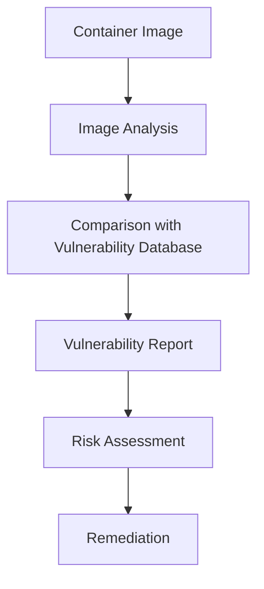

# Docker Vulnerability Scanning

## Introduction

Container security is a critical aspect of modern application deployment. Docker containers package applications and their dependencies together, but they can inadvertently include security vulnerabilities. Docker vulnerability scanning is the process of examining container images to identify known security issues before deploying them to production environments.

In this guide, you'll learn why vulnerability scanning is important, how it works, and how to implement it in your Docker workflow. By the end, you'll be able to confidently scan your container images and address potential security issues.

## Why is Vulnerability Scanning Important?

Container images often include various components:
- Base operating system (Alpine, Ubuntu, etc.)
- System libraries and packages
- Application dependencies
- Your custom application code

Each of these components can contain vulnerabilities:

1. **Known CVEs (Common Vulnerabilities and Exposures)** - publicly documented security flaws
2. **Outdated packages** - older versions of software with known security issues
3. **Misconfigurations** - improper settings that create security weaknesses

Without scanning, these vulnerabilities can go undetected and potentially be exploited by attackers after deployment.

## How Docker Vulnerability Scanning Works

The vulnerability scanning process involves:



1. **Image Analysis**: The scanner examines the layers of your Docker image, identifying all installed packages and their versions.
2. **Database Comparison**: These components are compared against databases of known vulnerabilities (like the National Vulnerability Database).
3. **Reporting**: A report is generated showing discovered vulnerabilities, their severity, and potential remediation steps.

## Popular Docker Vulnerability Scanning Tools

### Docker Scout

Docker Scout (formerly Docker Scan) is integrated directly into Docker Desktop and the Docker CLI, making it easy to use.

#### Basic Usage

```bash
# Scan a local image
docker scout cves nginx:latest

# Scan and generate a detailed report
docker scout cves --format json nginx:latest > vulnerability-report.json
```

#### Sample Output

```
✓ Image stored for indexing
✓ Indexed 1/1 components

nginx:latest Vulnerabilities

Critical    8      
High        39     
Medium      15     
Low         11     
Unknown     0      

73 vulnerabilities found in 12 packages
  • openssl-dev. Critical: 2, High: 2
  • openssl. Critical: 2, High: 4, Medium: 2
  • ...
```

### Trivy

Trivy is a popular open-source scanner that can detect vulnerabilities in container images, file systems, and Git repositories.

#### Installation

```bash
# On macOS
brew install trivy

# On Ubuntu/Debian
apt-get install trivy

# On Windows with Chocolatey
choco install trivy
```

#### Basic Usage

```bash
# Scan a Docker image
trivy image python:3.9-alpine

# Scan with output filtering
trivy image --severity HIGH,CRITICAL python:3.9-alpine
```

#### Sample Output

```
2021-09-01T12:03:07.823Z        INFO    Detected OS: alpine
2021-09-01T12:03:07.823Z        INFO    Detecting Alpine vulnerabilities...
2021-09-01T12:03:07.824Z        INFO    Number of language-specific files: 1
2021-09-01T12:03:07.824Z        INFO    Detecting python-pkg vulnerabilities...

python:3.9-alpine (alpine 3.14.2)
===================================
Total: 0 (HIGH: 0, CRITICAL: 0)


Python (python-pkg)
===================
Total: 0 (HIGH: 0, CRITICAL: 0)
```

## Integrating Vulnerability Scanning into CI/CD

Automating vulnerability scanning in your CI/CD pipeline ensures that every container image is checked before deployment.

### Example GitHub Actions Workflow

```yaml
name: Docker Security Scan

on:
  push:
    branches: [ main ]
  pull_request:
    branches: [ main ]

jobs:
  security-scan:
    runs-on: ubuntu-latest
    steps:
      - name: Checkout code
        uses: actions/checkout@v2

      - name: Build Docker image
        run: docker build -t my-app:${{ github.sha }} .

      - name: Run Trivy vulnerability scanner
        uses: aquasecurity/trivy-action@master
        with:
          image-ref: 'my-app:${{ github.sha }}'
          format: 'table'
          exit-code: '1'
          severity: 'CRITICAL,HIGH'
```

This workflow:
1. Builds your Docker image when code is pushed to main or in a pull request
2. Scans the image with Trivy looking for Critical and High severity issues
3. Fails the build if any such vulnerabilities are found

## Best Practices for Vulnerability Management

### 1. Use Minimal Base Images

Start with minimal base images to reduce the potential attack surface:

```dockerfile
# Instead of this
FROM ubuntu:latest

# Use this
FROM alpine:latest

# Or even better, use distroless images when possible
FROM gcr.io/distroless/base-debian11
```

### 2. Keep Base Images Updated

Regularly update your base images to include security patches:

```dockerfile
# Pull the latest version regularly
FROM node:18-alpine

# Or specify exact versions for reproducibility
FROM node:18.17.1-alpine3.18
```

### 3. Multi-Stage Builds

Use multi-stage builds to reduce the final image size and attack surface:

```dockerfile
# Build stage
FROM node:18-alpine AS build
WORKDIR /app
COPY package*.json ./
RUN npm install
COPY . .
RUN npm run build

# Production stage
FROM node:18-alpine
WORKDIR /app
COPY --from=build /app/dist ./dist
COPY --from=build /app/package*.json ./
RUN npm install --only=production
USER node
CMD ["node", "dist/index.js"]
```

### 4. Implement a "Break the Build" Policy

Configure your CI/CD pipeline to fail when critical vulnerabilities are detected, preventing vulnerable images from being deployed.

### 5. Risk-Based Remediation

Not all vulnerabilities need immediate fixing. Prioritize based on:
- Severity (Critical, High, Medium, Low)
- Exploitability in your environment
- Existence of a patch or workaround

## Handling False Positives

Vulnerability scanners sometimes report issues that aren't applicable to your environment. You can manage these with:

### 1. Vulnerability Whitelisting

For Trivy, you can create a `.trivyignore` file in your project:

```
# .trivyignore
# Format: CVE-YYYY-XXXXX
CVE-2023-12345  # Not applicable due to our configuration
CVE-2023-67890  # Fixed in our custom patch
```

### 2. Policy as Code

Define your acceptable risk levels programmatically:

```yaml
# trivy-config.yaml
vulnerability:
  ignore-unfixed: true
  severity: CRITICAL,HIGH
```

## Practical Example: Securing a Web Application

Let's walk through a complete example of building and securing a simple Node.js web application.

### Initial Dockerfile

```dockerfile
FROM node:18
WORKDIR /app
COPY package*.json ./
RUN npm install
COPY . .
EXPOSE 3000
CMD ["node", "app.js"]
```

### Scanning Results

When we scan this image with Trivy, we might see numerous vulnerabilities:

```bash
trivy image my-node-app:latest
```

Output might show:
- 15 HIGH severity issues
- 3 CRITICAL severity issues
- Many related to the node base image and npm packages

### Improved Dockerfile

```dockerfile
# Build stage
FROM node:18-alpine AS build
WORKDIR /app
COPY package*.json ./
RUN npm ci
COPY . .

# Production stage
FROM node:18-alpine
WORKDIR /app
# Add non-root user
RUN addgroup -S appgroup && adduser -S appuser -G appgroup
COPY --from=build /app/package*.json ./
COPY --from=build /app/node_modules ./node_modules
COPY --from=build /app/app.js ./
# Set ownership
RUN chown -R appuser:appgroup /app
USER appuser
EXPOSE 3000
CMD ["node", "app.js"]
```

### Re-scanning

After implementing these changes, we'd scan again:

```bash
trivy image my-node-app:latest
```

We should see a significant reduction in vulnerabilities by:
- Using Alpine Linux instead of Debian/Ubuntu
- Running as a non-root user
- Minimizing included files
- Having fewer packages installed

## Summary

Docker vulnerability scanning is a critical practice for maintaining secure container deployments. By implementing regular scanning in your development workflow, you can:

- Identify security issues before they reach production
- Understand your security posture
- Mitigate vulnerabilities based on risk
- Ensure compliance with security standards

Remember that vulnerability scanning is just one part of a comprehensive container security strategy. It should be combined with other practices like least privilege principles, network segmentation, and runtime security monitoring.

## Additional Resources

- [Docker Scout Documentation](https://docs.docker.com/scout/)
- [Trivy Documentation](https://aquasecurity.github.io/trivy/)
- [OWASP Docker Security Cheat Sheet](https://cheatsheetseries.owasp.org/cheatsheets/Docker_Security_Cheat_Sheet.html)
- [National Vulnerability Database](https://nvd.nist.gov/)

## Exercises

1. Build a simple application with Docker and scan it with both Docker Scout and Trivy. Compare the results.
2. Implement a multi-stage build for an existing Dockerfile and measure the reduction in vulnerabilities.
3. Set up a GitHub Actions workflow that scans your container images on every push.
4. Create a policy for handling different severity levels of vulnerabilities in your development workflow.
5. Research and implement a vulnerability scanning solution for your container registry (Docker Hub, AWS ECR, etc.).