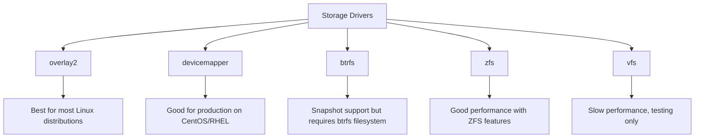

# Docker Performance Basics

## Introduction

When working with Docker containers, understanding performance fundamentals is crucial for building efficient applications. Docker provides a lightweight virtualization solution, but without proper optimization, containers can face performance bottlenecks that impact your application's responsiveness and resource usage.

This guide covers the essential concepts of Docker performance, helping beginners understand how to monitor, measure, and optimize their Docker containers. By the end, you'll have practical knowledge to ensure your containerized applications run efficiently in development and production environments.

## Docker Performance Fundamentals

### What Affects Docker Performance?

Docker containers share the host system's kernel but run in isolated environments. Several factors affect container performance:

1. **Host Resources**: CPU, memory, disk I/O, and network bandwidth limitations
2. **Container Configuration**: Resource allocation settings and constraints
3. **Image Size**: Larger images can slow startup and increase memory usage
4. **Container Networking**: Network driver choice and configuration
5. **Storage Drivers**: Different storage drivers have varying performance characteristics

Let's explore each of these aspects and learn how to optimize them.

## Monitoring Docker Performance

Before optimizing, you need to understand your current performance. Docker provides built-in tools for monitoring container resources.

### Using Docker Stats

The `docker stats` command provides a live stream of container resource usage statistics:

```bash
docker stats
```

Output:
```
CONTAINER ID   NAME                  CPU %     MEM USAGE / LIMIT     MEM %     NET I/O           BLOCK I/O         PIDS
7c5a2d4e9e0c   mystifying_bardeen    0.10%     5.273MiB / 7.772GiB   0.07%     656B / 0B         0B / 0B           1
3ca39b02698a   boring_chandrasekhar  0.12%     115.8MiB / 7.772GiB   1.46%     2.62kB / 0B       0B / 0B           26
```

For more detailed metrics, you can use the `--format` option to customize output:

```bash
docker stats --format "table {{.Name}}\t{{.CPUPerc}}\t{{.MemUsage}}\t{{.NetIO}}\t{{.BlockIO}}"
```

### Using Docker Top

To view the processes running inside a container:

```bash
docker top container_name
```

Output:
```
UID                 PID                 PPID                C                   STIME               TTY                 TIME                CMD
root                12345               12340               0                   10:51               ?                   00:00:00            node app.js
```

## Benchmarking Container Performance

Let's create a simple benchmark to measure container startup time:

```bash
time docker run --rm alpine echo "Hello, Docker!"
```

Output:
```
Hello, Docker!

real    0m0.754s
user    0m0.028s
sys     0m0.032s
```

This helps you understand how quickly your containers can start, which is important for scaling and recovery scenarios.

## CPU Performance Optimization

### Setting CPU Limits

By default, containers can use unlimited CPU resources. You can control CPU usage with the `--cpus` flag:

```bash
# Limit container to use 0.5 CPU cores
docker run --cpus=0.5 nginx
```

### Specifying CPU Shares

For multiple containers, you can set relative CPU priorities with `--cpu-shares`:

```bash
# Container A gets twice the CPU priority of container B
docker run --cpu-shares=1024 --name=container_a nginx
docker run --cpu-shares=512 --name=container_b nginx
```

### Pinning Containers to Specific CPUs

For performance-critical workloads, you can pin containers to specific CPU cores:

```bash
# Pin container to CPU cores 0 and 1
docker run --cpuset-cpus="0,1" nginx
```

## Memory Performance Optimization

### Setting Memory Limits

Prevent containers from consuming too much memory:

```bash
# Limit container to 512MB of RAM
docker run --memory=512m nginx
```

### Configuring Swap Limits

Control swap usage to improve predictability:

```bash
# Limit memory to 1GB and swap to 2GB total
docker run --memory=1g --memory-swap=2g nginx
```

The container can use up to 1GB of physical memory and 1GB of swap.

## Storage Performance

### Choosing the Right Storage Driver

Docker supports multiple storage drivers with different performance characteristics:



Check your current storage driver:

```bash
docker info | grep "Storage Driver"
```

Output:
```
Storage Driver: overlay2
```

### Volume Performance

For I/O intensive applications, use Docker volumes instead of bind mounts:

```bash
# Create and use a named volume
docker volume create data_volume
docker run -v data_volume:/app/data nginx
```

Volumes provide better performance than bind mounts because they're managed by Docker and optimized for container workloads.

## Network Performance

### Network Driver Selection

Docker offers several network drivers, each with different performance characteristics:

1. **Bridge** (default): Good for most use cases
2. **Host**: Best performance but less isolation
3. **Overlay**: For multi-host networks (Swarm)
4. **Macvlan**: Direct connection to physical network
5. **None**: Disables networking

For maximum performance, the host network mode eliminates network overhead:

```bash
docker run --network=host nginx
```

### Container DNS Resolution

Slow DNS resolution can impact container startup and runtime performance. Configure DNS settings:

```bash
docker run --dns=8.8.8.8 nginx
```

## Image Optimization for Performance

### Building Smaller Images

Smaller images lead to faster downloads, quicker startups, and lower memory usage.

**Multi-stage builds** dramatically reduce image size:

```dockerfile
# Build stage
FROM node:16 AS build
WORKDIR /app
COPY package*.json ./
RUN npm install
COPY . .
RUN npm run build

# Production stage
FROM node:16-alpine
WORKDIR /app
COPY --from=build /app/dist ./dist
COPY --from=build /app/node_modules ./node_modules
COPY package*.json ./
CMD ["npm", "start"]
```

### Layer Optimization

Docker images consist of layers. Optimize your Dockerfile to leverage layer caching:

```dockerfile
# Bad: Changes to source code invalidate cached dependencies
COPY . /app
RUN npm install

# Good: Dependencies layer can be cached
COPY package*.json /app/
RUN npm install
COPY . /app
```

## Real-World Performance Scenarios

### Case Study: Web Server Optimization

Let's optimize a Node.js web application for production:

```dockerfile
FROM node:16-alpine

# Set working directory
WORKDIR /app

# Install dependencies
COPY package*.json ./
RUN npm ci --only=production

# Copy application code
COPY . .

# Set environment variables
ENV NODE_ENV=production

# Limit memory usage
ENV NODE_OPTIONS="--max-old-space-size=512"

# Expose port
EXPOSE 3000

# Start command
CMD ["node", "server.js"]
```

Run with resource constraints:

```bash
docker run --name web-app \
  --cpus=0.5 \
  --memory=512m \
  --restart=on-failure:5 \
  -p 3000:3000 \
  web-app
```

### Performance Testing with Docker Compose

Create a performance test environment using Docker Compose:

```yaml
version: '3.8'

services:
  app:
    build: .
    ports:
      - "3000:3000"
    deploy:
      resources:
        limits:
          cpus: '0.5'
          memory: 512M
  
  load-test:
    image: artillery/artillery
    depends_on:
      - app
    command: "quick --count 100 -n 50 http://app:3000/"
    deploy:
      resources:
        limits:
          cpus: '0.5'
          memory: 256M
```

Run the test with:

```bash
docker-compose up
```

## Advanced Performance Techniques

### Container Healthchecks

Implement healthchecks to ensure your containers are performing correctly:

```dockerfile
HEALTHCHECK --interval=30s --timeout=3s --retries=3 \
  CMD curl -f http://localhost:3000/ || exit 1
```

### Resource Quotas with Docker Compose

Set resource quotas for all services in a Docker Compose file:

```yaml
version: '3.8'
services:
  web:
    image: nginx
    deploy:
      resources:
        limits:
          cpus: '0.5'
          memory: 256M
        reservations:
          cpus: '0.1'
          memory: 128M
```

## Performance Monitoring Tools

Besides Docker's built-in tools, several external tools can help monitor Docker performance:

1. **cAdvisor**: Container-specific metrics
2. **Prometheus**: Metrics collection and alerting
3. **Grafana**: Visualization dashboards
4. **Datadog**: Comprehensive monitoring solution

A simple monitoring stack can be created with Docker Compose:

```yaml
version: '3.8'
services:
  cadvisor:
    image: gcr.io/cadvisor/cadvisor:latest
    ports:
      - "8080:8080"
    volumes:
      - /:/rootfs:ro
      - /var/run:/var/run:ro
      - /sys:/sys:ro
      - /var/lib/docker/:/var/lib/docker:ro
      - /dev/disk/:/dev/disk:ro
    privileged: true
    
  prometheus:
    image: prom/prometheus:latest
    ports:
      - "9090:9090"
    volumes:
      - ./prometheus.yml:/etc/prometheus/prometheus.yml
    depends_on:
      - cadvisor
    
  grafana:
    image: grafana/grafana:latest
    ports:
      - "3000:3000"
    depends_on:
      - prometheus
```

## Common Performance Issues and Solutions

| Issue | Symptom | Solution |
|-------|---------|----------|
| High CPU usage | Container using excessive CPU | Set CPU limits with `--cpus` |
| Memory leaks | Growing memory consumption | Set memory limits, fix application code |
| Slow disk I/O | Sluggish file operations | Use volumes with performant storage |
| Network latency | Slow inter-container communication | Consider `host` network for critical services |
| Slow container startup | Long deployment times | Optimize image size, use alpine-based images |

## Summary

Docker performance optimization involves understanding and controlling several key aspects:

1. **Resource Allocation**: Set appropriate CPU and memory limits
2. **Storage Configuration**: Choose the right storage driver and use volumes
3. **Network Setup**: Select optimal network drivers for your use case
4. **Image Optimization**: Build smaller, more efficient Docker images
5. **Monitoring**: Regularly track performance metrics to identify bottlenecks

By implementing these practices, you can ensure your Docker containers run efficiently and reliably, providing the best experience for your application users.

## Additional Resources

- [Docker Documentation: Limit a container's resources](https://docs.docker.com/config/containers/resource_constraints/)
- [Docker Documentation: Storage drivers](https://docs.docker.com/storage/storagedriver/select-storage-driver/)
- [Docker Compose documentation](https://docs.docker.com/compose/)

## Exercises

1. **Benchmark Different Images**: Compare the startup time and memory usage of a web server using different base images (full OS, slim, alpine).
2. **Resource Constraint Testing**: Run the same application with different resource constraints and measure its performance.
3. **Storage Driver Comparison**: If possible on your system, test the same container with different storage drivers and compare I/O performance.
4. **Network Performance**: Compare network performance between bridge and host network modes for a web application.
5. **Multi-Stage Build**: Convert an existing Dockerfile to use multi-stage builds and measure the image size reduction.