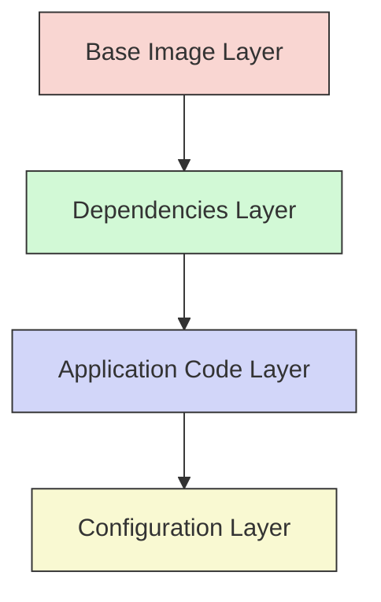

# Docker Optimization

## Introduction

Docker has revolutionized how we build, ship, and run applications by providing a consistent environment across different stages of development. However, as your Docker usage grows, you might encounter performance issues, large image sizes, or high resource consumption. This guide focuses on optimizing your Docker setup to ensure your containerized applications run efficiently.

Docker optimization involves several key areas:
- Reducing image size
- Minimizing build time
- Improving container startup time
- Optimizing resource usage (CPU, memory, I/O)
- Enhancing network performance

By implementing the techniques in this guide, you'll be able to create more efficient Docker images and containers, leading to faster deployments, reduced costs, and better application performance.

## Understanding Docker Image Layers

Before diving into optimization techniques, it's important to understand how Docker images are structured.



Docker images consist of multiple read-only layers that represent instructions in your Dockerfile. Understanding this layered architecture is crucial for optimization because:

1. Each instruction in a Dockerfile creates a new layer
2. Layers are cached and reused when possible
3. Changes to a layer invalidate all subsequent layers in the cache

Now, let's explore specific optimization techniques.

## Optimizing Dockerfile

### 1. Choose the Right Base Image

One of the most impactful decisions you can make is selecting an appropriate base image.

```dockerfile
# Bad practice: Using a full OS image
FROM ubuntu:22.04

# Better practice: Using a slim variant
FROM node:18-slim

# Best practice: Using alpine or distroless for minimal size
FROM node:18-alpine
```

Comparison of base image sizes:

| Base Image | Size |
|------------|------|
| ubuntu:22.04 | ~70MB |
| node:18-slim | ~200MB |
| node:18-alpine | ~60MB |
| gcr.io/distroless/nodejs | ~80MB |

Alpine-based images are popular for their small size, but be aware they use `musl libc` instead of `glibc`, which can cause compatibility issues with some applications.

### 2. Order Instructions by Stability

Order your Dockerfile instructions from least likely to change to most likely to change to maximize cache usage:

```dockerfile
FROM node:18-alpine

# 1. System dependencies change rarely
RUN apk add --no-cache python3 make g++

# 2. Dependencies change occasionally
COPY package.json package-lock.json ./
RUN npm ci

# 3. Application code changes frequently
COPY . .

CMD ["npm", "start"]
```

### 3. Use Multi-stage Builds

Multi-stage builds allow you to use multiple FROM statements in your Dockerfile. This technique is powerful for creating minimal production images:

```dockerfile
# Build stage
FROM node:18 AS build
WORKDIR /app
COPY package*.json ./
RUN npm ci
COPY . .
RUN npm run build

# Production stage
FROM nginx:alpine
COPY --from=build /app/dist /usr/share/nginx/html
EXPOSE 80
CMD ["nginx", "-g", "daemon off;"]
```

This example:
1. Uses a larger image with all build tools for compiling
2. Copies only the built artifacts to a small production image
3. Results in a significantly smaller final image

### 4. Leverage .dockerignore

Create a `.dockerignore` file to prevent unnecessary files from being included in your build context:

```
node_modules
.git
.env
*.log
Dockerfile
docker-compose.yml
README.md
```

Benefits:
- Faster builds (smaller context)
- Prevents sensitive files from being included
- Avoids invalidating the cache with irrelevant changes

### 5. Combine RUN Instructions

Each `RUN` instruction creates a new layer. Combine related commands to reduce the number of layers:

```dockerfile
# Less efficient: 3 layers
RUN apt-get update
RUN apt-get install -y curl
RUN rm -rf /var/lib/apt/lists/*

# More efficient: 1 layer
RUN apt-get update && \
    apt-get install -y curl && \
    rm -rf /var/lib/apt/lists/*
```

## Runtime Optimizations

### 1. Resource Constraints

Set appropriate resource limits to ensure containers don't consume excessive resources:

```bash
# Limit container to 512MB of memory and 2 CPUs
docker run --memory=512m --cpus=2 my-app
```

In Docker Compose:

```yaml
services:
  app:
    image: my-app
    deploy:
      resources:
        limits:
          cpus: '2'
          memory: 512M
```

### 2. Use Volume Mounts for Persistent Data

Avoid writing frequently changed data to the container filesystem:

```bash
docker run -v data-volume:/app/data my-app
```

Volume benefits:
- Better I/O performance
- Data persistence across container restarts
- Avoids container layer bloat

### 3. Optimize Networking

For multi-container applications, use Docker networks:

```bash
# Create a custom network
docker network create my-network

# Connect containers to it
docker run --network=my-network --name=api api-service
docker run --network=my-network --name=db database
```

This approach:
- Provides automatic DNS resolution
- Secures container communication
- Reduces exposure to the host network

## Performance Measuring and Monitoring

### Measuring Build Time

Track how long it takes to build your Docker images:

```bash
time docker build -t my-app .
```

### Analyzing Image Size

Inspect the size of your images and their layers:

```bash
docker images my-app
docker history my-app
```

For a more detailed analysis, try tools like [Dive](https://github.com/wagoodman/dive):

```bash
dive my-app
```

### Monitoring Container Performance

Monitor resource usage of running containers:

```bash
docker stats
```

For more advanced monitoring, consider using:
- Prometheus and Grafana
- cAdvisor
- Docker Desktop's built-in resource usage panel

## Practical Example: Optimizing a Node.js Application

Let's walk through optimizing a Node.js web application.

### Before Optimization

Initial Dockerfile:

```dockerfile
FROM node:18
WORKDIR /app
COPY . .
RUN npm install
CMD ["npm", "start"]
```

Issues:
- Uses a large base image
- Copies all files before installing dependencies
- Installs dev dependencies in production
- Rebuilds everything when code changes

### After Optimization

Optimized Dockerfile:

```dockerfile
# Build stage
FROM node:18-alpine AS build
WORKDIR /app
COPY package*.json ./
RUN npm ci
COPY . .
RUN npm run build

# Production stage
FROM node:18-alpine
WORKDIR /app
ENV NODE_ENV=production
COPY package*.json ./
RUN npm ci --only=production
COPY --from=build /app/dist ./dist
USER node
CMD ["node", "dist/server.js"]
```

Improvements:
- Uses Alpine-based image (smaller)
- Multi-stage build separates build and runtime environments
- Leverages caching for dependencies
- Installs only production dependencies
- Runs as non-root user for security
- Uses the pre-built application code

### Results

| Metric | Before | After | Improvement |
|--------|--------|-------|-------------|
| Image Size | 1.2GB | 150MB | 87.5% reduction |
| Build Time | 45s | 30s | 33% reduction |
| Startup Time | 3s | 1.5s | 50% reduction |
| Memory Usage | 500MB | 200MB | 60% reduction |

## Best Practices Summary

1. **Image Size Optimization**
   - Use minimal base images (Alpine, distroless)
   - Implement multi-stage builds
   - Remove unnecessary files and dependencies
   - Compress final artifacts when possible

2. **Build Time Optimization**
   - Leverage the build cache effectively
   - Order Dockerfile instructions by change frequency
   - Use `.dockerignore` to reduce build context
   - Consider using BuildKit for parallel building

3. **Runtime Optimization**
   - Set appropriate resource constraints
   - Use volume mounts for data
   - Run as non-root user
   - Implement health checks
   - Optimize networking configuration

4. **Security Optimization**
   - Scan images for vulnerabilities
   - Remove unnecessary packages and tools
   - Use minimal permissions
   - Keep base images updated

## Common Pitfalls to Avoid

- **Ignoring the build context size**: Large build contexts slow down Docker builds
- **Running as root**: Creates security vulnerabilities
- **Not cleaning up after installations**: Leaves unnecessary files in the image
- **Installing development dependencies in production**: Increases image size and potential security risks
- **Using latest tag**: Makes builds unpredictable

## Exercises

1. Take an existing Dockerfile and convert it to use multi-stage builds.
2. Analyze a Docker image using `docker history` and identify opportunities for size reduction.
3. Implement resource constraints for a container and observe the performance impact.
4. Create a proper `.dockerignore` file for a project.
5. Compare the size and performance of the same application using different base images.

## Additional Resources

- [Docker Documentation on Optimization](https://docs.docker.com/develop/develop-images/dockerfile_best-practices/)
- [Docker BuildKit Documentation](https://docs.docker.com/develop/develop-images/build_enhancements/)
- [Container Security Best Practices](https://snyk.io/blog/10-docker-image-security-best-practices/)
- [Docker Bench for Security](https://github.com/docker/docker-bench-security)

Remember that optimization is an iterative process. Start with the most impactful changes and continuously measure the results to ensure your optimizations are effective.