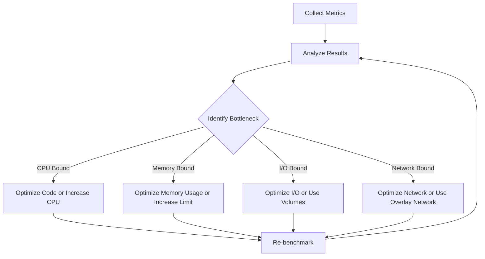

# Docker Benchmarking

## Introduction

Docker benchmarking is the process of measuring the performance of Docker containers and Docker-related operations to identify bottlenecks, compare configurations, and optimize resource usage. For developers working with containerized applications, understanding how to properly benchmark Docker is crucial for creating efficient, scalable systems.

In this tutorial, we'll explore various Docker benchmarking techniques, tools, and best practices that will help you evaluate and improve the performance of your Docker containers. Whether you're running applications in development or production environments, these benchmarking approaches will provide valuable insights into your container performance.

## Why Benchmark Docker Containers?

Before diving into how to benchmark, let's understand why benchmarking Docker containers is important:

- **Resource Optimization**: Identify containers that consume excessive CPU, memory, or I/O resources
- **Configuration Comparison**: Test different Docker configurations to find the most efficient setup
- **Performance Bottleneck Detection**: Pinpoint specific areas that slow down your containerized applications
- **Capacity Planning**: Determine how many containers can run efficiently on a given host
- **Cost Efficiency**: Reduce cloud infrastructure costs by optimizing container performance

## Basic Docker Performance Metrics

When benchmarking Docker containers, several key metrics are particularly important:

### 1. CPU Usage

CPU usage indicates how much processing power a container is consuming. High CPU usage might indicate compute-intensive tasks or inefficient code.

### 2. Memory Usage

Memory usage shows how much RAM a container is using. Memory leaks or inefficient memory allocation can cause performance issues.

### 3. Disk I/O

Disk I/O performance affects how quickly containers can read from and write to storage. Slow I/O operations can create bottlenecks.

### 4. Network Performance

Network throughput and latency metrics help identify communication bottlenecks between containers or external services.

### 5. Container Startup Time

The time it takes for a container to start can be crucial, especially in dynamic scaling scenarios.

## Docker Benchmarking Tools

Let's explore some essential tools for benchmarking Docker containers:

### 1. Docker Stats

The simplest way to start benchmarking is with Docker's built-in `stats` command:

```bash
docker stats
```

This command provides a live stream of container resource usage:

```
CONTAINER ID   NAME                CPU %     MEM USAGE / LIMIT     MEM %     NET I/O           BLOCK I/O         PIDS
a1b2c3d4e5f6   web-app            1.20%     125.6MiB / 1.952GiB   6.29%     648B / 648B       0B / 0B           12
b2c3d4e5f6a1   database           0.15%     756.3MiB / 1.952GiB   37.88%    1.21kB / 648B     8.19MB / 0B       38
```

For more detailed information on a specific container:

```bash
docker stats your-container-name
```

### 2. cAdvisor (Container Advisor)

cAdvisor is a Google-developed tool that provides deeper insights into container performance:

```bash
docker run \
  --volume=/:/rootfs:ro \
  --volume=/var/run:/var/run:ro \
  --volume=/sys:/sys:ro \
  --volume=/var/lib/docker/:/var/lib/docker:ro \
  --publish=8080:8080 \
  --detach=true \
  --name=cadvisor \
  gcr.io/cadvisor/cadvisor:latest
```

After running this command, you can access cAdvisor's web interface at `http://localhost:8080` to view detailed performance metrics.

### 3. Docker Bench Security

While primarily a security tool, Docker Bench Security can identify configuration issues that might affect performance:

```bash
docker run --rm -it \
  --net host \
  --pid host \
  --userns host \
  --cap-add audit_control \
  -v /var/lib:/var/lib \
  -v /var/run/docker.sock:/var/run/docker.sock \
  -v /usr/lib/systemd:/usr/lib/systemd \
  -v /etc:/etc \
  docker/docker-bench-security
```

### 4. Apache Benchmark (ab)

For testing HTTP services in containers, Apache Benchmark is a valuable tool:

```bash
ab -n 1000 -c 10 http://localhost:8080/
```

This command sends 1000 requests with 10 concurrent connections to your containerized web application.

Example output:

```
This is ApacheBench, Version 2.3 <$Revision: 1879490 $>
...
Concurrency Level:      10
Time taken for tests:   2.342 seconds
Complete requests:      1000
Failed requests:        0
Total transferred:      1243000 bytes
HTML transferred:       853000 bytes
Requests per second:    426.98 [#/sec] (mean)
Time per request:       23.421 [ms] (mean)
Time per request:       2.342 [ms] (mean, across all concurrent requests)
Transfer rate:          518.37 [Kbytes/sec] received
```

### 5. Prometheus and Grafana

For long-term performance monitoring and benchmarking, Prometheus can collect metrics and Grafana can visualize them:

```bash
# Run Prometheus
docker run -d -p 9090:9090 \
  -v /path/to/prometheus.yml:/etc/prometheus/prometheus.yml \
  prom/prometheus

# Run Grafana
docker run -d -p 3000:3000 grafana/grafana
```

## Benchmarking Specific Docker Performance Aspects

Let's explore how to benchmark specific aspects of Docker performance:

### Container Startup Time

Measuring how quickly your containers start can be crucial for scaling operations:

```bash
time docker run --rm your-image:tag
```

For more accurate measurements, create a script to run multiple tests:

```bash
#!/bin/bash

echo "Testing container startup time (10 iterations)"
for i in {1..10}; do
  start=$(date +%s.%N)
  docker run --rm your-image:tag > /dev/null 2>&1
  end=$(date +%s.%N)
  runtime=$(echo "$end - $start" | bc)
  echo "Run $i: $runtime seconds"
done
```

### CPU Performance

To benchmark CPU performance within a container, you can use stress-ng:

```bash
docker run --rm -it alpine sh -c "apk add --no-cache stress-ng && stress-ng --cpu 4 --timeout 10s --metrics"
```

This command installs stress-ng in an Alpine container and runs a CPU benchmark with 4 CPU workers for 10 seconds.

Example output:

```
stress-ng: info:  [6] dispatching hogs: 4 cpu
stress-ng: info:  [6] successful run completed in 10.00s
stress-ng: info:  [6] stressor       bogo ops real time  usr time  sys time   bogo ops/s   bogo ops/s
stress-ng: info:  [6]                           (secs)    (secs)    (secs)   (real time) (usr+sys time)
stress-ng: info:  [6] cpu               9596     10.00     39.96      0.00       959.52       240.16
```

### Memory Performance

To benchmark memory operations:

```bash
docker run --rm -it alpine sh -c "apk add --no-cache stress-ng && stress-ng --vm 2 --vm-bytes 256M --timeout 10s --metrics"
```

This runs 2 workers that allocate and free 256MB of memory repeatedly for 10 seconds.

### Disk I/O Performance

For benchmarking disk I/O in Docker:

```bash
docker run --rm -it alpine sh -c "apk add --no-cache fio && fio --name=test --ioengine=posixaio --rw=readwrite --bs=4k --size=100M --numjobs=4 --runtime=60 --time_based --end_fsync=1"
```

This command uses `fio` (Flexible I/O Tester) to benchmark disk read and write operations.

### Network Performance

To test network performance between containers:

```bash
# Start iperf3 server in a container
docker run --name iperf-server -d -p 5201:5201 networkstatic/iperf3 -s

# Run iperf3 client in another container
docker run --rm networkstatic/iperf3 -c iperf-server
```

Example output:

```
Connecting to host iperf-server, port 5201
[  5] local 172.17.0.3 port 59582 connected to 172.17.0.2 port 5201
[ ID] Interval           Transfer     Bitrate         Retr
[  5]   0.00-10.00  sec  11.6 GBytes  9.92 Gbits/sec    0
```

## Creating a Comprehensive Benchmarking Suite

For thorough benchmarking, you can create a Docker Compose setup that runs multiple tests:

```yaml
version: '3'

services:
  cpu-benchmark:
    image: alpine
    command: sh -c "apk add --no-cache stress-ng && stress-ng --cpu 2 --timeout 30s --metrics"
    
  memory-benchmark:
    image: alpine
    command: sh -c "apk add --no-cache stress-ng && stress-ng --vm 2 --vm-bytes 512M --timeout 30s --metrics"
    
  disk-benchmark:
    image: alpine
    command: sh -c "apk add --no-cache fio && fio --name=test --ioengine=posixaio --rw=readwrite --bs=4k --size=200M --numjobs=4 --runtime=30 --time_based --end_fsync=1"
    
  network-server:
    image: networkstatic/iperf3
    command: -s
    
  network-client:
    image: networkstatic/iperf3
    command: -c network-server -t 30
    depends_on:
      - network-server
```

Save this as `docker-compose.benchmark.yml` and run:

```bash
docker-compose -f docker-compose.benchmark.yml up
```

## Performance Bottleneck Visualization

Understanding your benchmarking results is easier with visualization. Here's a Mermaid diagram showing a typical Docker performance bottleneck analysis workflow:



## Best Practices for Docker Benchmarking

To ensure accurate and useful benchmarking results:

1. **Isolate Your Tests**: Run benchmarks on dedicated hosts without other workloads.

2. **Consistent Environment**: Use the same hardware and Docker version for all comparable tests.

3. **Multiple Iterations**: Run each benchmark multiple times and calculate averages.

4. **Control Variables**: Change only one variable at a time to isolate its impact.

5. **Realistic Workloads**: Benchmark with workloads that match your actual production usage.

6. **Document Everything**: Record all configuration details, results, and observations.

7. **Compare Relative Performance**: Focus on performance changes rather than absolute numbers.

## Real-world Example: Web Application Benchmarking

Let's walk through a complete example of benchmarking a containerized web application:

1. First, create a Docker Compose file with your application and a monitoring setup:

```yaml
version: '3'

services:
  web-app:
    image: your-web-app:latest
    ports:
      - "8080:8080"
    deploy:
      resources:
        limits:
          cpus: '1'
          memory: 512M
          
  cadvisor:
    image: gcr.io/cadvisor/cadvisor:latest
    volumes:
      - /:/rootfs:ro
      - /var/run:/var/run:ro
      - /sys:/sys:ro
      - /var/lib/docker/:/var/lib/docker:ro
    ports:
      - "8081:8080"
```

2. Start the services:

```bash
docker-compose up -d
```

3. Run Apache Benchmark against your application:

```bash
# Install Apache Benchmark if needed
apt-get install apache2-utils

# Run benchmark
ab -n 10000 -c 100 http://localhost:8080/
```

4. Collect the results and analyze them:

```bash
# Save results to a file
ab -n 10000 -c 100 http://localhost:8080/ > benchmark-results.txt

# Check container stats during the test
docker stats web-app --no-stream > container-stats.txt
```

5. View monitoring data in cAdvisor at `http://localhost:8081`.

6. Try optimizing your container and repeat the tests:

```bash
# Edit your Dockerfile to optimize it
# Rebuild and retest
docker-compose down
docker-compose up -d
```

7. Compare the results before and after optimization.

## Optimizing Based on Benchmark Results

After collecting benchmark data, you might identify various bottlenecks. Here are some common optimizations:

### CPU Optimizations:

- Use multi-stage builds to reduce image size
- Implement efficient algorithms
- Enable performance profiles in your application
- Consider increasing CPU limits if necessary

### Memory Optimizations:

- Monitor for memory leaks using tools like cAdvisor
- Set appropriate memory limits in Docker Compose
- Use memory-efficient base images
- Implement proper garbage collection in your application

### Disk I/O Optimizations:

- Use Docker volumes for frequently accessed data
- Consider using tmpfs for temporary files
- Use efficient file I/O patterns in your application
- Consider using SSDs for Docker storage

### Network Optimizations:

- Use Docker's built-in DNS for service discovery
- Implement caching for frequent network requests
- Consider using Docker's overlay network for multi-host setups
- Minimize data transfer between containers

## Summary

Docker benchmarking is an essential practice for ensuring optimal container performance. By measuring key metrics like CPU usage, memory consumption, disk I/O, and network performance, you can identify bottlenecks and implement targeted optimizations.

The tools and techniques covered in this tutorial provide a solid foundation for benchmarking your Docker containers. Remember that benchmarking should be an ongoing process—as your applications evolve, regular performance testing helps maintain efficiency and scalability.

## Additional Resources

Here are some resources to further your understanding of Docker benchmarking:

- Docker Documentation on Performance
- The Docker Benchmark Suite on GitHub
- Prometheus Documentation for Container Monitoring
- The cAdvisor GitHub repository

## Exercises

1. Set up a benchmarking environment with Docker Compose that includes cAdvisor and Prometheus.

2. Compare the performance of the same application in different base images (Alpine vs. Ubuntu).

3. Benchmark the performance impact of different Docker storage drivers.

4. Create a script that automatically runs a suite of benchmarks and generates a performance report.

5. Implement three optimizations based on benchmarking results and measure their impact.