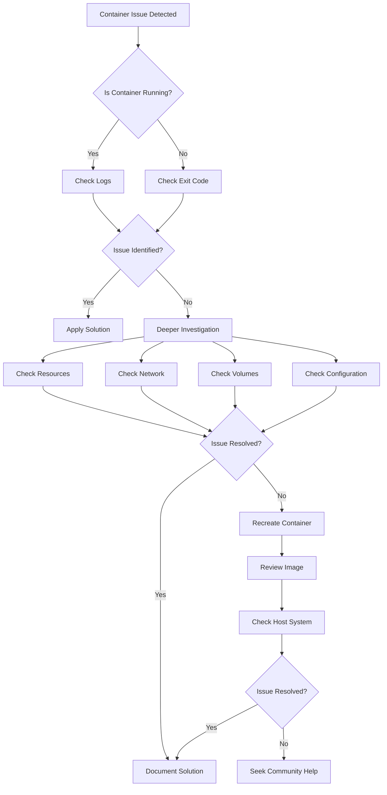

# Docker Troubleshooting

## Introduction

When working with Docker containers, you'll inevitably encounter issues that need troubleshooting. This guide will walk you through common Docker problems and their solutions, equipping you with the skills to diagnose and resolve container issues efficiently. Understanding how to troubleshoot Docker is essential for maintaining smooth container operations and optimizing performance.

## Understanding Docker Logs

### Viewing Container Logs

The first step in troubleshooting any Docker issue is examining the logs:

```bash
# Basic log viewing
docker logs container_name_or_id

# Follow logs in real-time
docker logs -f container_name_or_id

# Show last 50 lines
docker logs --tail 50 container_name_or_id

# Include timestamps
docker logs -t container_name_or_id
```

#### Example:

```bash
$ docker logs mysql-db
2023-10-15T14:22:03.452Z [Note] [Entrypoint]: Entrypoint script for MySQL Server started.
2023-10-15T14:22:03.678Z [Note] [Entrypoint]: Switching to dedicated user 'mysql'
2023-10-15T14:22:03.683Z [Note] [Entrypoint]: Entrypoint script for MySQL Server started.
2023-10-15T14:22:04.012Z [ERROR] [Entrypoint]: Database initialization failed
```

### Understanding Docker Events

Docker events provide a timeline of what's happening with your containers:

```bash
# View real-time events
docker events

# Filter events by type
docker events --filter 'type=container'
```

## Common Docker Issues and Solutions

### 1. Container Won't Start

When a container fails to start, follow these troubleshooting steps:

```bash
# Check container status
docker ps -a
```

#### Possible Issues and Solutions:

1. **Port Conflicts**

```bash
# Error example
$ docker run -p 8080:80 nginx
docker: Error response from daemon: driver failed programming external connectivity: Bind for 0.0.0.0:8080 failed: port is already allocated.
```

**Solution**: Change the host port or find and stop the process using the port:

```bash
# Find process using port 8080
$ sudo lsof -i :8080

# Change to another port
$ docker run -p 8081:80 nginx
```

2. **Incorrect Image Name**

```bash
$ docker run nonexistent-image
Error: No such image: nonexistent-image
```

**Solution**: Verify the image name and pull it if necessary:

```bash
$ docker pull nginx
$ docker run nginx
```

3. **Exit Codes**

```bash
$ docker ps -a
CONTAINER ID   IMAGE    COMMAND   STATUS                     NAMES
7d8a74e68f3d   ubuntu   "bash"    Exited (127) 2 hours ago   quirky_wing
```

Common exit codes:
- Exit 0: Normal exit
- Exit 1: Application error
- Exit 125: Docker daemon error
- Exit 126: Command cannot be invoked
- Exit 127: Command not found

**Solution**: Inspect logs and check the application within the container:

```bash
$ docker logs 7d8a74e68f3d
```

### 2. Container Resource Issues

#### Checking Resource Usage

```bash
# View container resource consumption
$ docker stats

# Example output
CONTAINER ID   NAME            CPU %     MEM USAGE / LIMIT     MEM %     NET I/O           BLOCK I/O         PIDS
7d8a74e68f3d   nginx-app       0.14%     21.52MiB / 7.673GiB   0.27%     648B / 648B       0B / 4.1kB        2
```

#### Memory Issues

If a container is running out of memory:

```bash
# Set memory limits
$ docker run -d --name memory-limited --memory="512m" nginx
```

#### CPU Limits

To prevent CPU starvation:

```bash
# Limit container to use at most 2 CPUs
$ docker run -d --name cpu-limited --cpus="2" nginx
```

### 3. Networking Issues

#### Container Cannot Connect to Network

1. Check network configuration:

```bash
# List networks
$ docker network ls

# Inspect network
$ docker network inspect bridge
```

2. Test connectivity from inside the container:

```bash
$ docker exec -it container_name ping google.com
```

#### DNS Issues

If containers can't resolve hostnames:

```bash
# Check DNS configuration
$ docker exec -it container_name cat /etc/resolv.conf

# Set custom DNS
$ docker run --dns 8.8.8.8 nginx
```

### 4. Volume and Data Persistence Issues

#### Data Not Persisting

If your data disappears when a container is removed:

```bash
# Create a volume
$ docker volume create my_data

# Use the volume
$ docker run -d --name db -v my_data:/var/lib/mysql mysql:5.7
```

#### Permission Issues

When containers can't access mounted volumes:

```bash
# Fix permissions in the container
$ docker exec -it container_name chown -R user:group /path/in/container
```

## Debugging Tools and Techniques

### 1. Interactive Debugging

Start a shell in a running container:

```bash
$ docker exec -it container_name /bin/bash

# For containers without bash
$ docker exec -it container_name /bin/sh
```

### 2. Inspecting Container Configuration

View detailed container information:

```bash
$ docker inspect container_name
```

For specific information:

```bash
$ docker inspect --format '{{.NetworkSettings.IPAddress}}' container_name
```

### 3. Docker Health Checks

Configure health checks to monitor container health:

```dockerfile
FROM nginx
HEALTHCHECK --interval=30s --timeout=3s \
  CMD curl -f http://localhost/ || exit 1
```

Check health status:

```bash
$ docker ps
CONTAINER ID   IMAGE     STATUS                    PORTS     NAMES
7d8a74e68f3d   nginx     Up 2 minutes (healthy)    80/tcp    web-server
```

## Troubleshooting Docker Compose Applications

### Common Compose Issues

1. **Service Dependency Problems**

```yaml
# docker-compose.yml example with dependencies
version: '3'
services:
  web:
    image: nginx
    depends_on:
      - db
  db:
    image: mysql:5.7
    environment:
      MYSQL_ROOT_PASSWORD: example
```

2. **Environment Variable Issues**

Check if environment variables are properly set:

```bash
$ docker-compose config
```

3. **Recreating Containers**

Force recreation of containers if needed:

```bash
$ docker-compose up -d --force-recreate
```

## Advanced Troubleshooting Techniques

### 1. Docker Daemon Logs

When Docker itself is having issues:

```bash
# For systemd-based systems
$ sudo journalctl -u docker.service

# For non-systemd systems
$ sudo cat /var/log/docker.log
```

### 2. Container Performance Analysis

Use `docker stats` for real-time monitoring:

```bash
$ docker stats
```

Use system tools inside the container:

```bash
$ docker exec -it container_name top
$ docker exec -it container_name free -m
```

### 3. Image Layer Analysis

Understand how your image is built:

```bash
$ docker history image_name
```

### 4. Network Packet Capture

Capture network traffic for deeper analysis:

```bash
$ docker run --net=container:target_container nicolaka/netshoot tcpdump -i eth0
```

## Common Docker Desktop Issues

### Windows Specific Issues

1. **WSL2 Integration Problems**

If Docker Desktop has WSL2 integration issues:

```bash
# Restart WSL
$ wsl --shutdown
$ docker start
```

2. **Windows Defender Interference**

Add exclusions for Docker directories in Windows Defender.

### Mac Specific Issues

1. **Disk Space Issues**

Clear Docker disk image:

```bash
# From Docker Desktop: Preferences > Resources > Disk image size
# Or manually reset from terminal
$ rm ~/Library/Containers/com.docker.docker/Data/vms/0/data/Docker.raw
```

2. **Performance Problems**

Adjust resource allocation in Docker Desktop preferences.

## Visualizing Docker Troubleshooting Workflow



## Summary

Docker troubleshooting requires a systematic approach, starting with container logs and status, then investigating specific subsystems like networking, storage, and resources. Remember these key points:

- Always check logs first with `docker logs`
- Understand container resource usage with `docker stats`
- Use `docker exec` to investigate from inside the container
- Inspect container configuration with `docker inspect`
- Use health checks to proactively monitor containers
- For complex applications, use Docker Compose's troubleshooting tools

By following these techniques, you'll be able to diagnose and resolve most Docker issues efficiently, ensuring smooth container operations.

## Additional Resources

- [Docker Documentation](https://docs.docker.com/)
- [Docker GitHub Issues](https://github.com/docker/docker/issues)
- [Stack Overflow Docker Tag](https://stackoverflow.com/questions/tagged/docker)

## Practice Exercises

1. Intentionally create a port conflict and resolve it using the techniques learned.
2. Set up a container with limited memory, then monitor it using `docker stats`.
3. Create a container with a volume, then verify data persistence after container removal.
4. Configure a custom health check for a web application container.
5. Use `docker inspect` to extract specific configuration details from a running container.