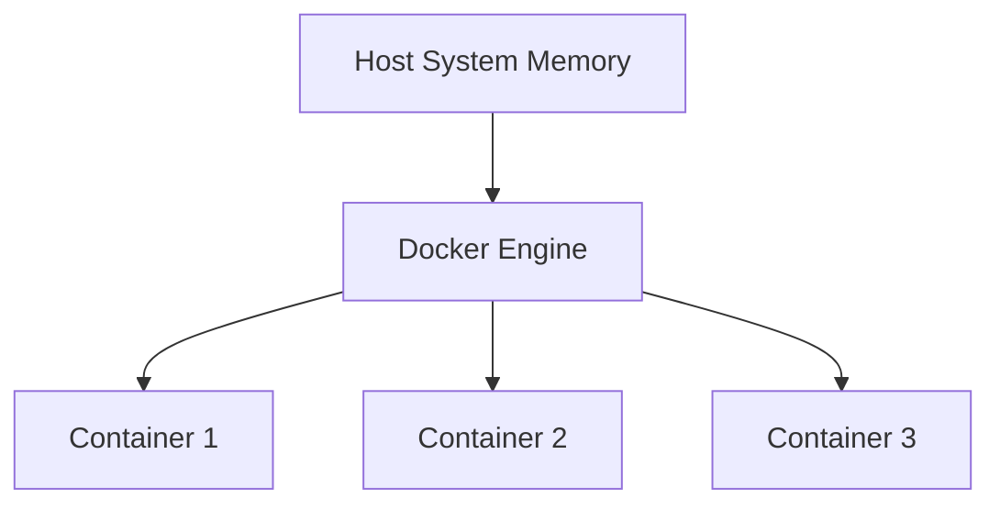

# Docker Memory Management

## Introduction

Memory management is a critical aspect of Docker container performance. When running applications in containers, understanding how Docker allocates, limits, and handles memory can help you avoid common pitfalls like container crashes due to out-of-memory errors or performance degradation due to memory constraints.

This guide will walk you through Docker's memory management mechanisms, how to configure memory limits for your containers, and best practices to optimize memory usage in your containerized applications.

## Understanding Docker Memory Management

Docker containers share the host system's kernel but have their own isolated user space. Memory management in Docker involves:

1. **Memory Allocation**: How Docker assigns memory to containers
2. **Memory Limits**: Setting constraints on container memory usage
3. **Memory Swapping**: Managing virtual memory when physical memory is exhausted
4. **Memory Reservation**: Guaranteeing minimum available memory
5. **Out-of-Memory (OOM) Handling**: How Docker responds when memory limits are exceeded

Let's explore each of these concepts in detail.

## Docker Memory Architecture

Docker uses control groups (cgroups) provided by the Linux kernel to manage and limit memory resources. When you run a container, Docker creates a cgroup for it, which allows the system to track and optionally limit the resources used by the container.



By default, a container has no memory constraints, meaning it can use as much memory as the host's kernel scheduler allows. This can lead to one container consuming all available memory, potentially causing issues for other containers or the host system itself.

## Setting Memory Limits

Docker provides several flags to control memory usage of containers:

- `--memory` or `-m`: Sets the maximum amount of memory the container can use
- `--memory-swap`: Sets the total amount of memory + swap the container can use
- `--memory-reservation`: Sets soft limit (a reservation)
- `--memory-swappiness`: Configures container memory swappiness behavior
- `--oom-kill-disable`: Disables OOM Killer for the container

Let's look at examples of how to use these flags:

### Basic Memory Limit

To limit a container to use a maximum of 1GB of memory:

```bash
docker run -d --name memory-test --memory="1g" nginx
```

You can verify this limit by checking the cgroup settings:

```bash
docker exec memory-test cat /sys/fs/cgroup/memory/memory.limit_in_bytes
```

Output:
```
1073741824
```

The output is in bytes, and 1073741824 bytes equals 1GB.

### Memory + Swap Limit

To set both memory and swap limits:

```bash
docker run -d --name memory-swap-test --memory="1g" --memory-swap="1.5g" nginx
```

This allows the container to use 1GB of memory and an additional 500MB of swap.

### Memory Reservation

Memory reservation provides a soft limit:

```bash
docker run -d --name memory-reservation-test --memory="1g" --memory-reservation="750m" nginx
```

This container can use up to 1GB, but Docker will try to keep it at or below 750MB if the host is under memory pressure.

## Monitoring Container Memory Usage

You can monitor memory usage using the `docker stats` command:

```bash
docker stats
```

Output:
```
CONTAINER ID   NAME                    CPU %     MEM USAGE / LIMIT     MEM %     NET I/O       BLOCK I/O     PIDS
3a2fb5f29e7d   memory-test             0.00%     2.1MiB / 1GiB         0.21%     656B / 0B     0B / 0B       2
7d8ac5c9e5a2   memory-swap-test        0.00%     2.1MiB / 1GiB         0.21%     656B / 0B     0B / 0B       2
58c0e775c1d0   memory-reservation-test 0.00%     2.1MiB / 1GiB         0.21%     656B / 0B     0B / 0B       2
```

For more detailed information, you can use:

```bash
docker inspect memory-test | grep -i mem
```

## Understanding OOM (Out of Memory) Killer

When a container tries to use more memory than its limit, the Linux kernel's OOM killer gets triggered. By default, it will kill processes in the container to free up memory.

You can see this in action with a simple test:

```bash
docker run --rm --name memory-hog --memory="100m" progrium/stress --vm 1 --vm-bytes 200M
```

This command creates a container with a 100MB memory limit and runs a stress test trying to allocate 200MB. The container will likely be killed by the OOM killer.

You can verify this by checking Docker logs:

```bash
docker logs memory-hog
```

Or the system logs:

```bash
dmesg | grep -i "out of memory"
```

### Disabling OOM Killer

In some cases, you might want to disable the OOM killer for critical containers:

```bash
docker run -d --name critical-service --memory="1g" --oom-kill-disable nginx
```

⚠️ **Warning**: Use this flag with caution! If the container uses more memory than available, the host system might become unstable.

## Memory Optimization Best Practices

Here are some best practices for optimizing Docker container memory usage:

### 1. Right-size Your Memory Limits

Monitor your application's memory usage patterns and set appropriate limits:

```bash
# Run without explicit memory limits first to observe usage
docker run -d --name app-profiling nginx
docker stats app-profiling --no-stream

# Then set appropriate limits based on observations plus some buffer
docker run -d --name production-app --memory="512m" --memory-reservation="400m" nginx
```

### 2. Use Memory Reservation

Memory reservation helps Docker schedule containers efficiently:

```bash
docker run -d --memory-reservation="300m" nginx
```

### 3. Be Careful with Java Applications

Java applications need special consideration because the JVM doesn't always respect container memory limits:

```bash
# For Java 8u131+ and Java 9+
docker run -d --name java-app --memory="1g" \
  -e JAVA_OPTS="-XX:+UnlockExperimentalVMOptions -XX:+UseCGroupMemoryLimitForHeap" \
  java-application
```

For Java 10 and later:

```bash
docker run -d --name java-app --memory="1g" \
  -e JAVA_OPTS="-XX:+UseContainerSupport" \
  java-application
```

### 4. Consider Memory Swappiness

Control how aggressively the container will swap memory:

```bash
# Discourage swapping (0 = disable swapping if possible)
docker run -d --memory="1g" --memory-swappiness=0 nginx

# Allow liberal swapping (100 = maximum swappiness)
docker run -d --memory="1g" --memory-swappiness=100 nginx
```

### 5. Use Docker Compose for Complex Setups

For applications with multiple containers, use Docker Compose to manage memory limits consistently:

```yaml
version: '3'
services:
  webapp:
    image: nginx
    deploy:
      resources:
        limits:
          memory: 512M
        reservations:
          memory: 256M
  
  database:
    image: postgres
    deploy:
      resources:
        limits:
          memory: 1G
        reservations:
          memory: 750M
```

Save this as `docker-compose.yml` and run:

```bash
docker-compose up -d
```

## Common Memory Issues and Solutions

### Issue 1: Container Gets Killed Without Warning

**Symptoms**: Container stops unexpectedly, logs show OOM killer activation

**Solution**:
1. Increase memory limit
2. Optimize application memory usage
3. Check for memory leaks

```bash
# Increase memory and enable detailed OOM messages
docker run -d --name debug-container --memory="2g" \
  -e MALLOC_ARENA_MAX=2 \
  your-application
```

### Issue 2: Application Performance Degrades Over Time

**Symptoms**: Application becomes slower as it runs longer

**Solution**:
1. Monitor memory usage patterns
2. Implement appropriate garbage collection
3. Consider implementing restart policies

```bash
# Set restart policy to restart on memory issues
docker run -d --name auto-heal --restart=on-failure \
  --memory="1g" your-application
```

### Issue 3: Excessive Swap Usage

**Symptoms**: Application performance is inconsistent, high swap usage observed

**Solution**:
1. Adjust memory-swappiness
2. Increase physical memory allocation
3. Consider disabling swap for performance-critical applications

```bash
# Reduce swap usage for performance-sensitive container
docker run -d --name performance-app --memory="1g" \
  --memory-swappiness=10 your-application
```

## Real-World Examples

### Example 1: Web Server with Database

A typical web application setup with proper memory management:

```bash
# Database container with appropriate memory limits
docker run -d --name mysql-db \
  --memory="1g" \
  --memory-reservation="800m" \
  -e MYSQL_ROOT_PASSWORD=secret \
  mysql:8.0

# Web server with memory limits
docker run -d --name web-server \
  --memory="512m" \
  --memory-reservation="256m" \
  --link mysql-db:db \
  nginx
```

### Example 2: Memory-Intensive Data Processing

For applications that process large datasets:

```bash
docker run -d --name data-processor \
  --memory="4g" \
  --memory-reservation="2g" \
  --memory-swap="8g" \
  data-processing-image
```

### Example 3: Microservices Architecture

In a microservices setup, each service should have appropriate memory limits:

```yaml
version: '3'
services:
  auth-service:
    image: auth-service
    deploy:
      resources:
        limits:
          memory: 256M
        reservations:
          memory: 128M
  
  product-service:
    image: product-service
    deploy:
      resources:
        limits:
          memory: 512M
        reservations:
          memory: 256M
  
  order-service:
    image: order-service
    deploy:
      resources:
        limits:
          memory: 768M
        reservations:
          memory: 384M
```

## Advanced Memory Management

### Using cgroup v2

Docker now supports cgroup v2, which provides improved memory accounting:

```bash
# Check if your system uses cgroup v2
docker info | grep -i cgroup

# Using memory.high instead of hard limits
docker run --cgroupns=host \
  --cgroup-parent=docker-memory.slice \
  --memory-high=1g \
  nginx
```

### Memory Profiling with Tools

For in-depth memory analysis, you can use tools like `pmap` inside the container:

```bash
docker run -d --name memory-analysis nginx
docker exec -it memory-analysis bash -c "apt-get update && apt-get install -y procps && pmap -x 1"
```

Output would show memory allocation for the main process:

```
Address           Kbytes     RSS   Dirty Mode  Mapping
0000000000400000     304     304       0 r-x-- nginx
0000000000609000      16      16      16 r---- nginx
...
```

## Summary

Docker memory management is essential for running stable, efficient containerized applications. By understanding the various memory-related flags, monitoring options, and optimization techniques, you can:

1. Prevent OOM kills and application crashes
2. Optimize resource usage on your host system
3. Ensure applications run efficiently with appropriate memory allocation
4. Implement proper resource isolation between containers

As you continue working with Docker, regularly monitor memory usage patterns and adjust your configuration as needed. Container memory requirements may change as your application evolves, so periodic review of memory settings is recommended.

## Additional Resources

- Docker's official documentation on [container resource constraints](https://docs.docker.com/config/containers/resource_constraints/)
- Tools for monitoring Docker memory usage: cAdvisor, Prometheus, Grafana
- `docker stats` command for real-time resource usage monitoring

## Exercises

1. Create a container with 256MB memory limit and monitor its memory usage while running a simple web application.
2. Experiment with different memory-swappiness values and observe the impact on performance.
3. Write a simple bash script that monitors container memory usage and sends an alert when it exceeds 80% of the limit.
4. Compare memory usage patterns between a container running a Node.js application and one running a Java application with the same workload.
5. Configure a multi-container application using Docker Compose with appropriate memory limits for each service.