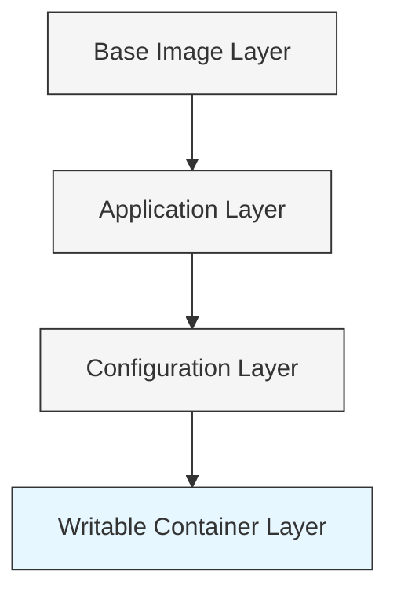

# Docker Storage Performance

## Introduction

When working with Docker containers, storage performance can significantly impact your application's speed and efficiency. Docker uses a layered filesystem approach and different storage drivers that each have unique performance characteristics. Understanding how Docker manages storage and knowing the techniques to optimize it are crucial skills for Docker users.

In this guide, we'll explore Docker's storage mechanisms, compare different storage drivers, and provide practical techniques to measure and improve storage performance for your containerized applications.

## Docker Storage Basics

Before diving into performance optimization, let's understand how Docker handles storage.

### Layered Filesystem

Docker uses a layered filesystem where each image consists of multiple read-only layers, with a thin writable layer on top for running containers.



### Storage Drivers

Docker uses storage drivers to manage the layered filesystem. Each driver implements the layer management differently, which affects performance:

- **overlay2**: The default and recommended driver
- **devicemapper**: Uses device mapper thin provisioning
- **btrfs**: Uses the Btrfs filesystem
- **zfs**: Uses the ZFS filesystem
- **aufs**: An older driver, now less commonly used
- **vfs**: Simple but inefficient driver, useful in testing

You can check your current storage driver with:

```bash
docker info | grep "Storage Driver"
```

Example output:
```
Storage Driver: overlay2
```

## Storage Performance Factors

Several factors influence Docker storage performance:

1. **Storage driver selection**
2. **Volume mount type**
3. **Host filesystem type**
4. **Container write patterns**
5. **Image size and layer count**

Let's examine each of these factors in detail.

## Comparing Storage Driver Performance

Different storage drivers have different performance characteristics:

### overlay2

The `overlay2` driver is generally the fastest for most workloads and is now the default in Docker.

**Pros**:
- Excellent read/write performance
- Good balance between features and speed
- Lower memory usage

**Cons**:
- Performance can degrade with many layers
- Some overhead for heavy write workloads

### devicemapper

Used commonly in older Linux distributions:

**Pros**:
- Better isolation than some other drivers
- Good for write-heavy workloads with proper configuration

**Cons**:
- Slower than overlay2 in most cases
- "loop-lvm" mode (default) is very slow; "direct-lvm" required for production

### btrfs and zfs

These filesystem-based drivers offer advanced features:

**Pros**:
- Built-in snapshot capabilities
- Better handling of large files
- Compression capabilities

**Cons**:
- Higher CPU usage
- More complex setup
- Requires specific host filesystem

## Performance Testing for Docker Storage

Let's measure Docker storage performance with some simple tests:

### Basic I/O Benchmark

You can use tools like `dd` to benchmark write performance:

```bash
docker run --rm alpine sh -c "time dd if=/dev/zero of=test bs=1M count=1000 && rm test"
```

Example output:
```
1000+0 records in
1000+0 records out
1048576000 bytes (1.0 GB, 1000 MiB) copied, 0.534 s, 1.97 GB/s

real    0m 0.59s
user    0m 0.00s
sys     0m 0.41s
```

### Using fio for Advanced Testing

For more comprehensive testing, use `fio` (Flexible I/O Tester):

```bash
docker run --rm centos:7 bash -c "yum install -y fio && fio --name=test --filename=/tmp/test --size=1G --bs=4k --direct=1 --rw=randwrite --ioengine=libaio --iodepth=256 --runtime=30 --numjobs=4 --time_based --group_reporting --end_fsync=1"
```

This command will output detailed metrics about IOPS, throughput, and latency.

## Volume Types and Performance

Docker offers different ways to mount data:

### Bind Mounts

Mounting a host directory to a container:

```bash
docker run -v /host/path:/container/path nginx
```

**Performance**: Fast but may cause permission issues.

### Named Volumes

Using Docker-managed volumes:

```bash
docker volume create my_volume
docker run -v my_volume:/container/path nginx
```

**Performance**: Good performance with the benefits of Docker management.

### tmpfs Mounts

In-memory filesystem for temporary data:

```bash
docker run --tmpfs /container/temp:rw,noexec,nosuid,size=100m nginx
```

**Performance**: Very fast but data is lost when container stops.

## Performance Comparison

Let's compare the performance of different mount types with a simple test:

```bash
# Create test volume
docker volume create test_volume

# Test bind mount performance
docker run --rm -v $(pwd)/test:/test ubuntu bash -c "time dd if=/dev/zero of=/test/file bs=1M count=1000 && rm /test/file"

# Test volume performance
docker run --rm -v test_volume:/test ubuntu bash -c "time dd if=/dev/zero of=/test/file bs=1M count=1000"

# Test container filesystem performance
docker run --rm ubuntu bash -c "time dd if=/dev/zero of=/file bs=1M count=1000 && rm /file"

# Test tmpfs performance
docker run --rm --tmpfs /test:rw,size=1G ubuntu bash -c "time dd if=/dev/zero of=/test/file bs=1M count=1000"
```

Typical results show that tmpfs is fastest, followed by bind mounts, named volumes, and container filesystem (which depends on the storage driver).

## Optimization Tips

### 1. Choose the Right Storage Driver

For most workloads, use `overlay2`:

```bash
# In /etc/docker/daemon.json:
{
  "storage-driver": "overlay2",
  "storage-opts": ["overlay2.override_kernel_check=true"]
}
```

### 2. Use tmpfs for Temporary Data

For ephemeral data like caches or temporary files:

```bash
docker run --tmpfs /tmp:rw,noexec,nosuid,size=100m my_app
```

### 3. Use Volumes for Database Workloads

For databases and other I/O intensive applications:

```bash
docker volume create --driver local \
  --opt type=ext4 \
  --opt device=/dev/sdb \
  my_db_volume

docker run -v my_db_volume:/var/lib/mysql mysql
```

### 4. Reduce Image Layers

In your Dockerfile, combine commands to reduce layers:

```dockerfile
# Less efficient with multiple layers
FROM ubuntu
RUN apt-get update
RUN apt-get install -y package1
RUN apt-get install -y package2

# More efficient with fewer layers
FROM ubuntu
RUN apt-get update && apt-get install -y \
    package1 \
    package2
```

### 5. Implement Multi-stage Builds

Multi-stage builds create smaller images with fewer layers:

```dockerfile
# Build stage
FROM node:14 AS build
WORKDIR /app
COPY package*.json ./
RUN npm install
COPY . .
RUN npm run build

# Production stage
FROM nginx:alpine
COPY --from=build /app/build /usr/share/nginx/html
```

### 6. Monitor I/O Performance

Use `docker stats` to monitor container I/O:

```bash
docker stats --format "table {{.Name}}\t{{.CPUPerc}}\t{{.MemUsage}}\t{{.BlockIO}}"
```

For more detailed insights, use tools like `iotop` or `atop` on the host:

```bash
sudo iotop -aPo
```

## Real-world Scenario: Optimizing a Database Container

Let's optimize a PostgreSQL container for better storage performance:

1. Create an optimized volume:

```bash
docker volume create --driver local pgdata
```

2. Run PostgreSQL with optimal settings:

```bash
docker run -d \
  --name postgres \
  -v pgdata:/var/lib/postgresql/data \
  -e POSTGRES_PASSWORD=mysecretpassword \
  --storage-opt size=10G \
  postgres:13
```

3. Configure the database for the storage type:

```bash
docker exec -it postgres bash

# In the container
cat >> /var/lib/postgresql/data/postgresql.conf << EOF
# Storage optimization
wal_buffers = 16MB
checkpoint_timeout = 15min
max_wal_size = 2GB
min_wal_size = 1GB
random_page_cost = 1.1  # For SSD storage
EOF

# Restart PostgreSQL
exit
docker restart postgres
```

## Summary

Docker storage performance depends on several factors, including storage drivers, volume types, and configuration. Key takeaways:

- Use `overlay2` for most workloads
- Choose the appropriate volume type for your application needs
- Use tmpfs for temporary data
- Reduce image layers for better performance
- Monitor I/O to identify bottlenecks
- Tune application settings based on the underlying storage

By understanding Docker storage performance and implementing the techniques outlined in this guide, you can significantly improve the speed and efficiency of your containerized applications.

## Additional Resources

- [Docker Documentation on Storage Drivers](https://docs.docker.com/storage/storagedriver/)
- [Docker Documentation on Volumes](https://docs.docker.com/storage/volumes/)
- [Docker Storage Performance Analysis](https://docs.docker.com/config/containers/resource_constraints/)

## Exercises

1. Compare the performance of different storage drivers by running the same container workload with different drivers.
2. Benchmark the performance difference between a container using a bind mount versus a named volume.
3. Create a multi-stage build for an application and measure the performance improvement.
4. Set up a monitoring system to track I/O performance of your Docker containers over time.
5. Optimize a database container for your specific workload and measure the performance gains.