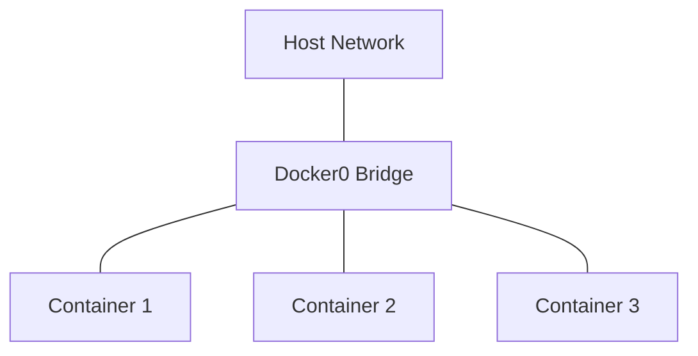
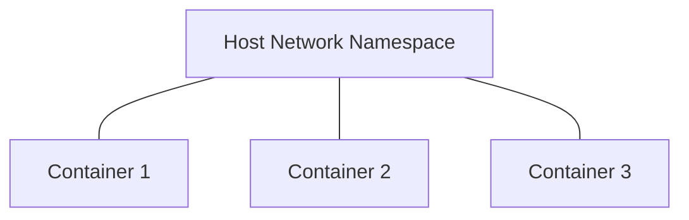
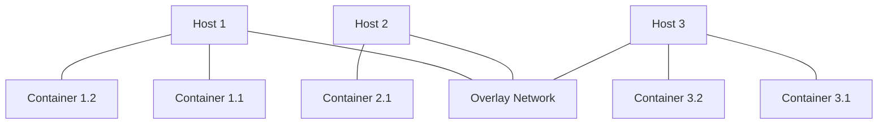
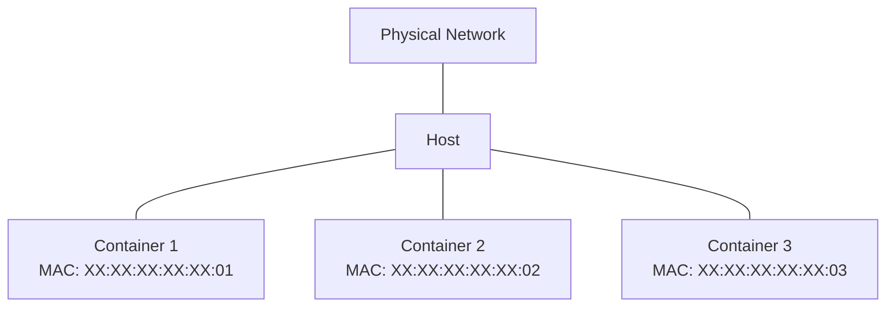

# Docker Network Performance

## Introduction

Docker has revolutionized how applications are deployed and managed, but containerization introduces unique considerations for network performance. Understanding Docker's networking options and their performance implications is crucial for optimizing containerized applications.

In this guide, we'll explore Docker's networking models, performance characteristics, measurement techniques, and optimization strategies. Whether you're running a single container or orchestrating a complex microservices architecture, these insights will help you maximize network throughput and minimize latency.

## Docker Networking Fundamentals

Before diving into performance considerations, let's review Docker's primary networking modes:

### Bridge Network

The default network mode in Docker. Containers connect to a virtual bridge (`docker0`) on the host:



### Host Network

Containers share the host's network namespace, eliminating network isolation but maximizing performance:



### Overlay Network

Enables communication between containers across multiple Docker hosts:



### Macvlan Network

Assigns MAC addresses to containers, making them appear as physical devices on the network:



## Performance Characteristics

Each networking mode exhibits different performance characteristics:

| Network Mode | Throughput | Latency | Isolation | Use Case                    |
|--------------|------------|---------|-----------|-----------------------------|
| Bridge       | Medium     | Medium  | Good      | General purpose             |
| Host         | Excellent  | Minimal | None      | Performance-critical apps   |
| Overlay      | Lower      | Higher  | Good      | Multi-host communication    |
| Macvlan      | Excellent  | Low     | Good      | Network-intensive workloads |

## Measuring Network Performance

Let's explore how to measure Docker networking performance using common tools:

### Using iperf3

`iperf3` is an excellent tool for measuring network throughput between containers:

```bash
# Install iperf3 in container 1
docker exec container1 apt update && docker exec container1 apt install -y iperf3

# Start iperf3 server in container 1
docker exec container1 iperf3 -s

# Install iperf3 in container 2
docker exec container2 apt update && docker exec container2 apt install -y iperf3

# Run iperf3 client in container 2, connecting to container 1
docker exec container2 iperf3 -c <container1_ip>
```

Sample output:
```
[ ID] Interval           Transfer     Bitrate
[  5]   0.00-10.00  sec  4.77 GBytes  4.10 Gbits/sec                  sender
[  5]   0.00-10.00  sec  4.77 GBytes  4.10 Gbits/sec                  receiver
```

### Using ping for Latency

Measure latency between containers using the `ping` command:

```bash
docker exec container1 ping -c 5 <container2_ip>
```

Sample output:
```
PING 172.17.0.3 (172.17.0.3) 56(84) bytes of data.
64 bytes from 172.17.0.3: icmp_seq=1 ttl=64 time=0.072 ms
64 bytes from 172.17.0.3: icmp_seq=2 ttl=64 time=0.067 ms
64 bytes from 172.17.0.3: icmp_seq=3 ttl=64 time=0.066 ms
64 bytes from 172.17.0.3: icmp_seq=4 ttl=64 time=0.065 ms
64 bytes from 172.17.0.3: icmp_seq=5 ttl=64 time=0.065 ms

--- 172.17.0.3 ping statistics ---
5 packets transmitted, 5 received, 0% packet loss, time 4097ms
rtt min/avg/max/mdev = 0.065/0.067/0.072/0.002 ms
```

## Benchmarking Different Network Modes

Let's create a simple benchmarking example to compare the performance of different network modes:

```bash
#!/bin/bash
# save as docker-network-benchmark.sh

echo "Setting up test containers..."

# Create a bridge network
docker network create --driver bridge test-bridge

# Start server containers
docker run -d --name server-bridge --network test-bridge nginx
docker run -d --name server-host --network host nginx

# Get bridge server IP
BRIDGE_IP=$(docker inspect -f '{{range .NetworkSettings.Networks}}{{.IPAddress}}{{end}}' server-bridge)

echo "Testing bridge network performance..."
docker run --rm --network test-bridge appropriate/curl -s -o /dev/null -w "Time: %{time_total}s
" http://$BRIDGE_IP/

echo "Testing host network performance..."
docker run --rm --network host appropriate/curl -s -o /dev/null -w "Time: %{time_total}s
" http://localhost:80/

echo "Cleaning up..."
docker rm -f server-bridge server-host
docker network rm test-bridge
```

Make the script executable and run it:

```bash
chmod +x docker-network-benchmark.sh
./docker-network-benchmark.sh
```

Sample output:
```
Setting up test containers...
Testing bridge network performance...
Time: 0.012s
Testing host network performance...
Time: 0.004s
Cleaning up...
```

This demonstrates that host networking typically offers lower latency compared to bridge networking.

## Common Performance Issues and Solutions

### DNS Resolution Delays

Problem: Slow DNS resolution can impact container startup and inter-service communication.

Solution:
```bash
# Check current DNS settings
docker exec container1 cat /etc/resolv.conf

# Specify custom DNS servers
docker run --dns 8.8.8.8 --dns 8.8.4.4 -d --name container1 nginx
```

### Network Packet Loss

Problem: Packet loss between containers can severely impact performance.

Diagnosis:
```bash
# Install mtr in the container
docker exec container1 apt update && docker exec container1 apt install -y mtr

# Run mtr to check for packet loss
docker exec container1 mtr -r -c 100 <container2_ip>
```

### MTU Mismatch

Problem: Maximum Transmission Unit (MTU) mismatches can cause packet fragmentation and reduced performance.

Solution:
```bash
# Check current MTU
docker network inspect bridge | grep -i mtu

# Create a network with custom MTU
docker network create --driver bridge --opt com.docker.network.driver.mtu=1400 custom-mtu-network
```

## Optimization Strategies

### Using Host Networking for Performance-Critical Applications

For applications where network performance is critical:

```bash
docker run --network host -d --name high-performance-app your-image
```

Note: This sacrifices network isolation for performance.

### Tuning the Linux Kernel

Add these parameters to `/etc/sysctl.conf` for better performance:

```
# Increase TCP buffer limits
net.core.rmem_max = 16777216
net.core.wmem_max = 16777216

# Increase Linux autotuning TCP buffer limits
net.ipv4.tcp_rmem = 4096 87380 16777216
net.ipv4.tcp_wmem = 4096 65536 16777216

# Enable TCP fast open
net.ipv4.tcp_fastopen = 3
```

Apply changes with:
```bash
sudo sysctl -p
```

### Choosing the Right Network Driver

For single-host deployments:
- Use `host` network mode when maximum performance is required and isolation is not a concern
- Use bridge networks with performance tuning for most applications

For multi-host deployments:
- Consider Macvlan for performance-critical applications
- Use overlay networks with performance tuning for general microservices

## Practical Example: Optimizing a Web Application

Let's optimize a simple web application with Redis for better network performance:

```bash
# Create an optimized bridge network
docker network create --driver bridge \
  --opt com.docker.network.bridge.enable_icc=true \
  --opt com.docker.network.driver.mtu=9000 \
  web-tier

# Run Redis with host networking for best performance
docker run -d --name redis --network host redis

# Run web app on the optimized bridge network
docker run -d --name webapp \
  --network web-tier \
  -e REDIS_HOST=host.docker.internal \
  -p 8080:8080 \
  your-webapp-image
```

### Testing the Optimized Setup

Let's measure the performance improvement:

```bash
# Install Apache Bench
apt-get install apache2-utils

# Test the web app performance (10000 requests, 100 concurrent)
ab -n 10000 -c 100 http://localhost:8080/
```

Before optimization (sample results):
```
Requests per second: 1245.67 [#/sec] (mean)
Time per request: 80.278 [ms] (mean)
```

After optimization (sample results):
```
Requests per second: 2854.32 [#/sec] (mean)
Time per request: 35.035 [ms] (mean)
```

## Best Practices

1. **Profile Before Optimizing**: Measure performance to identify actual bottlenecks.

2. **Use Host Networking Selectively**: Apply it only to performance-critical components.

3. **Minimize Inter-Container Communication**: Design your architecture to reduce network hops.

4. **Consider Container Placement**: Place frequently communicating containers on the same Docker host.

5. **Monitor Network Performance**: Use tools like Prometheus with Node Exporter to track network metrics.

6. **Update Docker Regularly**: Newer versions often include networking performance improvements.

7. **Use Connection Pooling**: For database and service connections to reduce connection overhead.

```javascript
// Example connection pooling in Node.js
const { Pool } = require('pg');
const pool = new Pool({
  host: 'db',
  user: 'user',
  password: 'password',
  database: 'app',
  max: 20, // Maximum number of clients in the pool
  idleTimeoutMillis: 30000
});
```

## Summary

Docker networking offers flexibility but requires understanding performance trade-offs:

- Bridge networks provide good isolation with moderate performance
- Host networking offers maximum performance with no isolation
- Overlay networks enable multi-host communication with performance overhead
- Macvlan provides near-native performance with good isolation

By choosing the right network mode, tuning system parameters, and following best practices, you can significantly improve Docker networking performance for your containerized applications.

## Additional Resources

- Practice benchmarking different Docker network modes
- Try implementing connection pooling in a containerized application
- Experiment with different MTU settings and measure the impact
- Set up monitoring for network performance metrics

## Further Learning

- TCP/IP optimization for containerized environments
- Container orchestration networking (Kubernetes, Docker Swarm)
- Service mesh implementations for microservices