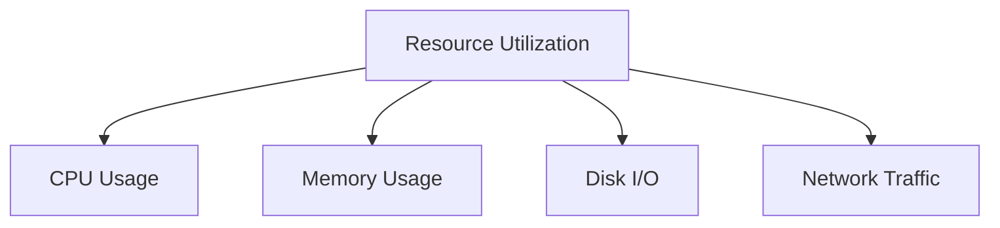

# Docker Monitoring

## Introduction

Monitoring Docker containers is an essential skill for any developer working with containerized applications. As containers are ephemeral by nature, tracking their performance, resource usage, and health becomes crucial for maintaining reliable systems. This guide will walk you through the fundamentals of Docker monitoring, introducing various tools and techniques to help you ensure your containerized applications run smoothly.

## Why Monitor Docker Containers?

Containers run in isolation, making it challenging to understand what's happening inside them without proper monitoring. Effective monitoring helps you:

- Identify performance bottlenecks
- Track resource usage (CPU, memory, network, disk I/O)
- Detect and troubleshoot issues before they impact users
- Plan for capacity and scaling
- Ensure container health and availability

## Basic Docker Monitoring Commands

Docker provides several built-in commands that offer insights into container performance. Let's explore these commands:

### Docker Stats

The `docker stats` command provides a live stream of container resource usage statistics:

```bash
docker stats
```

Output:
```
CONTAINER ID   NAME                CPU %     MEM USAGE / LIMIT     MEM %     NET I/O           BLOCK I/O         PIDS
a1b2c3d4e5f6   redis              0.07%     7.789MiB / 7.772GiB   0.10%     1.45kB / 0B       0B / 0B           5
f6e5d4c3b2a1   nginx              0.00%     3.164MiB / 7.772GiB   0.04%     3.28kB / 0B       0B / 0B           2
```

You can also monitor specific containers:

```bash
docker stats redis nginx
```

### Docker Top

The `docker top` command shows the running processes inside a container:

```bash
docker top redis
```

Output:
```
UID     PID      PPID     C     STIME     TTY     TIME        CMD
999     16234    16217    0     09:45     ?       00:00:00    redis-server *:6379
```

### Docker Inspect

The `docker inspect` command returns detailed information about container configuration:

```bash
docker inspect redis
```

This returns a JSON object with extensive configuration details. You can use filters to get specific information:

```bash
docker inspect --format='{{.State.Status}}' redis
```

Output:
```
running
```

## System-Level Monitoring

While Docker's built-in commands are useful for quick checks, comprehensive monitoring requires more robust solutions.

### cAdvisor (Container Advisor)

cAdvisor is a Google-developed tool that provides container users with resource usage and performance characteristics. It's easy to deploy as a Docker container itself:

```bash
docker run \
  --volume=/:/rootfs:ro \
  --volume=/var/run:/var/run:ro \
  --volume=/sys:/sys:ro \
  --volume=/var/lib/docker/:/var/lib/docker:ro \
  --volume=/dev/disk/:/dev/disk:ro \
  --publish=8080:8080 \
  --detach=true \
  --name=cadvisor \
  gcr.io/cadvisor/cadvisor:latest
```

After running this command, you can access cAdvisor's web interface at `http://localhost:8080` to view detailed metrics about your containers.

## Advanced Monitoring with Prometheus and Grafana

For production environments, a combination of Prometheus (for metrics collection) and Grafana (for visualization) provides a powerful monitoring solution.

### Setting Up Prometheus

First, create a `prometheus.yml` configuration file:

```yaml
global:
  scrape_interval: 15s

scrape_configs:
  - job_name: 'prometheus'
    static_configs:
      - targets: ['localhost:9090']
  
  - job_name: 'cadvisor'
    static_configs:
      - targets: ['cadvisor:8080']
```

Then run Prometheus as a container:

```bash
docker run \
  -p 9090:9090 \
  -v $(pwd)/prometheus.yml:/etc/prometheus/prometheus.yml \
  --name prometheus \
  --network monitoring-network \
  prom/prometheus
```

### Setting Up Grafana

Run Grafana as a container:

```bash
docker run \
  -p 3000:3000 \
  --name grafana \
  --network monitoring-network \
  grafana/grafana
```

After setup, access Grafana at `http://localhost:3000` (default username/password: admin/admin). 

### Creating a Docker Monitoring Dashboard

Here's how to create a basic monitoring dashboard in Grafana:

1. Add Prometheus as a data source:
   - Go to Configuration > Data Sources
   - Add Prometheus with URL `http://prometheus:9090`
   - Click "Save & Test"

2. Import a dashboard:
   - Go to "+" > Import
   - Enter dashboard ID 893 (Docker monitoring dashboard)
   - Select your Prometheus data source
   - Click "Import"

## Docker Compose Setup for Monitoring

For a complete monitoring stack, you can use Docker Compose. Here's a sample `docker-compose.yml`:

```yaml
version: '3'
services:
  prometheus:
    image: prom/prometheus
    volumes:
      - ./prometheus.yml:/etc/prometheus/prometheus.yml
    ports:
      - "9090:9090"
    restart: always

  cadvisor:
    image: gcr.io/cadvisor/cadvisor:latest
    volumes:
      - /:/rootfs:ro
      - /var/run:/var/run:ro 
      - /sys:/sys:ro
      - /var/lib/docker/:/var/lib/docker:ro
      - /dev/disk/:/dev/disk:ro
    ports:
      - "8080:8080"
    restart: always

  grafana:
    image: grafana/grafana
    depends_on:
      - prometheus
    ports:
      - "3000:3000"
    restart: always
```

Start the stack with:

```bash
docker-compose up -d
```

## Monitoring Metrics That Matter

When monitoring Docker containers, focus on these key metrics:

### 1. Resource Utilization



- **CPU Usage**: High CPU usage may indicate inefficient code or insufficient resources
- **Memory Usage**: Includes actual usage and limits
- **Disk I/O**: Critical for database containers
- **Network Traffic**: Helps identify communication issues between services

### 2. Container Health

- **Container State**: Running, stopped, or restarting
- **Restart Count**: High restart counts indicate stability issues
- **Uptime**: How long containers have been running

### 3. Application-Specific Metrics

Beyond system metrics, consider monitoring application-specific indicators:

- Request rates and response times
- Error rates
- Queue lengths
- Application-specific business metrics

## Best Practices for Docker Monitoring

1. **Set Resource Limits**: Always define memory and CPU limits for containers

```bash
docker run -d --memory=512m --cpus=0.5 nginx
```

2. **Use Health Checks**: Implement Docker health checks to automatically monitor container health

```dockerfile
HEALTHCHECK --interval=30s --timeout=3s \
  CMD curl -f http://localhost/ || exit 1
```

3. **Implement Alerting**: Configure alerts for critical metrics to get notified of issues

4. **Log Aggregation**: Combine monitoring with centralized logging for complete visibility

5. **Regular Auditing**: Periodically review your monitoring setup to ensure it captures all necessary metrics

## Troubleshooting Common Issues

### High CPU Usage

If containers show consistently high CPU usage:

1. Check for inefficient code or infinite loops
2. Consider increasing CPU allocation
3. Look for potential memory leaks causing CPU thrashing

```bash
# Increase CPU allocation
docker update --cpus=1 container_name
```

### Memory Leaks

If a container's memory usage grows continuously:

1. Check the application for memory leaks
2. Verify proper garbage collection is occurring
3. Consider implementing auto-restart policies for temporary mitigation

```bash
# Set memory limit and restart policy
docker run -d --memory=1g --restart=always nginx
```

### Container Crashes

For frequently crashing containers:

1. Check container logs:
   ```bash
   docker logs container_name
   ```
2. Look for exit codes:
   ```bash
   docker inspect container_name --format='{{.State.ExitCode}}'
   ```
3. Implement a restart policy:
   ```bash
   docker run -d --restart=on-failure:5 nginx
   ```

## Summary

Docker monitoring is essential for maintaining reliable containerized applications. We've covered:

- Basic Docker monitoring commands for quick insights
- System-level monitoring with cAdvisor
- Advanced monitoring solutions with Prometheus and Grafana
- Key metrics to monitor for container health
- Best practices and troubleshooting techniques

By implementing proper monitoring, you can ensure your Docker containers run efficiently and reliably, preventing issues before they impact your users.

## Additional Resources

- [Docker Documentation on Resource Constraints](https://docs.docker.com/config/containers/resource_constraints/)
- [Prometheus Documentation](https://prometheus.io/docs/introduction/overview/)
- [Grafana Dashboards](https://grafana.com/grafana/dashboards/)

## Exercises

1. Set up a basic monitoring stack with cAdvisor, Prometheus, and Grafana using Docker Compose.
2. Create a custom dashboard in Grafana to monitor specific metrics for your application.
3. Implement health checks for a container and observe how it affects monitoring results.
4. Deliberately create a resource-intensive container and practice identifying and resolving the issue using monitoring tools.
5. Configure alerts in Prometheus for critical thresholds and test the alerting system.