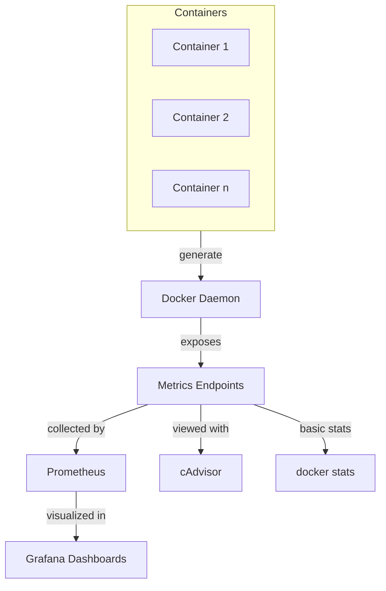

# Docker Metrics

## Introduction

When running applications in Docker containers, monitoring performance is crucial for maintaining optimal system health and user experience. Docker metrics provide insights into resource usage, bottlenecks, and overall system performance. This guide will introduce you to the essential metrics for monitoring Docker containers and show you how to collect, visualize, and analyze them.

## Why Monitor Docker Metrics?

Containers are designed to be lightweight and ephemeral, but they still consume system resources. Without proper monitoring:

- Performance issues can go undetected
- Resource constraints might limit application functionality
- Scaling decisions become guesswork rather than data-driven
- Troubleshooting becomes more difficult and time-consuming

## Key Docker Metrics to Monitor

Let's explore the most important metrics categories for Docker environments:

### 1. CPU Metrics

CPU metrics help you understand processor utilization by your containers.

- **CPU Usage**: The percentage of CPU resources being used by a container
- **CPU Throttling**: Instances when a container wanted to use more CPU but was restricted
- **CPU Shares**: The relative weight assigned to containers when distributing CPU resources

Example of checking CPU usage for a container:

```bash
docker stats --format "table {{.Name}}\t{{.CPUPerc}}\t{{.MemUsage}}"
```

Output:
```
NAME                CPU %     MEM USAGE / LIMIT
webapp              15.25%    221.1MiB / 1.952GiB
database            6.78%     541.8MiB / 1.952GiB
```

### 2. Memory Metrics

Memory metrics track RAM usage and help prevent out-of-memory issues.

- **Memory Usage**: Current memory consumption
- **Memory Limit**: Maximum memory allocated to a container
- **Memory Failures**: Failed memory allocations due to limits
- **Cache Usage**: Memory used for caching data

To check memory usage for all running containers:

```bash
docker stats --no-stream --format "table {{.Name}}\t{{.MemUsage}}\t{{.MemPerc}}"
```

### 3. Disk I/O Metrics

Disk metrics show how containers interact with storage.

- **Read/Write Operations**: Number of read or write operations
- **Bytes Read/Written**: Amount of data read from or written to disk
- **Block I/O**: Block device I/O operations and their sizes
- **Storage Driver Metrics**: Performance of the storage driver

Example of checking disk I/O for a specific container:

```bash
docker stats --no-stream --format "table {{.Name}}\t{{.BlockIO}}" my_container
```

### 4. Network Metrics

Network metrics provide insights into container communication.

- **Network I/O**: Amount of data received and transmitted
- **Network Packets**: Count of packets in and out
- **Network Errors**: Failed network operations
- **Connection Count**: Number of active network connections

To view network I/O for containers:

```bash
docker stats --no-stream --format "table {{.Name}}\t{{.NetIO}}"
```

### 5. Container Metrics

These metrics relate specifically to the containers themselves.

- **Running Containers**: Number of active containers
- **Container States**: How many containers are running, stopped, paused
- **Container Lifecycle Events**: Starts, stops, crashes, and restarts
- **Image Pulls**: Frequency and timing of image pulls

To count containers by their status:

```bash
docker container ls -a --format "{{.Status}}" | sort | uniq -c
```

Output:
```
     15 Created
      3 Exited (0) 2 days ago
      7 Exited (1) 12 hours ago
     10 Running
```

## Tools for Collecting Docker Metrics

Docker provides several ways to collect performance metrics:

### 1. Built-in Docker Commands

The simplest way to start monitoring Docker is with built-in commands.

#### docker stats

The `docker stats` command provides a live stream of container resource usage:

```bash
docker stats
```

Output:
```
CONTAINER ID   NAME       CPU %     MEM USAGE / LIMIT     MEM %     NET I/O          BLOCK I/O        PIDS
a1b2c3d4e5f6   webapp     0.15%     21.48MiB / 1.952GiB   1.07%     648B / 648B      0B / 0B          4
f6e5d4c3b2a1   database   0.36%     156.3MiB / 1.952GiB   7.82%     2.35kB / 1.25kB  8.19MB / 0B      27
```

You can customize the output with format strings:

```bash
docker stats --format "table {{.Name}}\t{{.CPUPerc}}\t{{.MemUsage}}\t{{.NetIO}}"
```

#### docker events

Monitor Docker events in real-time:

```bash
docker events
```

This command will show container lifecycle events as they occur:

```
2023-06-10T15:20:30.123456789Z container create 9a8b7c6d5e4f3a2b1c0d image=nginx:latest name=webserver
2023-06-10T15:20:31.234567890Z container start 9a8b7c6d5e4f3a2b1c0d image=nginx:latest name=webserver
```

### 2. cAdvisor

Google's Container Advisor (cAdvisor) is a dedicated tool for container monitoring.

To run cAdvisor in a Docker container:

```bash
docker run \
  --volume=/:/rootfs:ro \
  --volume=/var/run:/var/run:ro \
  --volume=/sys:/sys:ro \
  --volume=/var/lib/docker/:/var/lib/docker:ro \
  --publish=8080:8080 \
  --detach=true \
  --name=cadvisor \
  google/cadvisor:latest
```

Then access the dashboard at `http://localhost:8080`.

### 3. Prometheus and Grafana

For production environments, Prometheus and Grafana provide robust monitoring solutions.

First, enable the Docker metrics endpoint in `/etc/docker/daemon.json`:

```json
{
  "metrics-addr" : "127.0.0.1:9323",
  "experimental" : true
}
```

Configure Prometheus to scrape these metrics:

```yaml
scrape_configs:
  - job_name: 'docker'
    static_configs:
      - targets: ['localhost:9323']
```

Then visualize with Grafana for beautiful dashboards.

## Practical Examples

Let's look at some real-world examples of using Docker metrics.

### Example 1: Identifying a Memory Leak

Suppose you notice your application is slowing down over time. You can use Docker metrics to check for memory issues:

```bash
# Monitor memory usage every 5 seconds
watch -n 5 "docker stats --no-stream --format \"table {{.Name}}\t{{.MemUsage}}\t{{.MemPerc}}\""
```

If you see continuously increasing memory usage without corresponding load increases, you might have a memory leak.

### Example 2: Optimizing Container Resource Limits

To right-size your container resources, collect usage data over time:

```bash
#!/bin/bash
# Save to metrics.log every minute for an hour
for i in {1..60}; do
  echo "---- $(date) ----" >> metrics.log
  docker stats --no-stream >> metrics.log
  sleep 60
done
```

Analyze this data to set appropriate limits in your Docker Compose file:

```yaml
services:
  webapp:
    image: my-webapp
    deploy:
      resources:
        limits:
          cpus: '0.5'
          memory: 256M
        reservations:
          cpus: '0.25'
          memory: 128M
```

### Example 3: Creating a Simple Dashboard

You can create a basic monitoring dashboard using a shell script:

```bash
#!/bin/bash
# dashboard.sh
clear
while true; do
  echo "===== DOCKER CONTAINER METRICS ====="
  echo "$(date)"
  echo "-----------------------------------"
  echo "CONTAINERS RUNNING: $(docker ps -q | wc -l)"
  echo "CONTAINERS TOTAL: $(docker ps -aq | wc -l)"
  echo "-----------------------------------"
  docker stats --no-stream
  sleep 5
  clear
done
```

Make it executable and run:

```bash
chmod +x dashboard.sh
./dashboard.sh
```

## Best Practices for Docker Metrics

To get the most value from your metrics:

1. **Set resource limits** for all containers to prevent resource starvation
2. **Monitor all hosts** running Docker, not just individual containers
3. **Establish baselines** during normal operation to identify anomalies
4. **Create alerts** for critical thresholds to get notified of issues
5. **Correlate metrics** across containers to spot related problems
6. **Retain historical data** for trend analysis and capacity planning
7. **Automate responses** to common issues when possible

## Visualizing Docker Metrics Flow

Here's a diagram showing how metrics flow from Docker containers to monitoring tools:



## Summary

Docker metrics are essential for maintaining healthy containerized applications. By monitoring CPU, memory, disk, network, and container-specific metrics, you can:

- Identify performance bottlenecks
- Plan capacity requirements
- Troubleshoot issues more effectively
- Make data-driven scaling decisions
- Optimize resource allocation

Start with built-in tools like `docker stats` for basic monitoring, then progress to more sophisticated solutions like cAdvisor, Prometheus, and Grafana as your containerized environment grows.

## Additional Resources

- Docker documentation on [metrics collection](https://docs.docker.com/config/daemon/prometheus/)
- Prometheus [documentation](https://prometheus.io/docs/introduction/overview/)
- Grafana [dashboards for Docker](https://grafana.com/grafana/dashboards/)

## Exercises

1. Use `docker stats` to monitor the resource usage of a container running a web server under load.
2. Set up cAdvisor and explore the metrics it provides beyond what `docker stats` shows.
3. Create a shell script that logs container metrics to a file when CPU usage exceeds 80%.
4. Configure resource limits for a container and observe what happens when the application tries to exceed them.
5. Set up Prometheus and Grafana to create a persistent monitoring dashboard for your Docker environment.