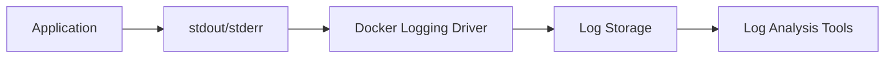

# Docker Logging

Effective logging is essential when working with Docker containers. In this guide, we'll explore Docker's logging mechanisms, configuration options, and best practices to help you troubleshoot issues and optimize container performance.

## Introduction to Docker Logging

When you run applications in containers, logs become even more critical because containers are ephemeral - they can be created and destroyed frequently. Without proper logging, debugging issues becomes extremely challenging.

Docker provides built-in logging capabilities that capture output from your containerized applications. By default, Docker captures everything written to standard output (`stdout`) and standard error (`stderr`) streams from the container.



## Basic Docker Logging Commands

### Viewing Container Logs

The most basic way to view logs is using the `docker logs` command:

```bash
docker logs [OPTIONS] CONTAINER
```

Common options include:

```bash
# Show last 10 lines of logs
docker logs --tail 10 my-container

# Follow log output (like tail -f)
docker logs -f my-container

# Show timestamps
docker logs -t my-container

# Combine options
docker logs -f -t --tail 20 my-container
```

Example output:

```
2023-09-28T14:32:45.123456789Z Server started on port 3000
2023-09-28T14:32:45.234567890Z Connected to database
2023-09-28T14:32:46.345678901Z Processing incoming request from 192.168.1.100
```

## Docker Logging Drivers

Docker uses logging drivers to manage how logs are processed and stored. The default is the `json-file` driver, but Docker supports several others for different requirements.

### Available Logging Drivers

| Driver | Description |
|--------|-------------|
| `json-file` | Default logging driver that writes logs as JSON files |
| `local` | Custom format optimized for performance and disk space |
| `syslog` | Writes to the syslog facility |
| `journald` | Writes to the systemd journal |
| `splunk` | Writes to Splunk using HTTP Event Collector |
| `awslogs` | Writes to Amazon CloudWatch Logs |
| `fluentd` | Writes to fluentd for log aggregation |
| `gelf` | Writes to Graylog Extended Log Format |

### Configuring Logging Drivers

You can set the logging driver:

1. **Per-container (at runtime)**:

```bash
docker run --log-driver=syslog --log-opt syslog-address=udp://syslog-server:514 alpine echo hello world
```

2. **In docker-compose.yml**:

```yaml
version: '3'
services:
  web:
    image: nginx
    logging:
      driver: "json-file"
      options:
        max-size: "10m"
        max-file: "3"
```

3. **Daemon-wide (in `/etc/docker/daemon.json`)**:

```json
{
  "log-driver": "json-file",
  "log-opts": {
    "max-size": "10m",
    "max-file": "3"
  }
}
```

## Log Rotation and Storage Management

By default, Docker logs can grow indefinitely, consuming valuable disk space. It's essential to configure log rotation:

```json
{
  "log-driver": "json-file",
  "log-opts": {
    "max-size": "10m",
    "max-file": "3",
    "compress": "true"
  }
}
```

This configuration:
- Limits each log file to 10MB
- Keeps a maximum of 3 log files
- Compresses rotated log files

## Practical Example: Setting Up Centralized Logging

Let's implement a practical example using the ELK stack (Elasticsearch, Logstash, Kibana) for centralized logging with Docker:

1. Create a `docker-compose.yml` file:

```yaml
version: '3'

services:
  elasticsearch:
    image: docker.elastic.co/elasticsearch/elasticsearch:7.15.0
    environment:
      - discovery.type=single-node
      - "ES_JAVA_OPTS=-Xms512m -Xmx512m"
    ports:
      - "9200:9200"
    volumes:
      - elasticsearch_data:/usr/share/elasticsearch/data

  logstash:
    image: docker.elastic.co/logstash/logstash:7.15.0
    volumes:
      - ./logstash/pipeline:/usr/share/logstash/pipeline
    ports:
      - "5000:5000/udp"
    depends_on:
      - elasticsearch

  kibana:
    image: docker.elastic.co/kibana/kibana:7.15.0
    ports:
      - "5601:5601"
    depends_on:
      - elasticsearch

  app:
    image: nginx
    logging:
      driver: gelf
      options:
        gelf-address: "udp://localhost:5000"
        tag: "nginx"

volumes:
  elasticsearch_data:
```

2. Create a Logstash pipeline configuration in `./logstash/pipeline/logstash.conf`:

```
input {
  gelf {
    port => 5000
  }
}

output {
  elasticsearch {
    hosts => ["elasticsearch:9200"]
    index => "docker-logs-%{+YYYY.MM.dd}"
  }
}
```

3. Start the stack:

```bash
docker-compose up -d
```

4. Access Kibana at `http://localhost:5601` to view and analyze your centralized logs.

## Advanced Logging Techniques

### Multi-line Log Handling

Docker's default logging treats each line as a separate log entry, which can break multi-line logs like stack traces. For proper multi-line handling, consider using loggers that support this feature or configure your application to output JSON logs.

Example configuration for fluentd driver to handle Java stack traces:

```json
{
  "log-driver": "fluentd",
  "log-opts": {
    "fluentd-address": "localhost:24224",
    "tag": "app.{{.Name}}",
    "fluentd-async": "true"
  }
}
```

Then in fluentd configuration:

```
<filter app.**>
  @type concat
  key log
  stream_identity_key container_id
  multiline_start_regexp /^[\w\.]+Exception/
  multiline_end_regexp /^\s*at .+/
</filter>
```

### Structured Logging

For better log analysis, use structured logging in your applications:

```javascript
// Instead of this:
console.log('User logged in: ' + username);

// Do this:
console.log(JSON.stringify({
  event: 'user_login',
  username: username,
  timestamp: new Date().toISOString(),
  ip: request.ip
}));
```

This approach makes logs much easier to parse and analyze with tools like Elasticsearch.

## Performance Considerations

Logging can impact container performance. Here are some tips to minimize this impact:

1. **Use the right logging driver**: The `local` driver is optimized for performance compared to `json-file`.

2. **Set appropriate log levels**: Only log what's necessary for production environments.

3. **Configure log rotation**: Prevent log files from growing too large.

4. **Use buffering**: Some logging drivers support buffering, which can reduce I/O overhead:

```json
{
  "log-driver": "fluentd",
  "log-opts": {
    "fluentd-address": "fluentd-host:24224",
    "fluentd-async": "true",
    "fluentd-buffer-limit": "8MB"
  }
}
```

5. **Consider disabling logging** for certain high-volume containers:

```bash
docker run --log-driver none alpine echo hello world
```

## Troubleshooting Docker Logging Issues

### Common Issues and Solutions

1. **Missing logs**:
   - Check if the container is still running: `docker ps`
   - Verify the logging driver configuration: `docker inspect --format '{{.HostConfig.LogConfig}}' container_id`

2. **Log file too large**:
   - Implement log rotation as described earlier

3. **Slow container performance due to logging**:
   - Consider using a more efficient logging driver or buffering
   - Reduce log verbosity in your application

4. **Cannot connect to logging infrastructure**:
   - Check network connectivity between Docker host and logging infrastructure
   - Verify firewall rules and port configurations

## Summary

Docker logging is a crucial aspect of container management that enables effective debugging, monitoring, and troubleshooting. In this guide, we've covered:

- Basic Docker logging commands
- Configuring different logging drivers
- Log rotation and storage management
- Setting up centralized logging
- Advanced techniques like multi-line and structured logging
- Performance considerations
- Troubleshooting common issues

Properly configured logging will help you maintain healthy Docker environments and quickly resolve issues when they occur.

## Exercises

1. Configure Docker to use the `local` logging driver with a max file size of 20MB and retention of 5 files.
2. Set up a simple fluentd logging configuration to forward container logs to a centralized server.
3. Create a sample application that uses structured logging and run it in a container.
4. Implement log rotation for an existing Docker environment and verify it works correctly.

## Additional Resources

- [Docker Logging Documentation](https://docs.docker.com/config/containers/logging/)
- [Fluentd Docker Logging Driver](https://docs.fluentd.org/container-deployment/docker-logging-driver)
- [ELK Stack Documentation](https://www.elastic.co/guide/index.html)
- [Grafana Loki - Lightweight Log Aggregation System](https://grafana.com/oss/loki/)