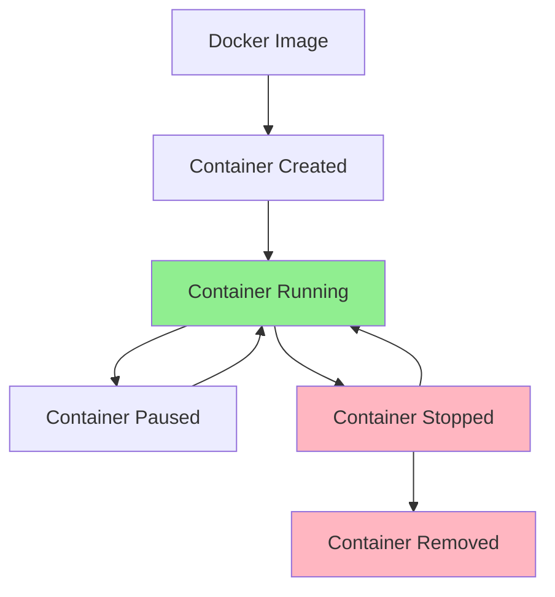

# Docker Debugging

## Introduction

Docker has revolutionized how we build, ship, and run applications by providing a consistent environment across different stages of development. However, when things go wrong in containerized applications, debugging can be challenging due to the isolated nature of containers. This guide will walk you through effective strategies and tools for debugging Docker containers, helping you quickly identify and resolve issues to maintain optimal performance.

## Understanding Docker Container Lifecycle

Before diving into debugging techniques, it's important to understand how Docker containers operate:



Debugging can occur at various stages, but most commonly when a container is running or when it unexpectedly stops.

## Essential Docker Debugging Commands

### Inspecting Container Logs

The first step in debugging any Docker container is examining its logs:

```bash
# Basic log viewing
docker logs container_name_or_id

# Follow logs in real-time
docker logs -f container_name_or_id

# Show timestamps
docker logs --timestamps container_name_or_id

# Show only the last 100 lines
docker logs --tail 100 container_name_or_id
```

**Example output:**

```
2023-05-15T14:32:18.215Z INFO  Server started on port 3000
2023-05-15T14:32:45.123Z ERROR Database connection failed: timeout
2023-05-15T14:32:50.876Z INFO  Retrying database connection...
2023-05-15T14:33:01.345Z INFO  Database connected successfully
```

### Inspecting Container Details

To get detailed information about a container:

```bash
docker inspect container_name_or_id
```

This command returns a JSON object with comprehensive information about the container, including:
- Network settings
- Mount points
- Environment variables
- Resource constraints
- Current state

For a more focused approach, use the format option to extract specific information:

```bash
# Get IP address
docker inspect --format='{{range .NetworkSettings.Networks}}{{.IPAddress}}{{end}}' container_name_or_id

# Get environment variables
docker inspect --format='{{.Config.Env}}' container_name_or_id
```

### Interactive Debugging with Shell Access

Sometimes you need to explore from inside the container:

```bash
# Access a running container with bash (if available)
docker exec -it container_name_or_id bash

# If bash is not available, try sh
docker exec -it container_name_or_id sh
```

Once inside, you can:
- Check running processes with `ps aux`
- Examine file contents
- Check network connectivity
- Verify environment variables with `env`

## Advanced Debugging Techniques

### Debugging Container Startup Issues

If your container fails to start, these approaches can help:

1. **Start with interactive mode**:

```bash
docker run -it --entrypoint sh your_image
```

This bypasses the default entry point and gives you a shell to investigate.

2. **Check for dependency issues**:

```bash
# Create a Dockerfile for debugging
FROM your_problematic_image
CMD ["sleep", "3600"]
```

Build and run this image, then exec into it to investigate without it immediately exiting.

### Monitoring Resource Usage

Performance issues often stem from resource constraints:

```bash
# View real-time container stats
docker stats container_name_or_id

# Get more detailed process information
docker top container_name_or_id
```

Example output from `docker stats`:

```
CONTAINER ID   NAME         CPU %     MEM USAGE / LIMIT     MEM %     NET I/O          BLOCK I/O        PIDS
c8f53ba47acc   web-server   0.15%     45.57MiB / 7.772GiB   0.57%     648B / 648B      0B / 0B          4
```

### Debugging Network Issues

Container network problems are common debugging scenarios:

```bash
# Check what ports are exposed
docker port container_name_or_id

# Install network tools inside container
docker exec -it container_name_or_id sh -c "apt-get update && apt-get install -y iputils-ping net-tools"

# Test connectivity from inside
docker exec -it container_name_or_id ping google.com
```

### Inspecting Docker Events

The events stream can reveal important system-wide information:

```bash
docker events
```

For targeted debugging, filter events by container:

```bash
docker events --filter container=container_name_or_id
```

## Debugging Multi-Container Applications

Docker Compose applications require additional debugging strategies:

### Viewing Logs from All Services

```bash
docker-compose logs

# Follow logs from specific service
docker-compose logs -f service_name
```

### Selective Service Startup

```bash
# Start only specific services
docker-compose up database api

# Rebuild a specific service
docker-compose up --build service_name
```

## Performance Debugging

### Identifying CPU and Memory Issues

```bash
# Create a process list showing resource usage
docker exec container_name_or_id ps -eo pid,ppid,cmd,%mem,%cpu --sort=-%cpu

# Check memory allocation details
docker exec container_name_or_id cat /proc/meminfo
```

### Identifying I/O Bottlenecks

For applications experiencing slowdowns:

```bash
# Install iostat (if not available)
docker exec -it container_name_or_id sh -c "apt-get update && apt-get install -y sysstat"

# Monitor I/O activity
docker exec container_name_or_id iostat -x 1 5
```

## Practical Debugging Walkthrough

Let's walk through a common debugging scenario:

### Scenario: Node.js Application with High Memory Usage

1. **Identify the issue**:

```bash
docker stats app_container
```

You notice memory usage climbing steadily.

2. **Check application logs**:

```bash
docker logs app_container
```

No obvious errors, but response times are increasing.

3. **Inspect running processes**:

```bash
docker exec app_container ps -eo pid,ppid,cmd,%mem,%cpu --sort=-%mem
```

Output shows Node.js process consuming large amounts of memory.

4. **Generate heap dump** (Node.js specific):

```bash
docker exec app_container node --inspect=0.0.0.0:9229
```

Then connect with Chrome DevTools to examine memory usage.

5. **Fix and verify**:

After fixing a memory leak in the code:

```bash
# Rebuild and restart the container
docker-compose up -d --build app_service

# Verify the fix
docker stats app_container
```

## Using Docker Debugging Tools

### Docker Desktop Extension

If you're using Docker Desktop, the built-in dashboard provides:
- Container logs
- Shell access
- Port information
- Resource usage graphs

### Debug with Visual Studio Code

VS Code's Docker extension enables:
- Attaching debuggers to containers
- Setting breakpoints in containerized code
- Viewing logs directly in the editor

Add this to your `.vscode/launch.json` for Node.js debugging:

```json
{
  "type": "node",
  "request": "attach",
  "name": "Docker: Attach to Node",
  "port": 9229,
  "address": "localhost",
  "localRoot": "${workspaceFolder}",
  "remoteRoot": "/app",
  "protocol": "inspector"
}
```

## Best Practices for Docker Debugging

1. **Use proper logging**:
   - Implement structured logging (JSON format)
   - Include contextual information (request IDs, timestamps)
   - Set appropriate log levels

2. **Build debugging-friendly images**:
   - Include troubleshooting tools in development images
   - Consider multi-stage builds with debuggable development stages

3. **Implement health checks**:
   ```dockerfile
   HEALTHCHECK --interval=5s --timeout=3s CMD curl -f http://localhost/ || exit 1
   ```

4. **Set resource limits**:
   ```bash
   docker run --memory=512m --cpus=0.5 your_image
   ```
   This makes resource issues more apparent before production.

## Summary

Debugging Docker containers requires understanding both container-specific concepts and traditional debugging techniques. By mastering the tools and approaches covered in this guide, you'll be able to:

- Quickly identify the source of problems in containerized applications
- Resolve issues before they impact production environments
- Improve the overall performance and reliability of your Docker deployments

Remember that effective debugging is a proactive process. Implementing proper monitoring, logging, and health checks can prevent many issues before they require intensive debugging.

## Additional Resources

- Documentation: [Docker troubleshooting guide](https://docs.docker.com/engine/reference/commandline/logs/)
- Tool: [ctop](https://github.com/bcicen/ctop) - Top-like interface for container metrics
- Tool: [dive](https://github.com/wagoodman/dive) - Explore Docker image layers

## Exercises

1. Debug a container that starts and immediately exits. Identify the cause and fix it.
2. Set up health checks for a web application container and observe how Docker handles unhealthy containers.
3. Create a multi-container application with Docker Compose and practice debugging communication issues between services.
4. Implement a monitoring solution that alerts you when a container's memory usage exceeds 80%.