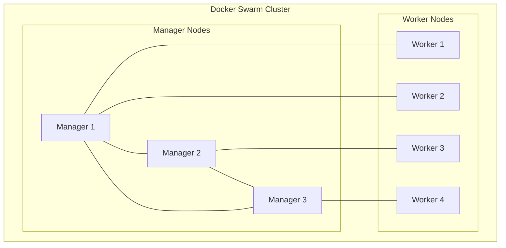

# Docker Swarm

## Introduction

Docker Swarm is Docker's native clustering and orchestration solution that allows you to create and manage a cluster of Docker nodes as a single virtual system. It provides tools to deploy, scale, and manage containerized applications across multiple hosts, making it easier to build and maintain highly available applications.

In this tutorial, you'll learn the fundamentals of Docker Swarm, its architecture, how to set it up, and how to deploy and manage services across your swarm.

## What is Docker Swarm?

Docker Swarm transforms a group of Docker hosts into a single, virtual Docker host. It uses the standard Docker API, meaning any tool that already communicates with Docker can seamlessly work with a swarm to deploy applications.

Some key features of Docker Swarm include:

- **Cluster management integrated with Docker Engine**: Use the Docker CLI to create a swarm of Docker Engines
- **Decentralized design**: You can build an entire swarm from a single disk image
- **Declarative service model**: Docker Engine uses a declarative approach to define the desired state of services
- **Scaling**: Easily scale up or down the number of tasks for each service
- **Desired state reconciliation**: The swarm manager automatically reconciles the cluster to the desired state
- **Multi-host networking**: Overlay networks enable secure communication between containers across hosts
- **Service discovery**: Swarm mode includes an internal DNS component for service discovery
- **Load balancing**: Automatically distribute service containers across the cluster
- **Secure by default**: Communications are encrypted with automatic key rotation

## Docker Swarm Architecture

Docker Swarm operates based on a manager-worker architecture:



### Manager Nodes

Manager nodes handle cluster management tasks:
- Maintaining cluster state
- Scheduling services
- Serving the Swarm API

For high availability, you should implement multiple managers in your swarm (3-5 is recommended), with an odd number to maintain quorum.

### Worker Nodes

Worker nodes execute the tasks (containers) distributed by manager nodes. They have no authority to make decisions about which containers to run.

## Getting Started with Docker Swarm

### Prerequisites

Before you begin, ensure you have:
- Docker Engine installed on all hosts you plan to include in your swarm
- Network connectivity between all hosts
- Open ports:
  - TCP port 2377 for cluster management communications
  - TCP and UDP port 7946 for communication among nodes
  - UDP port 4789 for overlay network traffic

### Initializing a Swarm

To create a new swarm, run the following command on the node you want to designate as the first manager:

```bash
docker swarm init --advertise-addr <MANAGER-IP>
```

This command initializes a new swarm and makes the current node a manager. The output will look similar to:

```
Swarm initialized: current node (dxn1zf6l61qsb1josjja83ngz) is now a manager.

To add a worker to this swarm, run the following command:

    docker swarm join --token SWMTKN-1-49nj1cmql0jkz5s954yi3oex3nedyz0fb0xx14ie39trti4wxv-8vxv8rssmk743ojnwacrr2e7c 192.168.99.100:2377

To add a manager to this swarm, run 'docker swarm join-token manager' and follow the instructions.
```

### Adding Worker Nodes

To add a worker node to your swarm, run the join command provided by the `docker swarm init` output on each worker machine:

```bash
docker swarm join --token <TOKEN> <MANAGER-IP>:2377
```

### Adding Manager Nodes

To add additional manager nodes (recommended for high availability), first get the manager join token:

```bash
docker swarm join-token manager
```

Then run the provided command on the new manager node:

```bash
docker swarm join --token <MANAGER-TOKEN> <MANAGER-IP>:2377
```

### Viewing Nodes in Your Swarm

To see a list of all nodes in your swarm:

```bash
docker node ls
```

Example output:

```
ID                            HOSTNAME            STATUS              AVAILABILITY        MANAGER STATUS      ENGINE VERSION
dxn1zf6l61qsb1josjja83ngz *   manager1            Ready               Active              Leader              19.03.13
vz1qwopzy9n01fdj6hbmg1ptt     worker1             Ready               Active                                  19.03.13
ida9ia9uilbxdozb6yj6lkxjn     worker2             Ready               Active                                  19.03.13
```

## Deploying Services in Docker Swarm

Now that we have a swarm up and running, let's deploy services to it.

### Creating a Service

A service is the definition of tasks to execute on the swarm. To create a service:

```bash
docker service create --name web-server --replicas 3 --publish 80:80 nginx
```

This command creates a service named `web-server` with 3 replicas of the Nginx container, publishing port 80.

### Listing Services

To see the services running in your swarm:

```bash
docker service ls
```

Example output:

```
ID                  NAME                MODE                REPLICAS            IMAGE               PORTS
i0z2jp2zy9z0        web-server          replicated          3/3                 nginx:latest        *:80->80/tcp
```

### Inspecting a Service

To get detailed information about a service:

```bash
docker service inspect --pretty web-server
```

### Viewing Service Tasks

To see which nodes are running the service tasks:

```bash
docker service ps web-server
```

Example output:

```
ID                  NAME                IMAGE               NODE                DESIRED STATE       CURRENT STATE           ERROR               PORTS
v6d9mvv8lspp        web-server.1        nginx:latest        manager1            Running             Running 2 minutes ago                       
7l69f0bnr3ch        web-server.2        nginx:latest        worker1             Running             Running 2 minutes ago                       
pjmxj4xth8xu        web-server.3        nginx:latest        worker2             Running             Running 2 minutes ago                       
```

### Scaling a Service

To change the number of replicas for a service:

```bash
docker service scale web-server=5
```

### Updating a Service

To update a service (for example, to use a newer image):

```bash
docker service update --image nginx:1.19 web-server
```

You can also update other aspects of the service, such as environment variables, ports, or resource constraints.

## Docker Stack: Deploying Multi-Service Applications

For complex applications with multiple services, Docker Compose files can be used with Docker Stack to deploy to a swarm.

### Example Docker Compose File

Create a file named `docker-compose.yml`:

```yaml
version: '3.8'

services:
  web:
    image: nginx:latest
    ports:
      - "80:80"
    deploy:
      replicas: 2
      update_config:
        parallelism: 1
        delay: 10s
      restart_policy:
        condition: on-failure
  
  db:
    image: postgres:13
    environment:
      POSTGRES_PASSWORD: example
    volumes:
      - db-data:/var/lib/postgresql/data
    deploy:
      placement:
        constraints: [node.role == manager]
      restart_policy:
        condition: on-failure

volumes:
  db-data:
```

### Deploying a Stack

To deploy the stack to your swarm:

```bash
docker stack deploy -c docker-compose.yml my-app
```

### Managing Stacks

List the stacks:

```bash
docker stack ls
```

List the services in a stack:

```bash
docker stack services my-app
```

List tasks in a stack:

```bash
docker stack ps my-app
```

Remove a stack:

```bash
docker stack rm my-app
```

## Networking in Swarm Mode

Docker Swarm provides several networking capabilities:

### Overlay Networks

Overlay networks enable service-to-service communication across nodes in the swarm:

```bash
docker network create --driver overlay my-network
```

When you create a service, you can attach it to this network:

```bash
docker service create --name my-service --network my-network nginx
```

### Ingress Network

The ingress network is a special overlay network that facilitates load balancing among service containers. It's created automatically when you initialize a swarm.

## Volumes in Swarm Mode

For persistent storage, you can use volumes with your swarm services:

```bash
docker service create \
  --name db \
  --mount type=volume,source=db-data,destination=/var/lib/mysql \
  mysql:5.7
```

## Secrets Management

Docker Swarm provides a secure way to manage sensitive data like passwords:

Create a secret:

```bash
echo "mypassword" | docker secret create db_password -
```

Use the secret in a service:

```bash
docker service create \
  --name db \
  --secret db_password \
  --env MYSQL_ROOT_PASSWORD_FILE=/run/secrets/db_password \
  mysql:5.7
```

## Health Checks and Service Reliability

Docker Swarm constantly monitors the health of your services and automatically restarts containers that fail:

```bash
docker service create \
  --name web \
  --replicas 3 \
  --health-cmd "curl -f http://localhost/ || exit 1" \
  --health-interval 5s \
  --health-retries 3 \
  --health-timeout 2s \
  nginx
```

## Common Swarm Management Commands

Here's a quick reference for commonly used Docker Swarm commands:

| Command | Description |
|---------|-------------|
| `docker swarm init` | Initialize a swarm |
| `docker swarm join` | Join a swarm as a worker or manager |
| `docker swarm leave` | Leave the swarm |
| `docker node ls` | List nodes in the swarm |
| `docker node promote` | Promote a node to manager status |
| `docker node demote` | Demote a manager node to worker |
| `docker service create` | Create a new service |
| `docker service ls` | List services |
| `docker service ps` | List the tasks of a service |
| `docker service scale` | Scale a service |
| `docker service update` | Update a service |
| `docker service rm` | Remove a service |
| `docker stack deploy` | Deploy a new stack or update an existing stack |
| `docker stack ls` | List stacks |
| `docker stack services` | List the services in a stack |
| `docker stack rm` | Remove a stack |

## Real-world Example: Web Application with Database and Load Balancer

Let's put it all together with a complete example of deploying a web application with a database and load balancer:

```yaml
version: '3.8'

services:
  web:
    image: my-webapp:latest
    depends_on:
      - db
    environment:
      - DATABASE_URL=postgres://postgres:example@db:5432/mydb
    deploy:
      replicas: 3
      update_config:
        parallelism: 1
        delay: 10s
      restart_policy:
        condition: on-failure
    networks:
      - app-network

  db:
    image: postgres:13
    environment:
      POSTGRES_PASSWORD_FILE: /run/secrets/db_password
      POSTGRES_DB: mydb
    volumes:
      - db-data:/var/lib/postgresql/data
    deploy:
      placement:
        constraints: [node.role == manager]
      restart_policy:
        condition: on-failure
    networks:
      - app-network
    secrets:
      - db_password

  lb:
    image: nginx:latest
    ports:
      - "80:80"
    volumes:
      - ./nginx.conf:/etc/nginx/nginx.conf:ro
    depends_on:
      - web
    deploy:
      replicas: 2
      placement:
        constraints: [node.role == worker]
    networks:
      - app-network

networks:
  app-network:
    driver: overlay

volumes:
  db-data:

secrets:
  db_password:
    external: true
```

To deploy this stack:

```bash
docker stack deploy -c docker-compose.yml my-app
```

## Troubleshooting Docker Swarm

### Common Issues and Solutions

1. **Nodes not joining the swarm**:
   - Check network connectivity between nodes
   - Verify that required ports are open
   - Check system time synchronization

2. **Service container fails to start**:
   - Check service logs: `docker service logs <SERVICE-NAME>`
   - Verify image availability: `docker pull <IMAGE>`
   - Check resource constraints

3. **Network connectivity issues between services**:
   - Ensure services are on the same overlay network
   - Verify DNS resolution: `docker exec <CONTAINER-ID> ping <SERVICE-NAME>`
   - Check for network policies or firewalls

### Viewing Logs

To view logs for a service:

```bash
docker service logs <SERVICE-NAME>
```

### Inspecting the Swarm State

To get detailed information about the swarm:

```bash
docker info
```

## Swarm vs. Kubernetes

While Docker Swarm provides excellent orchestration capabilities, it's worth comparing it to Kubernetes, the other major container orchestration platform:

| Feature | Docker Swarm | Kubernetes |
|---------|--------------|------------|
| Learning curve | Lower | Higher |
| Setup complexity | Simple | Complex |
| Scalability | Good for smaller deployments | Excellent for large-scale deployments |
| Auto-scaling | Basic | Advanced |
| Service discovery | Built-in DNS-based | Multiple options |
| Load balancing | Built-in | More configuration options |
| Rolling updates | Supported | Extensive options |
| Community | Smaller | Very large |
| Corporate backing | Docker, Inc. | Cloud Native Computing Foundation |

Docker Swarm is an excellent choice for:
- Teams new to container orchestration
- Smaller deployments
- Scenarios where simplicity is valued over extensive features

## Summary

Docker Swarm provides a straightforward way to orchestrate containers across multiple hosts. In this tutorial, you've learned:

- How to set up a Docker Swarm cluster
- How to deploy and manage services
- How to work with stacks for multi-service applications
- Networking and storage options in Swarm mode
- Best practices for production swarm deployments

With these skills, you can now deploy containerized applications at scale, ensuring high availability and easy management.

## Additional Resources

Here are some resources to continue your Docker Swarm learning journey:

- Docker's official documentation on Swarm mode: [https://docs.docker.com/engine/swarm/](https://docs.docker.com/engine/swarm/)
- Docker Compose file reference: [https://docs.docker.com/compose/compose-file/](https://docs.docker.com/compose/compose-file/)
- Docker Forums for community support: [https://forums.docker.com/](https://forums.docker.com/)

## Exercises

To reinforce your learning, try these exercises:

1. Set up a 3-node Docker Swarm cluster (1 manager, 2 workers)
2. Deploy a simple web application with 5 replicas and verify load balancing
3. Create a stack with a web application and database, using secrets for password management
4. Simulate a node failure and observe how Docker Swarm handles container rescheduling
5. Perform a rolling update of your application to a new version without downtime