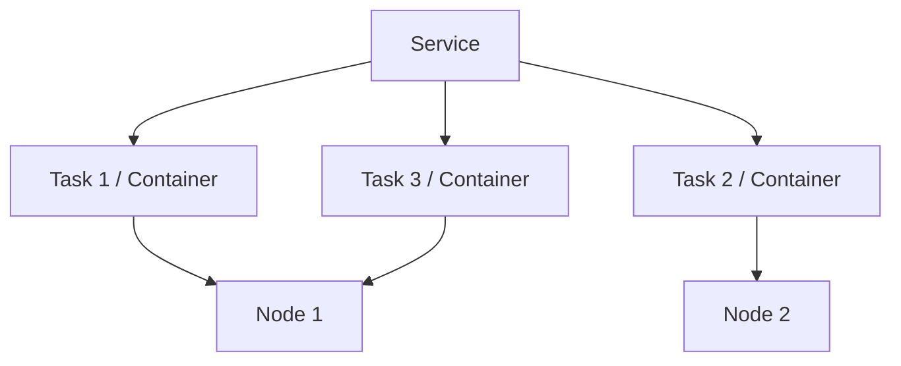
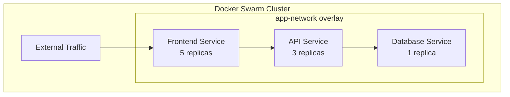

# Docker Swarm Services

## Introduction

Docker Swarm is Docker's native clustering and orchestration solution that transforms a group of Docker hosts into a single virtual host. Within this orchestration system, **Services** are the cornerstone components that allow you to deploy, scale, and manage containerized applications across multiple nodes.

A Docker Swarm service is a higher-level abstraction that represents a specific application or component running across one or more container instances. Unlike standalone containers, services in Docker Swarm provide features like:

- **Declarative state**: Define desired state and let Swarm maintain it
- **Scaling**: Run multiple replicas of a container across the swarm
- **Load balancing**: Distribute traffic among service replicas
- **Rolling updates**: Update services with zero downtime
- **Self-healing**: Automatically replace failed containers

In this guide, we'll explore how to create, manage, and scale services in Docker Swarm, making your applications more resilient and easier to maintain.

## Prerequisites

Before diving into Docker Swarm services, ensure you have:

1. Docker installed on all nodes (minimum version 1.12+)
2. A Docker Swarm initialized (at least one manager node)
3. Multiple nodes joined to your swarm (for a proper cluster)


## Understanding Service Concepts

In Docker Swarm, services operate under a declarative model where you define the desired state of your application, and Swarm works to maintain that state. Let's understand some key concepts:

### Service vs. Container

A traditional Docker container is a single instance running on a single host. In contrast, a Swarm service can consist of multiple container instances (called **tasks**) distributed across the cluster.



### Service Types

Docker Swarm supports two types of services:

1. **Replicated Services**: The most common type where you specify the number of identical tasks you want to run. Swarm schedules these tasks across the cluster.

2. **Global Services**: These run one task on every node in the swarm. No need to specify the number of replicas, as each node gets exactly one instance.

### Service Components

A service definition typically includes:

- **Image**: The Docker image to use for the containers
- **Replicas**: How many containers to run (for replicated services)
- **Ports**: Which ports to expose
- **Networks**: Which networks the service connects to
- **Mounts**: Volume/bind mounts
- **Resource constraints**: CPU and memory limits
- **Update policy**: How to handle service updates
- **Restart policy**: What to do when a container fails

## Creating Your First Service

Let's create a simple web service using NGINX. First, ensure your swarm is initialized:

```bash
# Check the status of your swarm
docker info | grep Swarm

# If not in swarm mode, initialize it
docker swarm init --advertise-addr <MANAGER-IP>
```

Now, let's create a simple replicated web service:

```bash
docker service create \
  --name webservice \
  --replicas 3 \
  --publish published=80,target=80 \
  nginx:latest
```

Breaking down this command:
- `--name webservice`: Names our service "webservice"
- `--replicas 3`: Requests 3 identical container instances
- `--publish published=80,target=80`: Maps port 80 on the host to port 80 in the container
- `nginx:latest`: Specifies the Docker image to use

After running this command, you should see output similar to:

```
overall progress: 3 out of 3 tasks
1/3: running   [==================================================>]
2/3: running   [==================================================>]
3/3: running   [==================================================>]
verify: Service converged
```

## Managing Services

Once you've created services, you'll need to manage them. Here are essential commands:

### Listing Services

To see all services in your swarm:

```bash
docker service ls
```

Output:
```
ID             NAME        MODE         REPLICAS   IMAGE          PORTS
ntk1bcu5tv54   webservice  replicated   3/3        nginx:latest   *:80->80/tcp
```

### Inspecting a Service

To get detailed information about a specific service:

```bash
docker service inspect webservice
```

This returns a JSON object with all details about the service. For a more focused view:

```bash
docker service inspect webservice --pretty
```

### Checking Service Tasks

To see the individual tasks (containers) of a service:

```bash
docker service ps webservice
```

Output:
```
ID            NAME           IMAGE         NODE      DESIRED STATE  CURRENT STATE
7blvqr3x2121  webservice.1   nginx:latest  worker2   Running        Running 2 minutes ago
bhgev65as4i1  webservice.2   nginx:latest  worker1   Running        Running 2 minutes ago
oagb3l0jxet2  webservice.3   nginx:latest  manager1  Running        Running 2 minutes ago
```

### Scaling a Service

Need more capacity? Scale up your service:

```bash
docker service scale webservice=5
```

Output:
```
webservice scaled to 5
overall progress: 5 out of 5 tasks
1/5: running   [==================================================>]
2/5: running   [==================================================>]
3/5: running   [==================================================>]
4/5: running   [==================================================>]
5/5: running   [==================================================>]
verify: Service converged
```

You can also scale down by specifying a lower number of replicas.

### Removing a Service

When you no longer need a service:

```bash
docker service rm webservice
```

## Advanced Service Configuration

Now that we understand the basics, let's explore more advanced service configurations.

### Global Services

Sometimes you want a service running on every node. For example, a monitoring agent:

```bash
docker service create \
  --name monitoring-agent \
  --mode global \
  --mount type=bind,source=/var/run/docker.sock,target=/var/run/docker.sock \
  prom/node-exporter
```

The `--mode global` flag ensures one container runs on each node in the swarm.

### Resource Constraints

To prevent a service from consuming too many resources:

```bash
docker service create \
  --name resource-limited-app \
  --replicas 3 \
  --limit-cpu 0.5 \
  --limit-memory 512M \
  --reserve-cpu 0.1 \
  --reserve-memory 128M \
  my-application:latest
```

This sets both upper limits and reserved minimums for CPU and memory.

### Placement Constraints

Control where your services run with placement constraints:

```bash
docker service create \
  --name frontend \
  --replicas 3 \
  --constraint "node.role==worker" \
  --constraint "node.labels.region==east" \
  nginx:latest
```

This example places containers only on worker nodes with the "region=east" label.

### Update Configuration

For zero-downtime updates, configure update policies:

```bash
docker service create \
  --name zero-downtime-app \
  --replicas 5 \
  --update-parallelism 2 \
  --update-delay 20s \
  --update-failure-action rollback \
  my-application:latest
```

This configuration:
- Updates 2 containers at a time
- Waits 20 seconds between updates
- Automatically rolls back if the update fails

### Networks

Connect your service to specific Docker networks:

```bash
# First create a network
docker network create --driver overlay backend-network

# Then create a service using this network
docker service create \
  --name backend-api \
  --replicas 3 \
  --network backend-network \
  my-backend-api:latest
```

### Secrets

For sensitive data like credentials, use Docker secrets:

```bash
# Create a secret
echo "supersecretpassword" | docker secret create db_password -

# Use the secret in a service
docker service create \
  --name database \
  --secret db_password \
  --env DB_PASSWORD_FILE=/run/secrets/db_password \
  postgres:latest
```

The secret will be mounted as a file at `/run/secrets/db_password` inside the container.

## Real-World Example: Multi-Service Application

Let's build a more realistic example: a three-tier web application with a frontend, API, and database.

First, create an overlay network:

```bash
docker network create --driver overlay app-network
```

Next, deploy the database service:

```bash
docker service create \
  --name db \
  --network app-network \
  --mount type=volume,source=db-data,target=/var/lib/mysql \
  --env MYSQL_ROOT_PASSWORD=examplepassword \
  --env MYSQL_DATABASE=appdb \
  --constraint 'node.labels.db==true' \
  mysql:5.7
```

Then, the API service:

```bash
docker service create \
  --name api \
  --network app-network \
  --replicas 3 \
  --env DB_HOST=db \
  --env DB_PASSWORD=examplepassword \
  --env DB_DATABASE=appdb \
  my-api-image:latest
```

Finally, the frontend service:

```bash
docker service create \
  --name frontend \
  --network app-network \
  --replicas 5 \
  --publish published=80,target=80 \
  --env API_ENDPOINT=http://api:8000 \
  my-frontend-image:latest
```

The result is a complete application stack that is:
- Load balanced
- Scalable
- Distributed across the cluster
- Self-healing
- Network-isolated with each component

This architecture can be visualized as follows:



## Monitoring Services

To effectively manage your services, you need to monitor them:

### Service Logs

View logs for all tasks in a service:

```bash
docker service logs frontend
```

Or follow the logs in real-time:

```bash
docker service logs --follow frontend
```

### Service Status

Get a quick status update on all services:

```bash
docker service ls
```

For more detailed task status:

```bash
docker service ps frontend --no-trunc
```

## Troubleshooting Common Issues

### Containers Not Starting

If your service creates tasks that never reach the "Running" state:

1. Check resource availability on nodes:
```bash
docker node ls
   ```

2. Look for specific task errors:
```bash
docker service ps --no-trunc my-service
   ```

3. Check the logs of a failing task:
```bash
docker service logs my-service
   ```

### Load Balancing Issues

If external requests aren't reaching your service:

1. Verify the service is published correctly:
```bash
docker service inspect --format="{{json .Endpoint.Ports}}" my-service
   ```

2. Test connectivity from inside the swarm:
```bash
docker run --rm --network app-network appropriate/curl curl -s my-service:8000
   ```

### Rolling Back Failed Updates

If a service update fails:

```bash
docker service update --rollback my-service
```

## Best Practices

1. **Use version tags for images** instead of "latest" in production
2. **Configure health checks** for reliable service monitoring
3. **Implement rolling updates** to avoid downtime
4. **Set resource limits** to prevent resource starvation
5. **Use overlay networks** to isolate service communication
6. **Label your nodes** for targeted service placement
7. **Plan for persistence** using volumes when needed
8. **Regularly back up Swarm state** from manager nodes
9. **Use secrets** for sensitive data instead of environment variables
10. **Monitor service health** with appropriate tools

## Summary

Docker Swarm services provide a powerful abstraction for deploying and managing containerized applications at scale. We've covered:

- Creating basic and advanced services
- Scaling services up and down
- Configuring constraints, resources, and update policies
- Building multi-service applications
- Monitoring and troubleshooting services

By leveraging services, you can build resilient, scalable applications that self-heal and update with minimal downtime. Docker Swarm services offer many of the benefits of more complex orchestration systems with the simplicity of the Docker CLI that you already know.

## Exercises

1. Create a replicated web service and scale it to 3 instances.
2. Set up a global service that prints the hostname of each node.
3. Create a service with CPU and memory limits.
4. Deploy a two-tier application with frontend and backend services.
5. Configure a service with a rolling update policy and test an image update.

## Additional Resources

- [Docker Documentation on Services](https://docs.docker.com/engine/swarm/services/)
- [Docker Swarm Networking](https://docs.docker.com/engine/swarm/networking/)
- [Docker Compose with Swarm Mode](https://docs.docker.com/compose/swarm/)
- [Docker Swarm Security Best Practices](https://docs.docker.com/engine/security/)