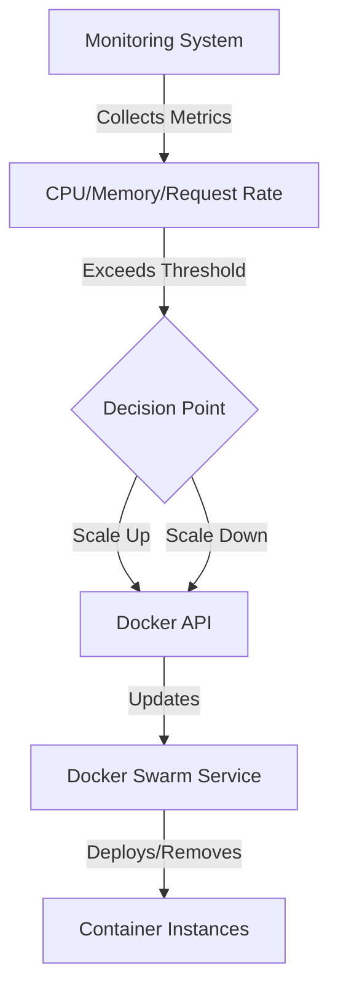

# Docker Swarm Scaling

## Introduction

Docker Swarm is Docker's native clustering and orchestration solution that turns a group of Docker hosts into a single virtual host. One of the most powerful features of Docker Swarm is its ability to scale applications horizontally with minimal effort. Scaling in Docker Swarm refers to increasing or decreasing the number of container instances that run a particular service, allowing your application to handle varying loads efficiently.

In this tutorial, we'll explore how to scale services in Docker Swarm, both manually and automatically. We'll also cover strategies for efficient scaling and best practices to ensure your applications remain resilient and performant.

## Prerequisites

Before diving into scaling with Docker Swarm, ensure you have:

- Basic understanding of Docker containers
- A Docker Swarm cluster set up with at least one manager and one worker node
- Docker Engine version 19.03 or later installed on all nodes


## Manual Scaling in Docker Swarm

### Basic Service Scaling

The simplest way to scale a service in Docker Swarm is using the `docker service scale` command. This allows you to specify exactly how many replicas of a service you want running.

Let's start by creating a simple web service:

```bash
# Create a service with 3 replicas
docker service create --name web-server --replicas 3 -p 80:80 nginx
```

This command creates a service named `web-server` with 3 replicas of the Nginx image, exposing port 80.

To check the current state of your service:

```bash
docker service ls
```

Output:
```
ID             NAME        MODE         REPLICAS   IMAGE          PORTS
uv2p7rn94qdm   web-server  replicated   3/3        nginx:latest   *:80->80/tcp
```

Now, let's scale this service to have 5 replicas:

```bash
docker service scale web-server=5
```

Output:
```
web-server scaled to 5
overall progress: 5 out of 5 tasks
1/5: running   [==================================================>]
2/5: running   [==================================================>]
3/5: running   [==================================================>]
4/5: running   [==================================================>]
5/5: running   [==================================================>]
verify: Service converged
```

To scale down, simply specify a lower number:

```bash
docker service scale web-server=2
```

Output:
```
web-server scaled to 2
overall progress: 2 out of 2 tasks
1/2: running   [==================================================>]
2/2: running   [==================================================>]
verify: Service converged
```

### Scaling Multiple Services Simultaneously

Docker Swarm allows you to scale multiple services in a single command:

```bash
docker service scale web-server=4 api-service=3 database=2
```

This command scales three different services in one operation.

## Automatic Scaling with Docker Swarm

While Docker Swarm doesn't have built-in autoscaling like Kubernetes, you can implement automatic scaling using Docker API and monitoring tools.

### Using Docker API for Autoscaling

Let's create a simple bash script that scales our service based on CPU usage:

```bash
#!/bin/bash

SERVICE_NAME="web-server"
MAX_REPLICAS=10
MIN_REPLICAS=2
CPU_THRESHOLD=70

while true; do
  # Get average CPU usage across service containers
  CPU_USAGE=$(docker stats --no-stream --format "{{.CPUPerc}}" $(docker ps -q --filter name=$SERVICE_NAME) | sed 's/%//g' | awk '{sum+=$1} END {print sum/NR}')
  
  # Get current replica count
  CURRENT_REPLICAS=$(docker service ls --filter name=$SERVICE_NAME --format "{{.Replicas}}" | cut -d/ -f1)
  
  echo "Current CPU usage: $CPU_USAGE%, Replicas: $CURRENT_REPLICAS"
  
  if (( $(echo "$CPU_USAGE > $CPU_THRESHOLD" | bc -l) )) && [ $CURRENT_REPLICAS -lt $MAX_REPLICAS ]; then
    # Scale up by 1
    NEW_REPLICAS=$((CURRENT_REPLICAS + 1))
    echo "Scaling up to $NEW_REPLICAS replicas"
    docker service scale $SERVICE_NAME=$NEW_REPLICAS
  elif (( $(echo "$CPU_USAGE < $(($CPU_THRESHOLD/2))" | bc -l) )) && [ $CURRENT_REPLICAS -gt $MIN_REPLICAS ]; then
    # Scale down by 1
    NEW_REPLICAS=$((CURRENT_REPLICAS - 1))
    echo "Scaling down to $NEW_REPLICAS replicas"
    docker service scale $SERVICE_NAME=$NEW_REPLICAS
  fi
  
  sleep 60
done
```

Save this script as `autoscale.sh`, make it executable with `chmod +x autoscale.sh`, and run it in the background:

```bash
./autoscale.sh &
```

### Using Third-party Tools

For production environments, consider using more sophisticated monitoring and scaling solutions:

1. **Docker Flow Monitor + Prometheus + Alertmanager**: This setup can trigger scaling actions based on predefined metrics.

2. **Portainer**: Provides a GUI for monitoring and scaling Docker Swarm services.

Here's a simple diagram showing how automatic scaling works:



## Service Updates and Rolling Deployments

When scaling services, you often need to update them as well. Docker Swarm provides built-in support for rolling updates:

```bash
docker service update --image nginx:alpine --update-parallelism 2 --update-delay 20s web-server
```

This command:
- Updates the service to use the `nginx:alpine` image
- Updates 2 containers at a time
- Waits 20 seconds between updates

The `--update-parallelism` flag controls how many tasks are updated simultaneously, while `--update-delay` specifies the time between updates.

## Scaling Strategies and Best Practices

### Load Balancing

Docker Swarm includes a built-in load balancer that distributes traffic to all containers of a service. When you scale a service, the load balancer automatically adjusts to include the new containers.

For example, to create a service with the routing mesh enabled:

```bash
docker service create --name web --replicas 5 --publish published=80,target=80 nginx
```

Now all requests to port 80 on any Swarm node will be load-balanced across the 5 nginx containers.

### Resource Constraints

When scaling services, it's crucial to set resource constraints to prevent a single service from consuming all resources:

```bash
docker service create --name resource-limited-service \
  --replicas 3 \
  --reserve-cpu 0.25 \
  --reserve-memory 128M \
  --limit-cpu 0.5 \
  --limit-memory 256M \
  nginx
```

This service:
- Reserves 0.25 CPUs and 128MB of memory per container
- Limits usage to 0.5 CPUs and 256MB of memory per container

### Placement Constraints

Use placement constraints to control where containers run:

```bash
# Run only on worker nodes
docker service create --name worker-only \
  --constraint node.role==worker \
  --replicas 3 \
  nginx
```

```bash
# Spread across different availability zones
docker service create --name high-availability \
  --placement-pref 'spread=node.labels.zone' \
  --replicas 6 \
  nginx
```

## Practical Examples

### Scaling a Web Application Stack

Let's deploy and scale a complete web application stack:

```bash
# Create an overlay network
docker network create --driver overlay webappnet

# Deploy a database service
docker service create --name db \
  --network webappnet \
  --replicas 1 \
  --mount type=volume,source=dbdata,destination=/var/lib/mysql \
  -e MYSQL_ROOT_PASSWORD=mypassword \
  -e MYSQL_DATABASE=webappdb \
  mysql:5.7

# Deploy a backend API service
docker service create --name api \
  --network webappnet \
  --replicas 2 \
  -e DB_HOST=db \
  -e DB_PASSWORD=mypassword \
  mycompany/api:latest

# Deploy a frontend service
docker service create --name frontend \
  --network webappnet \
  --replicas 3 \
  -p 80:80 \
  mycompany/frontend:latest
```

Now, let's scale the API service based on demand:

```bash
# During high traffic periods
docker service scale api=5

# During low traffic periods
docker service scale api=2
```

### Handling Blue-Green Deployments with Scaling

Blue-green deployment is a technique that reduces downtime by running two identical environments (blue and green) and switching between them:

```bash
# Deploy the "blue" version with 3 replicas
docker service create --name myapp-blue \
  --network webappnet \
  --replicas 3 \
  mycompany/myapp:1.0

# Create a proxy that points to the blue version
docker service create --name myapp-proxy \
  --network webappnet \
  --replicas 1 \
  -p 80:80 \
  -e BACKEND=myapp-blue \
  nginx:custom-proxy

# Deploy the "green" version with 0 replicas initially
docker service create --name myapp-green \
  --network webappnet \
  --replicas 0 \
  mycompany/myapp:2.0

# Scale up the green version
docker service scale myapp-green=3

# Update the proxy to point to the green version
docker service update --env-add BACKEND=myapp-green myapp-proxy

# Scale down the blue version once green is confirmed working
docker service scale myapp-blue=0
```

## Monitoring Scaled Services

To effectively manage scaled services, you need to monitor them:

```bash
# Check the status of all services
docker service ls

# Get detailed info about a specific service
docker service ps web-server --no-trunc

# View container logs for a service
docker service logs web-server
```

For more advanced monitoring, consider setting up:

1. **Prometheus + Grafana**: For metrics collection and visualization
2. **cAdvisor**: For container-level performance metrics
3. **ELK Stack**: For centralized logging

## Summary

In this tutorial, we've explored Docker Swarm scaling, covering:

- Manual scaling of services using `docker service scale`
- Implementing automatic scaling based on resource usage
- Service updates and rolling deployments
- Scaling strategies and best practices for resource management
- Practical examples of scaling application stacks
- Monitoring techniques for scaled services

Docker Swarm provides a straightforward yet powerful way to scale your containerized applications. By mastering these scaling techniques, you can ensure your applications remain responsive under varying loads while maximizing resource efficiency.

## Exercises

1. Create a simple web service and practice scaling it up and down manually.
2. Implement the autoscaling script from this tutorial and test it with a CPU-intensive application.
3. Set up a three-tier application (database, API, frontend) and practice scaling each tier independently.
4. Try implementing a blue-green deployment using the techniques described above.
5. Create a service with placement constraints and observe how containers are distributed across your Swarm.

## Additional Resources

- [Docker Swarm Official Documentation](https://docs.docker.com/engine/swarm/)
- [Docker Service Scale Command Reference](https://docs.docker.com/engine/reference/commandline/service_scale/)
- [Docker Service Update Command Reference](https://docs.docker.com/engine/reference/commandline/service_update/)
- [Docker Flow Monitor Documentation](https://github.com/docker-flow/docker-flow-monitor)