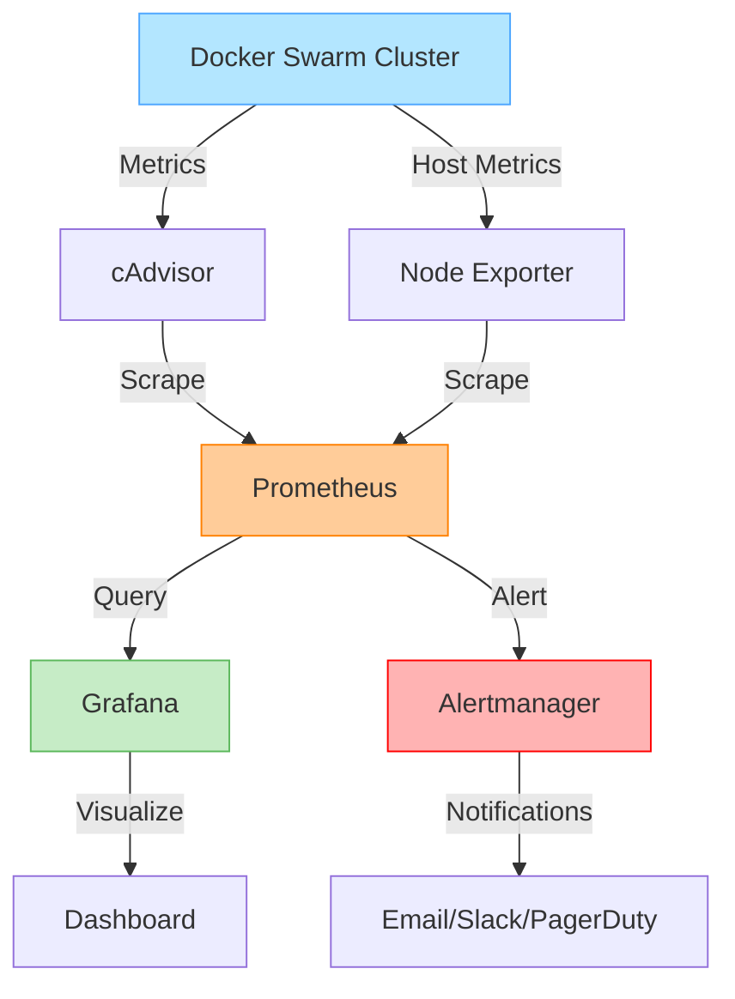

# Docker Swarm Monitoring

## Introduction

Docker Swarm is Docker's native clustering and orchestration solution that transforms a group of Docker hosts into a single virtual host. While Swarm simplifies deployment and scaling of containerized applications, monitoring these distributed systems presents unique challenges. Effective monitoring is crucial for maintaining performance, ensuring high availability, and quickly identifying and resolving issues.

In this guide, we'll explore various approaches to monitoring Docker Swarm environments, the key metrics to track, and the tools that make monitoring more manageable. By the end, you'll have a solid understanding of how to implement a comprehensive monitoring strategy for your Docker Swarm clusters.

## Why Monitor Docker Swarm?

Before diving into the "how," let's understand the "why" of Swarm monitoring:

1. **Resource Optimization**: Identify resource bottlenecks and optimize container placement
2. **Troubleshooting**: Quickly diagnose issues across distributed services
3. **Performance Insights**: Understand application performance in a clustered environment
4. **Capacity Planning**: Make informed decisions about scaling your infrastructure
5. **High Availability**: Ensure your services remain available and resilient

## Key Metrics to Monitor

For effective Docker Swarm monitoring, you should track metrics at multiple levels:

### Node-level Metrics
- CPU usage and load
- Memory usage and limits
- Disk I/O and storage capacity
- Network throughput and latency
- Number of containers running

### Service-level Metrics
- Number of tasks running vs desired state
- Task restart counts
- Service update status
- Deployment success/failure rates

### Container-level Metrics
- CPU and memory usage
- Network I/O
- Disk read/write operations
- Container health status
- Restart count

### Application-specific Metrics
- Request rates and latency
- Error rates
- Business-specific metrics
- User experience metrics

## Setting Up Basic Monitoring with Docker Commands

Docker provides built-in commands to check the basic health of your Swarm. Let's start with these native tools:

### Checking Swarm Status

```bash
# View overall Swarm status
docker info | grep Swarm

# List all nodes in the Swarm
docker node ls

# Inspect a specific node
docker node inspect --pretty node-name
```

The output will look something like:

```
Swarm: active
 NodeID: abc123def456ghijk
 Is Manager: true
 Managers: 3
 Nodes: 7
```

### Monitoring Services

```bash
# List all services
docker service ls

# Check service details and replicas
docker service ps service-name

# View service logs
docker service logs service-name
```

Example output for `docker service ls`:

```
ID             NAME         MODE         REPLICAS   IMAGE             PORTS
x3ti8xflm9xt   web          replicated   5/5        nginx:latest      *:80->80/tcp
bf0kv6k58r3x   redis        replicated   3/3        redis:latest      
```

### Visualizing with Docker Swarm Visualizer

For a simple visual representation, you can deploy the Docker Swarm Visualizer:

```bash
docker service create \
  --name=viz \
  --publish=8080:8080/tcp \
  --constraint=node.role==manager \
  --mount=type=bind,src=/var/run/docker.sock,dst=/var/run/docker.sock \
  dockersamples/visualizer
```

## Advanced Monitoring with Prometheus and Grafana

For production environments, a more robust solution combining Prometheus and Grafana is recommended.

### Step 1: Deploy Prometheus

First, create a `prometheus.yml` configuration file:

```yaml
global:
  scrape_interval: 15s

scrape_configs:
  - job_name: 'docker'
    static_configs:
      - targets: ['cadvisor:8080']

  - job_name: 'node-exporter'
    static_configs:
      - targets: ['node-exporter:9100']
```

Next, create a Docker Compose file for the monitoring stack:

```yaml
version: '3.8'

services:
  prometheus:
    image: prom/prometheus:latest
    volumes:
      - ./prometheus.yml:/etc/prometheus/prometheus.yml
    ports:
      - "9090:9090"
    deploy:
      placement:
        constraints:
          - node.role == manager

  cadvisor:
    image: google/cadvisor:latest
    volumes:
      - /:/rootfs:ro
      - /var/run:/var/run:ro
      - /sys:/sys:ro
      - /var/lib/docker/:/var/lib/docker:ro
    ports:
      - "8080:8080"
    deploy:
      mode: global

  node-exporter:
    image: prom/node-exporter:latest
    volumes:
      - /proc:/host/proc:ro
      - /sys:/host/sys:ro
      - /:/rootfs:ro
    command:
      - '--path.procfs=/host/proc'
      - '--path.sysfs=/host/sys'
      - '--collector.filesystem.ignored-mount-points=^/(sys|proc|dev|host|etc)($$|/)'
    ports:
      - "9100:9100"
    deploy:
      mode: global

  grafana:
    image: grafana/grafana:latest
    ports:
      - "3000:3000"
    volumes:
      - grafana-storage:/var/lib/grafana
    deploy:
      placement:
        constraints:
          - node.role == manager

volumes:
  grafana-storage:
```

Deploy the stack with:

```bash
docker stack deploy -c docker-compose.yml monitoring
```

### Step 2: Configure Grafana

1. Access Grafana at `http://your-swarm-manager:3000` (default credentials: admin/admin)
2. Add Prometheus as a data source:
   - Name: Prometheus
   - Type: Prometheus
   - URL: http://prometheus:9090
3. Import dashboards for Docker Swarm (IDs: 1860, 893, 395)

## Implementing Alert Management

Monitoring is not complete without alerts. Let's set up alerting with Alertmanager:

### Step 1: Create alertmanager.yml

```yaml
global:
  resolve_timeout: 5m

route:
  group_by: ['alertname']
  group_wait: 10s
  group_interval: 5m
  repeat_interval: 1h
  receiver: 'email-notifications'

receivers:
- name: 'email-notifications'
  email_configs:
  - to: 'alert@yourdomain.com'
    from: 'alertmanager@yourdomain.com'
    smarthost: smtp.yourdomain.com:587
    auth_username: 'alertmanager@yourdomain.com'
    auth_password: 'your-password'
```

### Step 2: Add Alertmanager to the Docker Compose file

```yaml
alertmanager:
  image: prom/alertmanager:latest
  ports:
    - "9093:9093"
  volumes:
    - ./alertmanager.yml:/etc/alertmanager/alertmanager.yml
  deploy:
    placement:
      constraints:
        - node.role == manager
```

### Step 3: Create alert rules

Create a file named `alert.rules`:

```yaml
groups:
- name: docker-swarm-alerts
  rules:
  - alert: HighCPUUsage
    expr: (sum by(instance) (rate(process_cpu_seconds_total[1m])) * 100) > 80
    for: 5m
    labels:
      severity: warning
    annotations:
      summary: "High CPU usage detected on {{ $labels.instance }}"
      description: "{{ $labels.instance }} has high CPU usage ({{ $value }}%)"

  - alert: ServiceDown
    expr: up == 0
    for: 1m
    labels:
      severity: critical
    annotations:
      summary: "Service down on {{ $labels.instance }}"
      description: "{{ $labels.job }} has been down for more than 1 minute"
```

Add the rules file to Prometheus configuration and update the compose file accordingly.

## Flow Visualization with Mermaid

Here's a diagram of how the monitoring components interact:



## Best Practices for Docker Swarm Monitoring

1. **Implement Multi-level Monitoring**: Monitor at node, service, container, and application levels
2. **Use Labels Effectively**: Add metadata to services for better filtering and organization
3. **Set Up Proper Retention Policies**: Determine how long to store metrics based on your needs
4. **Automate Remediation**: Where possible, set up automatic responses to common issues
5. **Monitor Network Traffic**: Inter-service communication can be a source of issues
6. **Custom Metrics**: Extend monitoring to include application-specific metrics
7. **Regular Audits**: Periodically review your monitoring setup as your Swarm evolves

## Troubleshooting Common Issues

### High Memory Usage

If you notice high memory usage on a node:

```bash
# Check memory usage per container
docker stats --no-stream

# Identify services with memory issues
docker service ls -q | xargs docker service ps -q | xargs docker inspect --format '{{.Node.ID}} {{.Status.ContainerStatus.ContainerID}}' | xargs -L 1 sh -c 'docker inspect --format "{{.Name}} {{.HostConfig.Memory}}" $1'
```

### Service Scheduling Issues

If services aren't being scheduled properly:

```bash
# Check for placement constraints
docker service inspect --pretty service-name

# View node availability
docker node ls --filter availability=active
```

### Node Connectivity Problems

For networking issues between nodes:

```bash
# Test connectivity between nodes
docker run --rm alpine ping swarm-node-ip

# Check overlay network status
docker network inspect ingress
```

## Practical Example: Complete Monitoring Stack

Let's build a complete monitoring stack for a production Swarm environment. We'll use:

- Prometheus for metrics collection
- Grafana for visualization
- cAdvisor for container metrics
- Node Exporter for host metrics
- Alertmanager for alerting
- Blackbox Exporter for endpoint monitoring

Create a file named `monitoring-stack.yml`:

```yaml
version: '3.8'

services:
  prometheus:
    image: prom/prometheus:latest
    volumes:
      - ./prometheus/:/etc/prometheus/
      - prometheus_data:/prometheus
    command:
      - '--config.file=/etc/prometheus/prometheus.yml'
      - '--storage.tsdb.path=/prometheus'
      - '--web.console.libraries=/etc/prometheus/console_libraries'
      - '--web.console.templates=/etc/prometheus/consoles'
      - '--storage.tsdb.retention.time=15d'
      - '--web.enable-lifecycle'
    ports:
      - "9090:9090"
    deploy:
      placement:
        constraints:
          - node.role == manager
      
  alertmanager:
    image: prom/alertmanager:latest
    volumes:
      - ./alertmanager/:/etc/alertmanager/
    command:
      - '--config.file=/etc/alertmanager/alertmanager.yml'
      - '--storage.path=/alertmanager'
    ports:
      - "9093:9093"
    deploy:
      placement:
        constraints:
          - node.role == manager
          
  cadvisor:
    image: gcr.io/cadvisor/cadvisor:latest
    volumes:
      - /:/rootfs:ro
      - /var/run:/var/run:ro
      - /sys:/sys:ro
      - /var/lib/docker/:/var/lib/docker:ro
      - /dev/disk/:/dev/disk:ro
    ports:
      - "8080:8080"
    deploy:
      mode: global
      
  node-exporter:
    image: prom/node-exporter:latest
    volumes:
      - /proc:/host/proc:ro
      - /sys:/host/sys:ro
      - /:/rootfs:ro
    command:
      - '--path.procfs=/host/proc'
      - '--path.sysfs=/host/sys'
      - '--collector.filesystem.ignored-mount-points=^/(sys|proc|dev|host|etc)($$|/)'
    ports:
      - "9100:9100"
    deploy:
      mode: global
      
  blackbox-exporter:
    image: prom/blackbox-exporter:latest
    volumes:
      - ./blackbox/:/etc/blackbox_exporter/
    command:
      - '--config.file=/etc/blackbox_exporter/blackbox.yml'
    ports:
      - "9115:9115"
    deploy:
      placement:
        constraints:
          - node.role == manager
          
  grafana:
    image: grafana/grafana:latest
    volumes:
      - grafana_data:/var/lib/grafana
    environment:
      - GF_SECURITY_ADMIN_PASSWORD=secure_password
      - GF_USERS_ALLOW_SIGN_UP=false
    ports:
      - "3000:3000"
    deploy:
      placement:
        constraints:
          - node.role == manager

volumes:
  prometheus_data:
  grafana_data:
```

Deploy with:

```bash
docker stack deploy -c monitoring-stack.yml monitoring
```

## Exercise: Setting Up a Complete Monitoring Solution

Now it's your turn to practice! Try completing these tasks:

1. Set up a local Docker Swarm with at least 2 nodes
2. Deploy a simple web application with multiple replicas
3. Implement the monitoring stack described above
4. Create a custom Grafana dashboard to monitor your application
5. Configure alerts for high CPU usage and service availability
6. Simulate a failure and observe how your monitoring system responds

## Summary

Monitoring Docker Swarm environments requires a multi-layered approach that encompasses nodes, services, containers, and applications. By combining tools like Prometheus, Grafana, and various exporters, you can build a comprehensive monitoring system that provides visibility, insights, and alerts.

Remember these key takeaways:
- Always monitor at multiple levels (host, service, container, application)
- Set up proper alerting to catch issues early
- Use visualization to quickly understand system status
- Implement monitoring from the beginning, not as an afterthought
- Regularly review and improve your monitoring strategy

## Additional Resources

- [Docker Documentation: Swarm Mode](https://docs.docker.com/engine/swarm/)
- [Prometheus Documentation](https://prometheus.io/docs/introduction/overview/)
- [Grafana Dashboards for Docker](https://grafana.com/grafana/dashboards/)
- [cAdvisor GitHub Repository](https://github.com/google/cadvisor)
- [Brendan Gregg's USE Method for Performance Analysis](http://www.brendangregg.com/usemethod.html)

As you continue to work with Docker Swarm, remember that effective monitoring is not just about collecting data—it's about turning that data into actionable insights that help you maintain reliable, performant systems.