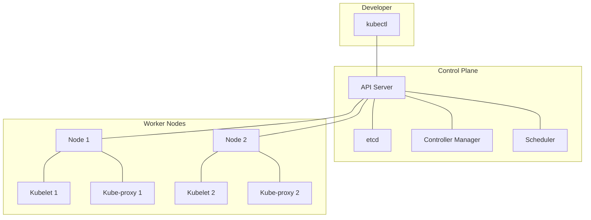
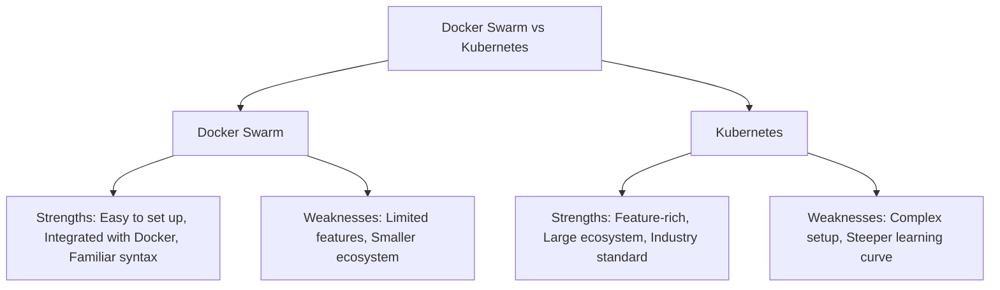

# Docker vs Kubernetes Comparison

## Introduction

Container technology has revolutionized how we build, ship, and run applications. Two prominent names in this space are Docker and Kubernetes. While often mentioned together, they serve different but complementary purposes in the container ecosystem. This guide will help you understand the differences and relationships between Docker and Kubernetes, and when to use each technology.

## What is Docker?

Docker is a platform that enables developers to build, package, and distribute applications as containers. A container is a lightweight, standalone, executable package that includes everything needed to run an application: code, runtime, system tools, libraries, and settings.

### Key Components of Docker

1. **Docker Engine**: The runtime that enables creating and running containers
2. **Docker Images**: Templates used to create containers
3. **Dockerfile**: Text file with instructions to build a Docker image
4. **Docker Hub**: Registry for sharing and storing Docker images
5. **Docker Compose**: Tool for defining and running multi-container applications

### Simple Docker Example

Let's create a basic containerized Node.js application:

1. First, create a `Dockerfile`:

```
FROM node:14-alpine
WORKDIR /app
COPY package*.json ./
RUN npm install
COPY . .
EXPOSE 3000
CMD ["node", "index.js"]
```

2. Build the Docker image:

```bash
docker build -t my-nodejs-app .
```

3. Run the container:

```bash
docker run -p 3000:3000 my-nodejs-app
```

Output:
```
> my-nodejs-app@1.0.0 start
> node index.js
Server running on port 3000
```

## What is Kubernetes?

Kubernetes (K8s) is an open-source container orchestration platform designed to automate the deployment, scaling, and management of containerized applications. It was originally developed by Google and is now maintained by the Cloud Native Computing Foundation (CNCF).

### Key Components of Kubernetes

1. **Cluster**: A set of nodes that run containerized applications
2. **Node**: A worker machine in the Kubernetes cluster
3. **Pod**: The smallest deployable unit in Kubernetes, containing one or more containers
4. **Service**: An abstraction that defines a logical set of pods and a policy to access them
5. **Deployment**: Manages the deployment and scaling of a set of pods
6. **ReplicaSet**: Ensures that a specified number of pod replicas are running at any given time
7. **Namespace**: Virtual cluster within a physical cluster

### Kubernetes Architecture



## Docker vs Kubernetes: Key Differences

| Feature | Docker | Kubernetes |
|---------|--------|------------|
| Primary Function | Container runtime and image building | Container orchestration platform |
| Scope | Single host by default | Designed for clusters |
| Scalability | Limited scaling with Docker Swarm | Highly scalable |
| Self-healing | Limited | Automatic container recovery |
| Load Balancing | Basic with Docker Compose | Advanced with Services |
| Rolling Updates | Manual process | Automated handling |
| Community | Large community | Very large enterprise-focused community |
| Learning Curve | Moderate | Steep |

## How Docker and Kubernetes Work Together

Docker and Kubernetes are not competing technologies but complementary tools that work together:

1. Docker is used to **create containers** that package applications
2. Kubernetes is used to **orchestrate** these containers across multiple hosts

### Workflow Example:

1. Develop application code
2. Create a Dockerfile
3. Build a Docker image
4. Push the image to a registry
5. Define Kubernetes manifests (YAML files)
6. Deploy the application to Kubernetes

## Real-World Application: Deploying a Microservice

Let's deploy a simple microservice architecture with Docker and Kubernetes:

### 1. Create Docker images for each service

For a frontend service, create a `Dockerfile`:

```
FROM nginx:alpine
COPY ./build /usr/share/nginx/html
EXPOSE 80
CMD ["nginx", "-g", "daemon off;"]
```

For a backend API service:

```
FROM node:14-alpine
WORKDIR /app
COPY package*.json ./
RUN npm install
COPY . .
EXPOSE 8080
CMD ["node", "server.js"]
```

### 2. Define Kubernetes deployment for frontend

Create a `frontend-deployment.yaml` file:

```yaml
apiVersion: apps/v1
kind: Deployment
metadata:
  name: frontend
spec:
  replicas: 3
  selector:
    matchLabels:
      app: frontend
  template:
    metadata:
      labels:
        app: frontend
    spec:
      containers:
      - name: frontend
        image: myregistry/frontend:latest
        ports:
        - containerPort: 80
```

### 3. Define a service to expose the frontend

Create a `frontend-service.yaml` file:

```yaml
apiVersion: v1
kind: Service
metadata:
  name: frontend-service
spec:
  selector:
    app: frontend
  ports:
  - port: 80
    targetPort: 80
  type: LoadBalancer
```

### 4. Deploy to Kubernetes

```bash
kubectl apply -f frontend-deployment.yaml
kubectl apply -f frontend-service.yaml
```

Output:
```
deployment.apps/frontend created
service/frontend-service created
```

## When to Use Docker Alone

Use Docker alone when:

1. You're developing on a local machine
2. You have a simple application with few containers
3. You're in the early stages of development
4. You need to quickly test an application
5. You're learning container concepts

## When to Use Kubernetes

Use Kubernetes when:

1. You need to deploy applications across multiple servers
2. High availability is required
3. You need automatic scaling of services
4. Your application has complex microservice architecture
5. You need advanced networking capabilities
6. You require automated rollbacks and updates

## Docker Compose vs Kubernetes

Docker Compose is a simpler alternative for orchestrating multiple containers on a single host:

```yaml
# docker-compose.yml example
version: '3'
services:
  web:
    image: nginx:alpine
    ports:
      - "80:80"
    volumes:
      - ./website:/usr/share/nginx/html
  api:
    build: ./api
    ports:
      - "8080:8080"
  database:
    image: postgres:12
    environment:
      POSTGRES_PASSWORD: example
    volumes:
      - db-data:/var/lib/postgresql/data

volumes:
  db-data:
```

To run:

```bash
docker-compose up
```

Compared to the equivalent Kubernetes setup, which would require multiple YAML files for deployments, services, and persistent volumes.

## Kubernetes vs Docker Swarm

Docker Swarm is Docker's native clustering and orchestration solution:



## Summary

- **Docker** is primarily a container runtime that allows you to build, ship, and run containers
- **Kubernetes** is a container orchestration platform that manages containerized applications across multiple hosts
- They work together: Docker creates the containers, Kubernetes orchestrates them
- Use Docker alone for simple, local development or small applications
- Use Kubernetes for complex, production-ready applications that require scaling and high availability
- Docker Compose and Docker Swarm offer simpler alternatives to Kubernetes for less complex scenarios

## Additional Resources

- Try the official [Kubernetes tutorials](https://kubernetes.io/docs/tutorials/)
- Practice with [Katacoda's Docker playground](https://www.katacoda.com/courses/docker)
- Explore [Minikube](https://minikube.sigs.k8s.io/) for local Kubernetes development
- Read the [Kubernetes Documentation](https://kubernetes.io/docs/home/)
- Join the [Kubernetes Slack community](https://kubernetes.slack.com/)

## Exercises

1. Install Docker and create a simple containerized web application
2. Use Docker Compose to set up a multi-container application with a database
3. Install Minikube to create a local Kubernetes cluster
4. Deploy the same application to both Docker Compose and Kubernetes, and compare the experience
5. Create a Kubernetes deployment with multiple replicas and observe how Kubernetes handles pod failures

By understanding both Docker and Kubernetes, you'll be well-equipped to choose the right tool for your container orchestration needs and build scalable, resilient applications.