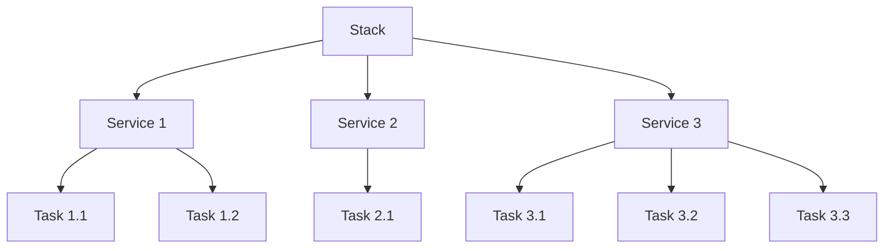

# Docker Swarm Stacks

## Introduction

Docker Swarm Stacks represent a higher-level abstraction in Docker's orchestration capabilities, allowing you to define and manage multi-container applications as a single entity. If you've worked with Docker Compose for local development, Swarm Stacks will feel familiar, as they build upon the same concept but extend it to work across a cluster of machines.

In this guide, we'll explore how Docker Swarm Stacks help simplify the deployment and management of complex applications in a distributed environment.

## Prerequisites

Before diving into Swarm Stacks, you should:
- Have a basic understanding of Docker containers
- Be familiar with Docker Compose
- Have a Docker Swarm cluster initialized

## Understanding Docker Swarm Stacks

### What is a Stack?

A stack is a collection of services that make up an application. It's defined using a Compose file format (similar to what you use with Docker Compose) but deployed across a Swarm cluster.



The key advantages of using Stacks include:

1. **Declarative configuration**: Define your entire application in a single YAML file
2. **Version control**: Track changes to your application structure
3. **Simplified deployments**: One command to deploy or update the entire application
4. **Service management**: Automatic load balancing, scaling, and failure recovery

## Creating Your First Stack

Let's create a simple web application stack with a web service and a database.

### Step 1: Create a stack file (docker-compose.yml)

Create a file named `docker-compose.yml`:

```yaml
version: '3.8'

services:
  web:
    image: nginx:latest
    ports:
      - "80:80"
    deploy:
      replicas: 3
      restart_policy:
        condition: on-failure
    networks:
      - webnet

  visualizer:
    image: dockersamples/visualizer
    ports:
      - "8080:8080"
    volumes:
      - "/var/run/docker.sock:/var/run/docker.sock"
    deploy:
      placement:
        constraints: [node.role == manager]
    networks:
      - webnet

networks:
  webnet:
```

This stack file defines:
- A web service using the nginx image with 3 replicas
- A visualizer service to help us see our containers across the cluster
- A network called webnet that connects our services

### Step 2: Deploy the stack

To deploy this stack, run:

```bash
docker stack deploy -c docker-compose.yml mywebapp
```

The output should look similar to:

```
Creating network mywebapp_webnet
Creating service mywebapp_web
Creating service mywebapp_visualizer
```

### Step 3: Verify the stack deployment

Check if your stack was deployed correctly:

```bash
docker stack ls
```

This will show all your deployed stacks:

```
NAME       SERVICES   ORCHESTRATOR
mywebapp   2          swarm
```

To see the services in your stack:

```bash
docker stack services mywebapp
```

Output:

```
ID            NAME                 MODE        REPLICAS  IMAGE                             PORTS
7n5hn56g9pbc  mywebapp_visualizer  replicated  1/1       dockersamples/visualizer:latest   *:8080->8080/tcp
9xpa4b5mrd8y  mywebapp_web         replicated  3/3       nginx:latest                      *:80->80/tcp
```

To see where tasks are running:

```bash
docker stack ps mywebapp
```

Output:

```
ID            NAME                   IMAGE                             NODE     DESIRED STATE  CURRENT STATE
udn3j4j7n9s4  mywebapp_web.1         nginx:latest                      node2    Running        Running 2 minutes ago
b8p0s3z9q7r1  mywebapp_web.2         nginx:latest                      node1    Running        Running 2 minutes ago
m4n6t7r8d2p0  mywebapp_web.3         nginx:latest                      node3    Running        Running 2 minutes ago
u5g1h2j3k4l5  mywebapp_visualizer.1  dockersamples/visualizer:latest   node1    Running        Running 2 minutes ago
```

Now you can visit:
- http://localhost:80 to see the nginx welcome page
- http://localhost:8080 to see the visualizer showing your containers across the Swarm

## Understanding Stack Components

Let's break down the key components of a Stack:

### Services

Services define "what to run" (which container image, how many replicas, network configurations, etc.). In our example, `web` and `visualizer` are services.

### Tasks

Tasks are the individual containers that Swarm schedules on nodes. Each replica of a service represents a task.

### Deploy Configurations

The `deploy` section specifies how the service should be deployed in the Swarm:

```yaml
deploy:
  replicas: 5                   # Number of container instances
  resources:
    limits:
      cpus: '0.5'               # CPU usage limit
      memory: 50M               # Memory usage limit
  restart_policy:
    condition: on-failure       # Restart policy
  update_config:
    parallelism: 2              # Update 2 containers at a time
    delay: 10s                  # Wait 10s between updates
  placement:
    constraints:
      - node.role == worker     # Place only on worker nodes
```

## Advanced Stack Features

Let's explore some more advanced features of Swarm Stacks:

### Volumes for Persistent Storage

```yaml
version: '3.8'

services:
  db:
    image: postgres:13
    volumes:
      - db-data:/var/lib/postgresql/data
    environment:
      POSTGRES_PASSWORD: example
    deploy:
      placement:
        constraints: [node.labels.db == true]

volumes:
  db-data:
```

### Secrets Management

Secrets allow you to securely provide sensitive data to services:

First, create a secret:

```bash
printf "mydbpassword" | docker secret create db_password -
```

Then use it in your stack:

```yaml
version: '3.8'

services:
  db:
    image: postgres:13
    secrets:
      - db_password
    environment:
      POSTGRES_PASSWORD_FILE: /run/secrets/db_password

secrets:
  db_password:
    external: true
```

### Configs for Configuration Files

Similar to secrets, configs let you provide configuration files to services:

```bash
docker config create nginx_conf ./nginx.conf
```

```yaml
version: '3.8'

services:
  web:
    image: nginx:latest
    configs:
      - source: nginx_conf
        target: /etc/nginx/nginx.conf

configs:
  nginx_conf:
    external: true
```

## Real-World Example: Multi-Tier Web Application

Let's look at a more complete example of a web application with frontend, backend, and database tiers:

```yaml
version: '3.8'

services:
  frontend:
    image: example/webapp-frontend:latest
    ports:
      - "80:80"
    deploy:
      replicas: 3
      update_config:
        parallelism: 1
        delay: 10s
      restart_policy:
        condition: on-failure
    networks:
      - frontend-network
      - backend-network

  backend:
    image: example/webapp-backend:latest
    deploy:
      replicas: 2
      placement:
        constraints:
          - node.role == worker
      restart_policy:
        condition: on-failure
    environment:
      - DB_HOST=database
      - DB_USER=webapp
      - DB_PASSWORD_FILE=/run/secrets/db_password
    secrets:
      - db_password
    networks:
      - backend-network
      - database-network

  database:
    image: postgres:13
    volumes:
      - db-data:/var/lib/postgresql/data
    deploy:
      placement:
        constraints:
          - node.labels.db == true
    environment:
      - POSTGRES_USER=webapp
      - POSTGRES_PASSWORD_FILE=/run/secrets/db_password
    secrets:
      - db_password
    networks:
      - database-network

networks:
  frontend-network:
  backend-network:
  database-network:

volumes:
  db-data:

secrets:
  db_password:
    external: true
```

This stack demonstrates several important patterns:

1. **Network segmentation**: Different network zones for security
2. **Secrets management**: Secure password handling
3. **Placement constraints**: Database on specific nodes
4. **Persistent storage**: Database data persists across deployments
5. **Replicated services**: Frontend and backend scale horizontally

## Managing Stacks

Here are some essential commands for stack management:

### Updating a Stack

To update a stack, simply modify your compose file and redeploy:

```bash
docker stack deploy -c docker-compose.yml mywebapp
```

Swarm will intelligently update only the services that have changed.

### Scaling Services

You can scale services by changing the replicas in your compose file:

```yaml
services:
  web:
    deploy:
      replicas: 5  # Changed from 3 to 5
```

Then redeploy the stack:

```bash
docker stack deploy -c docker-compose.yml mywebapp
```

### Removing a Stack

To remove a stack and all its services:

```bash
docker stack rm mywebapp
```

## Common Issues and Troubleshooting

### Service Not Starting

If a service isn't starting, check its logs:

```bash
docker service logs mywebapp_web
```

### Node Placement Issues

If services won't place on nodes, verify your constraints match your node labels:

```bash
docker node ls --format "{{.ID}} {{.Hostname}} {{.Status}} {{.Availability}} {{.Labels}}"
```

### Network Connectivity Issues

To troubleshoot network issues, you can deploy a simple diagnostic container:

```bash
docker service create --name network-test --network mywebapp_webnet alpine ping -c 3 mywebapp_web
docker service logs network-test
```

## Best Practices

1. **Version your stack files**: Keep them in version control
2. **Use environment variables**: For values that change between environments
3. **Limit resource usage**: Set memory and CPU limits
4. **Place stateful services carefully**: Use placement constraints for databases
5. **Plan for failure**: Set restart policies for all services
6. **Separate concerns**: Use multiple stacks for independent applications
7. **Follow the principle of least privilege**: Restrict network access between services

## Summary

Docker Swarm Stacks provide a powerful way to deploy and manage multi-container applications across a cluster of Docker hosts. They extend the familiar Docker Compose concept to a distributed environment, enabling:

- Declarative application definitions
- Simple deployments and updates
- Automated scaling and load balancing
- Service resilience with health checks and restart policies

As you become more comfortable with Swarm Stacks, you'll find they provide the perfect balance between simplicity and power for many orchestration needs.

## Further Learning

Here are some topics to explore next:

1. **Advanced service discovery**: Learn how Swarm's internal DNS works
2. **Integration with CI/CD pipelines**: Automated stack deployments
3. **Monitoring and logging**: Setting up centralized logging for stack services
4. **Comparison with Kubernetes**: Understanding when to use Swarm vs Kubernetes

## Exercises

1. Create a stack with a web service and a Redis cache
2. Implement rolling updates for a service
3. Set up a stack that uses secrets for database credentials
4. Create a multi-stage Dockerfile for an application and deploy it using a stack
5. Implement a blue/green deployment strategy using Swarm stacks