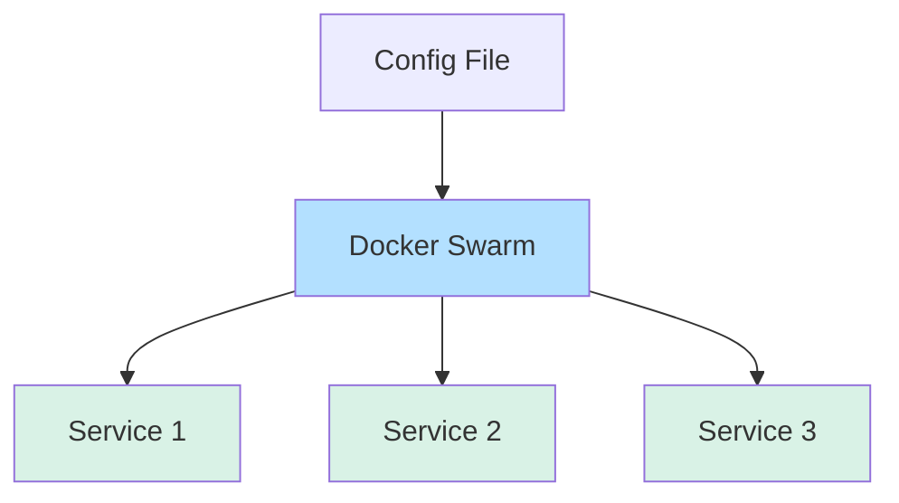

# Docker Swarm Configs

## Introduction

When managing a distributed application across multiple containers in a Docker Swarm, sharing configuration data efficiently becomes a critical challenge. Docker Swarm Configs provides a solution to this problem by allowing you to store and distribute configuration data to containers in a secure and efficient manner.

In this tutorial, you'll learn what Docker Swarm configs are, why they're useful, and how to implement them in your own applications.

## What are Docker Swarm Configs?

Docker Swarm Configs is a feature that allows you to store non-sensitive configuration information as objects in the swarm and then securely distribute this configuration to only the services that need access to it. This eliminates the need to build configuration data into your container images or pass it through environment variables.



Some key features of Docker Swarm configs:

- Configs are only accessible to services that have been granted explicit access
- Configs are mounted into containers as files in a temporary filesystem
- Config updates require redeployment of services
- Configs are immutable once created

## Prerequisites

Before you begin, ensure you have:

1. Docker installed (version 17.06.0 or higher)
2. A Docker Swarm initialized (`docker swarm init`)
3. Basic familiarity with Docker Swarm services

## Creating and Using Docker Swarm Configs

Let's walk through the process of creating and using configs in a Docker Swarm environment.

### Step 1: Create a Config File

First, let's create a simple configuration file that we want to share with our services:

```bash
echo "This is a configuration file for our application" > app-config.txt
```

### Step 2: Create a Docker Config

Now, let's create a Docker config from this file:

```bash
docker config create app-config ./app-config.txt
```

Output:
```
mqu3gd0yp5bhbzymjdom0hipd
```

You can verify the config was created with:

```bash
docker config ls
```

Output:
```
ID                          NAME        CREATED          UPDATED
mqu3gd0yp5bhbzymjdom0hipd   app-config  10 seconds ago   10 seconds ago
```

### Step 3: Create a Service Using the Config

Now, let's create a service that uses this config:

```bash
docker service create \
  --name nginx-config-demo \
  --config source=app-config,target=/usr/share/nginx/html/config.txt \
  --publish 8080:80 \
  nginx
```

This command:
- Creates a new service named `nginx-config-demo`
- Mounts the `app-config` config to `/usr/share/nginx/html/config.txt` inside the container
- Publishes port 8080 on the host to port 80 in the container
- Uses the `nginx` image

### Step 4: Verify the Config is Available

We can now check if our config is properly mounted in the container:

```bash
# First, find the container ID
docker ps --filter name=nginx-config-demo -q

# Then, execute a command in the container
docker exec $(docker ps --filter name=nginx-config-demo -q) cat /usr/share/nginx/html/config.txt
```

Output:
```
This is a configuration file for our application
```

You can also access the configuration via the web server:

```bash
curl http://localhost:8080/config.txt
```

Output:
```
This is a configuration file for our application
```

## Real-World Example: Multi-Environment Configuration

In real applications, you might need different configurations for different environments (development, staging, production). Let's implement a more complex example.

### Creating Environment-Specific Configs

First, let's create configuration files for each environment:

```bash
# Create development config
echo '{"api_url": "http://dev-api.example.com", "debug": true, "log_level": "debug"}' > config.dev.json

# Create production config
echo '{"api_url": "https://api.example.com", "debug": false, "log_level": "error"}' > config.prod.json
```

Now, let's create Docker configs from these files:

```bash
docker config create app-config-dev ./config.dev.json
docker config create app-config-prod ./config.prod.json
```

### Creating a Node.js Application

Let's create a simple Node.js application that reads the configuration:

```javascript
// app.js
const fs = require('fs');
const path = require('path');

// Read the config file
const configPath = path.join(process.env.CONFIG_PATH || '/app/config', 'config.json');
const config = JSON.parse(fs.readFileSync(configPath, 'utf8'));

console.log('App starting with configuration:');
console.log(JSON.stringify(config, null, 2));

const express = require('express');
const app = express();
const port = 3000;

app.get('/', (req, res) => {
  res.json({
    message: 'Configuration loaded successfully',
    environment: config.debug ? 'development' : 'production',
    api_url: config.api_url,
    log_level: config.log_level
  });
});

app.listen(port, () => {
  console.log(`App listening at http://localhost:${port}`);
});
```

Create a Dockerfile:

```dockerfile
FROM node:14-alpine

WORKDIR /app

COPY package.json package-lock.json ./
RUN npm install

COPY app.js ./

CMD ["node", "app.js"]
```

Build and push the Docker image:

```bash
docker build -t yourregistry/config-demo:latest .
docker push yourregistry/config-demo:latest
```

### Deploying with Environment-Specific Configs

Now, let's deploy our application with different configurations:

```bash
# Development environment
docker service create \
  --name app-dev \
  --config source=app-config-dev,target=/app/config/config.json \
  --publish 3001:3000 \
  yourregistry/config-demo:latest

# Production environment
docker service create \
  --name app-prod \
  --config source=app-config-prod,target=/app/config/config.json \
  --publish 3002:3000 \
  yourregistry/config-demo:latest
```

You can now access both environments:
- Development: http://localhost:3001
- Production: http://localhost:3002

Each service will display different configuration values based on the config that was mounted.

## Working with Config Updates

Docker Swarm configs are immutable, which means you cannot update an existing config. Instead, you need to:

1. Create a new config with the updated content
2. Update the service to use the new config
3. Remove the old config (optional)

Let's see how to update our configuration:

```bash
# Create updated config file
echo '{"api_url": "http://new-dev-api.example.com", "debug": true, "log_level": "info"}' > config.dev.v2.json

# Create new config
docker config create app-config-dev-v2 ./config.dev.v2.json

# Update the service to use the new config
docker service update \
  --config-rm app-config-dev \
  --config-add source=app-config-dev-v2,target=/app/config/config.json \
  app-dev
```

The service will be updated to use the new configuration.

## Config Permissions and Security

You can control access to your configs by specifying the file mode when mounting:

```bash
docker service create \
  --name secure-app \
  --config source=app-secrets,target=/app/config/secrets.json,mode=0400 \
  yourregistry/config-demo:latest
```

This sets the permissions to read-only for the file owner (root by default), which prevents other users in the container from accessing the config.

## Best Practices for Swarm Configs

Here are some best practices for working with Docker Swarm configs:

1. **Use configs for non-sensitive data only**: For sensitive data, use Docker secrets instead
2. **Name configs clearly**: Include version or environment information in the config name
3. **Version your configs**: Use a versioning scheme when creating configs to track changes
4. **Document dependencies**: Keep track of which services depend on which configs
5. **Clean up unused configs**: Remove old configs that are no longer in use

## When to Use Configs vs. Other Methods

| Method | Use Case | Pros | Cons |
| ------ | -------- | ---- | ---- |
| Docker Configs | Non-sensitive application configuration | Centralized, secure distribution | Requires swarm mode, immutable |
| Environment Variables | Simple configuration, runtime settings | Easy to set, no additional files | Limited in size, all or nothing access |
| Config Files in Image | Default configuration | Bundled with app | Requires rebuild for changes |
| Mounted Volumes | Large configuration files, frequently changing config | Can be updated without redeploy | Requires volume management |
| Docker Secrets | Sensitive information | Encrypted, secure | Similar limitations to configs |

## Summary

Docker Swarm Configs provides a powerful mechanism for managing configuration across a Docker Swarm cluster. In this tutorial, you've learned:

- What Docker Swarm Configs are and their key features
- How to create and use configs with Docker services
- How to implement multi-environment configuration
- Best practices for managing configs in a production environment

By using Docker Swarm Configs effectively, you can simplify your application's configuration management, improve security, and make your deployments more repeatable and reliable.

## Additional Resources

- [Docker Configs Documentation](https://docs.docker.com/engine/swarm/configs/)
- [Docker Secrets Documentation](https://docs.docker.com/engine/swarm/secrets/) (for sensitive data)
- [Docker Service Create Command Reference](https://docs.docker.com/engine/reference/commandline/service_create/)

## Exercises

1. Create a Docker Swarm Config containing a custom Nginx configuration and deploy an Nginx service using this config.
2. Create a multi-container application that shares the same configuration using Docker Configs.
3. Implement a versioning strategy for your configs and practice updating a service to use a newer config version.
4. Create a Docker Compose file that defines a service using a Docker Config.
5. Compare the use of Docker Configs and Docker Secrets in a sample application that requires both non-sensitive and sensitive configuration.