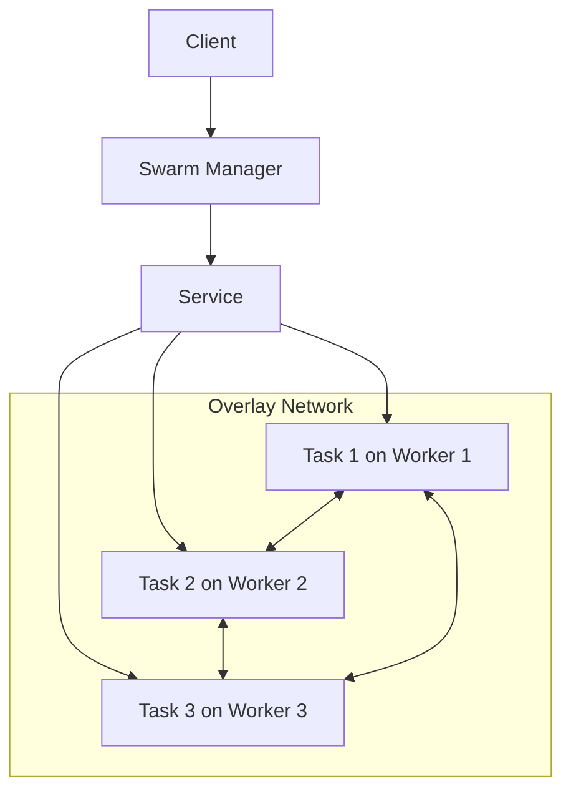
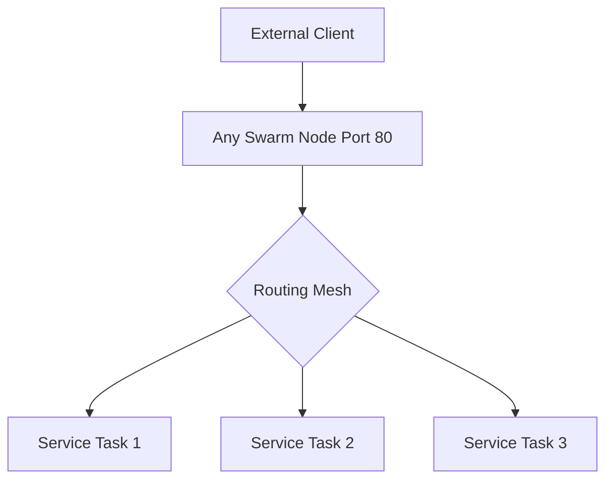

# Docker Swarm Networking

## Introduction

Docker Swarm is Docker's native clustering and orchestration solution, allowing you to create and manage a swarm of Docker nodes and deploy application services across them. One of the most powerful yet complex aspects of Docker Swarm is its networking capabilities.

In this guide, we'll explore how networking works in Docker Swarm, from basic concepts to advanced configurations. By the end, you'll understand how containers communicate within a swarm, how to manage network traffic, and how to implement common networking patterns for your distributed applications.

## Prerequisites

Before diving into Docker Swarm networking, make sure you have:

- Basic understanding of Docker containers
- Docker Engine installed (version 1.12 or later)
- Basic knowledge of networking concepts (IP addresses, ports, etc.)
- Multiple machines or VMs for testing a swarm (optional but recommended)

## Docker Swarm Networking Fundamentals

### The Network Architecture

Docker Swarm implements a networking model that allows containers to communicate across multiple host machines as if they were on the same host. This is achieved through an overlay network that spans across all nodes in the swarm.



### Network Types in Docker Swarm

Docker Swarm supports several different network types:

1. **Overlay Networks**: Allow containers on different Docker hosts to communicate
2. **Bridge Networks**: Connect containers on the same Docker host
3. **Host Networks**: Remove network isolation between the container and the host
4. **Macvlan Networks**: Allow containers to appear as physical devices on your network
5. **None Networks**: Disable networking for a container

For most Swarm deployments, overlay networks are the most important as they enable cross-node communication.

## Creating and Managing Overlay Networks

### Creating an Overlay Network

To create an overlay network in your swarm, use the following command:

```bash
docker network create --driver overlay my-network
```

This creates a network named `my-network` that can span across all nodes in your swarm.

### Inspecting Networks

You can inspect the network to see its details:

```bash
docker network inspect my-network
```

Output (simplified):

```json
[
    {
        "Name": "my-network",
        "Id": "j3fvzxlf2q7hhprcm9938nay0",
        "Created": "2023-06-15T20:46:10.272744688Z",
        "Scope": "swarm",
        "Driver": "overlay",
        "EnableIPv6": false,
        "IPAM": {
            "Driver": "default",
            "Config": [
                {
                    "Subnet": "10.0.0.0/24",
                    "Gateway": "10.0.0.1"
                }
            ]
        },
        "Internal": false,
        "Attachable": false,
        "Ingress": false,
        "Containers": {},
        "Options": {
            "com.docker.network.driver.overlay.vxlanid_list": "4097"
        },
        "Labels": {}
    }
]
```

### Attaching Services to Networks

When you create a service, you can attach it to one or more overlay networks:

```bash
docker service create \
  --name my-service \
  --network my-network \
  --replicas 3 \
  nginx
```

This deploys three replicas of the Nginx container and connects them to `my-network`.

## Understanding Network Encryption

By default, application data traveling between nodes in an overlay network is not encrypted. For added security, you can enable encryption when creating the network:

```bash
docker network create --driver overlay --opt encrypted my-secure-network
```

This encrypts all traffic on that overlay network, providing an additional layer of security for sensitive data.

## Service Discovery in Docker Swarm

Docker Swarm provides built-in service discovery, allowing containers to find and communicate with each other using DNS names.

### Internal DNS System

When you create a service in a swarm, it automatically registers in the internal DNS system with its service name. This means other services can connect to it using just the service name.

For example, if you have a service named `database`, another service can connect to it simply by using the hostname `database`.

### Example: Web Application with Database

Let's create a simple web application that connects to a database:

1. First, create an overlay network:

```bash
docker network create --driver overlay app-network
```

2. Create a MySQL database service:

```bash
docker service create \
  --name mysql \
  --network app-network \
  --env MYSQL_ROOT_PASSWORD=my-secret-pw \
  --env MYSQL_DATABASE=myapp \
  mysql:5.7
```

3. Create a web application service that connects to the database:

```bash
docker service create \
  --name webapp \
  --network app-network \
  --env DB_HOST=mysql \
  --env DB_PASSWORD=my-secret-pw \
  --publish 80:80 \
  --replicas 3 \
  mywebapp:latest
```

In this example, the web application can connect to the database using the hostname `mysql` within its connection configuration.

## Load Balancing and the Routing Mesh

Docker Swarm includes a built-in load balancer that distributes incoming requests across all service tasks.

### Ingress Network

The ingress network is a special overlay network created automatically when you initialize a swarm. This network handles routing mesh traffic for services with published ports.

### How the Routing Mesh Works

When you publish a port for a service (using the `--publish` flag), the swarm makes that service available on that port on every node in the swarm, whether or not there's a task for that service running on the node.



Let's see this in action:

```bash
# Create a service with 3 replicas and publish port 8080
docker service create \
  --name web-server \
  --publish 8080:80 \
  --replicas 3 \
  nginx
```

Now, you can access your service on port 8080 on any node in the swarm, and Docker will route your request to one of the three replicas.

### Testing the Load Balancer

To test the load balancer, you can create a simple service that displays its container ID:

```bash
docker service create \
  --name whoami \
  --publish 8000:8000 \
  --replicas 3 \
  jwilder/whoami
```

If you make multiple requests to port 8000 on any swarm node, you'll see responses from different container IDs as the requests are load balanced across the three replicas.

## Configuring Overlay Network Properties

You can configure various properties of overlay networks to meet your specific requirements.

### Subnet and Gateway

You can specify the subnet and gateway for an overlay network:

```bash
docker network create \
  --driver overlay \
  --subnet 10.0.9.0/24 \
  --gateway 10.0.9.1 \
  custom-network
```

### MTU (Maximum Transmission Unit)

You can configure the MTU value for the overlay network:

```bash
docker network create \
  --driver overlay \
  --opt com.docker.network.driver.mtu=1400 \
  custom-mtu-network
```

## Port Publishing Modes

Docker Swarm supports two publishing modes for service ports:

### Ingress Mode (Default)

Publishes the port on every node in the swarm, routing requests to active containers:

```bash
docker service create \
  --name web \
  --publish published=8080,target=80 \
  nginx
```

### Host Mode

Publishes the port only on nodes where service tasks are running:

```bash
docker service create \
  --name web \
  --publish published=8080,target=80,mode=host \
  nginx
```

## Network Troubleshooting in Docker Swarm

When troubleshooting networking issues in Docker Swarm, these commands can be helpful:

### Listing Networks

```bash
docker network ls
```

Output:
```
NETWORK ID          NAME                DRIVER              SCOPE
078a8a5c20ad        bridge              bridge              local
abca3decf848        docker_gwbridge     bridge              local
e9eb4139d155        host                host                local
j3fvzxlf2q7h        ingress             overlay             swarm
1fd675612271        my-network          overlay             swarm
9a68c93944ce        none                null                local
```

### Checking Network Connectivity

Using a container to test connectivity to another service:

```bash
docker run --rm --network my-network appropriate/curl curl -s http://my-service:80
```

### Inspecting Service Tasks and Networks

```bash
docker service ps my-service
docker network inspect my-network
```

## Advanced Networking Patterns

### Multi-Network Services

You can attach a service to multiple networks for segmentation:

```bash
docker network create --driver overlay frontend-network
docker network create --driver overlay backend-network

docker service create \
  --name api \
  --network frontend-network \
  --network backend-network \
  my-api-image
```

This setup allows the API service to communicate with both frontend and backend services while keeping those networks separate.

### External Service Communication

Sometimes, you need services in your swarm to communicate with external services. You have several options:

1. **DNS-based resolution**: Configure your external DNS to point to your swarm nodes
2. **Proxy service**: Use a proxy like Nginx to route traffic to external services
3. **Host networking**: For direct external connectivity without overlay networks

Example proxy configuration:

```bash
docker service create \
  --name external-proxy \
  --publish 8000:80 \
  --config source=proxy.conf,target=/etc/nginx/conf.d/proxy.conf \
  nginx
```

## Security Considerations

### Network Isolation

Use multiple overlay networks to isolate different components of your application:

```bash
# Create separate networks for different application tiers
docker network create --driver overlay frontend-net
docker network create --driver overlay backend-net
docker network create --driver overlay data-net

# Deploy services to appropriate networks
docker service create --name web --network frontend-net nginx
docker service create --name api --network frontend-net --network backend-net myapi
docker service create --name db --network data-net --network backend-net postgres
```

### Encrypted Networks

For sensitive data, always use encrypted overlay networks:

```bash
docker network create --driver overlay --opt encrypted secure-network
```

## Practical Example: Three-Tier Web Application

Let's put everything together with a complete example of a three-tier web application:

1. Create necessary networks:

```bash
docker network create --driver overlay frontend-network
docker network create --driver overlay --opt encrypted backend-network
```

2. Deploy a database service:

```bash
docker service create \
  --name postgres \
  --network backend-network \
  --env POSTGRES_PASSWORD=mypassword \
  --env POSTGRES_DB=myapp \
  --mount type=volume,source=postgres-data,destination=/var/lib/postgresql/data \
  postgres:13
```

3. Deploy an API service:

```bash
docker service create \
  --name api \
  --network frontend-network \
  --network backend-network \
  --env DB_HOST=postgres \
  --env DB_PASSWORD=mypassword \
  --env DB_NAME=myapp \
  --replicas 3 \
  myapp/api:latest
```

4. Deploy a web frontend:

```bash
docker service create \
  --name web \
  --network frontend-network \
  --env API_URL=http://api:3000 \
  --publish 80:80 \
  --replicas 3 \
  myapp/web:latest
```

This setup creates a secure, scalable application with:
- Public access to the web frontend
- Internal communication between web and API
- Encrypted communication between API and database
- Proper network isolation between tiers

## Summary

Docker Swarm networking provides a powerful foundation for building distributed applications:

- **Overlay networks** enable container communication across multiple hosts
- **Service discovery** allows services to find each other by name
- **Load balancing** distributes traffic across service replicas
- **Network segmentation** improves security and organization
- **Routing mesh** makes services accessible from any node in the swarm

Understanding these networking concepts is crucial for designing and deploying effective Docker Swarm applications that are both reliable and secure.

## Exercises

1. Create a simple two-service application with a web frontend and a backend API, each running on separate overlay networks.
2. Set up a service that's accessible externally, and verify the routing mesh by accessing it through different nodes.
3. Implement network encryption for a sensitive service and verify that traffic is encrypted.
4. Create a multi-tier application with proper network isolation between tiers.

## Additional Resources

- [Docker Documentation: Swarm Networking](https://docs.docker.com/engine/swarm/networking/)
- [Docker Documentation: Overlay Networks](https://docs.docker.com/network/overlay/)
- [Docker Documentation: Configure Service Discovery](https://docs.docker.com/engine/swarm/networking/#configure-service-discovery)