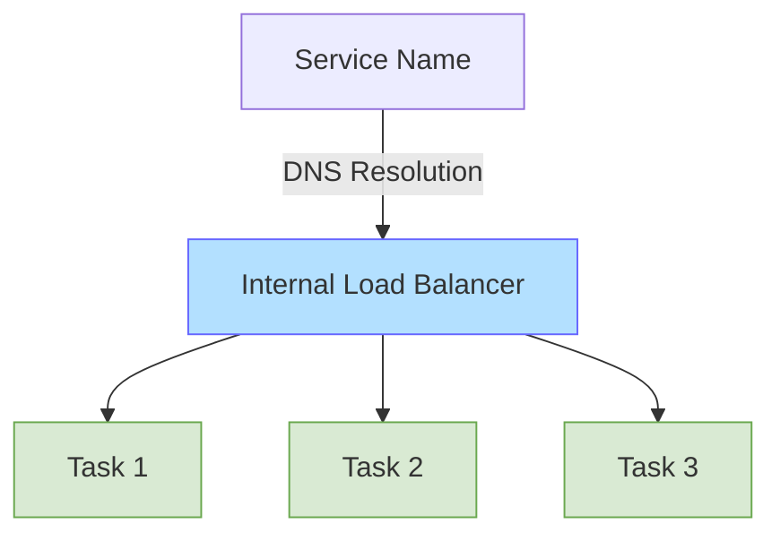
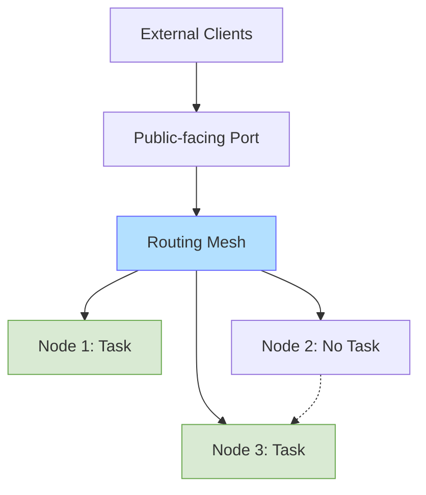

# Docker Swarm Load Balancing

## Introduction

Load balancing is a critical aspect of maintaining high-availability applications in a distributed environment. As your applications scale to handle increasing traffic, you need a reliable mechanism to distribute requests evenly across multiple service instances. Docker Swarm, Docker's native clustering and orchestration solution, provides built-in load balancing capabilities that make this process seamless and efficient.

In this guide, we'll explore how Docker Swarm handles load balancing, the different types of load balancing available, and how to implement and optimize load balancing for your services.

## Understanding Docker Swarm Load Balancing

Docker Swarm implements load balancing at two distinct levels:

1. **Internal Load Balancing**: Distributes traffic within the swarm cluster
2. **External Load Balancing**: Manages incoming traffic from outside the swarm

Let's break down how each works:

### Internal Load Balancing

Docker Swarm uses a built-in DNS-based load balancing mechanism for internal service discovery and load distribution. When you create a service in swarm mode, each task (container instance) receives a slot on the internal routing mesh network.



When a service wants to communicate with another service, it only needs to know the service name. Docker's internal DNS resolves the service name to the virtual IP (VIP) assigned to the service, and the traffic is distributed among the healthy tasks.

### External Load Balancing

For external traffic, Docker Swarm provides a routing mesh that extends across all nodes in the swarm. This allows incoming requests to be accepted by any node, regardless of whether that node is running the service container.



## Setting Up Load Balancing with Docker Swarm

Let's walk through the process of creating a load-balanced service in Docker Swarm:

### Step 1: Initialize a Docker Swarm

If you haven't already set up a swarm, initialize one with:

```bash
docker swarm init --advertise-addr <MANAGER-IP>
```

This command transforms your Docker engine into a swarm manager.

### Step 2: Create a Service with Multiple Replicas

To demonstrate load balancing, let's create a simple web service with multiple replicas:

```bash
docker service create \
  --name web-server \
  --replicas 3 \
  --publish published=8080,target=80 \
  nginx:latest
```

This command:
- Creates a service named `web-server`
- Deploys 3 replicas (instances)
- Maps port 8080 on the host to port 80 in the container
- Uses the nginx web server image

### Step 3: Verify Service Deployment

Check that your service is running properly:

```bash
docker service ls
```

Output:
```
ID             NAME         MODE         REPLICAS   IMAGE          PORTS
uahzn5xrc8he   web-server   replicated   3/3        nginx:latest   *:8080->80/tcp
```

To see the distribution of tasks across nodes:

```bash
docker service ps web-server
```

Output:
```
ID             NAME            IMAGE          NODE      DESIRED STATE   CURRENT STATE
7opsckr0bx3d   web-server.1    nginx:latest   node1     Running         Running 2 minutes ago
hpfppc3k4grf   web-server.2    nginx:latest   node2     Running         Running 2 minutes ago
bn5r9canj8d7   web-server.3    nginx:latest   node3     Running         Running 2 minutes ago
```

## Load Balancing Strategies in Docker Swarm

Docker Swarm supports several load balancing strategies that can be configured based on your specific needs:

### 1. Round Robin (Default)

By default, Docker Swarm uses a round-robin algorithm that distributes requests sequentially among available tasks.

### 2. DNS Round Robin

You can disable the virtual IP and use DNS round-robin instead:

```bash
docker service create \
  --name web-server \
  --replicas 3 \
  --publish published=8080,target=80 \
  --endpoint-mode dnsrr \
  nginx:latest
```

The `--endpoint-mode dnsrr` flag configures the service to use DNS round-robin instead of a virtual IP.

### 3. Custom Load Balancing with Labels

For more advanced load balancing, you can use node labels to control placement and distribution:

```bash
# Add labels to nodes
docker node update --label-add zone=east node1
docker node update --label-add zone=west node2
docker node update --label-add zone=east node3

# Create service with placement constraints
docker service create \
  --name web-server \
  --replicas 6 \
  --publish published=8080,target=80 \
  --placement-pref 'spread=node.labels.zone' \
  nginx:latest
```

This creates a service that distributes tasks evenly across different zones.

## Real-World Example: Scaling a Web Application

Let's implement a more practical example of load balancing with a simple web application:

### Example: Load Balanced Web Application with Redis Backend

First, let's create an overlay network for our application:

```bash
docker network create --driver overlay webapp-network
```

Now, let's deploy a Redis service for our backend:

```bash
docker service create \
  --name redis \
  --network webapp-network \
  redis:latest
```

Next, deploy our web application with multiple replicas:

```bash
docker service create \
  --name webapp \
  --replicas 5 \
  --network webapp-network \
  --publish published=80,target=8000 \
  --env REDIS_URL=redis:6379 \
  mywebapp:latest
```

In this example:
1. The web application can scale independently from the Redis backend
2. All 5 webapp replicas can communicate with the Redis service using the service name
3. External traffic coming to any node on port 80 will be automatically load balanced among the 5 webapp replicas

### Testing the Load Balancing

To verify that load balancing is working, you can make multiple requests to the service and observe how they're distributed:

```bash
for i in {1..10}; do curl -s http://localhost:80/hostname; echo; done
```

Output:
```
webapp-1
webapp-3
webapp-5
webapp-2
webapp-4
webapp-1
webapp-3
webapp-5
webapp-2
webapp-4
```

This shows that requests are being distributed across different container instances.

## Advanced Load Balancing Configuration

### Health Checks for Better Load Distribution

Adding health checks ensures that only healthy containers receive traffic:

```bash
docker service create \
  --name web-server \
  --replicas 3 \
  --publish published=8080,target=80 \
  --health-cmd "curl -f http://localhost/health || exit 1" \
  --health-interval 5s \
  --health-retries 3 \
  --health-timeout 2s \
  nginx:latest
```

### Using Update Config for Zero-Downtime Deployments

When updating your services, you can configure rolling updates for zero-downtime deployments:

```bash
docker service create \
  --name web-server \
  --replicas 5 \
  --publish published=8080,target=80 \
  --update-delay 10s \
  --update-parallelism 2 \
  --update-failure-action rollback \
  nginx:latest
```

This configuration:
- Updates 2 tasks at a time
- Waits 10 seconds between updates
- Automatically rolls back if the update fails

## Limitations and Considerations

While Docker Swarm's built-in load balancing is powerful, there are some considerations to keep in mind:

1. **Session Stickiness**: The default load balancer doesn't support session stickiness. For stateful applications requiring sticky sessions, you might need an additional solution like HAProxy or Traefik.

2. **Layer 4 Load Balancing**: Swarm's routing mesh operates at Layer 4 (transport layer), so it can only route based on IP address and port, not application-level attributes like HTTP headers.

3. **External Load Balancers**: For production environments, you might want to consider adding an external load balancer like NGINX, HAProxy, or a cloud provider's load balancing service for more advanced features.

## Summary

Docker Swarm provides robust built-in load balancing capabilities that are easy to set up and use. By utilizing the internal DNS-based service discovery and the routing mesh for external traffic, Swarm ensures your services remain highly available and resilient. 

Key points to remember:
- Internal load balancing uses DNS and VIPs for service discovery
- External load balancing uses the routing mesh across all nodes
- Default round-robin algorithm distributes requests evenly
- More advanced distribution can be achieved through placement constraints and labels
- Health checks ensure only healthy containers receive traffic

With these fundamentals, you can build scalable, load-balanced applications using Docker Swarm's orchestration capabilities.

## Additional Resources

To further explore Docker Swarm load balancing:

- [Docker Documentation: Use swarm mode routing mesh](https://docs.docker.com/engine/swarm/networking/)
- [Docker Documentation: Configure service discovery](https://docs.docker.com/engine/swarm/networking/#configure-service-discovery)
- [Docker Documentation: Use swarm mode service discovery](https://docs.docker.com/engine/swarm/networking/#use-swarm-mode-service-discovery)

## Exercises

1. Create a simple web application and deploy it as a service with 3 replicas. Modify the application to display its container ID, then test the load balancing behavior.

2. Set up a two-tier application with a frontend service and a backend database. Configure appropriate networks and verify that load balancing works correctly.

3. Experiment with different placement strategies using node labels and constraints. Observe how tasks are distributed across your swarm.

4. Implement health checks for your services and test failover scenarios by manually stopping containers to see how traffic redirects.

5. Configure and test a rolling update with different parallelism and delay settings. Measure the impact on service availability during updates.