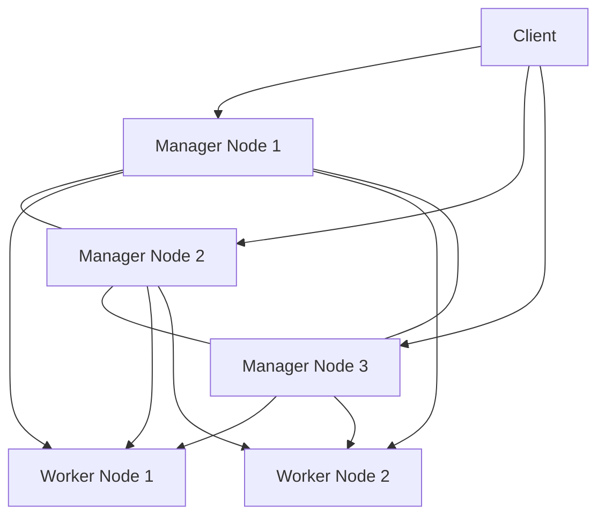

# Docker Swarm High Availability

## Introduction

High Availability (HA) is a critical feature in any production-grade container orchestration system. In the context of Docker Swarm, high availability refers to the ability of the system to remain operational even when individual nodes or components fail. 

Docker Swarm, Docker's native clustering and orchestration solution, provides several built-in features to ensure high availability. This guide will explore how to design, implement, and maintain a highly available Docker Swarm cluster, minimizing downtime and ensuring your applications remain accessible even during infrastructure failures.

## Understanding High Availability Concepts

Before diving into the technical details, let's understand some key concepts related to high availability in Docker Swarm:

- **Fault Tolerance**: The ability of a system to continue operating properly even when some of its components fail
- **Redundancy**: Duplication of critical components to provide backup in case of failure
- **Load Balancing**: Distribution of workloads across multiple nodes to optimize resource usage
- **Failover**: The automatic switching to a redundant system when the primary system fails
- **Quorum**: The minimum number of manager nodes that must be available for the cluster to function properly

## Docker Swarm Architecture for High Availability

A Docker Swarm cluster consists of two types of nodes:

1. **Manager Nodes**: Responsible for orchestrating the cluster, maintaining the desired state, and scheduling services
2. **Worker Nodes**: Execute the containers assigned to them by manager nodes



### Manager Node Redundancy

For high availability, it's crucial to have multiple manager nodes. Docker Swarm uses the Raft consensus algorithm to maintain cluster state consistency across manager nodes.

**Key considerations for manager nodes:**

- Deploy an **odd number** of manager nodes (3, 5, or 7)
- Distribute manager nodes across different availability zones or failure domains
- Manager nodes should have stable network connectivity between them

**Manager quorum requirements:**

| Total Manager Nodes | Quorum (Majority) | Maximum Failures Tolerated |
|---------------------|-------------------|-----------------------------|
| 1                   | 1                 | 0                           |
| 3                   | 2                 | 1                           |
| 5                   | 3                 | 2                           |
| 7                   | 4                 | 3                           |

:::caution
While you can technically have 2, 4, or 6 manager nodes, these configurations don't improve fault tolerance over the next lower odd number.
:::

## Setting Up a Highly Available Swarm Cluster

Let's walk through the process of creating a highly available Docker Swarm cluster with multiple manager and worker nodes.

### Prerequisites

- Multiple servers (physical or virtual) with Docker installed
- Network connectivity between all nodes
- Basic understanding of Docker and command-line operations

### Step 1: Initialize the Swarm on the First Manager Node

```bash
# On the first manager node
docker swarm init --advertise-addr <MANAGER-IP>
```

Example output:
```
Swarm initialized: current node (dxn1zf6l61qsb1josjja83ngz) is now a manager.

To add a worker to this swarm, run the following command:
    docker swarm join --token SWMTKN-1-49nj1cmql0jkz5s954yi3oex3nedyz0fb0xx14ie39trti4wxv-8vxv8rssmk743ojnwacrr2e7c 192.168.99.100:2377

To add a manager to this swarm, run 'docker swarm join-token manager' and follow the instructions.
```

### Step 2: Add More Manager Nodes

Generate a manager join token on the first manager:

```bash
# On the first manager node
docker swarm join-token manager
```

Example output:
```
To add a manager to this swarm, run the following command:
    docker swarm join --token SWMTKN-1-49nj1cmql0jkz5s954yi3oex3nedyz0fb0xx14ie39trti4wxv-2tviqzd7f9f1u3lb0s1ec7t67 192.168.99.100:2377
```

Run the provided command on each server that should become a manager:

```bash
# On each additional manager node
docker swarm join --token SWMTKN-1-49nj1cmql0jkz5s954yi3oex3nedyz0fb0xx14ie39trti4wxv-2tviqzd7f9f1u3lb0s1ec7t67 192.168.99.100:2377
```

### Step 3: Add Worker Nodes

Generate a worker join token on any manager:

```bash
# On any manager node
docker swarm join-token worker
```

Run the provided command on each server that should become a worker:

```bash
# On each worker node
docker swarm join --token SWMTKN-1-49nj1cmql0jkz5s954yi3oex3nedyz0fb0xx14ie39trti4wxv-8vxv8rssmk743ojnwacrr2e7c 192.168.99.100:2377
```

### Step 4: Verify the Swarm Cluster

Check the status of your Swarm cluster:

```bash
# On any manager node
docker node ls
```

Example output:
```
ID                            HOSTNAME            STATUS    AVAILABILITY   MANAGER STATUS   ENGINE VERSION
dxn1zf6l61qsb1josjja83ngz *   manager1            Ready     Active         Leader           20.10.8
6ltenfc51yfr1la31kp4lr02v     manager2            Ready     Active         Reachable        20.10.8
8jv3tlfpvyej4f2dnuqcm7vge     manager3            Ready     Active         Reachable        20.10.8
a37md5239ny976w3qyydnr45t     worker1             Ready     Active                          20.10.8
b96xc9mknqr3fctx9b7welxr5     worker2             Ready     Active                          20.10.8
```

## High Availability Service Deployment

Now that we have a highly available swarm infrastructure, let's look at how to deploy services with high availability in mind.

### Replicated Services for Redundancy

Deploy services with multiple replicas to ensure redundancy:

```bash
docker service create \
  --name webapp \
  --replicas 6 \
  --publish 80:80 \
  nginx:latest
```

### Using Placement Constraints for Availability

Distribute service instances across nodes to maximize availability:

```bash
docker service create \
  --name webapp \
  --replicas 6 \
  --publish 80:80 \
  --placement-pref 'spread=node.labels.zone' \
  nginx:latest
```

### Rolling Updates for Zero Downtime

Configure services for rolling updates to avoid downtime during deployments:

```bash
docker service create \
  --name webapp \
  --replicas 6 \
  --publish 80:80 \
  --update-parallelism 2 \
  --update-delay 10s \
  nginx:latest
```

Later, when updating:

```bash
docker service update --image nginx:1.21 webapp
```

## Advanced High Availability Configuration

Let's explore some advanced techniques for ensuring high availability in Docker Swarm.

### Implementing Health Checks

Add health checks to containers to automatically detect and handle failures:

```yaml
version: '3.8'
services:
  webapp:
    image: nginx:latest
    deploy:
      replicas: 4
    healthcheck:
      test: ["CMD", "curl", "-f", "http://localhost"]
      interval: 1m
      timeout: 10s
      retries: 3
      start_period: 30s
```

### Setting Up Manager Node Drain

When performing maintenance on manager nodes, you should drain them first:

```bash
# Put the node in drain state
docker node update --availability drain manager2

# Perform maintenance...

# Make the node active again
docker node update --availability active manager2
```

### Configuring Backup and Restore for Swarm State

Regularly back up your Swarm state to enable disaster recovery:

```bash
# On a manager node, back up the Swarm state
tar -czvf swarm-backup.tar.gz /var/lib/docker/swarm/
```

To restore (on a completely new swarm):

```bash
# Stop Docker
systemctl stop docker

# Restore the backup
rm -rf /var/lib/docker/swarm/
mkdir -p /var/lib/docker/swarm/
tar -xvzf swarm-backup.tar.gz -C /var/lib/docker/swarm/

# Start Docker
systemctl start docker
```

## Real-World Example: Highly Available Web Application

Let's put everything together by deploying a complete, highly available web application stack with a front-end, API, and database.

### Create a Docker Compose File for the Stack

Create a file named `webapp-stack.yml`:

```yaml
version: '3.8'

services:
  frontend:
    image: nginx:latest
    ports:
      - "80:80"
    deploy:
      replicas: 3
      update_config:
        parallelism: 1
        delay: 10s
        order: start-first
      restart_policy:
        condition: on-failure
        max_attempts: 3
      placement:
        preferences:
          - spread: node.labels.zone
    healthcheck:
      test: ["CMD", "curl", "-f", "http://localhost"]
      interval: 30s
      timeout: 10s
      retries: 3
      start_period: 10s
      
  api:
    image: myapp/api:latest
    deploy:
      replicas: 3
      update_config:
        parallelism: 1
        delay: 10s
      restart_policy:
        condition: on-failure
        max_attempts: 3
      placement:
        preferences:
          - spread: node.labels.zone
    environment:
      - DB_HOST=db
      - DB_USER=myuser
      - DB_PASSWORD_FILE=/run/secrets/db_password
    secrets:
      - db_password
      
  db:
    image: mysql:8.0
    deploy:
      replicas: 1
      placement:
        constraints:
          - node.role == manager
          - node.labels.db == true
      restart_policy:
        condition: on-failure
    environment:
      - MYSQL_ROOT_PASSWORD_FILE=/run/secrets/db_root_password
      - MYSQL_DATABASE=myapp
      - MYSQL_USER=myuser
      - MYSQL_PASSWORD_FILE=/run/secrets/db_password
    volumes:
      - db-data:/var/lib/mysql
    secrets:
      - db_root_password
      - db_password

volumes:
  db-data:
    driver: local

secrets:
  db_password:
    external: true
  db_root_password:
    external: true
```

### Create the Required Secrets

```bash
# Create secrets for the database passwords
echo "mysecretpassword" | docker secret create db_password -
echo "myrootsecretpassword" | docker secret create db_root_password -
```

### Deploy the Stack

```bash
docker stack deploy -c webapp-stack.yml myapp
```

### Monitor the Deployment

```bash
# Check the stack services
docker stack services myapp

# Check service logs
docker service logs myapp_frontend
docker service logs myapp_api
docker service logs myapp_db
```

## Testing High Availability

To verify that your high availability setup works as expected, you should perform the following tests:

### Test 1: Node Failure Simulation

Shut down a worker node and observe how the services are rescheduled:

```bash
# On the worker node
sudo shutdown -h now
```

Then check the service status on a manager:

```bash
docker service ls
```

### Test 2: Manager Node Failure

Shut down a manager node (not the leader) and observe the cluster behavior:

```bash
# First, identify the leader
docker node ls

# On a non-leader manager node
sudo shutdown -h now
```

Check the swarm status:

```bash
docker node ls
```

### Test 3: Network Partition Test

Isolate a node from the rest of the swarm using firewall rules:

```bash
# On a specific node
sudo iptables -A INPUT -p tcp --dport 2377 -j DROP
sudo iptables -A OUTPUT -p tcp --dport 2377 -j DROP
```

After testing, restore connectivity:

```bash
sudo iptables -D INPUT -p tcp --dport 2377 -j DROP
sudo iptables -D OUTPUT -p tcp --dport 2377 -j DROP
```

## Best Practices for Docker Swarm High Availability

1. **Always use odd numbers of manager nodes** (3, 5, or 7)
2. **Distribute manager nodes** across different failure domains (racks, availability zones, etc.)
3. **Keep the manager count small** (typically 3-5) for performance reasons
4. **Backup the swarm state regularly**
5. **Label your nodes** for better placement control
6. **Plan for network failures** by ensuring connectivity between manager nodes
7. **Implement proper monitoring** of your swarm cluster
8. **Use health checks** for all critical services
9. **Configure resource constraints** to prevent resource exhaustion
10. **Practice disaster recovery scenarios** regularly

## Monitoring and Maintenance

### Setting Up Monitoring

A complete HA solution requires proper monitoring. Consider adding:

- Prometheus for metrics collection
- Grafana for visualization
- Node exporter for host-level metrics
- cAdvisor for container metrics

Example Prometheus configuration for Docker Swarm:

```yaml
version: '3.8'
services:
  prometheus:
    image: prom/prometheus:latest
    ports:
      - "9090:9090"
    volumes:
      - ./prometheus.yml:/etc/prometheus/prometheus.yml
    deploy:
      placement:
        constraints:
          - node.role == manager
```

### Regular Maintenance Tasks

1. **Update manager certificates** (they expire after 90 days by default)
   ```bash
   docker swarm ca --rotate
   ```

2. **Check swarm health**
   ```bash
   docker node ls
   docker service ls
   ```

3. **Update Docker Engine** on nodes (one at a time)
   ```bash
   # On each node, one at a time, starting with workers
   docker node update --availability drain <NODE-ID>
   # Perform update
   docker node update --availability active <NODE-ID>
   ```

## Troubleshooting Common Issues

### Lost Quorum

If you lose quorum (majority of manager nodes), you may need to force a new cluster:

```bash
# On the remaining manager
docker swarm init --force-new-cluster
```

### Network Connectivity Issues

Check connectivity between nodes:

```bash
# Test connectivity to the swarm ports
nc -zv <manager-ip> 2377
nc -zv <manager-ip> 7946
nc -zv <manager-ip> 4789
```

### Service Deployment Failures

Check service logs for details:

```bash
docker service logs <service-name>
```

## Summary

High availability in Docker Swarm is achieved through:

1. **Multiple manager nodes** using Raft consensus
2. **Service replication** across worker nodes
3. **Placement strategies** to distribute workloads
4. **Health checks** to detect and handle failures
5. **Rolling updates** for zero-downtime deployments
6. **Regular backups** of the swarm state
7. **Comprehensive monitoring** and maintenance

By following the practices outlined in this guide, you can build a robust, highly available Docker Swarm cluster capable of withstanding various failure scenarios while maintaining service availability.

## Additional Resources

- [Official Docker Swarm Documentation](https://docs.docker.com/engine/swarm/)
- [Docker Swarm Tutorial](https://docs.docker.com/engine/swarm/swarm-tutorial/)
- [Raft Consensus Algorithm](https://raft.github.io/)

## Exercises

1. Set up a 3-manager, 2-worker Docker Swarm cluster on local virtual machines or cloud providers
2. Deploy a web application with 5 replicas and verify load balancing
3. Simulate failure of a worker node and observe how Docker reschedules containers
4. Implement health checks for a service and test failover when the health check fails
5. Create a backup of your swarm state and practice restoring it on a new cluster
6. Design a disaster recovery plan for a critical application running on Docker Swarm