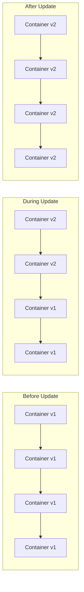

# Docker Swarm Rolling Updates

## Introduction

Docker Swarm is Docker's native clustering and orchestration solution that allows you to manage a cluster of Docker hosts as a single virtual system. One of the most powerful features of Docker Swarm is its ability to perform **rolling updates** - a deployment strategy that gradually replaces service instances with newer versions without causing service interruption.

In this tutorial, we'll explore how Docker Swarm implements rolling updates, why they're crucial for production environments, and how to configure them for your services. By the end, you'll be able to confidently deploy application updates with zero downtime.

## Prerequisites

Before diving into rolling updates, make sure you have:

- A Docker Swarm cluster set up with at least one manager and one worker node
- Basic understanding of Docker Swarm services
- Docker Engine version 17.05 or later

## Understanding Rolling Updates

### What is a Rolling Update?

A rolling update is a deployment strategy where service instances are gradually updated one by one or in small batches rather than all at once. This approach ensures that:

1. Your application remains available during the update process
2. If an update causes issues, only a portion of your service is affected
3. You can detect problems early and rollback if necessary

Let's visualize the process:



## Basic Rolling Update Configuration

When you create or update a service in Docker Swarm, you can specify how the rolling update should be performed using the `--update-*` flags.

### Key Parameters

- `--update-parallelism`: Number of tasks to update simultaneously (default: 1)
- `--update-delay`: Delay between updating tasks (default: 0s)
- `--update-failure-action`: Action to take if an update fails (default: pause)
- `--update-order`: Order of operations (default: stop-first)
- `--update-max-failure-ratio`: Failure rate to tolerate during an update (default: 0)

Let's see how to create a service with rolling update configuration:

```bash
docker service create \
  --name webapp \
  --replicas 4 \
  --update-parallelism 2 \
  --update-delay 30s \
  --update-failure-action rollback \
  nginx:1.21
```

This command creates a service with 4 replicas of the nginx:1.21 image and configures it to:
- Update 2 containers at a time
- Wait 30 seconds between updates
- Automatically rollback if the update fails

## Performing a Rolling Update

Now, let's update our service to a newer version of nginx:

```bash
docker service update --image nginx:1.22 webapp
```

Docker Swarm will now:
1. Replace the first 2 containers with the new version
2. Wait 30 seconds
3. Replace the remaining 2 containers

You can monitor the update progress with:

```bash
docker service ps webapp
```

Output:
```
ID             NAME          IMAGE        NODE     DESIRED STATE  CURRENT STATE            ERROR  PORTS
bk4c6a7zd75t   webapp.1      nginx:1.22   node2    Running        Running 30 seconds ago         
7zuh4ieh87a4    \_ webapp.1  nginx:1.21   node2    Shutdown       Shutdown 35 seconds ago        
4bnj0c23vj7n   webapp.2      nginx:1.22   node1    Running        Running 30 seconds ago         
5nb9r7en8o1e    \_ webapp.2  nginx:1.21   node1    Shutdown       Shutdown 35 seconds ago        
7xbc7s4tuhj3   webapp.3      nginx:1.22   node3    Running        Running 5 seconds ago          
9lkbw4f2mxk6    \_ webapp.3  nginx:1.21   node3    Shutdown       Shutdown 10 seconds ago        
2k74mtw9x85s   webapp.4      nginx:1.22   node1    Running        Running 5 seconds ago          
6kwv0jt91dx3    \_ webapp.4  nginx:1.21   node1    Shutdown       Shutdown 10 seconds ago        
```

## Advanced Rolling Update Configurations

### Setting Default Update Configurations

You can set default update configurations for all services in your Swarm by adding them to the `docker-compose.yml` file:

```yaml
version: '3.8'
services:
  webapp:
    image: nginx:1.21
    deploy:
      replicas: 4
      update_config:
        parallelism: 2
        delay: 30s
        failure_action: rollback
        monitor: 60s
        max_failure_ratio: 0.3
        order: start-first
```

Let's explain each parameter:

- `parallelism`: Number of containers to update simultaneously
- `delay`: Time to wait between updating tasks
- `failure_action`: Action to take if update fails (rollback, pause, continue)
- `monitor`: Duration to monitor for failure after each task update
- `max_failure_ratio`: Failure rate to tolerate during an update
- `order`: Whether to start new tasks before stopping old ones (start-first) or vice versa (stop-first)

### Health Checks for Safer Updates

To make your rolling updates even more reliable, add health checks to your services:

```yaml
version: '3.8'
services:
  webapp:
    image: nginx:1.21
    healthcheck:
      test: ["CMD", "curl", "-f", "http://localhost"]
      interval: 5s
      timeout: 5s
      retries: 3
      start_period: 10s
    deploy:
      replicas: 4
      update_config:
        parallelism: 1
        delay: 10s
        order: start-first
```

With health checks configured, Docker Swarm will only consider a task updated when it passes the health check.

## Real-World Example: Rolling Update of a Web Application

Let's put everything together with a practical example. We'll deploy and update a simple Node.js web application:

1. First, create a `docker-compose.yml` file:

```yaml
version: '3.8'
services:
  webapp:
    image: myapp:1.0
    ports:
      - "3000:3000"
    healthcheck:
      test: ["CMD", "wget", "--spider", "http://localhost:3000/health"]
      interval: 5s
      timeout: 5s
      retries: 3
    deploy:
      replicas: 6
      update_config:
        parallelism: 2
        delay: 20s
        order: start-first
        failure_action: rollback
        monitor: 30s
      rollback_config:
        parallelism: 3
        delay: 10s
```

2. Deploy the service:

```bash
docker stack deploy -c docker-compose.yml myapp
```

3. After some changes to your application, build a new image version:

```bash
docker build -t myapp:1.1 .
```

4. Update your `docker-compose.yml` to use the new image:

```yaml
version: '3.8'
services:
  webapp:
    image: myapp:1.1
    # rest of the configuration remains the same
```

5. Deploy the update:

```bash
docker stack deploy -c docker-compose.yml myapp
```

Monitor the update progress:

```bash
docker service ps myapp_webapp
```

## Rollback Strategies

If an update causes issues, you have several options:

### Automatic Rollbacks

If you've configured `failure_action: rollback` in your update config, Docker Swarm will automatically revert to the previous version if the update fails according to your monitoring parameters.

### Manual Rollbacks

You can manually roll back to the previous version:

```bash
docker service update --rollback myapp_webapp
```

## Best Practices for Rolling Updates

1. **Start Small**: Begin with a small parallelism value (1 or 2) to minimize risk
2. **Use Health Checks**: Implement robust health checks to ensure new containers are truly ready
3. **Implement Monitoring**: Set up monitoring to detect issues during and after updates
4. **Use the start-first Order for Stateless Services**: This ensures zero downtime
5. **Test in Staging First**: Always test your update strategy in a non-production environment
6. **Tune Your Update Parameters**: Adjust parameters based on your application characteristics:
   - CPU/memory-intensive apps may need longer delays
   - Critical services may need lower parallelism
   - Some applications may require special startup procedures

## Troubleshooting Rolling Updates

If you encounter issues with rolling updates, check:

1. **Service Logs**: Check logs of failing containers
   ```bash
   docker service logs myapp_webapp
   ```

2. **Health Check Configuration**: Ensure health checks are properly configured
   ```bash
   docker inspect --format='{{json .Spec.TaskTemplate.ContainerSpec.Healthcheck}}' myapp_webapp
   ```

3. **Update Status**: Examine the current update status
   ```bash
   docker service inspect --format='{{json .UpdateStatus}}' myapp_webapp
   ```

## Summary

Docker Swarm rolling updates provide a powerful mechanism for achieving zero-downtime deployments. By configuring the update parameters properly, you can ensure your services remain available during deployment while minimizing risk.

Key takeaways:
- Rolling updates replace service containers gradually
- Configure parallelism and delay to control update pace
- Use health checks to ensure containers are truly ready
- Configure appropriate monitoring and failure actions
- Use `start-first` order for zero-downtime updates of stateless applications

## Additional Resources

- [Docker Swarm Official Documentation](https://docs.docker.com/engine/swarm/)
- [Docker Compose File v3 Reference](https://docs.docker.com/compose/compose-file/compose-file-v3/)
- [Docker Service Update Command Reference](https://docs.docker.com/engine/reference/commandline/service_update/)

## Exercises

1. Set up a Docker Swarm cluster and deploy a simple web application with 4 replicas
2. Implement health checks for your application
3. Perform a rolling update with different parallelism values and observe the behavior
4. Intentionally deploy a broken version and test the automatic rollback feature
5. Create a Docker Compose file with different update configurations for multiple services