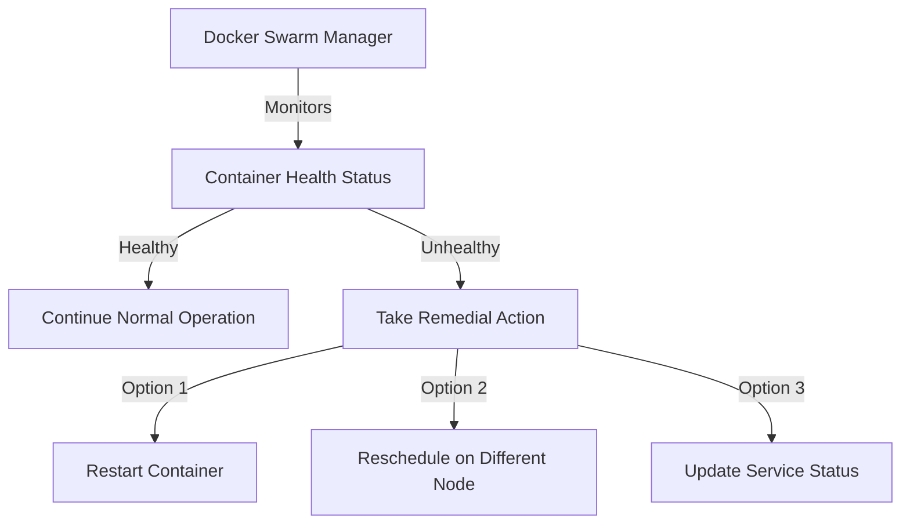

# Docker Swarm Health Checks

## Introduction

When running applications in a distributed environment like Docker Swarm, ensuring that your services remain healthy and available is critical. Health checks provide a mechanism to verify that your applications are functioning correctly and to automatically recover from failures when they occur.

In this guide, we'll explore how Docker Swarm implements health checks, how to configure them for your services, and best practices for maintaining a robust containerized environment.

## What are Health Checks?

Health checks are automated tests that Docker performs to determine if a container is functioning properly. These tests can be as simple as checking if a process is running or as complex as verifying that your application can process transactions correctly.

When a health check fails, Docker Swarm can take remedial action, such as:

1. Restarting the unhealthy container
2. Rescheduling the service on a different node 
3. Preventing traffic from being routed to the unhealthy container

Let's visualize the health check process in Docker Swarm:



## Types of Health Checks in Docker Swarm

Docker Swarm supports several types of health checks:

### 1. Command-based Health Checks

These execute a command inside the container. If the command returns a zero exit code, the container is considered healthy.

### 2. HTTP Health Checks

These send an HTTP request to a specified endpoint. If the endpoint returns a successful status code (usually 200-399), the container is considered healthy.

### 3. TCP Health Checks

These attempt to establish a TCP connection to a specific port. If the connection succeeds, the container is considered healthy.

## Configuring Health Checks

Health checks can be configured in your Docker Compose file or directly when creating services with the Docker CLI.

### Health Check Configuration in Docker Compose

Here's how to define a health check in a Docker Compose file (version 3.x):

```yaml
version: '3.8'
services:
  web:
    image: nginx:latest
    healthcheck:
      test: ["CMD", "curl", "-f", "http://localhost"]
      interval: 30s
      timeout: 10s
      retries: 3
      start_period: 40s
    deploy:
      replicas: 3
      restart_policy:
        condition: on-failure
```

Let's break down the health check options:

- `test`: The command to run to check health
- `interval`: How often to run the health check (default: 30s)
- `timeout`: Maximum time a health check can take before considered failing (default: 30s)
- `retries`: Number of consecutive failures needed to consider the container unhealthy (default: 3)
- `start_period`: Initial period to wait before starting health checks, allowing for container startup time (default: 0s)

### Deploying Services with Health Checks via CLI

You can also specify health checks when creating services directly with the Docker CLI:

```bash
docker service create \
  --name web \
  --replicas 3 \
  --health-cmd "curl -f http://localhost || exit 1" \
  --health-interval 30s \
  --health-timeout 10s \
  --health-retries 3 \
  --health-start-period 40s \
  nginx:latest
```

## Real-World Health Check Examples

Let's look at some practical examples for different types of applications:

### Example 1: Web Application Health Check

```yaml
version: '3.8'
services:
  web_app:
    image: my-web-app:latest
    ports:
      - "8080:8080"
    healthcheck:
      test: ["CMD", "curl", "-f", "http://localhost:8080/health"]
      interval: 20s
      timeout: 5s
      retries: 3
      start_period: 30s
    deploy:
      replicas: 3
      update_config:
        parallelism: 1
        delay: 10s
        order: start-first
      restart_policy:
        condition: on-failure
```

This example checks if the web application responds correctly to a `/health` endpoint, which is a common pattern for API health checks.

### Example 2: Database Health Check

```yaml
version: '3.8'
services:
  postgres:
    image: postgres:13
    environment:
      POSTGRES_USER: user
      POSTGRES_PASSWORD: password
      POSTGRES_DB: app_db
    healthcheck:
      test: ["CMD-SHELL", "pg_isready -U user -d app_db"]
      interval: 30s
      timeout: 5s
      retries: 5
      start_period: 80s
    deploy:
      replicas: 1
      restart_policy:
        condition: on-failure
```

This example uses `pg_isready` to verify that PostgreSQL is ready to accept connections.

### Example 3: Redis Cache Health Check

```yaml
version: '3.8'
services:
  redis:
    image: redis:latest
    healthcheck:
      test: ["CMD", "redis-cli", "ping"]
      interval: 10s
      timeout: 5s
      retries: 3
    deploy:
      replicas: 3
      update_config:
        parallelism: 1
        delay: 10s
      restart_policy:
        condition: on-failure
```

This simple health check verifies that Redis responds to the `ping` command, indicating it's operational.

## Implementation Best Practices

To get the most out of Docker Swarm health checks, follow these best practices:

### 1. Create Dedicated Health Endpoints

For web applications, create a dedicated `/health` or `/healthz` endpoint that performs appropriate checks:

```javascript
// Express.js example
app.get('/health', (req, res) => {
  // Check database connection
  const dbHealthy = checkDatabaseConnection();
  
  // Check cache connection
  const cacheHealthy = checkCacheConnection();
  
  if (dbHealthy && cacheHealthy) {
    res.status(200).send('Healthy');
  } else {
    res.status(500).send('Unhealthy');
  }
});
```

### 2. Make Health Checks Lightweight

Health checks should be quick and lightweight to avoid consuming unnecessary resources:

- Avoid expensive database queries
- Don't perform full application logic tests
- Keep network calls to a minimum

### 3. Set Appropriate Timing Parameters

Balance between quick detection and avoiding false positives:

- `interval`: Frequent enough to catch issues quickly, but not so frequent as to waste resources
- `timeout`: Long enough for normal operations, but short enough to detect real hangs
- `start_period`: Give containers enough time to initialize before checking health

### 4. Implement Multi-Stage Health Checks

For complex applications, consider different levels of health checks:

- **Liveness**: Basic check that the application is running
- **Readiness**: Check that the application is ready to accept traffic
- **Deep health**: Comprehensive check of all critical dependencies

## Monitoring Health Status

To check the health status of your services, use the following commands:

```bash
# Check health status of all containers in a service
docker service ps my_service

# Detailed inspection of a service
docker service inspect my_service

# View container health events
docker events --filter type=container
```

Example output of `docker service ps`:

```
ID                  NAME                IMAGE               NODE                DESIRED STATE       CURRENT STATE            ERROR               PORTS
tkv7igzw5nwp        web.1               nginx:latest        worker1             Running             Running 2 minutes ago                        
l8x3syu4zpln        web.2               nginx:latest        worker2             Running             Running 2 minutes ago                        
9mw79070dhjc        web.3               nginx:latest        worker3             Running             Running 2 minutes ago                        
```

If a container becomes unhealthy and gets restarted, you'll see it in the output:

```
ID                  NAME                IMAGE               NODE                DESIRED STATE       CURRENT STATE            ERROR               PORTS
tkv7igzw5nwp        web.1               nginx:latest        worker1             Running             Running 2 minutes ago                        
l8x3syu4zpln        web.2               nginx:latest        worker2             Running             Running 2 minutes ago                        
jqu72v2cqidg        web.3               nginx:latest        worker3             Running             Running 30 seconds ago                       
9mw79070dhjc         \_ web.3           nginx:latest        worker3             Shutdown            Failed 35 seconds ago    "task: unhealthy"   
```

## Common Health Check Pitfalls

Avoid these common mistakes when implementing health checks:

1. **Too strict checks:** Health checks that fail for minor issues can cause unnecessary restarts
2. **Too lenient checks:** Checks that pass even when the application is malfunctioning defeat the purpose
3. **Resource-intensive checks:** Heavy health checks can impact application performance
4. **Incorrect timeout values:** If timeouts are too short, healthy containers may be marked unhealthy

## Troubleshooting Health Checks

If your health checks aren't working as expected:

1. **Check container logs:**
   ```bash
   docker service logs <service_name>
   ```

2. **Manually run the health check command:**
   ```bash
   docker exec <container_id> curl -f http://localhost/health
   ```

3. **Inspect the service configuration:**
   ```bash
   docker service inspect --pretty <service_name>
   ```

4. **Temporarily disable and test manually:**
   You can disable health checks and monitor manually while troubleshooting.

## Summary

Docker Swarm health checks are a powerful feature for maintaining the availability and reliability of your containerized applications. By properly configuring health checks, you can:

- Automatically detect and recover from failures
- Prevent routing traffic to unhealthy containers
- Gain visibility into the health of your distributed system

Remember to create lightweight, appropriate health checks tailored to your application's needs and to set reasonable timing parameters that balance between quick detection and avoiding false positives.

## Additional Resources

To deepen your understanding of Docker Swarm health checks, consider exploring:

- Docker's official documentation on health checks
- Service orchestration patterns for high availability
- Monitoring solutions that integrate with Docker health data (like Prometheus)

## Exercises

1. Implement a basic HTTP health check for a web application of your choice
2. Create a multi-stage health check that verifies both the application and its database
3. Set up a monitoring dashboard to visualize the health status of your swarm services
4. Simulate a failure scenario and observe how Docker Swarm responds to unhealthy containers