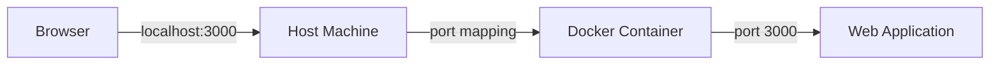
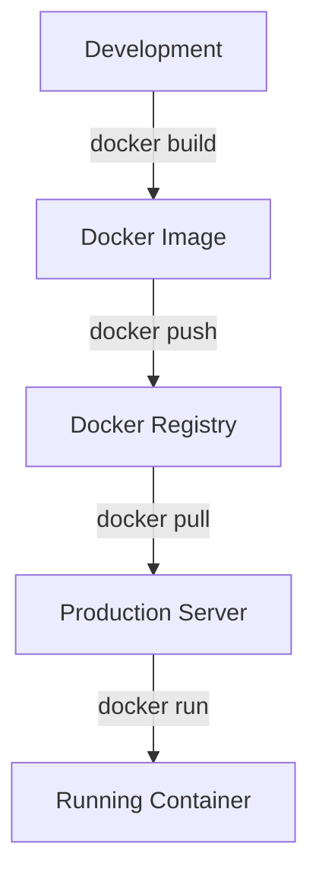

# Docker Web Application

## Introduction

Docker has revolutionized how we develop, ship, and run applications. In this tutorial, you'll learn how to containerize a simple web application using Docker. By the end, you'll understand how to package your web application along with its dependencies into a portable container that can run consistently across different environments.

Containerization solves the infamous "it works on my machine" problem by ensuring that your application runs the same way regardless of where it's deployed. This is especially valuable for web applications that need to be deployed across development, testing, and production environments.

## Prerequisites

Before we begin, make sure you have:

- Docker installed on your machine
- Basic knowledge of web development
- A text editor of your choice

## Understanding the Project Structure

We'll create a simple Node.js web application with the following structure:

```
docker-web-app/
├── src/
│   └── index.js
├── Dockerfile
├── package.json
└── .dockerignore
```

## Step 1: Creating the Web Application

Let's start by creating a basic Express.js application. Create a new directory and set up the following files:

First, initialize a new Node.js project:

```bash
mkdir docker-web-app
cd docker-web-app
npm init -y
npm install express
```

Now create the `src/index.js` file with this content:

```javascript
const express = require('express');
const app = express();
const PORT = process.env.PORT || 3000;

app.get('/', (req, res) => {
  res.send(`
    <h1>Hello from Docker!</h1>
    <p>This is a simple web application running inside a Docker container.</p>
    <p>Container started at: ${new Date().toISOString()}</p>
  `);
});

app.listen(PORT, () => {
  console.log(`Server running on port ${PORT}`);
});
```

Update the `package.json` file to include a start script:

```json
{
  "name": "docker-web-app",
  "version": "1.0.0",
  "description": "A simple Docker web application",
  "main": "src/index.js",
  "scripts": {
    "start": "node src/index.js"
  },
  "dependencies": {
    "express": "^4.17.1"
  }
}
```

## Step 2: Creating the Dockerfile

The Dockerfile contains instructions for building a Docker image of your application. Create a file named `Dockerfile` in the root of your project:

```dockerfile
# Use Node.js LTS as the base image
FROM node:16-alpine

# Create app directory inside the container
WORKDIR /usr/src/app

# Copy package.json and package-lock.json
COPY package*.json ./

# Install dependencies
RUN npm install

# Copy the application code
COPY . .

# Expose the port the app runs on
EXPOSE 3000

# Command to run the application
CMD ["npm", "start"]
```

Let's break down what each line does:

- `FROM node:16-alpine`: Uses a lightweight Node.js image as the base
- `WORKDIR /usr/src/app`: Sets the working directory inside the container
- `COPY package*.json ./`: Copies package files for efficient caching
- `RUN npm install`: Installs dependencies
- `COPY . .`: Copies the rest of the application code
- `EXPOSE 3000`: Documents that the application listens on port 3000
- `CMD ["npm", "start"]`: Specifies the command to start the application

## Step 3: Creating .dockerignore

Similar to `.gitignore`, a `.dockerignore` file specifies which files should be excluded when copying files to the Docker image:

```
node_modules
npm-debug.log
Dockerfile
.dockerignore
```

This helps keep your Docker image slim and prevents unnecessary files from being included.

## Step 4: Building the Docker Image

Now that we have our application code and Dockerfile, let's build the Docker image:

```bash
docker build -t my-web-app .
```

This command builds an image tagged as `my-web-app` using the Dockerfile in the current directory.

The output will look something like:

```
Sending build context to Docker daemon  4.096kB
Step 1/7 : FROM node:16-alpine
 ---> 36afc3967e71
Step 2/7 : WORKDIR /usr/src/app
 ---> Using cache
 ---> f9b6c5d5b5f5
Step 3/7 : COPY package*.json ./
 ---> Using cache
 ---> 7d9d11712f81
Step 4/7 : RUN npm install
 ---> Using cache
 ---> 6f5da11c3e10
Step 5/7 : COPY . .
 ---> 2a95d5d5b1f0
Step 6/7 : EXPOSE 3000
 ---> Running in 3c4d5d5c7f1c
Removing intermediate container 3c4d5d5c7f1c
 ---> 9a7d5c9c9d5b
Step 7/7 : CMD ["npm", "start"]
 ---> Running in b1c5d6c7d8e9
Removing intermediate container b1c5d6c7d8e9
 ---> a1b2c3d4e5f6
Successfully built a1b2c3d4e5f6
Successfully tagged my-web-app:latest
```

## Step 5: Running the Docker Container

Let's run our containerized application:

```bash
docker run -p 3000:3000 my-web-app
```

This command starts a new container using the `my-web-app` image and maps port 3000 on your host to port 3000 in the container.

You should see output like:

```
Server running on port 3000
```

Now open your browser and navigate to `http://localhost:3000`. You should see your web application running!

## Understanding Container Networking

When you run a Docker container, it's isolated from your host machine by default. The `-p 3000:3000` flag maps port 3000 on your host to port 3000 inside the container, allowing you to access the application.

Here's a diagram showing how port mapping works:



## Advanced Configuration: Environment Variables

Docker makes it easy to configure your application using environment variables. Let's modify our application to use an environment variable for a greeting message:

Update `src/index.js`:

```javascript
const express = require('express');
const app = express();
const PORT = process.env.PORT || 3000;
const GREETING = process.env.GREETING || 'Hello from Docker!';

app.get('/', (req, res) => {
  res.send(`
    <h1>${GREETING}</h1>
    <p>This is a simple web application running inside a Docker container.</p>
    <p>Container started at: ${new Date().toISOString()}</p>
  `);
});

app.listen(PORT, () => {
  console.log(`Server running on port ${PORT}`);
});
```

Now we can pass environment variables when running the container:

```bash
docker run -p 3000:3000 -e GREETING="Welcome to Docker Web App!" my-web-app
```

## Persisting Data with Volumes

For web applications that need to persist data, Docker provides volumes. Let's modify our application to write logs to a file that will persist beyond the container's lifecycle:

Update `src/index.js`:

```javascript
const express = require('express');
const fs = require('fs');
const path = require('path');
const app = express();
const PORT = process.env.PORT || 3000;
const GREETING = process.env.GREETING || 'Hello from Docker!';
const logDir = path.join(__dirname, '../logs');

// Ensure log directory exists
if (!fs.existsSync(logDir)) {
  fs.mkdirSync(logDir);
}

app.get('/', (req, res) => {
  const timestamp = new Date().toISOString();
  const logMessage = `Request received at: ${timestamp}
`;
  
  // Log to file
  fs.appendFileSync(path.join(logDir, 'access.log'), logMessage);
  
  res.send(`
    <h1>${GREETING}</h1>
    <p>This is a simple web application running inside a Docker container.</p>
    <p>Container started at: ${timestamp}</p>
  `);
});

app.listen(PORT, () => {
  console.log(`Server running on port ${PORT}`);
});
```

Now run the container with a volume:

```bash
docker run -p 3000:3000 -v "$(pwd)/logs:/usr/src/app/logs" my-web-app
```

This mounts the `logs` directory from your host to the `/usr/src/app/logs` directory in the container.

## Multi-Container Applications with Docker Compose

Real-world web applications often require multiple services (web server, database, cache, etc.). Docker Compose helps you define and run multi-container applications.

Create a `docker-compose.yml` file:

```yaml
version: '3'

services:
  web:
    build: .
    ports:
      - "3000:3000"
    environment:
      - GREETING=Hello from Docker Compose!
    volumes:
      - ./logs:/usr/src/app/logs
    depends_on:
      - redis

  redis:
    image: redis:alpine
    ports:
      - "6379:6379"
```

This configuration defines two services:
1. `web`: Our Node.js application
2. `redis`: A Redis cache server

To start both services:

```bash
docker-compose up
```

## Deploying Your Containerized Web Application

Once your application is containerized, deploying it becomes much simpler. Here are some options:

1. **Manual Deployment**:
   - Push your image to Docker Hub: `docker push yourusername/my-web-app`
   - Pull and run on your server: `docker pull yourusername/my-web-app && docker run -d -p 80:3000 yourusername/my-web-app`

2. **Cloud Platforms**:
   - AWS Elastic Container Service (ECS)
   - Google Cloud Run
   - Azure Container Instances
   - Kubernetes services like GKE, AKS, or EKS

Here's an example workflow for deploying to production:



## Best Practices

When containerizing web applications, follow these best practices:

1. **Use specific image tags**: Avoid using `latest` to ensure reproducible builds
2. **Optimize image size**: Use multi-stage builds and Alpine-based images
3. **Don't run as root**: Use `USER` instruction to switch to a non-root user
4. **Handle signals properly**: Ensure your application responds to SIGTERM
5. **Use health checks**: Add HEALTHCHECK instruction to monitor container health
6. **Store secrets securely**: Use environment variables or Docker secrets
7. **Log to stdout/stderr**: Docker can collect these logs automatically

## Summary

In this tutorial, you've learned how to:
- Create a simple Node.js web application
- Write a Dockerfile to containerize the application
- Build and run a Docker container
- Use environment variables for configuration
- Persist data using volumes
- Set up a multi-container application with Docker Compose
- Deploy your containerized application

Containerizing web applications with Docker offers numerous benefits, including consistent environments, simplified deployment, improved scalability, and better resource utilization.

## Exercises

1. Modify the application to display visitor count using Redis
2. Add a health check endpoint to the application
3. Create a multi-stage Dockerfile to reduce the image size
4. Set up CI/CD pipeline to automatically build and deploy the Docker image
5. Implement a reverse proxy (like Nginx) in front of the Node.js application

## Additional Resources

- [Docker Documentation](https://docs.docker.com/)
- [Node.js Docker Best Practices](https://nodejs.org/en/docs/guides/nodejs-docker-webapp/)
- [Docker Compose Documentation](https://docs.docker.com/compose/)

By following this guide, you've taken your first steps into the world of containerized web applications. As you continue your Docker journey, you'll discover even more powerful patterns and tools for building and deploying web applications.