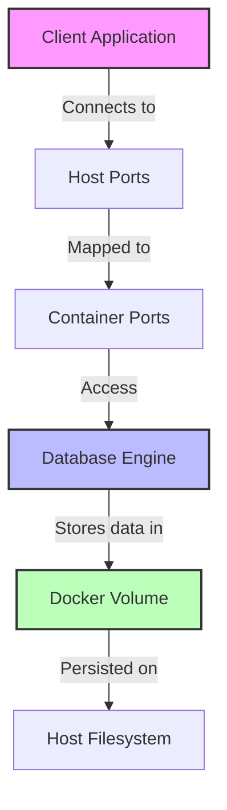

# Docker Database

## Introduction

Managing databases for development can be challenging - different projects may require different database systems, versions, or configurations. Docker simplifies this process by allowing you to run databases in isolated containers, making it easy to:

- Run multiple database types (MySQL, PostgreSQL, MongoDB, etc.) simultaneously
- Maintain different versions of the same database
- Quickly set up and tear down database environments
- Create consistent development environments across teams

In this guide, we'll explore how to use Docker to manage databases for your development projects. You'll learn how to set up, configure, and interact with database containers.

## Prerequisites

Before starting, make sure you have:

- [Docker](https://www.docker.com/get-started) installed on your system
- Basic familiarity with Docker concepts (images, containers)
- Basic understanding of databases

## Setting Up Your First Database Container

Let's start by creating a simple MySQL database container.

### Running a MySQL Container

```bash
docker run --name my-mysql -e MYSQL_ROOT_PASSWORD=mysecretpassword -p 3306:3306 -d mysql:8.0
```

This command:
- Creates a container named `my-mysql`
- Sets the root password to "mysecretpassword"
- Maps port 3306 on your host to port 3306 in the container
- Uses the MySQL 8.0 image
- Runs the container in detached mode (`-d`)

### Verifying the Container

Check if your container is running:

```bash
docker ps
```

Output should look similar to:

```
CONTAINER ID   IMAGE       COMMAND                  CREATED         STATUS         PORTS                               NAMES
a1b2c3d4e5f6   mysql:8.0   "docker-entrypoint.s…"   5 seconds ago   Up 4 seconds   0.0.0.0:3306->3306/tcp, 33060/tcp   my-mysql
```

### Connecting to Your MySQL Container

You can connect to your MySQL container using the MySQL client:

```bash
docker exec -it my-mysql mysql -uroot -pmysecretpassword
```

Once connected, you can run SQL commands:

```sql
CREATE DATABASE mydatabase;
USE mydatabase;
CREATE TABLE users (id INT AUTO_INCREMENT PRIMARY KEY, name VARCHAR(255), email VARCHAR(255));
INSERT INTO users (name, email) VALUES ('John Doe', 'john@example.com');
SELECT * FROM users;
```

## Database Persistence

By default, Docker containers are ephemeral - if you remove the container, all data is lost. For databases, we need persistence. Let's explore how to make our database data persistent.

### Using Docker Volumes

Volumes are the preferred way to persist data in Docker:

```bash
docker run --name mysql-persistent \
  -e MYSQL_ROOT_PASSWORD=mysecretpassword \
  -p 3307:3306 \
  -v mysql-data:/var/lib/mysql \
  -d mysql:8.0
```

This creates a Docker volume named `mysql-data` that persists your database files.

You can check your volumes with:

```bash
docker volume ls
```

Now, even if you remove and recreate the container, your data will be preserved as long as you use the same volume.

## Working with Different Database Types

Docker makes it easy to work with various database systems. Let's explore a few popular options.

### PostgreSQL

```bash
docker run --name my-postgres \
  -e POSTGRES_PASSWORD=mysecretpassword \
  -p 5432:5432 \
  -v postgres-data:/var/lib/postgresql/data \
  -d postgres:13
```

Connecting to PostgreSQL:

```bash
docker exec -it my-postgres psql -U postgres
```

Basic PostgreSQL commands:

```sql
CREATE DATABASE myapp;
\c myapp
CREATE TABLE users (id SERIAL PRIMARY KEY, name VARCHAR(100), email VARCHAR(100));
INSERT INTO users (name, email) VALUES ('Jane Smith', 'jane@example.com');
SELECT * FROM users;
```

### MongoDB

```bash
docker run --name my-mongo \
  -p 27017:27017 \
  -v mongo-data:/data/db \
  -d mongo:5.0
```

Connecting to MongoDB:

```bash
docker exec -it my-mongo mongosh
```

Basic MongoDB commands:

```javascript
use myapp
db.createCollection('users')
db.users.insertOne({ name: 'Mike Johnson', email: 'mike@example.com' })
db.users.find()
```

## Creating a Database Service with Docker Compose

For real-world applications, you'll often want to define your database as part of a larger application stack. Docker Compose is perfect for this.

Create a `docker-compose.yml` file:

```yaml
version: '3.8'

services:
  db:
    image: mysql:8.0
    restart: unless-stopped
    environment:
      MYSQL_ROOT_PASSWORD: rootpassword
      MYSQL_DATABASE: appdb
      MYSQL_USER: appuser
      MYSQL_PASSWORD: apppassword
    ports:
      - "3306:3306"
    volumes:
      - db_data:/var/lib/mysql
      - ./init.sql:/docker-entrypoint-initdb.d/init.sql

volumes:
  db_data:
```

Create an `init.sql` file to set up your database schema:

```sql
CREATE TABLE IF NOT EXISTS users (
  id INT AUTO_INCREMENT PRIMARY KEY,
  username VARCHAR(50) NOT NULL,
  email VARCHAR(100) NOT NULL,
  created_at TIMESTAMP DEFAULT CURRENT_TIMESTAMP
);

INSERT INTO users (username, email) VALUES 
  ('user1', 'user1@example.com'),
  ('user2', 'user2@example.com');
```

Start your services:

```bash
docker-compose up -d
```

## Database Administration Tools

Managing databases through command line can be challenging. Let's look at some admin tools you can run as Docker containers.

### phpMyAdmin for MySQL

```bash
docker run --name phpmyadmin \
  -d --link my-mysql:db \
  -p 8080:80 \
  phpmyadmin/phpmyadmin
```

Access phpMyAdmin at http://localhost:8080 and log in with your MySQL credentials.

### pgAdmin for PostgreSQL

```bash
docker run --name pgadmin \
  -e PGADMIN_DEFAULT_EMAIL=admin@example.com \
  -e PGADMIN_DEFAULT_PASSWORD=adminpassword \
  -p 8081:80 \
  -d dpage/pgadmin4
```

Access pgAdmin at http://localhost:8081 and log in with the email and password you set.

## Best Practices for Docker Databases

When working with databases in Docker, follow these best practices:

### 1. Always Use Volumes for Persistence

```bash
docker run --name mysql-prod \
  -v mysql-prod-data:/var/lib/mysql \
  -d mysql:8.0
```

### 2. Set Resource Limits

Limit memory and CPU to prevent a database container from consuming all host resources:

```bash
docker run --name mysql-limited \
  -m 512m --cpus=0.5 \
  -d mysql:8.0
```

### 3. Use Environment Variables for Configuration

Store sensitive information in environment variables:

```bash
docker run --name mysql-secure \
  -e MYSQL_ROOT_PASSWORD=$DB_ROOT_PASSWORD \
  -e MYSQL_DATABASE=$DB_NAME \
  -e MYSQL_USER=$DB_USER \
  -e MYSQL_PASSWORD=$DB_PASSWORD \
  -d mysql:8.0
```

### 4. Use Health Checks

Add health checks to ensure your database is functioning correctly:

```yaml
version: '3.8'
services:
  db:
    image: mysql:8.0
    healthcheck:
      test: ["CMD", "mysqladmin", "ping", "-h", "localhost", "-u", "root", "-p$$MYSQL_ROOT_PASSWORD"]
      interval: 30s
      timeout: 10s
      retries: 5
```

## Advanced Database Configurations

Let's explore some advanced database configurations for specific use cases.

### Custom MySQL Configuration

Create a `my.cnf` file:

```
[mysqld]
max_connections = 250
innodb_buffer_pool_size = 256M
character-set-server = utf8mb4
collation-server = utf8mb4_unicode_ci
```

Use it in your container:

```bash
docker run --name mysql-custom \
  -v ./my.cnf:/etc/mysql/conf.d/my.cnf \
  -d mysql:8.0
```

### Setting Up Database Replication

Create a primary-replica setup with Docker Compose:

```yaml
version: '3.8'

services:
  mysql-primary:
    image: mysql:8.0
    environment:
      MYSQL_ROOT_PASSWORD: rootpassword
    volumes:
      - mysql-primary-data:/var/lib/mysql
      - ./primary.cnf:/etc/mysql/conf.d/my.cnf
    ports:
      - "3306:3306"

  mysql-replica:
    image: mysql:8.0
    environment:
      MYSQL_ROOT_PASSWORD: rootpassword
    volumes:
      - mysql-replica-data:/var/lib/mysql
      - ./replica.cnf:/etc/mysql/conf.d/my.cnf
    ports:
      - "3307:3306"
    depends_on:
      - mysql-primary

volumes:
  mysql-primary-data:
  mysql-replica-data:
```

## Creating a Multi-Database Application

Modern applications often use multiple databases. Let's create a setup with both MongoDB and Redis:

```yaml
version: '3.8'

services:
  mongodb:
    image: mongo:5.0
    volumes:
      - mongodb_data:/data/db
    ports:
      - "27017:27017"
    restart: unless-stopped

  redis:
    image: redis:6.2
    volumes:
      - redis_data:/data
    ports:
      - "6379:6379"
    restart: unless-stopped

volumes:
  mongodb_data:
  redis_data:
```

## Visualizing Database Architecture

Let's visualize a typical Docker database architecture:



## Practical Example: Web Application with Database

Let's create a complete example with a web application and a database:

```yaml
version: '3.8'

services:
  app:
    image: node:14
    volumes:
      - ./app:/app
    working_dir: /app
    command: npm start
    ports:
      - "3000:3000"
    depends_on:
      - db
    environment:
      DB_HOST: db
      DB_USER: appuser
      DB_PASSWORD: apppassword
      DB_NAME: appdb

  db:
    image: mysql:8.0
    volumes:
      - db_data:/var/lib/mysql
      - ./init.sql:/docker-entrypoint-initdb.d/init.sql
    restart: always
    environment:
      MYSQL_ROOT_PASSWORD: rootpassword
      MYSQL_DATABASE: appdb
      MYSQL_USER: appuser
      MYSQL_PASSWORD: apppassword
    ports:
      - "3306:3306"

volumes:
  db_data:
```

## Troubleshooting Common Issues

### Container Won't Start

If your database container won't start, check the logs:

```bash
docker logs my-mysql
```

Common issues include:
- Port conflicts
- Insufficient permissions on volume mounts
- Invalid configuration parameters

### Connection Refused

If you can't connect to your database:

1. Check if the container is running
   ```bash
   docker ps | grep mysql
   ```

2. Verify port mapping
   ```bash
   docker port my-mysql
   ```

3. Try connecting from inside the container
   ```bash
   docker exec -it my-mysql mysql -uroot -p
   ```

### Data Persistence Issues

If your data isn't persisting between container restarts:

1. Check if you're using volumes correctly
   ```bash
   docker inspect my-mysql
   ```

2. Look for the `Mounts` section to verify volume configuration

## Summary

Docker provides a flexible and powerful way to manage databases for development and production environments. In this guide, you've learned:

- How to create and run database containers
- Different ways to persist database data
- Working with various database systems (MySQL, PostgreSQL, MongoDB)
- Using Docker Compose for multi-container applications
- Best practices for Docker databases
- Troubleshooting common issues

By containerizing your databases, you gain portability, consistency, and isolation, making your development workflow smoother and more efficient.

## Exercises

1. Create a Docker Compose file that sets up MySQL and phpMyAdmin.
2. Configure a PostgreSQL container with custom configuration settings.
3. Set up a MongoDB replica set using Docker Compose.
4. Create a backup and restore strategy for a Docker database.
5. Build a simple Node.js application that connects to a dockerized MySQL database.

## Additional Resources

- [Official MySQL Docker Image](https://hub.docker.com/_/mysql)
- [Official PostgreSQL Docker Image](https://hub.docker.com/_/postgres)
- [Official MongoDB Docker Image](https://hub.docker.com/_/mongo)
- [Docker Compose Documentation](https://docs.docker.com/compose/)
- [Docker Volume Documentation](https://docs.docker.com/storage/volumes/)