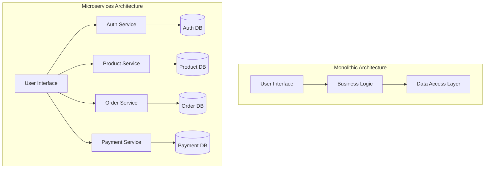
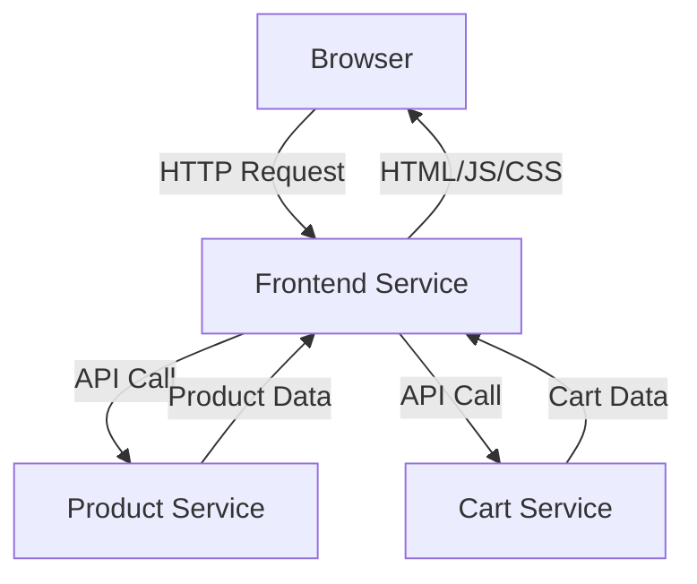

# Docker Microservices

## Introduction

Microservices architecture has revolutionized how we build and deploy applications. Instead of creating monolithic applications where all functionality lives in a single codebase, microservices break an application into smaller, independent services that work together. Docker provides the perfect environment for developing, deploying, and scaling these microservices.

In this tutorial, we'll explore how Docker enables microservice architecture and walk through creating a simple microservices application from scratch.

## What Are Microservices?

Microservices are an architectural approach where an application is composed of small, independent services that:

- Focus on doing one thing well
- Run in their own process
- Communicate via lightweight mechanisms (typically HTTP/REST APIs)
- Can be deployed independently
- May be written in different programming languages
- May use different data storage technologies



## Why Docker Is Perfect for Microservices

Docker provides several key benefits that make it ideal for microservices:

1. **Isolation**: Each service runs in its own container, preventing dependency conflicts
2. **Portability**: Containers run consistently across different environments
3. **Lightweight**: Containers share the host OS kernel, making them more efficient than VMs
4. **Scaling**: Easy to scale services independently based on demand
5. **Deployment**: Simplified deployment and rollback processes

## Prerequisites

To follow this tutorial, you'll need:

- Docker installed on your machine
- Basic understanding of Docker concepts
- Familiarity with a programming language (we'll use Node.js and Python)
- Text editor or IDE
- Terminal/command prompt

## Building a Simple Microservices Application

Let's create a simple application with three microservices:

1. A product service (Node.js)
2. A shopping cart service (Python)
3. A front-end service (Node.js with Express)

### Project Structure

```
docker-microservices-demo/
├── docker-compose.yml
├── product-service/
│   ├── Dockerfile
│   ├── package.json
│   └── server.js
├── cart-service/
│   ├── Dockerfile
│   ├── requirements.txt
│   └── app.py
└── frontend-service/
    ├── Dockerfile
    ├── package.json
    ├── server.js
    └── public/
        └── index.html
```

### 1. Creating the Product Service

First, let's create our product service using Node.js.

In `product-service/server.js`:

```javascript
const express = require('express');
const cors = require('cors');
const app = express();
const port = 3001;

app.use(cors());
app.use(express.json());

// In-memory product database
const products = [
  { id: 1, name: 'Laptop', price: 999.99, description: 'Powerful laptop for developers' },
  { id: 2, name: 'Smartphone', price: 699.99, description: 'Latest smartphone with great camera' },
  { id: 3, name: 'Headphones', price: 199.99, description: 'Noise-cancelling wireless headphones' }
];

// Get all products
app.get('/products', (req, res) => {
  res.json(products);
});

// Get a specific product
app.get('/products/:id', (req, res) => {
  const product = products.find(p => p.id === parseInt(req.params.id));
  if (!product) return res.status(404).json({ error: 'Product not found' });
  res.json(product);
});

app.listen(port, () => {
  console.log(`Product service running on port ${port}`);
});
```

In `product-service/package.json`:

```json
{
  "name": "product-service",
  "version": "1.0.0",
  "description": "Microservice for product data",
  "main": "server.js",
  "scripts": {
    "start": "node server.js"
  },
  "dependencies": {
    "express": "^4.18.2",
    "cors": "^2.8.5"
  }
}
```

In `product-service/Dockerfile`:

```dockerfile
FROM node:16-alpine

WORKDIR /app

COPY package*.json ./

RUN npm install

COPY . .

EXPOSE 3001

CMD ["node", "server.js"]
```

### 2. Creating the Cart Service

Next, let's create our cart service using Python and Flask.

In `cart-service/app.py`:

```python
from flask import Flask, jsonify, request
from flask_cors import CORS

app = Flask(__name__)
CORS(app)

# In-memory cart database
carts = {}

@app.route('/cart/<user_id>', methods=['GET'])
def get_cart(user_id):
    if user_id not in carts:
        carts[user_id] = []
    return jsonify(carts[user_id])

@app.route('/cart/<user_id>/add', methods=['POST'])
def add_to_cart(user_id):
    item = request.json
    
    if user_id not in carts:
        carts[user_id] = []
    
    # Check if product already in cart
    for cart_item in carts[user_id]:
        if cart_item['product_id'] == item['product_id']:
            cart_item['quantity'] += item['quantity']
            return jsonify(carts[user_id])
    
    # Add new item to cart
    carts[user_id].append(item)
    
    return jsonify(carts[user_id])

@app.route('/cart/<user_id>/remove/<product_id>', methods=['DELETE'])
def remove_from_cart(user_id, product_id):
    if user_id not in carts:
        return jsonify({"error": "Cart not found"}), 404
    
    product_id = int(product_id)
    carts[user_id] = [item for item in carts[user_id] if item['product_id'] != product_id]
    
    return jsonify(carts[user_id])

if __name__ == '__main__':
    app.run(host='0.0.0.0', port=3002)
```

In `cart-service/requirements.txt`:

```
Flask==2.2.3
Flask-CORS==3.0.10
```

In `cart-service/Dockerfile`:

```dockerfile
FROM python:3.9-slim

WORKDIR /app

COPY requirements.txt .

RUN pip install --no-cache-dir -r requirements.txt

COPY . .

EXPOSE 3002

CMD ["python", "app.py"]
```

### 3. Creating the Frontend Service

Finally, let's create a simple frontend service to tie everything together.

In `frontend-service/server.js`:

```javascript
const express = require('express');
const path = require('path');
const axios = require('axios');
const app = express();
const port = 3000;

app.use(express.json());
app.use(express.static('public'));

// Proxy endpoints
app.get('/api/products', async (req, res) => {
  try {
    const response = await axios.get('http://product-service:3001/products');
    res.json(response.data);
  } catch (error) {
    res.status(500).json({ error: 'Error fetching products' });
  }
});

app.get('/api/cart/:userId', async (req, res) => {
  try {
    const response = await axios.get(`http://cart-service:3002/cart/${req.params.userId}`);
    res.json(response.data);
  } catch (error) {
    res.status(500).json({ error: 'Error fetching cart' });
  }
});

app.post('/api/cart/:userId/add', async (req, res) => {
  try {
    const response = await axios.post(`http://cart-service:3002/cart/${req.params.userId}/add`, req.body);
    res.json(response.data);
  } catch (error) {
    res.status(500).json({ error: 'Error adding to cart' });
  }
});

app.delete('/api/cart/:userId/remove/:productId', async (req, res) => {
  try {
    const response = await axios.delete(
      `http://cart-service:3002/cart/${req.params.userId}/remove/${req.params.productId}`
    );
    res.json(response.data);
  } catch (error) {
    res.status(500).json({ error: 'Error removing from cart' });
  }
});

app.listen(port, () => {
  console.log(`Frontend service running on port ${port}`);
});
```

In `frontend-service/package.json`:

```json
{
  "name": "frontend-service",
  "version": "1.0.0",
  "description": "Frontend for microservices demo",
  "main": "server.js",
  "scripts": {
    "start": "node server.js"
  },
  "dependencies": {
    "express": "^4.18.2",
    "axios": "^1.3.4"
  }
}
```

In `frontend-service/public/index.html`:

```html
<!DOCTYPE html>
<html lang="en">
<head>
  <meta charset="UTF-8" />
  <meta name="viewport" content="width=device-width, initial-scale=1.0" />
  <title>Microservices Demo</title>
  <style>
    body {
      font-family: Arial, sans-serif;
      max-width: 800px;
      margin: 0 auto;
      padding: 20px;
    }
    .product {
      border: 1px solid #ddd;
      padding: 15px;
      margin-bottom: 10px;
      border-radius: 5px;
    }
    .cart-item {
      display: flex;
      justify-content: space-between;
      border-bottom: 1px solid #eee;
      padding: 10px 0;
    }
    button {
      background-color: #4CAF50;
      color: white;
      border: none;
      padding: 5px 10px;
      cursor: pointer;
      border-radius: 3px;
    }
    button.remove {
      background-color: #f44336;
    }
  </style>
</head>
<body>
  <h1>Microservices Shop Demo</h1>
  
  <div id="app">
    <div id="products-container">
      <h2>Products</h2>
      <div id="products-list"></div>
    </div>
    
    <div id="cart-container">
      <h2>Shopping Cart</h2>
      <div id="cart-list"></div>
      <p>Total: $<span id="cart-total">0.00</span></p>
    </div>
  </div>

  <script>
    // Simple user ID for demo purposes
    const userId = 'user123';
    let productData = [];
    
    // Fetch products
    async function fetchProducts() {
      const response = await fetch('/api/products');
      productData = await response.json();
      
      const productsContainer = document.getElementById('products-list');
      productsContainer.innerHTML = '';
      
      productData.forEach(product => {
        const productEl = document.createElement('div');
        productEl.className = 'product';
        productEl.innerHTML = `
          <h3>${product.name}</h3>
          <p>${product.description}</p>
          <p>$${product.price.toFixed(2)}</p>
          <button onclick="addToCart(${product.id})">Add to Cart</button>
        `;
        productsContainer.appendChild(productEl);
      });
    }
    
    // Fetch cart
    async function fetchCart() {
      const response = await fetch(`/api/cart/${userId}`);
      const cart = await response.json();
      
      const cartContainer = document.getElementById('cart-list');
      cartContainer.innerHTML = '';
      
      let total = 0;
      
      cart.forEach(item => {
        const product = productData.find(p => p.id === item.product_id);
        if (product) {
          const itemTotal = product.price * item.quantity;
          total += itemTotal;
          
          const cartItemEl = document.createElement('div');
          cartItemEl.className = 'cart-item';
          cartItemEl.innerHTML = `
            <div>
              <strong>${product.name}</strong> x ${item.quantity}
            </div>
            <div>
              $${itemTotal.toFixed(2)}
              <button class="remove" onclick="removeFromCart(${product.id})">Remove</button>
            </div>
          `;
          cartContainer.appendChild(cartItemEl);
        }
      });
      
      document.getElementById('cart-total').textContent = total.toFixed(2);
    }
    
    // Add item to cart
    async function addToCart(productId) {
      await fetch(`/api/cart/${userId}/add`, {
        method: 'POST',
        headers: {
          'Content-Type': 'application/json'
        },
        body: JSON.stringify({
          product_id: productId,
          quantity: 1
        })
      });
      
      fetchCart();
    }
    
    // Remove item from cart
    async function removeFromCart(productId) {
      await fetch(`/api/cart/${userId}/remove/${productId}`, {
        method: 'DELETE'
      });
      
      fetchCart();
    }
    
    // Initialize
    fetchProducts();
    fetchCart();
  </script>
</body>
</html>
```

In `frontend-service/Dockerfile`:

```dockerfile
FROM node:16-alpine

WORKDIR /app

COPY package*.json ./

RUN npm install

COPY . .

EXPOSE 3000

CMD ["node", "server.js"]
```

### 4. Docker Compose Configuration

Now, let's create a Docker Compose file to orchestrate our microservices.

In `docker-compose.yml`:

```yaml
version: '3'

services:
  product-service:
    build: ./product-service
    ports:
      - "3001:3001"
    networks:
      - microservice-network

  cart-service:
    build: ./cart-service
    ports:
      - "3002:3002"
    networks:
      - microservice-network

  frontend-service:
    build: ./frontend-service
    ports:
      - "3000:3000"
    depends_on:
      - product-service
      - cart-service
    networks:
      - microservice-network

networks:
  microservice-network:
    driver: bridge
```

## Running the Microservices Application

To run the entire application, follow these steps:

1. Navigate to the project root directory
2. Build and start the containers:

```bash
docker-compose up --build
```

3. Access the application at http://localhost:3000

You should see a simple e-commerce interface where you can:
- View products from the product service
- Add products to your cart
- Remove products from your cart
- See the cart total

## Understanding the Application Architecture

Let's analyze how our microservices work together:



1. **Product Service**: Handles product data and provides a REST API
2. **Cart Service**: Manages shopping cart state and provides a REST API
3. **Frontend Service**: Acts as a backend-for-frontend (BFF) that:
   - Serves the HTML, CSS, and JavaScript
   - Proxies requests to the other microservices
   - Presents a unified API to the client

Each service:
- Runs in its own container
- Has its own codebase (even in different programming languages)
- Can be developed, tested, deployed, and scaled independently

## Advanced Microservices Concepts

Now that we understand the basics, let's explore some advanced concepts:

### Service Discovery

In production environments, you'd typically use a service discovery mechanism instead of hardcoding service addresses. Tools like:

- Docker Swarm's built-in DNS
- Kubernetes Service Discovery
- Consul
- Eureka

### API Gateway

Instead of having the frontend service act as a simple proxy, you might implement a dedicated API Gateway that handles:

- Authentication
- Rate limiting
- Request routing
- Request/response transformation
- Monitoring

Popular API Gateway options include:
- Kong
- Ambassador
- Traefik
- AWS API Gateway

### Data Management

Our simple example used in-memory storage, but real microservices might:

1. **Have their own databases**: Each service manages its own data
2. **Use the right database for the job**: SQL, NoSQL, Graph, etc.
3. **Implement event sourcing**: Use events to manage data consistency

### Communication Patterns

Microservices can communicate in different ways:

1. **Synchronous**: REST, gRPC, GraphQL
2. **Asynchronous**: Message queues (RabbitMQ, Kafka, etc.)

### Monitoring and Observability

With multiple services, monitoring becomes crucial:

1. **Distributed tracing**: Tools like Jaeger or Zipkin
2. **Centralized logging**: ELK stack or Graylog
3. **Metrics**: Prometheus and Grafana

## Best Practices for Docker Microservices

1. **Keep containers small**: Use alpine-based images when possible
2. **One service per container**: Don't combine multiple services
3. **Use volumes for persistent data**: Don't store data in containers
4. **Implement health checks**: Monitor container health
5. **Use environment variables for configuration**: Don't hardcode config
6. **Optimize Dockerfiles**: Leverage layer caching
7. **Tag images properly**: Use semantic versioning
8. **Implement CI/CD pipelines**: Automate testing and deployment

## Challenges and Considerations

While microservices offer many benefits, they also introduce challenges:

1. **Increased complexity**: More moving parts to manage
2. **Network overhead**: Services communicate over the network
3. **Data consistency**: Each service has its own data
4. **Testing**: End-to-end testing becomes more complex
5. **Deployment complexity**: More services to deploy and coordinate
6. **Monitoring complexity**: Need to monitor multiple services

## Summary

In this tutorial, we've learned:

1. What microservices are and why they're beneficial
2. How Docker facilitates microservices development
3. How to build a simple microservices application using Docker
4. How to orchestrate services using Docker Compose
5. Advanced concepts and best practices for microservices

Docker and microservices are a powerful combination that enables teams to build scalable, maintainable applications. By breaking down applications into small, focused services, teams can develop faster, scale more efficiently, and adopt new technologies more easily.

## Exercises

1. Add a new microservice to the application (e.g., a user service for authentication)
2. Implement persistent storage for the cart service using a MongoDB container
3. Add service health checks to the Docker Compose file
4. Implement a simple message queue using RabbitMQ for async communication
5. Deploy the microservices to a Docker Swarm or Kubernetes cluster

## Additional Resources

- [Docker Documentation](https://docs.docker.com/)
- [Microservices.io](https://microservices.io/) - Patterns and resources
- [Building Microservices](https://samnewman.io/books/building_microservices/) by Sam Newman
- [Docker for Microservices](https://www.nginx.com/blog/docker-and-microservices-from-development-to-deployment/) by NGINX
- [Martin Fowler on Microservices](https://martinfowler.com/articles/microservices.html)