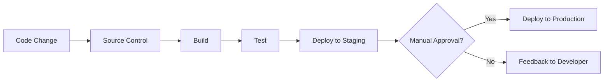
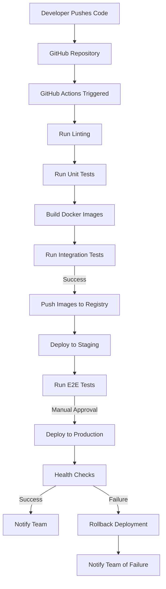

# Docker CI/CD: Automating Your Development Pipeline

## Introduction

Continuous Integration and Continuous Deployment (CI/CD) represents one of the most powerful practices in modern software development. When combined with Docker, it creates a robust system for automatically building, testing, and deploying your applications. In this tutorial, we'll explore how to implement a CI/CD pipeline using Docker, making your development process more efficient and reliable.

CI/CD with Docker allows you to:
- Automatically test code changes
- Build Docker images consistently
- Deploy applications with minimal manual intervention
- Ensure your software is always in a deployable state

Let's dive into the world of Docker CI/CD and transform how you deliver software!

## Prerequisites

Before we begin, make sure you have:
- Basic understanding of Docker concepts (containers, images)
- Docker and Docker Compose installed on your system
- A GitHub account (we'll use GitHub Actions for our CI/CD examples)
- A simple application to containerize (we'll use a basic Node.js app)

## Understanding CI/CD Concepts

### What is CI/CD?

CI/CD consists of two related but distinct practices:

1. **Continuous Integration (CI)**: The practice of frequently merging code changes into a shared repository, followed by automated building and testing.

2. **Continuous Deployment/Delivery (CD)**: 
   - **Continuous Delivery**: Automating the release process up to production, with a manual approval step
   - **Continuous Deployment**: Fully automating the entire pipeline including deployment to production

Let's visualize the CI/CD pipeline:



### Docker's Role in CI/CD

Docker enhances the CI/CD process in several ways:

- **Consistency**: Same environment everywhere (development, testing, production)
- **Isolation**: Applications and dependencies are packaged together
- **Portability**: Docker images can run anywhere Docker is installed
- **Scalability**: Easily scale containers based on demand
- **Version Control**: Docker images can be versioned like code

## Setting Up a Basic CI/CD Pipeline with Docker

Let's create a simple CI/CD pipeline for a Node.js application. We'll use:
- GitHub for source control
- GitHub Actions for CI/CD orchestration
- Docker for containerization
- Docker Hub for image registry

### Step 1: Prepare Your Application

First, let's create a simple Node.js application with a Dockerfile:

```javascript
// app.js
const express = require('express');
const app = express();
const port = process.env.PORT || 3000;

app.get('/', (req, res) => {
  res.send('Hello Docker CI/CD!');
});

app.listen(port, () => {
  console.log(`App listening at http://localhost:${port}`);
});
```

```javascript
// test.js
const assert = require('assert');
console.log('Running tests...');
assert.strictEqual(1 + 1, 2);
console.log('Tests passed!');
```

```json
// package.json
{
  "name": "docker-cicd-demo",
  "version": "1.0.0",
  "description": "A simple app to demonstrate Docker CI/CD",
  "main": "app.js",
  "scripts": {
    "start": "node app.js",
    "test": "node test.js"
  },
  "dependencies": {
    "express": "^4.17.1"
  }
}
```

Now, create a Dockerfile:

```dockerfile
FROM node:14-alpine

WORKDIR /app

COPY package*.json ./

RUN npm install

COPY . .

EXPOSE 3000

CMD ["npm", "start"]
```

### Step 2: Set Up GitHub Actions Workflow

Create a `.github/workflows` directory in your project and add a `docker-ci-cd.yml` file:

```yaml
name: Docker CI/CD

on:
  push:
    branches: [ main ]
  pull_request:
    branches: [ main ]

jobs:
  build-and-test:
    runs-on: ubuntu-latest
    
    steps:
    - uses: actions/checkout@v2
    
    - name: Set up Node.js
      uses: actions/setup-node@v2
      with:
        node-version: '14'
    
    - name: Install dependencies
      run: npm install
    
    - name: Run tests
      run: npm test
    
    - name: Build Docker image
      run: docker build -t myapp:${{ github.sha }} .
    
    - name: Test Docker image
      run: |
        docker run -d -p 3000:3000 --name myapp myapp:${{ github.sha }}
        sleep 5
        curl http://localhost:3000 | grep "Hello Docker CI/CD"
    
    - name: Login to Docker Hub
      if: github.event_name != 'pull_request'
      uses: docker/login-action@v1
      with:
        username: ${{ secrets.DOCKER_HUB_USERNAME }}
        password: ${{ secrets.DOCKER_HUB_TOKEN }}
    
    - name: Push to Docker Hub
      if: github.event_name != 'pull_request'
      run: |
        docker tag myapp:${{ github.sha }} ${{ secrets.DOCKER_HUB_USERNAME }}/myapp:latest
        docker push ${{ secrets.DOCKER_HUB_USERNAME }}/myapp:latest
```

### Step 3: Understanding the Workflow

Let's break down what our GitHub Actions workflow does:

1. **Trigger**: The workflow runs on pushes to the main branch and pull requests
2. **Build and Test**:
   - Checkout the code
   - Set up Node.js environment
   - Install dependencies
   - Run tests
   - Build a Docker image with a tag based on the commit SHA
   - Start a container from the image and test it
3. **Deploy**:
   - Log in to Docker Hub (only for pushes to main, not pull requests)
   - Tag and push the Docker image to Docker Hub

### Step 4: Configure Secrets

For our workflow to push to Docker Hub, we need to set up secrets in our GitHub repository:

1. Go to your GitHub repository
2. Click on "Settings" > "Secrets" > "New repository secret"
3. Add:
   - `DOCKER_HUB_USERNAME`: Your Docker Hub username
   - `DOCKER_HUB_TOKEN`: Your Docker Hub access token (not your password)

## Advanced CI/CD with Docker Compose

For more complex applications with multiple services, we can use Docker Compose in our CI/CD pipeline.

### Docker Compose Setup

Create a `docker-compose.yml` file:

```yaml
version: '3'

services:
  app:
    build: .
    ports:
      - "3000:3000"
    environment:
      - NODE_ENV=production
  
  db:
    image: mongo:4.4
    volumes:
      - mongo-data:/data/db
    ports:
      - "27017:27017"

volumes:
  mongo-data:
```

### Testing with Docker Compose

Update your GitHub Actions workflow to test with Docker Compose:

```yaml
# Add this step after building the Docker image
- name: Test with Docker Compose
  run: |
    docker-compose up -d
    sleep 10
    curl http://localhost:3000 | grep "Hello Docker CI/CD"
    docker-compose down
```

## Implementing Continuous Deployment

Let's extend our pipeline to deploy our application to a server. We'll use SSH to deploy to a remote server:

```yaml
# Add this job after the build-and-test job
deploy:
  needs: build-and-test
  if: github.event_name != 'pull_request'
  runs-on: ubuntu-latest
  
  steps:
  - name: Deploy to production server
    uses: appleboy/ssh-action@master
    with:
      host: ${{ secrets.DEPLOY_HOST }}
      username: ${{ secrets.DEPLOY_USER }}
      key: ${{ secrets.DEPLOY_KEY }}
      script: |
        cd /path/to/app
        docker-compose pull
        docker-compose up -d
```

You'll need to add three more secrets to your GitHub repository:
- `DEPLOY_HOST`: Your server's IP address or hostname
- `DEPLOY_USER`: SSH username
- `DEPLOY_KEY`: SSH private key for authentication

## Real-World CI/CD Pipeline Example

Let's put all these concepts together in a complete CI/CD pipeline for a web application with a frontend, backend, and database:



### Complete GitHub Actions Workflow

Here's a more comprehensive GitHub Actions workflow file for a real-world application:

```yaml
name: CI/CD Pipeline

on:
  push:
    branches: [ main, develop ]
  pull_request:
    branches: [ main, develop ]

jobs:
  test:
    runs-on: ubuntu-latest
    steps:
    - uses: actions/checkout@v2
    
    - name: Set up Node.js
      uses: actions/setup-node@v2
      with:
        node-version: '14'
    
    - name: Install dependencies
      run: npm ci
    
    - name: Lint code
      run: npm run lint
    
    - name: Run unit tests
      run: npm test
  
  build:
    needs: test
    runs-on: ubuntu-latest
    steps:
    - uses: actions/checkout@v2
    
    - name: Set up Docker Buildx
      uses: docker/setup-buildx-action@v1
    
    - name: Cache Docker layers
      uses: actions/cache@v2
      with:
        path: /tmp/.buildx-cache
        key: ${{ runner.os }}-buildx-${{ github.sha }}
        restore-keys: |
          ${{ runner.os }}-buildx-
    
    - name: Login to Docker Hub
      if: github.event_name != 'pull_request'
      uses: docker/login-action@v1
      with:
        username: ${{ secrets.DOCKER_HUB_USERNAME }}
        password: ${{ secrets.DOCKER_HUB_TOKEN }}
    
    - name: Build and push
      uses: docker/build-push-action@v2
      with:
        context: .
        push: ${{ github.event_name != 'pull_request' }}
        tags: ${{ secrets.DOCKER_HUB_USERNAME }}/myapp:${{ github.sha }}
        cache-from: type=local,src=/tmp/.buildx-cache
        cache-to: type=local,dest=/tmp/.buildx-cache-new
    
    # Temp fix for cache size
    - name: Move cache
      run: |
        rm -rf /tmp/.buildx-cache
        mv /tmp/.buildx-cache-new /tmp/.buildx-cache
  
  deploy-staging:
    needs: build
    if: github.ref == 'refs/heads/develop'
    runs-on: ubuntu-latest
    steps:
    - name: Deploy to staging
      uses: appleboy/ssh-action@master
      with:
        host: ${{ secrets.STAGING_HOST }}
        username: ${{ secrets.STAGING_USER }}
        key: ${{ secrets.STAGING_KEY }}
        script: |
          cd /path/to/app
          docker-compose pull
          docker-compose up -d
    
    - name: Run E2E tests
      run: |
        sleep 30  # Wait for deployment to stabilize
        npx cypress run --config baseUrl=https://staging.example.com
  
  deploy-production:
    needs: deploy-staging
    if: github.ref == 'refs/heads/main'
    runs-on: ubuntu-latest
    environment:
      name: production
      url: https://example.com
    steps:
    - name: Deploy to production
      uses: appleboy/ssh-action@master
      with:
        host: ${{ secrets.PRODUCTION_HOST }}
        username: ${{ secrets.PRODUCTION_USER }}
        key: ${{ secrets.PRODUCTION_KEY }}
        script: |
          cd /path/to/app
          docker pull ${{ secrets.DOCKER_HUB_USERNAME }}/myapp:${{ github.sha }}
          docker-compose up -d
    
    - name: Health check
      run: |
        sleep 30
        curl -sSf https://example.com/health || exit 1
```

## Best Practices for Docker CI/CD

1. **Use Multi-Stage Builds**: Reduce image size and improve security.

```dockerfile
# Build stage
FROM node:14-alpine AS build
WORKDIR /app
COPY package*.json ./
RUN npm ci
COPY . .
RUN npm run build

# Production stage
FROM node:14-alpine
WORKDIR /app
COPY --from=build /app/dist ./dist
COPY --from=build /app/node_modules ./node_modules
COPY package*.json ./
EXPOSE 3000
CMD ["npm", "start"]
```

2. **Cache Docker Layers**: Speed up builds by caching layers.

3. **Tag Images Properly**: Use meaningful tags like:
   - Commit SHA: `myapp:abc123`
   - Git branch: `myapp:feature-login`
   - Semantic versioning: `myapp:1.2.3`
   - Latest: `myapp:latest`

4. **Scan Images for Vulnerabilities**:

```yaml
- name: Scan for vulnerabilities
  uses: aquasecurity/trivy-action@master
  with:
    image-ref: 'myapp:${{ github.sha }}'
    format: 'table'
    exit-code: '1'
    severity: 'CRITICAL,HIGH'
```

5. **Implement Rollback Strategies**: Always have a plan B.

6. **Monitor Your Deployments**: Add logging and monitoring.

## Common CI/CD Tools for Docker

Several tools can help you implement CI/CD with Docker:

1. **GitHub Actions**: Tightly integrated with GitHub repositories
2. **GitLab CI/CD**: Built into GitLab with runner support
3. **Jenkins**: Highly customizable with many plugins
4. **CircleCI**: Cloud-based CI/CD platform with Docker support
5. **Travis CI**: Simple configuration for open source projects
6. **DroneCI**: Native Docker support with pipeline as code

## Practical Exercise: Create Your Own CI/CD Pipeline

Let's practice what we've learned by setting up a CI/CD pipeline for a simple web application:

1. Create a new GitHub repository
2. Add a simple web application (Node.js, Python, or any language you prefer)
3. Add a Dockerfile
4. Set up GitHub Actions for:
   - Running tests
   - Building a Docker image
   - Pushing to Docker Hub
5. *Optional*: Deploy to a free service like Heroku or Render

## Summary

In this tutorial, we've covered:

- **CI/CD fundamentals** and their importance in modern development
- **Docker's role** in creating consistent build and deployment pipelines
- How to **set up a basic CI/CD pipeline** with GitHub Actions and Docker
- **Advanced CI/CD techniques** with Docker Compose for multi-service applications
- **Best practices** for implementing Docker in your CI/CD workflow
- **Common tools** for Docker CI/CD implementation

By adopting Docker in your CI/CD pipeline, you can achieve:
- Faster development cycles
- More reliable deployments
- Consistent environments
- Better collaboration between development and operations

## Additional Resources

- [Docker Documentation](https://docs.docker.com/)
- [GitHub Actions Documentation](https://docs.github.com/en/actions)
- [Docker Compose Documentation](https://docs.docker.com/compose/)
- [Docker Hub](https://hub.docker.com/)
- [CI/CD Best Practices](https://www.atlassian.com/continuous-delivery/principles/continuous-integration-vs-delivery-vs-deployment)

## Next Steps

Now that you understand Docker CI/CD, consider exploring:
1. Kubernetes for container orchestration
2. Infrastructure as Code (IaC) tools like Terraform
3. Advanced monitoring and observability solutions
4. GitOps workflows for Kubernetes deployments

Happy automating!