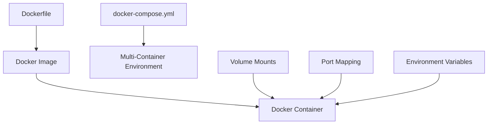

# Docker Development Environment

## Introduction

When developing applications, one of the most common challenges is ensuring consistency across different development machines and deployment environments. How many times have you heard (or said) "but it works on my machine"? Docker solves this problem by providing a way to package your application along with all its dependencies into a standardized unit called a **container**.

A Docker development environment allows you to:

- Create consistent environments across development, testing, and production
- Isolate project dependencies to avoid conflicts
- Onboard new team members quickly with a ready-to-use environment
- Test applications in production-like settings locally

In this guide, we'll explore how to set up and use Docker to create powerful, portable development environments for your projects.

## Prerequisites

Before we begin, make sure you have:

- [Docker Desktop](https://www.docker.com/products/docker-desktop) installed on your machine
- Basic understanding of command-line operations
- A project you'd like to containerize

## Understanding Docker Development Environments

Let's first understand the key components that make up a Docker development environment:



### Key Components

1. **Dockerfile**: A script containing instructions to build a Docker image
2. **Docker Image**: A template that contains your application code and all dependencies
3. **Docker Container**: A running instance of your Docker image
4. **docker-compose.yml**: A configuration file for defining and running multi-container Docker applications
5. **Volume Mounts**: Allow you to sync files between your host and container
6. **Port Mapping**: Connect container ports to host ports
7. **Environment Variables**: Configure your application behavior

## Setting Up Your First Docker Development Environment

Let's start by creating a simple development environment for a Node.js application.

### Step 1: Create a Dockerfile

First, let's create a `Dockerfile` in your project root:

```dockerfile
# Use Node.js as our base image
FROM node:18-alpine

# Set working directory
WORKDIR /app

# Copy package.json and package-lock.json
COPY package*.json ./

# Install dependencies
RUN npm install

# Copy the rest of the application
COPY . .

# Expose port 3000
EXPOSE 3000

# Command to run the application
CMD ["npm", "start"]
```

### Step 2: Create a .dockerignore File

Create a `.dockerignore` file to exclude unnecessary files:

```
node_modules
npm-debug.log
.git
.gitignore
```

### Step 3: Create a docker-compose.yml File

For more complex setups, create a `docker-compose.yml` file:

```yaml
version: '3.8'

services:
  app:
    build: .
    ports:
      - "3000:3000"
    volumes:
      - .:/app
      - /app/node_modules
    environment:
      - NODE_ENV=development
    command: npm run dev

  database:
    image: mongo:latest
    ports:
      - "27017:27017"
    volumes:
      - mongodb_data:/data/db

volumes:
  mongodb_data:
```

### Step 4: Build and Start Your Environment

Now let's start our development environment:

```bash
# Build and start containers
docker-compose up -d

# Check running containers
docker-compose ps

# View logs
docker-compose logs -f
```

**Output:**
```
Creating network "myproject_default" with the default driver
Creating myproject_database_1 ... done
Creating myproject_app_1      ... done
Attaching to myproject_database_1, myproject_app_1
database_1  | 2023-09-14T10:15:32.476+0000 I NETWORK  [initandlisten] waiting for connections on port 27017
app_1       | > myapp@1.0.0 dev
app_1       | > nodemon src/index.js
app_1       | [nodemon] 2.0.22
app_1       | [nodemon] starting `node src/index.js`
app_1       | Server running on port 3000
```

## Real-World Development Workflow with Docker

Now that we have our environment set up, let's see how a typical development workflow looks like.

### Making Code Changes

With volume mounts configured, you can edit files on your host machine, and changes will be reflected in the container instantly.

1. Edit a source file in your project
2. If you're using tools like Nodemon, they will detect changes and restart automatically
3. Refresh your browser to see the changes

### Installing New Dependencies

When you need to add new packages to your project:

```bash
# Run npm install inside the container
docker-compose exec app npm install express --save

# Or get a shell in the container
docker-compose exec app sh
# Then run any commands you need
npm install
npm run test
exit
```

### Running Tests

You can run tests directly in your container:

```bash
docker-compose exec app npm run test
```

### Debugging

To debug your application in a Docker container:

1. Configure your Dockerfile to expose debug ports
2. Configure your IDE to connect to these ports
3. Add the following to your docker-compose.yml under your app service:

```yaml
ports:
  - "3000:3000"
  - "9229:9229"  # Debug port
command: npm run debug  # Assuming you have a debug script in package.json
```

Example debug script in package.json:

```json
"scripts": {
  "debug": "node --inspect=0.0.0.0:9229 src/index.js"
}
```

## Advanced Docker Development Features

Let's explore some advanced features that can enhance your development environment.

### Multi-Stage Builds

Multi-stage builds help create smaller production images:

```dockerfile
# Build stage
FROM node:18-alpine AS build
WORKDIR /app
COPY package*.json ./
RUN npm install
COPY . .
RUN npm run build

# Production stage
FROM node:18-alpine
WORKDIR /app
COPY --from=build /app/dist ./dist
COPY --from=build /app/package*.json ./
RUN npm install --production
EXPOSE 3000
CMD ["node", "dist/index.js"]
```

### Development vs. Production Configurations

You can maintain different Docker Compose files for different environments:

- `docker-compose.yml` - Base configuration
- `docker-compose.override.yml` - Development overrides (loaded automatically)
- `docker-compose.prod.yml` - Production settings

**docker-compose.override.yml (Development):**
```yaml
services:
  app:
    volumes:
      - .:/app
      - /app/node_modules
    environment:
      - NODE_ENV=development
    command: npm run dev
```

**docker-compose.prod.yml (Production):**
```yaml
services:
  app:
    environment:
      - NODE_ENV=production
    command: node dist/index.js
    # No volumes mounted for production
```

To use the production configuration:

```bash
docker-compose -f docker-compose.yml -f docker-compose.prod.yml up -d
```

### Using Docker for Different Programming Languages

The approach is similar across languages, but configurations might differ slightly:

#### Python Development Environment

```dockerfile
FROM python:3.9-slim

WORKDIR /app

COPY requirements.txt .
RUN pip install -r requirements.txt

COPY . .

CMD ["python", "app.py"]
```

With docker-compose.yml:

```yaml
services:
  app:
    build: .
    ports:
      - "5000:5000"
    volumes:
      - .:/app
    environment:
      - FLASK_ENV=development
      - FLASK_APP=app.py
    command: flask run --host=0.0.0.0
```

#### Java Development Environment

```dockerfile
FROM maven:3.8.4-openjdk-17 AS build
WORKDIR /app
COPY pom.xml .
COPY src ./src
RUN mvn package -DskipTests

FROM openjdk:17-slim
COPY --from=build /app/target/*.jar app.jar
EXPOSE 8080
ENTRYPOINT ["java", "-jar", "app.jar"]
```

## Common Challenges and Solutions

### Performance Issues on macOS/Windows

Docker on macOS and Windows runs in a virtual machine, which can lead to slower file system performance. To improve:

1. Minimize the number of files you sync with volume mounts
2. Use targeted volume mounts instead of mounting the entire project
3. Use tools like docker-sync for macOS

### Container Resource Constraints

Configure resource limits in your docker-compose.yml:

```yaml
services:
  app:
    # other configurations...
    deploy:
      resources:
        limits:
          cpus: '0.5'
          memory: 512M
```

### Managing Database Data

For persistent database data:

```yaml
services:
  database:
    image: postgres:13
    volumes:
      - postgres_data:/var/lib/postgresql/data
    environment:
      - POSTGRES_PASSWORD=mysecretpassword
      - POSTGRES_USER=myuser
      - POSTGRES_DB=mydb

volumes:
  postgres_data:
```

## Best Practices for Docker Development Environments

1. **Keep images small** - Use alpine-based images and multi-stage builds
2. **Optimize rebuilds** - Order Dockerfile commands by change frequency
3. **Use .dockerignore** - Exclude unnecessary files
4. **Separate development and production** - Use different Docker Compose files
5. **Set explicit versions** - Avoid `latest` tags for reproducibility
6. **Use environment variables** - Don't hardcode configuration
7. **Use health checks** - Ensure services are actually ready:

```yaml
services:
  app:
    # other configurations...
    healthcheck:
      test: ["CMD", "curl", "-f", "http://localhost:3000/health"]
      interval: 30s
      timeout: 10s
      retries: 3
```

## Summary

Docker development environments provide a powerful way to create consistent, reproducible environments for your development workflow. By containerizing your application and its dependencies, you eliminate the "works on my machine" problem and make it easier for teams to collaborate.

In this guide, we've covered:
- Setting up a basic Docker development environment
- Creating Dockerfiles and docker-compose configurations
- Managing a development workflow with Docker
- Advanced features for more complex setups
- Best practices for Docker-based development

With these skills, you can now set up efficient development environments for any project, ensuring consistency from development to production.

## Exercises

1. Create a Docker development environment for a simple web application using your favorite programming language.
2. Add a database service to your docker-compose.yml and connect your application to it.
3. Create separate development and production Docker configurations.
4. Set up a multi-stage build for a frontend application using React or Vue.js.
5. Implement Docker health checks for your services.

## Additional Resources

- [Docker Documentation](https://docs.docker.com/)
- [Docker Compose Documentation](https://docs.docker.com/compose/)
- [Docker Best Practices](https://docs.docker.com/develop/develop-images/dockerfile_best-practices/)
- [Development with Docker Compose](https://docs.docker.com/compose/development/)
- [Docker Multi-Stage Builds](https://docs.docker.com/build/building/multi-stage/)