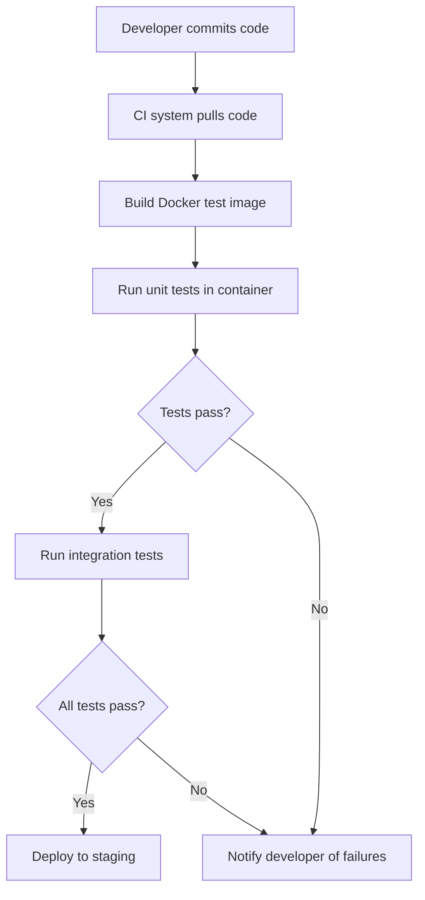

# Docker Testing Environment

## Introduction

Testing is a crucial part of software development, but setting up consistent testing environments can be challenging. Different team members may have different local setups, leading to the infamous "it works on my machine" problem. Docker provides an elegant solution to this challenge by allowing you to create isolated, reproducible testing environments that work consistently across different machines.

In this guide, we'll explore how to use Docker to create reliable testing environments for your applications. Whether you're a solo developer or part of a large team, Docker can help streamline your testing process and ensure consistency across different stages of your development pipeline.

## Why Docker for Testing?

Docker offers several benefits for testing environments:

- **Consistency**: Everyone runs tests in identical environments
- **Isolation**: Tests don't interfere with other processes or the host system
- **Reproducibility**: Test environments can be recreated exactly as needed
- **Portability**: Testing setups work on any system that runs Docker
- **Efficiency**: Resources can be shared and tests can run in parallel

## Prerequisites

Before we begin, make sure you have:

- Docker installed on your machine
- Basic understanding of Docker concepts (images, containers)
- A simple application to test


## Creating a Basic Testing Environment

Let's start by creating a simple testing environment for a Python application.

### 1. Project Structure

First, let's set up a basic project structure:

```
project/
├── app/
│   ├── __init__.py
│   └── main.py
├── tests/
│   ├── __init__.py
│   └── test_main.py
├── Dockerfile
├── docker-compose.yml
└── requirements.txt
```

### 2. Sample Application

Here's a simple Python function in `app/main.py` that we'll test:

```python
# app/main.py
def add_numbers(a, b):
    return a + b

def multiply_numbers(a, b):
    return a * b
```

### 3. Test File

Now let's create a test file in `tests/test_main.py`:

```python
# tests/test_main.py
import unittest
from app.main import add_numbers, multiply_numbers

class TestMathFunctions(unittest.TestCase):
    def test_add_numbers(self):
        self.assertEqual(add_numbers(2, 3), 5)
        self.assertEqual(add_numbers(-1, 1), 0)
        
    def test_multiply_numbers(self):
        self.assertEqual(multiply_numbers(2, 3), 6)
        self.assertEqual(multiply_numbers(-1, 5), -5)

if __name__ == '__main__':
    unittest.main()
```

### 4. Requirements File

Create a `requirements.txt` file:

```
pytest==7.4.0
pytest-cov==4.1.0
```

### 5. Dockerfile for Testing

Now, let's create a `Dockerfile` for our testing environment:

```dockerfile
# Use a Python base image
FROM python:3.9-slim

# Set working directory
WORKDIR /app

# Copy requirements first (for better caching)
COPY requirements.txt .

# Install dependencies
RUN pip install --no-cache-dir -r requirements.txt

# Copy the rest of the application
COPY . .

# Command to run tests
CMD ["pytest", "-v", "--cov=app"]
```

### 6. Docker Compose Configuration

Create a `docker-compose.yml` file to make it easier to run the tests:

```yaml
version: '3'

services:
  test:
    build: .
    volumes:
      - .:/app
    command: pytest -v --cov=app
```

## Running Tests in Docker

Now that we have our Docker testing environment set up, let's run our tests:

```bash
docker-compose up test
```

You should see output similar to:

```
Building test
...
Creating project_test_1 ... done
Attaching to project_test_1
test_1  | ============================= test session starts ==============================
test_1  | platform linux -- Python 3.9.x, pytest-7.4.0, pluggy-1.x
test_1  | collected 2 items
test_1  |
test_1  | tests/test_main.py::TestMathFunctions::test_add_numbers PASSED [ 50%]
test_1  | tests/test_main.py::TestMathFunctions::test_multiply_numbers PASSED [100%]
test_1  |
test_1  | ----------- coverage: platform linux, python 3.9.x -----------
test_1  | Name           Stmts   Miss  Cover
test_1  | ----------------------------------
test_1  | app/__init__.py     0      0   100%
test_1  | app/main.py         4      0   100%
test_1  | ----------------------------------
test_1  | TOTAL               4      0   100%
test_1  |
test_1  | ============================== 2 passed in 0.08s ===============================
project_test_1 exited with code 0
```

## Advanced Testing Environments

Now that we understand the basics, let's explore more advanced testing scenarios.

### Multiple Service Testing

For more complex applications that use multiple services (like a web app with a database), we can use Docker Compose to create a multi-container testing environment.

Here's an example `docker-compose.yml` for a web application with a database:

```yaml
version: '3'

services:
  app:
    build: .
    depends_on:
      - db
    environment:
      - DATABASE_URL=postgresql://postgres:postgres@db:5432/testdb
    command: pytest -v

  db:
    image: postgres:13
    environment:
      - POSTGRES_USER=postgres
      - POSTGRES_PASSWORD=postgres
      - POSTGRES_DB=testdb
    # This healthcheck ensures tests wait until the database is ready
    healthcheck:
      test: ["CMD-SHELL", "pg_isready -U postgres"]
      interval: 5s
      timeout: 5s
      retries: 5
```

This setup creates two containers:
1. An `app` container that runs our tests
2. A `db` container with a PostgreSQL database for testing

### Parallel Test Execution

Docker allows us to run tests in parallel by spinning up multiple containers:

```yaml
version: '3'

services:
  test-unit:
    build: .
    volumes:
      - .:/app
    command: pytest -v tests/unit/

  test-integration:
    build: .
    volumes:
      - .:/app
    depends_on:
      - db
    command: pytest -v tests/integration/

  db:
    image: postgres:13
    environment:
      - POSTGRES_USER=postgres
      - POSTGRES_PASSWORD=postgres
      - POSTGRES_DB=testdb
```

With this configuration, you can run:

```bash
docker-compose up --parallel test-unit test-integration
```

## Testing Workflow Visualization

Here's a diagram illustrating a typical Docker testing workflow:



## Testing Strategies with Docker

### 1. Disposable Test Databases

You can create disposable databases for testing that are created fresh for each test run:

```yaml
version: '3'

services:
  test:
    build: .
    depends_on:
      - db
    environment:
      - TEST_DATABASE_URL=postgresql://postgres:postgres@db:5432/testdb
    command: pytest -v

  db:
    image: postgres:13
    environment:
      - POSTGRES_USER=postgres
      - POSTGRES_PASSWORD=postgres
      - POSTGRES_DB=testdb
    volumes:
      - ./init-test-db.sql:/docker-entrypoint-initdb.d/init-test-db.sql
```

### 2. Test Matrix with Different Environments

You can test your application against different versions of dependencies:

```yaml
version: '3'

services:
  test-python38:
    build:
      context: .
      dockerfile: Dockerfile.python38
    volumes:
      - .:/app
    command: pytest -v

  test-python39:
    build:
      context: .
      dockerfile: Dockerfile.python39
    volumes:
      - .:/app
    command: pytest -v

  test-python310:
    build:
      context: .
      dockerfile: Dockerfile.python310
    volumes:
      - .:/app
    command: pytest -v
```

### 3. Persistent Test Results

You can configure your testing setup to save test results outside the container:

```yaml
version: '3'

services:
  test:
    build: .
    volumes:
      - .:/app
      - ./test-results:/app/test-results
    command: pytest -v --junitxml=/app/test-results/results.xml
```

## Continuous Integration with Docker Testing

Docker testing environments integrate perfectly with CI/CD systems. Here's a sample configuration for GitHub Actions:

```yaml
name: Docker Tests

on: [push, pull_request]

jobs:
  test:
    runs-on: ubuntu-latest
    steps:
      - uses: actions/checkout@v3
      
      - name: Set up Docker Buildx
        uses: docker/setup-buildx-action@v2
      
      - name: Run tests
        run: docker-compose up --exit-code-from test test
      
      - name: Upload test results
        uses: actions/upload-artifact@v3
        with:
          name: test-results
          path: test-results/
```

## Best Practices for Docker Testing Environments

1. **Keep images small**: Use slim or alpine base images to reduce build time and size.

2. **Optimize for caching**: Structure your Dockerfile to take advantage of Docker's layer caching:
   
   ```dockerfile
   # Good - dependencies in separate layer
   COPY requirements.txt .
   RUN pip install -r requirements.txt
   COPY . .
   
   # Bad - changes to code invalidate dependency cache
   COPY . .
   RUN pip install -r requirements.txt
   ```

3. **Use volumes for local development**: Mount your code as a volume during development to see changes immediately.

4. **Run as non-root**: Use a non-root user inside your testing containers for security:
   
   ```dockerfile
   RUN useradd -m testuser
   USER testuser
   ```

5. **Use environment variables**: Make your tests configurable with environment variables.

6. **Implement health checks**: Ensure services are ready before running tests that depend on them.

## Debugging Failed Tests in Docker

When tests fail inside a Docker container, debugging can be challenging. Here are some approaches:

### Interactive Mode

Run your test container in interactive mode:

```bash
docker-compose run --rm test bash
```

This gives you a shell inside the container where you can run tests manually and explore the environment.

### Logging

Increase verbosity in your test runs:

```yaml
command: pytest -v --log-cli-level=DEBUG
```

### Visual Studio Code Remote Containers

For a more integrated experience, use VS Code's Remote Containers extension to develop and debug directly inside your Docker container.

## Example: Testing a Web Application

Let's look at a more complete example of testing a Flask application with both unit and integration tests.

### Project Structure

```
flask-app/
├── app/
│   ├── __init__.py
│   └── app.py
├── tests/
│   ├── __init__.py
│   ├── test_unit.py
│   └── test_integration.py
├── Dockerfile
├── docker-compose.yml
└── requirements.txt
```

### Sample Flask Application

`app/app.py`:

```python
from flask import Flask, jsonify, request

app = Flask(__name__)

@app.route('/api/add', methods=['POST'])
def add():
    data = request.json
    if not data or 'a' not in data or 'b' not in data:
        return jsonify({'error': 'Missing parameters'}), 400
    
    result = data['a'] + data['b']
    return jsonify({'result': result})

if __name__ == '__main__':
    app.run(host='0.0.0.0', port=5000)
```

### Unit Tests

`tests/test_unit.py`:

```python
import unittest
from app.app import app

class TestFlaskApp(unittest.TestCase):
    def setUp(self):
        self.app = app.test_client()
        self.app.testing = True
    
    def test_add_success(self):
        response = self.app.post('/api/add', 
                                json={'a': 1, 'b': 2})
        data = response.get_json()
        self.assertEqual(response.status_code, 200)
        self.assertEqual(data['result'], 3)
    
    def test_add_missing_params(self):
        response = self.app.post('/api/add', 
                                json={'a': 1})
        self.assertEqual(response.status_code, 400)

if __name__ == '__main__':
    unittest.main()
```

### Integration Tests

`tests/test_integration.py`:

```python
import unittest
import requests

class TestFlaskAppIntegration(unittest.TestCase):
    def setUp(self):
        self.base_url = 'http://app:5000'
    
    def test_add_endpoint(self):
        response = requests.post(
            f'{self.base_url}/api/add',
            json={'a': 5, 'b': 3}
        )
        data = response.json()
        self.assertEqual(response.status_code, 200)
        self.assertEqual(data['result'], 8)

if __name__ == '__main__':
    unittest.main()
```

### Docker Compose for Integration Testing

`docker-compose.yml`:

```yaml
version: '3'

services:
  app:
    build: .
    command: python -m app.app
    ports:
      - "5000:5000"
  
  test-unit:
    build: .
    volumes:
      - .:/app
    command: pytest -v tests/test_unit.py
  
  test-integration:
    build: .
    volumes:
      - .:/app
    depends_on:
      - app
    command: pytest -v tests/test_integration.py
```

To run the tests:

```bash
# Run unit tests
docker-compose up test-unit

# Run integration tests
docker-compose up app -d
docker-compose up test-integration
```

## Summary

Docker provides a powerful platform for creating consistent, isolated testing environments that can significantly improve your testing workflow. By containerizing your tests, you ensure that everyone on your team is testing under the same conditions, eliminating the "it works on my machine" problem.

In this guide, we've explored:

- Setting up basic Docker testing environments
- Creating multi-service testing setups
- Running tests in parallel
- Implementing different testing strategies
- Integrating with CI/CD systems
- Best practices for Docker testing
- Debugging techniques for container-based tests

By implementing these techniques, you can create more reliable, efficient, and maintainable testing processes for your applications.

## Additional Resources

- [Official Docker Documentation](https://docs.docker.com/)
- [pytest Documentation](https://docs.pytest.org/)
- [Docker Compose Documentation](https://docs.docker.com/compose/)

## Exercises

1. Create a Docker testing environment for a simple application in your preferred programming language.
2. Modify the testing setup to include a database container.
3. Implement a multi-stage Dockerfile that has separate stages for testing and production.
4. Set up parallel test execution for different components of your application.
5. Configure your testing environment to generate test coverage reports.