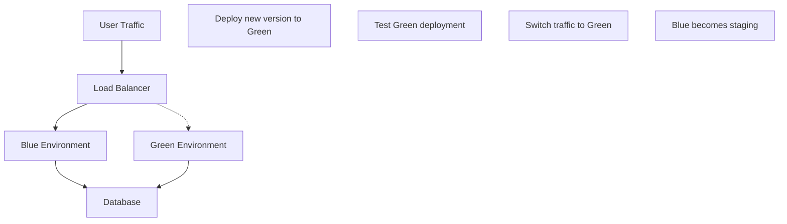

# Docker Production Deployment

## Introduction

Deploying Docker containers in a production environment is a critical step in the software development lifecycle. While Docker makes development and testing easier, production deployments require additional considerations for reliability, security, and performance. This guide will walk you through the essential steps and best practices for deploying Docker containers in production environments.

## Prerequisites

Before diving into production deployment, make sure you have:

- Basic knowledge of Docker concepts (containers, images, Dockerfiles)
- Docker and Docker Compose installed on your system
- A containerized application ready for deployment
- Access to a production server or cloud platform

## Preparing Your Application for Production

### Creating a Production-Ready Dockerfile

A production Dockerfile differs from a development one in several important ways:

```dockerfile
# Development Dockerfile (for reference)
FROM node:16
WORKDIR /app
COPY package*.json ./
RUN npm install
COPY . .
EXPOSE 3000
CMD ["npm", "run", "dev"]
```

```dockerfile
# Production Dockerfile
FROM node:16-alpine AS builder
WORKDIR /app
COPY package*.json ./
RUN npm ci
COPY . .
RUN npm run build

FROM node:16-alpine
WORKDIR /app
# Create a non-root user
RUN addgroup -S appgroup && adduser -S appuser -G appgroup
COPY --from=builder /app/dist ./dist
COPY --from=builder /app/package*.json ./
RUN npm ci --only=production
USER appuser
EXPOSE 3000
CMD ["npm", "run", "start"]
```

Key differences in production:
- Using multi-stage builds to create smaller images
- Using lightweight base images (alpine)
- Running as a non-root user for security
- Only installing production dependencies
- Building application in a separate stage

### Security Best Practices

1. **Scan your images for vulnerabilities**:
```bash
# Using Docker Scout
docker scout cve myapp:latest

# Or using Trivy
trivy image myapp:latest
```

2. **Set resource limits in your docker-compose.yml file**:
```yaml
services:
  webapp:
    image: myapp:latest
    deploy:
      resources:
        limits:
          cpus: '0.5'
          memory: 512M
        reservations:
          cpus: '0.25'
          memory: 256M
```

3. **Use secrets management**:
```yaml
services:
  webapp:
    image: myapp:latest
    secrets:
      - db_password
      - api_key

secrets:
  db_password:
    file: ./secrets/db_password.txt
  api_key:
    file: ./secrets/api_key.txt
```

## Deployment Strategies

### Basic Production Deployment

A simple deployment using Docker Compose:

```yaml
# docker-compose.prod.yml
version: '3.8'

services:
  webapp:
    image: myapp:1.0.0
    restart: always
    ports:
      - "80:3000"
    environment:
      - NODE_ENV=production
      - DATABASE_URL=postgres://user:password@db:5432/myapp
    depends_on:
      - db
  
  db:
    image: postgres:14-alpine
    volumes:
      - postgres_data:/var/lib/postgresql/data
    environment:
      - POSTGRES_PASSWORD=password
      - POSTGRES_USER=user
      - POSTGRES_DB=myapp
    restart: always

volumes:
  postgres_data:
```

Deploy with:
```bash
docker-compose -f docker-compose.prod.yml up -d
```

### Blue-Green Deployment

Blue-green deployment is a technique that reduces downtime by running two identical production environments:



Implementation example with Docker Compose and a reverse proxy:

```yaml
# docker-compose.blue.yml
version: '3.8'
services:
  blue:
    image: myapp:1.0.0
    networks:
      - web
    labels:
      - "traefik.enable=true"
      - "traefik.http.routers.blue.rule=Host(`myapp.com`)"

networks:
  web:
    external: true
```

```yaml
# docker-compose.green.yml
version: '3.8'
services:
  green:
    image: myapp:1.1.0
    networks:
      - web
    labels:
      - "traefik.enable=true"
      - "traefik.http.routers.green.rule=Host(`staging.myapp.com`)"

networks:
  web:
    external: true
```

To switch traffic:
```bash
# Update labels to route production traffic to green
docker-compose -f docker-compose.green.yml down
docker-compose -f docker-compose.green.yml up -d
```

## Container Orchestration in Production

For larger applications, a container orchestrator is essential.

### Docker Swarm

Docker Swarm is Docker's native clustering and orchestration solution:

```yaml
# docker-compose.swarm.yml
version: '3.8'
services:
  webapp:
    image: myapp:1.0.0
    deploy:
      replicas: 3
      update_config:
        parallelism: 1
        delay: 10s
      restart_policy:
        condition: on-failure
        max_attempts: 3
    ports:
      - "80:3000"
    networks:
      - webnet

networks:
  webnet:
```

Deploy to Swarm:
```bash
# Initialize Swarm if not already done
docker swarm init

# Deploy stack
docker stack deploy -c docker-compose.swarm.yml myapp
```

### Kubernetes (Brief Overview)

For more complex deployments, Kubernetes is often used:

```yaml
# deployment.yaml
apiVersion: apps/v1
kind: Deployment
metadata:
  name: myapp
spec:
  replicas: 3
  selector:
    matchLabels:
      app: myapp
  template:
    metadata:
      labels:
        app: myapp
    spec:
      containers:
      - name: myapp
        image: myapp:1.0.0
        ports:
        - containerPort: 3000
        resources:
          limits:
            cpu: "0.5"
            memory: "512Mi"
          requests:
            cpu: "0.2"
            memory: "256Mi"
```

```yaml
# service.yaml
apiVersion: v1
kind: Service
metadata:
  name: myapp
spec:
  selector:
    app: myapp
  ports:
  - port: 80
    targetPort: 3000
  type: LoadBalancer
```

## Monitoring and Logging

### Setting Up Monitoring

A sample Docker Compose setup with Prometheus and Grafana:

```yaml
# docker-compose.monitoring.yml
version: '3.8'
services:
  prometheus:
    image: prom/prometheus:latest
    volumes:
      - ./prometheus.yml:/etc/prometheus/prometheus.yml
      - prometheus_data:/prometheus
    ports:
      - "9090:9090"
  
  grafana:
    image: grafana/grafana:latest
    depends_on:
      - prometheus
    ports:
      - "3000:3000"
    volumes:
      - grafana_data:/var/lib/grafana
    environment:
      - GF_SECURITY_ADMIN_PASSWORD=secure_password

volumes:
  prometheus_data:
  grafana_data:
```

Example prometheus.yml configuration:
```yaml
global:
  scrape_interval: 15s

scrape_configs:
  - job_name: 'myapp'
    static_configs:
      - targets: ['webapp:9101']
```

### Centralized Logging

Setting up ELK (Elasticsearch, Logstash, Kibana) stack:

```yaml
# docker-compose.logging.yml
version: '3.8'
services:
  elasticsearch:
    image: docker.elastic.co/elasticsearch/elasticsearch:7.14.0
    environment:
      - "discovery.type=single-node"
    volumes:
      - elasticsearch_data:/usr/share/elasticsearch/data
    ports:
      - "9200:9200"
  
  logstash:
    image: docker.elastic.co/logstash/logstash:7.14.0
    depends_on:
      - elasticsearch
    volumes:
      - ./logstash.conf:/usr/share/logstash/pipeline/logstash.conf
  
  kibana:
    image: docker.elastic.co/kibana/kibana:7.14.0
    depends_on:
      - elasticsearch
    ports:
      - "5601:5601"

volumes:
  elasticsearch_data:
```

## CI/CD Pipeline Integration

Example GitHub Actions workflow for Docker deployment:

```yaml
name: Deploy to Production

on:
  push:
    branches: [ main ]

jobs:
  build-and-deploy:
    runs-on: ubuntu-latest
    
    steps:
    - uses: actions/checkout@v2
    
    - name: Build and tag Docker image
      run: |
        docker build -t myapp:${{ github.sha }} .
        docker tag myapp:${{ github.sha }} myapp:latest
    
    - name: Log in to Docker Hub
      uses: docker/login-action@v1
      with:
        username: ${{ secrets.DOCKER_HUB_USERNAME }}
        password: ${{ secrets.DOCKER_HUB_TOKEN }}
    
    - name: Push Docker image
      run: |
        docker push myapp:${{ github.sha }}
        docker push myapp:latest
    
    - name: Deploy to production server
      uses: appleboy/ssh-action@master
      with:
        host: ${{ secrets.PROD_HOST }}
        username: ${{ secrets.PROD_USER }}
        key: ${{ secrets.PROD_SSH_KEY }}
        script: |
          cd /opt/myapp
          docker-compose pull
          docker-compose down
          docker-compose up -d
```

## Backup and Disaster Recovery

### Database Backup Strategy

Backup script for containerized database:

```bash
#!/bin/bash
# db-backup.sh

# Set variables
CONTAINER_NAME="myapp_db_1"
BACKUP_DIR="/backups"
TIMESTAMP=$(date +%Y%m%d_%H%M%S)
BACKUP_FILE="${BACKUP_DIR}/db_backup_${TIMESTAMP}.sql"

# Ensure backup directory exists
mkdir -p ${BACKUP_DIR}

# Run backup command inside container
docker exec ${CONTAINER_NAME} pg_dump -U postgres myapp > ${BACKUP_FILE}

# Compress backup
gzip ${BACKUP_FILE}

# Remove backups older than 7 days
find ${BACKUP_DIR} -name "db_backup_*.sql.gz" -mtime +7 -delete
```

Schedule with cron:
```bash
# Add to crontab
0 2 * * * /path/to/db-backup.sh >> /var/log/db-backup.log 2>&1
```

### Container Volumes Backup

Example script to backup Docker volumes:

```bash
#!/bin/bash
# volume-backup.sh

# Set variables
VOLUME_NAME="myapp_postgres_data"
BACKUP_DIR="/backups/volumes"
TIMESTAMP=$(date +%Y%m%d_%H%M%S)
BACKUP_FILE="${BACKUP_DIR}/${VOLUME_NAME}_${TIMESTAMP}.tar.gz"

# Ensure backup directory exists
mkdir -p ${BACKUP_DIR}

# Create temporary container to access volume data
docker run --rm -v ${VOLUME_NAME}:/source -v ${BACKUP_DIR}:/backup alpine \
  tar -czf /backup/$(basename ${BACKUP_FILE}) -C /source .

# Remove backups older than 7 days
find ${BACKUP_DIR} -name "${VOLUME_NAME}_*.tar.gz" -mtime +7 -delete
```

## Performance Tuning

### Optimizing Docker Daemon Settings

Edit `/etc/docker/daemon.json`:
```json
{
  "log-driver": "json-file",
  "log-opts": {
    "max-size": "10m",
    "max-file": "3"
  },
  "default-ulimits": {
    "nofile": {
      "Name": "nofile",
      "Hard": 64000,
      "Soft": 64000
    }
  },
  "metrics-addr": "0.0.0.0:9323",
  "experimental": true
}
```

### Container Resource Allocation

Guidelines for resource allocation:
- Start with conservative limits
- Monitor resource usage with tools like cAdvisor
- Adjust based on actual usage patterns
- Consider the overhead of the container runtime

## Handling Secrets in Production

### Using Docker Secrets

For Docker Swarm:
```bash
# Create secrets
echo "mydbpassword" | docker secret create db_password -
echo "myapikey" | docker secret create api_key -
```

```yaml
# docker-compose with secrets
version: '3.8'
services:
  webapp:
    image: myapp:latest
    secrets:
      - db_password
      - api_key
    environment:
      - DB_PASSWORD_FILE=/run/secrets/db_password
      - API_KEY_FILE=/run/secrets/api_key
      
secrets:
  db_password:
    external: true
  api_key:
    external: true
```

Accessing secrets in your application:
```javascript
// Node.js example
const fs = require('fs');
const db_password = fs.readFileSync('/run/secrets/db_password', 'utf8').trim();
```

## Production Checklist

Before finalizing your deployment, check these essential items:

- [ ] Image is built from pinned base image version
- [ ] Container runs as non-root user
- [ ] Resource limits are set
- [ ] Health checks are configured
- [ ] Logs are externalized
- [ ] Secrets are properly managed
- [ ] Monitoring is in place
- [ ] Backup and restore procedures are tested
- [ ] Security scanning is implemented
- [ ] Network access is restricted

## Troubleshooting Common Issues

### Container Won't Start

Check logs:
```bash
docker logs <container_id>
```

Check container status:
```bash
docker inspect <container_id>
```

### Out of Memory Issues

Look for memory-related errors:
```bash
docker stats
```

Adjust memory limits:
```yaml
services:
  webapp:
    deploy:
      resources:
        limits:
          memory: 1G
```

### Network Connectivity Problems

Check network:
```bash
docker network ls
docker network inspect <network_name>
```

Test connectivity:
```bash
docker exec <container_id> ping <service_name>
```

## Summary

Docker production deployment requires careful planning and attention to detail. By following the best practices covered in this guide, you can create a robust, secure, and scalable containerized production environment.

Key takeaways:
- Use multi-stage builds to create optimized images
- Implement proper security measures (non-root users, scanning)
- Configure resource limits
- Set up monitoring and logging
- Use container orchestration for high-availability
- Implement backup and disaster recovery
- Properly manage secrets and configuration
- Test thoroughly before deployment

## Additional Resources

- [Docker Production Best Practices](https://docs.docker.com/develop/dev-best-practices/)
- [Docker Security Best Practices](https://docs.docker.com/engine/security/security/)
- [Official Docker Compose Documentation](https://docs.docker.com/compose/)
- [Docker Swarm Documentation](https://docs.docker.com/engine/swarm/)

## Exercises

1. Create a production-ready Dockerfile for a web application of your choice.
2. Set up a monitoring stack with Prometheus and Grafana for your containerized application.
3. Implement a blue-green deployment strategy for an example application.
4. Create a backup and restore script for your application's data volumes.
5. Configure a CI/CD pipeline to build, test, and deploy your containerized application.