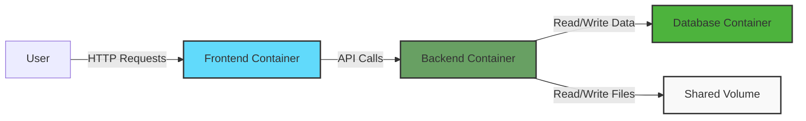

# Docker Multi-Container Application

## Introduction

When building modern applications, you'll often need more than just a single service. For example, a typical web application might include a frontend, a backend API, and a database. Rather than deploying everything in one container (which would defeat many of the benefits of containerization), Docker allows you to create multi-container applications where each container has a specific role.

In this tutorial, we'll learn how to:
- Create multiple containers that work together
- Connect containers through networks
- Manage shared data with volumes
- Orchestrate everything using Docker Compose

By the end of this guide, you'll be able to build a complete multi-container application architecture.

## Prerequisites

Before starting, make sure you have:
- Docker installed on your machine
- Basic understanding of Docker concepts (images, containers)
- Familiarity with YAML syntax (for Docker Compose files)

## Why Use Multiple Containers?

You might wonder: "Why not just put everything in one container?"

There are several important reasons to separate your application into multiple containers:

1. **Separation of concerns**: Each container focuses on doing one thing well
2. **Independent scaling**: Scale components based on their specific needs
3. **Easier updates**: Update or replace components without affecting others
4. **Reusability**: Reuse containers across different projects
5. **Better failure isolation**: Issues in one container don't bring down the entire application

## Example Application Architecture

Let's create a simple web application with three components:

1. **Frontend**: A React application serving the user interface
2. **Backend API**: A Node.js/Express API server
3. **Database**: A MongoDB database for data storage

Here's a diagram showing how these components will interact:



## Setting Up Individual Containers

Before we orchestrate everything together, let's understand each component individually.

### Backend API Container

First, let's create a simple Express API. Create a folder named `api` with these files:

#### `api/package.json`

```json
{
  "name": "docker-multi-app-api",
  "version": "1.0.0",
  "description": "Backend API for Docker multi-container tutorial",
  "main": "server.js",
  "scripts": {
    "start": "node server.js"
  },
  "dependencies": {
    "express": "^4.18.2",
    "mongoose": "^7.5.0",
    "cors": "^2.8.5"
  }
}
```

#### `api/server.js`

```javascript
const express = require('express');
const mongoose = require('mongoose');
const cors = require('cors');

const app = express();
const PORT = process.env.PORT || 3001;
const MONGODB_URI = process.env.MONGODB_URI || 'mongodb://mongo:27017/taskdb';

// Middleware
app.use(cors());
app.use(express.json());

// Connect to MongoDB
mongoose.connect(MONGODB_URI)
  .then(() => console.log('Connected to MongoDB'))
  .catch(err => console.error('MongoDB connection error:', err));

// Define Task schema and model
const taskSchema = new mongoose.Schema({
  text: { type: String, required: true },
  completed: { type: Boolean, default: false }
});

const Task = mongoose.model('Task', taskSchema);

// API Routes
app.get('/api/tasks', async (req, res) => {
  try {
    const tasks = await Task.find();
    res.json(tasks);
  } catch (err) {
    res.status(500).json({ error: err.message });
  }
});

app.post('/api/tasks', async (req, res) => {
  try {
    const task = new Task(req.body);
    await task.save();
    res.status(201).json(task);
  } catch (err) {
    res.status(400).json({ error: err.message });
  }
});

app.listen(PORT, () => {
  console.log(`Server running on port ${PORT}`);
});
```

#### `api/Dockerfile`

```dockerfile
FROM node:18-alpine

WORKDIR /app

COPY package*.json ./

RUN npm install

COPY . .

EXPOSE 3001

CMD ["npm", "start"]
```

### Frontend Container

Now, let's create a simple React frontend. Create a folder named `frontend`:

#### `frontend/package.json`

```json
{
  "name": "docker-multi-app-frontend",
  "version": "1.0.0",
  "description": "Frontend for Docker multi-container tutorial",
  "dependencies": {
    "react": "^18.2.0",
    "react-dom": "^18.2.0",
    "axios": "^1.4.0"
  },
  "scripts": {
    "start": "react-scripts start",
    "build": "react-scripts build"
  },
  "browserslist": {
    "production": [">0.2%", "not dead", "not op_mini all"],
    "development": ["last 1 chrome version", "last 1 firefox version", "last 1 safari version"]
  }
}
```

#### `frontend/src/App.js`

```jsx
import React, { useState, useEffect } from 'react';
import axios from 'axios';
import './App.css';

const API_URL = process.env.REACT_APP_API_URL || 'http://localhost:3001';

function App() {
  const [tasks, setTasks] = useState([]);
  const [newTask, setNewTask] = useState('');

  useEffect(() => {
    fetchTasks();
  }, []);

  const fetchTasks = async () => {
    try {
      const response = await axios.get(`${API_URL}/api/tasks`);
      setTasks(response.data);
    } catch (error) {
      console.error('Error fetching tasks:', error);
    }
  };

  const addTask = async (e) => {
    e.preventDefault();
    if (!newTask.trim()) return;
    
    try {
      await axios.post(`${API_URL}/api/tasks`, { text: newTask });
      setNewTask('');
      fetchTasks();
    } catch (error) {
      console.error('Error adding task:', error);
    }
  };

  return (
    <div className="App">
      <h1>Task Manager</h1>
      <form onSubmit={addTask}>
        <input
          type="text"
          value={newTask}
          onChange={(e) => setNewTask(e.target.value)}
          placeholder="Add a new task"
        />
        <button type="submit">Add Task</button>
      </form>
      <ul>
        {tasks.map(task => (
          <li key={task._id}>
            {task.text}
          </li>
        ))}
      </ul>
    </div>
  );
}

export default App;
```

#### `frontend/Dockerfile`

```dockerfile
FROM node:18-alpine

WORKDIR /app

COPY package*.json ./

RUN npm install

COPY . .

EXPOSE 3000

CMD ["npm", "start"]
```

## Docker Networking

For our containers to communicate, we need to set up a Docker network. When using Docker Compose (which we'll cover next), networks are created automatically, but it's important to understand how they work.

Docker provides several network drivers:
- `bridge`: The default network driver. Containers on the same bridge network can communicate.
- `host`: Removes network isolation between the container and the Docker host.
- `overlay`: Connects multiple Docker daemons and enables Swarm services to communicate.
- `macvlan`: Assigns a MAC address to a container, making it appear as a physical device on your network.
- `none`: Disables all networking for a container.

For our multi-container application, we'll use a bridge network.

## Orchestrating with Docker Compose

Rather than managing each container separately, Docker Compose allows us to define and run multi-container applications with a single command.

Create a file named `docker-compose.yml` in your project root:

```yaml
version: '3.8'

services:
  # MongoDB service
  mongo:
    image: mongo:latest
    container_name: mongo
    ports:
      - "27017:27017"
    volumes:
      - mongo-data:/data/db
    networks:
      - app-network

  # Backend API service
  api:
    build: ./api
    container_name: api
    ports:
      - "3001:3001"
    depends_on:
      - mongo
    environment:
      - MONGODB_URI=mongodb://mongo:27017/taskdb
      - PORT=3001
    networks:
      - app-network

  # Frontend service
  frontend:
    build: ./frontend
    container_name: frontend
    ports:
      - "3000:3000"
    depends_on:
      - api
    environment:
      - REACT_APP_API_URL=http://localhost:3001
    networks:
      - app-network

networks:
  app-network:
    driver: bridge

volumes:
  mongo-data:
```

This Docker Compose file defines:
- Three services: MongoDB, API, and frontend
- A shared network for communication
- A volume for persistent database storage
- Environment variables for configuration
- Dependencies between services

## Running the Application

With all components defined, run the entire application with a single command:

```bash
docker-compose up
```

To run it in the background:

```bash
docker-compose up -d
```

The output should show all three containers starting up:

```
Creating mongo    ... done
Creating api      ... done
Creating frontend ... done
```

Visit `http://localhost:3000` to see your application running!

## Managing Your Multi-Container Application

### Viewing Logs

To see logs from all containers:

```bash
docker-compose logs
```

Or for a specific service:

```bash
docker-compose logs api
```

### Stopping the Application

To stop all containers but keep the data:

```bash
docker-compose stop
```

To stop and remove containers, networks, and volumes:

```bash
docker-compose down
```

To stop and remove everything, including volumes:

```bash
docker-compose down -v
```

## Data Persistence with Volumes

In our example, we used a volume for MongoDB:

```yaml
volumes:
  - mongo-data:/data/db
```

This ensures your data persists even when containers are removed. There are three types of volumes:

1. **Named volumes**: Created and managed by Docker (what we used)
2. **Host volumes**: Maps a container path to a host path
3. **Anonymous volumes**: Similar to named volumes but with auto-generated names

## Advanced Configurations

### Environment Variables

We've used environment variables for basic configuration. For production, consider:

```yaml
api:
  environment:
    - NODE_ENV=production
    - MONGODB_URI=mongodb://mongo:27017/taskdb
```

### Health Checks

You can add health checks to ensure services start in the correct order:

```yaml
api:
  healthcheck:
    test: ["CMD", "curl", "-f", "http://localhost:3001/health"]
    interval: 30s
    timeout: 10s
    retries: 3
```

### Resource Limits

Prevent containers from consuming too many resources:

```yaml
api:
  deploy:
    resources:
      limits:
        cpus: '0.5'
        memory: 512M
```

## Real-World Example: WordPress with MySQL

Let's look at another practical example. Here's how you might set up WordPress with MySQL:

```yaml
version: '3.8'

services:
  db:
    image: mysql:5.7
    volumes:
      - db_data:/var/lib/mysql
    restart: always
    environment:
      MYSQL_ROOT_PASSWORD: somewordpress
      MYSQL_DATABASE: wordpress
      MYSQL_USER: wordpress
      MYSQL_PASSWORD: wordpress

  wordpress:
    depends_on:
      - db
    image: wordpress:latest
    ports:
      - "8000:80"
    restart: always
    environment:
      WORDPRESS_DB_HOST: db:3306
      WORDPRESS_DB_USER: wordpress
      WORDPRESS_DB_PASSWORD: wordpress
      WORDPRESS_DB_NAME: wordpress

volumes:
  db_data:
```

## Common Issues and Troubleshooting

### Containers Can't Connect

If containers can't communicate:
- Ensure they're on the same network
- Check service names match what's used in connection strings
- Verify ports are correctly exposed

### Database Connection Issues

For database connection problems:
- Check environment variables
- Ensure the database service is fully started before the API connects
- Verify network configuration

### Changes Not Taking Effect

If your changes don't appear:
- Rebuild with `docker-compose up --build`
- Check if volumes are caching old data
- Verify file permissions inside containers

## Summary

In this tutorial, we've learned how to:
1. Create a multi-container application with frontend, backend, and database
2. Use Docker Compose to orchestrate multiple containers
3. Set up networking between containers
4. Manage persistent data with volumes
5. Configure environment variables for different services
6. Start, stop, and manage a multi-container application

Multi-container applications are powerful because they allow you to follow microservices best practices while keeping development and deployment simple. By isolating components into separate containers, you gain flexibility, scalability, and maintainability.

## Exercises

1. Add a Redis container to the application for caching
2. Implement a health check endpoint in the API and configure Docker health checks
3. Create a production-ready Docker Compose file with optimized settings
4. Add Nginx as a reverse proxy in front of the frontend container
5. Implement container restart policies for improved reliability

## Additional Resources

- [Docker Compose Documentation](https://docs.docker.com/compose/)
- [Docker Networking Guide](https://docs.docker.com/network/)
- [Docker Volumes](https://docs.docker.com/storage/volumes/)
- [Multi-stage Builds](https://docs.docker.com/build/building/multi-stage/)
- [Docker Compose in Production](https://docs.docker.com/compose/production/)

Happy containerizing!