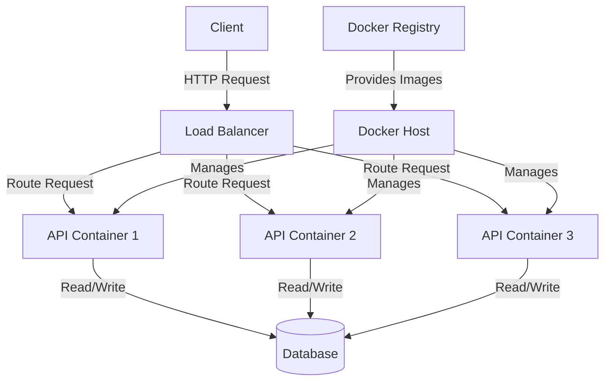

# Docker API Service

## Introduction

Welcome to our guide on building Docker API Services! In this tutorial, you'll learn how to containerize an API service using Docker. This approach has become the industry standard for deploying scalable, portable, and isolated applications.

An API (Application Programming Interface) service is an application that provides data and functionality to other applications through well-defined endpoints. By combining the power of APIs with Docker containerization, you can create services that are:

- **Consistent** across development, testing, and production environments
- **Portable** between different infrastructure providers
- **Scalable** to handle varying loads
- **Isolated** from other services and the host system

Whether you're building a RESTful API, GraphQL endpoint, or any other type of service, Docker provides an excellent foundation for your project.

## Prerequisites

Before we begin, make sure you have:

- Basic understanding of APIs and backend development
- Docker installed on your machine
- A code editor
- Familiarity with command-line operations

## Building Your First Dockerized API

Let's start by creating a simple API service using Node.js and Express, then containerize it with Docker.

### 1. Create a Basic Express API

First, let's create a simple Express application:

```javascript
// app.js
const express = require('express');
const app = express();
const PORT = process.env.PORT || 3000;

app.use(express.json());

// Sample data
const books = [
  { id: 1, title: 'The Docker Handbook', author: 'Jane Dev' },
  { id: 2, title: 'API Design Patterns', author: 'John Coder' }
];

// GET endpoint to retrieve all books
app.get('/api/books', (req, res) => {
  res.json(books);
});

// GET endpoint to retrieve a specific book
app.get('/api/books/:id', (req, res) => {
  const book = books.find(b => b.id === parseInt(req.params.id));
  if (!book) return res.status(404).json({ message: 'Book not found' });
  res.json(book);
});

// POST endpoint to add a new book
app.post('/api/books', (req, res) => {
  const newBook = {
    id: books.length + 1,
    title: req.body.title,
    author: req.body.author
  };
  
  books.push(newBook);
  res.status(201).json(newBook);
});

app.listen(PORT, () => {
  console.log(`Server running on port ${PORT}`);
});
```

### 2. Create a package.json File

```json
{
  "name": "docker-api-service",
  "version": "1.0.0",
  "description": "A simple API service containerized with Docker",
  "main": "app.js",
  "scripts": {
    "start": "node app.js"
  },
  "dependencies": {
    "express": "^4.18.2"
  }
}
```

### 3. Create a Dockerfile

Now, let's create a `Dockerfile` to containerize our API:

```dockerfile
# Use an official Node.js runtime as the base image
FROM node:18-alpine

# Set the working directory in the container
WORKDIR /usr/src/app

# Copy package.json and package-lock.json
COPY package*.json ./

# Install dependencies
RUN npm install

# Copy the rest of the application code
COPY . .

# Expose the port the app will run on
EXPOSE 3000

# Command to run the application
CMD ["npm", "start"]
```

### 4. Build and Run the Docker Container

Let's build and run our Docker container:

```bash
# Build the Docker image
docker build -t my-api-service .

# Run the container
docker run -p 3000:3000 -d --name api-service my-api-service
```

Now your API is running inside a Docker container and accessible at `http://localhost:3000/api/books`!

## Understanding the Docker Components

Let's break down what we just did:

### Dockerfile Explained

```dockerfile
FROM node:18-alpine
```
This specifies the base image. We're using Node.js 18 with Alpine Linux, which is a lightweight distribution.

```dockerfile
WORKDIR /usr/src/app
```
Sets the working directory inside the container.

```dockerfile
COPY package*.json ./
RUN npm install
```
Copies package files and installs dependencies. We do this before copying the entire codebase to take advantage of Docker's layer caching.

```dockerfile
COPY . .
```
Copies the rest of your application code into the container.

```dockerfile
EXPOSE 3000
```
Informs Docker that the container listens on port 3000.

```dockerfile
CMD ["npm", "start"]
```
Defines the command to run when the container starts.

## Best Practices for Dockerized APIs

### 1. Use Environment Variables for Configuration

Modify your application to use environment variables for configuration:

```javascript
// Modified portion of app.js
const PORT = process.env.PORT || 3000;
const NODE_ENV = process.env.NODE_ENV || 'development';

console.log(`Server running in ${NODE_ENV} mode on port ${PORT}`);
```

Then pass environment variables when running the container:

```bash
docker run -p 3000:3000 -e PORT=3000 -e NODE_ENV=production -d --name api-service my-api-service
```

### 2. Implement Health Checks

Add a health check endpoint to your API:

```javascript
// Add to app.js
app.get('/health', (req, res) => {
  res.status(200).json({ status: 'ok' });
});
```

Update your Dockerfile to include a health check:

```dockerfile
HEALTHCHECK --interval=30s --timeout=3s --start-period=5s --retries=3 \
  CMD curl -f http://localhost:3000/health || exit 1
```

### 3. Use Docker Volumes for Persistent Data

If your API needs to store data, use Docker volumes:

```bash
# Create a volume
docker volume create api-data

# Use the volume when running the container
docker run -p 3000:3000 -v api-data:/usr/src/app/data -d --name api-service my-api-service
```

### 4. Implement Proper Logging

Update your application to use structured logging:

```javascript
// Example logging middleware in app.js
app.use((req, res, next) => {
  const start = Date.now();
  res.on('finish', () => {
    const duration = Date.now() - start;
    console.log(JSON.stringify({
      method: req.method,
      path: req.path,
      status: res.statusCode,
      duration: `${duration}ms`
    }));
  });
  next();
});
```

## Docker Compose for Multi-Container Applications

Most real-world APIs need databases and other services. Docker Compose helps manage these multi-container applications:

```yaml
# docker-compose.yml
version: '3.8'

services:
  api:
    build: .
    ports:
      - "3000:3000"
    environment:
      - PORT=3000
      - NODE_ENV=development
      - DB_HOST=mongodb
      - DB_PORT=27017
      - DB_NAME=apidb
    depends_on:
      - mongodb
    volumes:
      - ./:/usr/src/app
      - /usr/src/app/node_modules

  mongodb:
    image: mongo:6.0
    ports:
      - "27017:27017"
    volumes:
      - mongo-data:/data/db

volumes:
  mongo-data:
```

Run your multi-container application with:

```bash
docker-compose up -d
```

This creates an API container and a MongoDB container, connecting them in a network.

## API Architecture with Docker

Let's visualize a common architecture for Dockerized APIs:



## Securing Your Docker API Service

Security is crucial for API services. Here are some best practices:

### 1. Use Non-Root Users

Update your Dockerfile to use a non-root user:

```dockerfile
# Add after installing dependencies
RUN addgroup -g 1000 appuser && \
    adduser -u 1000 -G appuser -s /bin/sh -D appuser

# Change ownership
RUN chown -R appuser:appuser /usr/src/app

# Switch to non-root user
USER appuser
```

### 2. Implement Rate Limiting

Add rate limiting to your Express API:

```javascript
const rateLimit = require('express-rate-limit');

const limiter = rateLimit({
  windowMs: 15 * 60 * 1000, // 15 minutes
  max: 100, // limit each IP to 100 requests per windowMs
  message: 'Too many requests, please try again later'
});

// Apply to all requests
app.use(limiter);
```

### 3. Use Environment Variables for Secrets

Never hardcode sensitive information. Use environment variables:

```javascript
// Connection string example
const connectionString = process.env.DB_CONNECTION_STRING;
```

## Monitoring and Logging

For production APIs, monitoring is essential:

### 1. Implement Prometheus Metrics

```javascript
const promClient = require('prom-client');
const collectDefaultMetrics = promClient.collectDefaultMetrics;
collectDefaultMetrics({ timeout: 5000 });

// Add a metrics endpoint
app.get('/metrics', (req, res) => {
  res.set('Content-Type', promClient.register.contentType);
  res.end(promClient.register.metrics());
});
```

### 2. Container Logs

Access container logs with:

```bash
docker logs api-service
```

Or using Docker Compose:

```bash
docker-compose logs api
```

## Scaling Your API Service

Docker makes it easy to scale your API horizontally:

```bash
# Run multiple instances
docker-compose up -d --scale api=3
```

## Deploying Your Docker API Service

Here's a simplified deployment workflow:

1. Build your Docker image
2. Push it to a container registry
3. Pull and run on your production servers

```bash
# Build and tag with version
docker build -t myregistry.com/my-api-service:v1.0.0 .

# Push to registry
docker push myregistry.com/my-api-service:v1.0.0

# On production server
docker pull myregistry.com/my-api-service:v1.0.0
docker run -p 80:3000 -d myregistry.com/my-api-service:v1.0.0
```

## Real-World Example: A Weather API Service

Let's create a more practical example - a weather API that fetches data from an external service:

```javascript
// weather-api.js
const express = require('express');
const axios = require('axios');
const redis = require('redis');
const { promisify } = require('util');

const app = express();
const PORT = process.env.PORT || 3000;
const WEATHER_API_KEY = process.env.WEATHER_API_KEY;

// Redis setup
const redisClient = redis.createClient({
  host: process.env.REDIS_HOST || 'localhost',
  port: process.env.REDIS_PORT || 6379
});

const getAsync = promisify(redisClient.get).bind(redisClient);
const setAsync = promisify(redisClient.set).bind(redisClient);

// Cache middleware
const cacheWeather = async (req, res, next) => {
  const city = req.params.city;
  
  try {
    const cachedData = await getAsync(city);
    if (cachedData) {
      return res.json(JSON.parse(cachedData));
    }
    next();
  } catch (err) {
    console.error('Cache error:', err);
    next();
  }
};

// Weather endpoint with caching
app.get('/api/weather/:city', cacheWeather, async (req, res) => {
  try {
    const city = req.params.city;
    const response = await axios.get(
      `https://api.openweathermap.org/data/2.5/weather?q=${city}&appid=${WEATHER_API_KEY}&units=metric`
    );
    
    const weatherData = {
      city: response.data.name,
      temperature: response.data.main.temp,
      description: response.data.weather[0].description,
      humidity: response.data.main.humidity,
      windSpeed: response.data.wind.speed,
      timestamp: new Date()
    };
    
    // Cache for 30 minutes
    await setAsync(city, JSON.stringify(weatherData), 'EX', 1800);
    
    res.json(weatherData);
  } catch (error) {
    console.error('Weather API error:', error.message);
    res.status(500).json({ error: 'Failed to fetch weather data' });
  }
});

app.listen(PORT, () => {
  console.log(`Weather API running on port ${PORT}`);
});
```

And the corresponding Docker Compose file:

```yaml
# docker-compose.yml for Weather API
version: '3.8'

services:
  weather-api:
    build: .
    ports:
      - "3000:3000"
    environment:
      - PORT=3000
      - REDIS_HOST=redis
      - WEATHER_API_KEY=your_api_key_here
    depends_on:
      - redis
      
  redis:
    image: redis:alpine
    ports:
      - "6379:6379"
    volumes:
      - redis-data:/data

volumes:
  redis-data:
```

## Troubleshooting Common Issues

### 1. Container Exiting Immediately

If your container exits immediately after starting:

```bash
# Check the logs
docker logs api-service

# Run in interactive mode
docker run -it my-api-service sh
```

### 2. Connection Refused Errors

If you're getting "connection refused" errors:

1. Check if your container is running: `docker ps`
2. Verify port mappings: `docker port api-service`
3. Ensure your application is listening on the correct interface (0.0.0.0, not just localhost)

### 3. Performance Issues

If your API is slow:

1. Check resource usage: `docker stats api-service`
2. Consider adding more resources: `docker run -p 3000:3000 --memory=1g --cpus=2 my-api-service`

## Summary

In this tutorial, you've learned how to:

1. Create a simple API service using Express
2. Containerize your API with Docker
3. Implement best practices for Dockerized APIs
4. Use Docker Compose for multi-container applications
5. Secure your API service
6. Monitor and scale your application
7. Deploy your Docker API service
8. Build a real-world example with caching

Docker provides an excellent platform for developing, deploying, and scaling API services. By containerizing your APIs, you ensure consistency across environments, simplify deployment, and make your services more maintainable.

## Exercises

1. **Basic**: Modify the books API to add DELETE and PUT endpoints
2. **Intermediate**: Add JWT authentication to the API
3. **Advanced**: Implement a CI/CD pipeline for your Dockerized API

## Additional Resources

- [Docker Documentation](https://docs.docker.com/)
- [Express.js Guide](https://expressjs.com/en/guide/routing.html)
- [12 Factor App Methodology](https://12factor.net/)
- [Docker Compose Documentation](https://docs.docker.com/compose/)
- [RESTful API Design Best Practices](https://restfulapi.net/)

Now that you understand the fundamentals of Docker API Services, you can apply these concepts to build robust, scalable, and maintainable API services for your projects.