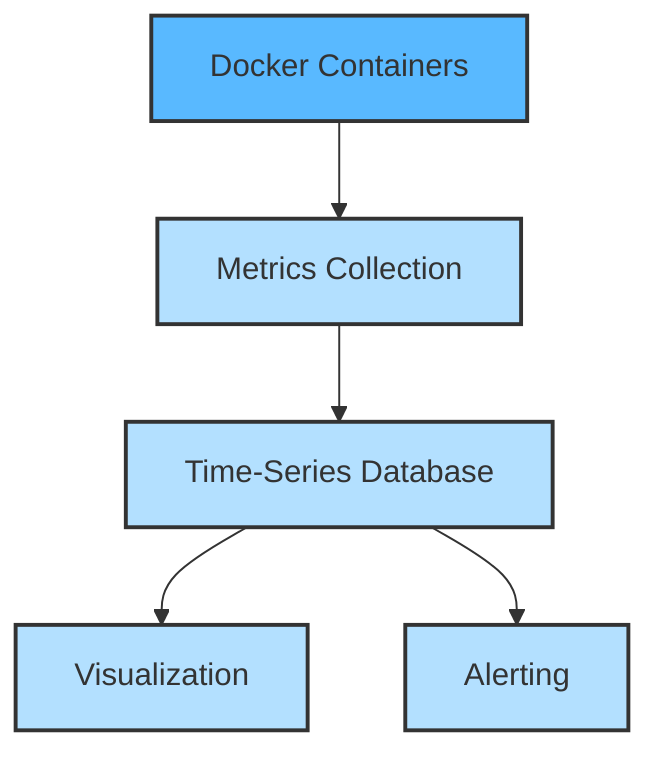

# Docker Monitoring Stack

## Introduction

When running applications in Docker containers, monitoring becomes essential to ensure optimal performance, detect issues early, and maintain system reliability. A Docker monitoring stack provides visibility into container health, resource usage, and application performance metrics.

In this tutorial, we'll build a complete monitoring solution for Docker environments using popular open-source tools. By the end, you'll have a functional monitoring stack that tracks container metrics, visualizes data, and alerts you when things go wrong.

## Why Monitor Docker Containers?

Docker containers are ephemeral by nature - they can be created, destroyed, or replaced frequently. This dynamic nature makes traditional monitoring approaches insufficient. Here's why dedicated container monitoring is crucial:

- **Resource Utilization**: Track CPU, memory, network, and disk usage to prevent resource starvation
- **Container Health**: Monitor container states, restarts, and lifecycle events
- **Application Performance**: Measure how your containerized applications perform under load
- **Troubleshooting**: Quickly identify and resolve issues in complex container environments
- **Capacity Planning**: Make informed decisions about infrastructure scaling based on historical data

## Components of a Docker Monitoring Stack

A comprehensive Docker monitoring stack typically consists of these components:



In our implementation, we'll use:

- **Prometheus**: For collecting and storing metrics
- **Node Exporter**: For host-level metrics
- **cAdvisor**: For container-level metrics
- **Grafana**: For visualization and dashboards
- **Alertmanager**: For handling alerts

## Setting Up the Monitoring Stack

Let's implement our monitoring stack step by step using Docker Compose.

### Step 1: Create the Project Structure

First, create a directory for your monitoring stack project:

```bash
mkdir docker-monitoring-stack
cd docker-monitoring-stack
```

Create the necessary subdirectories:

```bash
mkdir -p prometheus/config
mkdir -p grafana/provisioning/dashboards
mkdir -p grafana/provisioning/datasources
mkdir -p alertmanager
```

### Step 2: Configure Prometheus

Create a Prometheus configuration file at `prometheus/config/prometheus.yml`:

```yaml
global:
  scrape_interval: 15s
  evaluation_interval: 15s

alerting:
  alertmanagers:
    - static_configs:
        - targets:
            - alertmanager:9093

rule_files:
  - "alert_rules.yml"

scrape_configs:
  - job_name: 'prometheus'
    static_configs:
      - targets: ['localhost:9090']
  
  - job_name: 'node-exporter'
    static_configs:
      - targets: ['node-exporter:9100']
  
  - job_name: 'cadvisor'
    static_configs:
      - targets: ['cadvisor:8080']
```

Create an alert rules file at `prometheus/config/alert_rules.yml`:

```yaml
groups:
- name: example
  rules:
  - alert: HighContainerCPU
    expr: (sum by(name) (rate(container_cpu_usage_seconds_total{image!=""}[1m])) * 100) > 80
    for: 1m
    labels:
      severity: warning
    annotations:
      summary: "High CPU usage detected"
      description: "Container {{ $labels.name }} is using high CPU ({{ $value }}%)"
  
  - alert: HighContainerMemory
    expr: (container_memory_usage_bytes{image!=""} / container_spec_memory_limit_bytes{image!=""} * 100) > 80
    for: 1m
    labels:
      severity: warning
    annotations:
      summary: "High memory usage detected"
      description: "Container {{ $labels.name }} is using high memory ({{ $value }}%)"
```

### Step 3: Configure Alertmanager

Create an Alertmanager configuration file at `alertmanager/config.yml`:

```yaml
route:
  group_by: ['alertname']
  group_wait: 30s
  group_interval: 5m
  repeat_interval: 1h
  receiver: 'web.hook'

receivers:
- name: 'web.hook'
  webhook_configs:
  - url: 'http://localhost:5001/'

inhibit_rules:
  - source_match:
      severity: 'critical'
    target_match:
      severity: 'warning'
    equal: ['alertname', 'instance']
```

### Step 4: Configure Grafana

Create a Grafana datasource configuration file at `grafana/provisioning/datasources/datasource.yml`:

```yaml
apiVersion: 1

datasources:
  - name: Prometheus
    type: prometheus
    access: proxy
    url: http://prometheus:9090
    isDefault: true
    editable: false
```

### Step 5: Create the Docker Compose File

Create a `docker-compose.yml` file in the root directory:

```yaml
version: '3.8'

services:
  prometheus:
    image: prom/prometheus:latest
    container_name: prometheus
    restart: unless-stopped
    volumes:
      - ./prometheus/config:/etc/prometheus
      - prometheus_data:/prometheus
    command:
      - '--config.file=/etc/prometheus/prometheus.yml'
      - '--storage.tsdb.path=/prometheus'
      - '--web.console.libraries=/etc/prometheus/console_libraries'
      - '--web.console.templates=/etc/prometheus/consoles'
      - '--web.enable-lifecycle'
    ports:
      - "9090:9090"
    networks:
      - monitoring

  node-exporter:
    image: prom/node-exporter:latest
    container_name: node-exporter
    restart: unless-stopped
    volumes:
      - /proc:/host/proc:ro
      - /sys:/host/sys:ro
      - /:/rootfs:ro
    command:
      - '--path.procfs=/host/proc'
      - '--path.rootfs=/rootfs'
      - '--path.sysfs=/host/sys'
      - '--collector.filesystem.mount-points-exclude=^/(sys|proc|dev|host|etc)($$|/)'
    ports:
      - "9100:9100"
    networks:
      - monitoring

  cadvisor:
    image: gcr.io/cadvisor/cadvisor:latest
    container_name: cadvisor
    restart: unless-stopped
    volumes:
      - /:/rootfs:ro
      - /var/run:/var/run:ro
      - /sys:/sys:ro
      - /var/lib/docker/:/var/lib/docker:ro
      - /dev/disk/:/dev/disk:ro
    ports:
      - "8080:8080"
    networks:
      - monitoring

  grafana:
    image: grafana/grafana:latest
    container_name: grafana
    restart: unless-stopped
    volumes:
      - ./grafana/provisioning:/etc/grafana/provisioning
      - grafana_data:/var/lib/grafana
    environment:
      - GF_SECURITY_ADMIN_USER=admin
      - GF_SECURITY_ADMIN_PASSWORD=admin
      - GF_USERS_ALLOW_SIGN_UP=false
    ports:
      - "3000:3000"
    networks:
      - monitoring

  alertmanager:
    image: prom/alertmanager:latest
    container_name: alertmanager
    restart: unless-stopped
    volumes:
      - ./alertmanager:/etc/alertmanager
    command:
      - '--config.file=/etc/alertmanager/config.yml'
      - '--storage.path=/alertmanager'
    ports:
      - "9093:9093"
    networks:
      - monitoring

networks:
  monitoring:
    driver: bridge

volumes:
  prometheus_data:
  grafana_data:
```

### Step 6: Start the Monitoring Stack

Launch the entire monitoring stack with the following command:

```bash
docker-compose up -d
```

This will start all the services defined in your Docker Compose file. You can check the status with:

```bash
docker-compose ps
```

Expected output:
```
      Name                    Command               State           Ports         
--------------------------------------------------------------------------------
alertmanager       /bin/alertmanager --config ...   Up      0.0.0.0:9093->9093/tcp
cadvisor           /usr/bin/cadvisor -logtostderr   Up      0.0.0.0:8080->8080/tcp
grafana            /run.sh                          Up      0.0.0.0:3000->3000/tcp
node-exporter      /bin/node_exporter --path. ...   Up      0.0.0.0:9100->9100/tcp
prometheus         /bin/prometheus --config.f ...   Up      0.0.0.0:9090->9090/tcp
```

## Accessing the Monitoring Tools

After starting the stack, you can access each component through your web browser:

- **Prometheus**: http://localhost:9090
- **Grafana**: http://localhost:3000 (login with admin/admin)
- **cAdvisor**: http://localhost:8080
- **Alertmanager**: http://localhost:9093

## Using Prometheus for Metrics Collection

Prometheus collects time-series data from your containers and host system. Navigate to http://localhost:9090 to access the Prometheus web interface.

### Exploring Available Metrics

To see all available metrics, go to the Prometheus UI and click on the "Graph" tab. You can then use the dropdown to browse metrics or start typing to search.

Some useful container metrics to explore:

- `container_cpu_usage_seconds_total`: Total CPU time consumed
- `container_memory_usage_bytes`: Current memory usage
- `container_network_receive_bytes_total`: Network bytes received
- `container_network_transmit_bytes_total`: Network bytes transmitted

Try a simple query to see CPU usage for all containers:

```
rate(container_cpu_usage_seconds_total{image!=""}[1m]) * 100
```

## Visualizing Data with Grafana

Grafana provides powerful visualization capabilities for your monitoring data. Let's create a simple dashboard for container metrics.

1. Log in to Grafana at http://localhost:3000 with username `admin` and password `admin`
2. Create a new dashboard by clicking on "+ Create" > "Dashboard"
3. Add a new panel by clicking "Add panel"
4. Select "Prometheus" as the data source
5. Enter the following query for container CPU usage:
   ```
   sum by(name) (rate(container_cpu_usage_seconds_total{image!=""}[1m])) * 100
   ```
6. Configure the panel title, axes, and visualization settings
7. Save the dashboard

### Example Dashboard Configuration

Here's an example of a basic container monitoring dashboard with multiple panels:

1. **Container CPU Usage**:
   - Query: `sum by(name) (rate(container_cpu_usage_seconds_total{image!=""}[1m])) * 100`
   - Format: Graph
   - Units: Percent
   - Title: "Container CPU Usage (%)"

2. **Container Memory Usage**:
   - Query: `container_memory_usage_bytes{image!=""} / 1024 / 1024`
   - Format: Graph
   - Units: Megabytes
   - Title: "Container Memory Usage (MB)"

3. **Container Network Usage**:
   - Query: 
     ```
     sum by(name) (rate(container_network_receive_bytes_total{image!=""}[1m])) 
     sum by(name) (rate(container_network_transmit_bytes_total{image!=""}[1m]))
     ```
   - Format: Graph
   - Units: Bytes/second
   - Title: "Container Network Traffic"

4. **Container Status**:
   - Query: `sum by(name, state) (container_tasks_state{image!=""})`
   - Format: Table
   - Title: "Container States"

## Setting Up Alerts

Prometheus and Alertmanager work together to provide alerting capabilities. We've already configured some basic alerts in the `prometheus/config/alert_rules.yml` file.

Let's examine how these alerts work:

1. **HighContainerCPU alert**:
   - Triggers when a container uses more than 80% CPU for 1 minute
   - Expression: `(sum by(name) (rate(container_cpu_usage_seconds_total{image!=""}[1m])) * 100) > 80`

2. **HighContainerMemory alert**:
   - Triggers when a container uses more than 80% of its memory limit for 1 minute
   - Expression: `(container_memory_usage_bytes{image!=""} / container_spec_memory_limit_bytes{image!=""} * 100) > 80`

You can view the status of your alerts in Prometheus by navigating to the "Alerts" tab. When an alert fires, it will be sent to Alertmanager, which handles notification routing.

In a production environment, you'd configure Alertmanager to send notifications via email, Slack, PagerDuty, or other channels.

## Extending Your Monitoring Stack

The basic monitoring stack we've set up provides a solid foundation, but there are several ways to enhance it:

1. **Application-specific metrics**: Instrument your applications to expose Prometheus metrics for business-specific KPIs
2. **Additional exporters**: Add exporters for databases, message queues, and other services
3. **High availability**: Configure Prometheus and Alertmanager for high availability
4. **Remote storage**: Configure Prometheus to use long-term storage solutions
5. **Service discovery**: Use Prometheus service discovery for dynamic environments

### Adding Redis Monitoring Example

Let's add Redis monitoring to our stack as an example of extending the monitoring capabilities:

1. Add the Redis exporter to your `docker-compose.yml`:

```yaml
redis-exporter:
  image: oliver006/redis_exporter:latest
  container_name: redis-exporter
  restart: unless-stopped
  command:
    - '--redis.addr=redis://redis:6379'
  ports:
    - "9121:9121"
  networks:
    - monitoring
```

2. Add a Redis service:

```yaml
redis:
  image: redis:latest
  container_name: redis
  restart: unless-stopped
  ports:
    - "6379:6379"
  networks:
    - monitoring
```

3. Update the Prometheus configuration to scrape Redis metrics:

```yaml
- job_name: 'redis-exporter'
  static_configs:
    - targets: ['redis-exporter:9121']
```

4. Restart the stack to apply changes:

```bash
docker-compose up -d
```

## Best Practices for Docker Monitoring

When implementing a monitoring solution for Docker environments, keep these best practices in mind:

1. **Monitor both containers and applications**: Collect system-level and application-level metrics
2. **Set meaningful alerts**: Focus on actionable alerts that indicate real problems
3. **Use labels consistently**: Apply consistent labels to your containers for better filtering
4. **Retain historical data**: Configure appropriate data retention based on your needs
5. **Document dashboards**: Add documentation to dashboards so others can understand them
6. **Test your alerting**: Regularly test that alerts are triggered and notifications are sent
7. **Monitor the monitoring**: Set up monitoring for your monitoring stack itself

## Troubleshooting Common Issues

Here are solutions to common issues you might encounter:

### Issue: Prometheus can't scrape targets
- Check network connectivity between containers
- Verify target endpoints are accessible
- Check Prometheus configuration for errors

### Issue: High resource usage by monitoring stack
- Adjust scrape intervals
- Configure appropriate retention periods
- Use recording rules for frequently used queries

### Issue: Missing container metrics
- Verify cAdvisor is running properly
- Check container labels and filtering rules
- Ensure Docker is configured to expose metrics

## Summary

In this tutorial, we've built a comprehensive Docker monitoring stack using Prometheus, Grafana, cAdvisor, Node Exporter, and Alertmanager. This stack provides visibility into container and host metrics, visualization capabilities, and alerting for problematic conditions.

Key takeaways:
- Container monitoring requires specialized tools due to the ephemeral nature of containers
- Prometheus provides a powerful platform for metrics collection and alerting
- Grafana enables creation of informative dashboards
- A complete monitoring solution includes metrics collection, storage, visualization, and alerting
- Extending the stack with additional exporters allows monitoring of specific applications

## Additional Resources

To deepen your knowledge about Docker monitoring:

- **Official Documentation**:
  - [Prometheus Documentation](https://prometheus.io/docs/introduction/overview/)
  - [Grafana Documentation](https://grafana.com/docs/grafana/latest/)
  - [cAdvisor Documentation](https://github.com/google/cadvisor)

- **Books**:
  - "Prometheus: Up & Running" by Brian Brazil
  - "Docker Deep Dive" by Nigel Poulton

## Exercises

1. Add a new exporter for MySQL or PostgreSQL to the monitoring stack
2. Create a custom Grafana dashboard showing container health metrics
3. Configure Alertmanager to send notifications to a webhook endpoint
4. Implement a recording rule in Prometheus for a frequently used query
5. Create an alert for containers that restart frequently

By completing these exercises, you'll gain hands-on experience with the different components of the Docker monitoring stack and be well-prepared to implement monitoring in your own container environments.